# Battery replacement

This page helps you replace a worn battery in a keyboard half or a module: what each original cell
is, what a replacement must match, and which cells you can actually buy. The one thing to know first:
no seller we could find offers any of the four original cells, so every replacement is a close
substitute that needs checking with a meter and, usually, a new plug on its lead. Read
[Safety](#safety) before you open anything; the power model itself is on
[Power and batteries](power.md).

!!! note "At a glance"
    - Four batteries: each half has a 50 mAh pouch cell; the Tune a 1000 mAh block pack; the Touch a 700 mAh pouch cell; the Track a 600 mAh pack of two 300 mAh cells in parallel. All are 3.7 V lithium polymer with a three-wire lead.
    - The labels (`FH301217`, `FH 202030`, `FH364046`, `QS801630 1S2P`) are size codes; the makers behind `FH` and `QS` are not identified, and no exact source was found (checked 2026-09-23).
    - The third wire is almost certainly a thermistor. The modules' charger expects a 10 kΩ NTC of the 103AT type; the half's charger is unidentified.
    - The plugs look like 3-way JST SH-class (1.0 mm) housings on the half, Touch and Track, and a JST ZH-class (1.5 mm) housing on the Tune. Confirm with calipers before you buy.
    - Match the original capacity where you can: the charge current is fixed on the board and not known, so a smaller cell charges harder than the original did.
    - The FCC photos show pre-production units. Read the label on your own battery before you order: retail capacities may differ ([details](../open-questions.md#oq-h21)).

## The batteries at a glance

Replacement listings were read on 2026-09-23; none has been bought or tested. "Fits" means it fits
every dimension we know; the spaces inside the half and the modules have not been measured
([Measurements that would confirm fit](#measurements-that-would-confirm-fit)).

| Device | Original, as labeled | Rating | Size | Plug | Recommended replacement | Evidence |
|---|---|---|---|---|---|---|
| Each keyboard half | `FH301217` pouch cell with a protection board | 3.7 V, 50 mAh, 0.185 Wh | 3.0 x 12 x 17 mm by its code; about 12.5 x 18.5 mm with the folded protection board | 3-way, JST SH class (1.0 mm), likely | [YDL 301215](#keyboard-half-fh301217) (3.0 x 12 x 17 mm with its protection board, 30 mAh) ordered with the SH 1.0 plug and NTC options; capacity is lower, see the caveat | DOC INFERRED REPORTED |
| Tune | `FH 202030` block pack in blue PVC | 3.7 V, 1000 mAh, 3.7 Wh | 20 x 20 x 30 mm by its code (inferred); label face about 34 x 20 mm | 3-way, JST ZH class (1.5 mm) | [a 1S2P pack of two LiPol LP902030](#tune-fh-202030) (9.0 x 20 x 30 mm, 500 mAh each) with one 10 kΩ NTC and a ZH plug | DOC INFERRED REPORTED |
| Touch | `FH364046` pouch cell (a sample `FH364045` also photographed) | 3.7 V, 700 mAh, 2.59 Wh | 3.6 x 40 x 46 mm by its code; about 40 x 45 mm | 3-way, JST SH class (1.0 mm); board header `J3` | [LiPol LP304045](#touch-fh364046) (3.0 x 40 x 45 mm, 500 mAh) with a protection board, 10 kΩ NTC and SH plug; a custom 700 mAh cell for full capacity | DOC INFERRED REPORTED |
| Track | `QS801630 1S2P` pack of two `QS801630` cells | 3.7 V, 600 mAh, 2.22 Wh (2 x 300 mAh, 1.11 Wh) | each cell 8.0 x 16 x 30 mm by its code | 3-way, JST SH class (1.0 mm), likely | [a 1S2P pack of two LiPol LP801530](#track-qs801630-1s2p) (8.0 x 15 x 30 mm, 300 mAh each) with one 10 kΩ NTC | DOC INFERRED REPORTED |

The dongle has no battery; it runs from USB DOC[^fcc-dg]. The full part rows, with every
photo citation, are on the [Parts list](parts.md#batteries-and-power-ratings-every-half-and-every-module).

## Safety

!!! danger "Lithium polymer cells can burn"
    Every battery in the Create is a lithium polymer cell. Do not puncture, bend, crush or heat it, and
    do not cut through its tape or wrap with a blade: the protection board and tabs sit right under the
    tape. Work on a clear, non-flammable surface, keep metal tools away from bare tabs and contacts, and
    never short the leads. Charge a new cell for the first time where you can watch it, and stop if it
    gets warm, smells or swells. The vendor's manuals give the operating range as 0-60 °C and say not to
    short-circuit the pogo pins, the battery or its cells DOC[^um106][^man-c].

!!! danger "Never trust wire colors: check polarity with a meter"
    Sellers wire the same connector in different orders, and JST-style battery plugs are often sold
    with the polarity reversed against a given board. The original Track lead is red, yellow and
    black, the others red, white and black; do not assume a new cell follows either. Before a new
    battery goes near the board, measure it with a multimeter: the pair that reads about 3.7-4.2 V is
    the cell (note which pin is positive), and the third pin should read a resistance of about 10 kΩ to
    the negative pin at room temperature (the thermistor). Compare against the board's pin order, which
    is not yet established for any of the four connectors ([details](../open-questions.md#oq-h44)). A
    reversed cell can destroy the charger at once. Untested by us; we have not opened a battery
    compartment.

!!! danger "A protection board is required"
    Buy only cells or packs with a protection circuit module (PCM): the small board that cuts the cell
    off on overcharge, over-discharge, overcurrent and short circuit. The original half and Touch cells
    carry one folded under yellow tape; the Tune and Track packs hide theirs inside the wrap
    DOC INFERRED. A bare cell relies on the board alone, and the Create's boards were designed for protected
    packs. When two cells are joined in parallel, each should have its own PCM, or the pack one PCM
    rated for both.

!!! danger "Do not exceed the original thickness"
    A thicker cell presses on the board, the Qi coil or the case when the module or half is closed, and
    pressure on a pouch cell can short it internally. Keep every replacement at or below the original
    thickness (half 3.0 mm, Touch 3.6 mm, Track 8.0 mm per cell, Tune about 20 mm for the whole pack),
    and at or below its width and length unless you have measured spare room. Never force a lid closed
    over a battery.

!!! danger "Swollen, damaged or deeply drained cells"
    A cell that has puffed up, leaks, is dented, or has sat fully drained for a long time is damaged. Do
    not charge it, do not puncture it, and do not reuse it. Tape its leads, keep it in a non-flammable
    container away from anything combustible, and take it to a battery recycling or household hazardous
    waste point; never put it in household trash. The Create's labels carry the WEEE crossed-bin mark,
    and the v1.0.6 manual asks for the battery to be removed and recycled separately at end of life
    DOC[^um106][^fcc-crr]. A lithium cell held near 0 V for long may be unsafe to recharge even if it seems to
    recover INFERRED (general lithium-ion practice).

!!! danger "Battery Zero: a module drained to 0 % may not recover"
    Long docking can drain a module until its battery protection makes it unchargeable; the vendor
    called this "Battery Zero", announced firmware and hardware changes and a recovery mode, and the
    manual advises undocking modules for long storage DOC[^ks-21][^man-c]. A dark module is not
    necessarily a dead battery: try the module recovery key first ([R9 Module dead](../recovery.md#r9-module-dead)),
    which revived an unresponsive Tune and Touch on one of our boards MEASURED (a second board, 3.28.7, modules
    on 2.1.2, 2026-09-19). Replace the pack only if the module stays dead, and treat a pack that was
    stuck at 0 % as damaged (previous box).

## What every replacement must match

These criteria apply to all four batteries; each section below gives the numbers.

- **Chemistry and voltage.** 3.7 V nominal lithium polymer (or lithium-ion) with a 4.2 V full-charge
  voltage. The labels print 3.7 V, the v1.0.6 manual gives "Input Voltage 4.2V"[^um106], full halves read 4.07-4.21 V
  and full modules 4.12-4.26 V while on USB DOC MEASURED ([Power](power.md#reading-battery-values)). The
  modules' SG Micro SGM41523 charger charges to 4.2 V when its voltage-select pin is grounded or open,
  and can be set anywhere from 4.1 to 4.45 V DOC[^sgm]; the setting on Naya's boards has not been read
  ([details](../open-questions.md#oq-h48)). Do not use LiFePO4 (3.2 V) cells.
- **Size.** At or under the original in every dimension, and never thicker (above). Cell sizes are
  quoted as thickness x width x length; check whether a listing's length includes the protection board.
- **Protection board.** Required (above).
- **Thermistor.** Keep the three-wire lead with a 10 kΩ NTC. The modules' charger reads it on its TS
  pin and suspends charging outside about 0-60 °C, and cuts current to a tenth between 0 and 10 °C and
  between 45 and 60 °C; its datasheet recommends a 103AT-2 type (10 kΩ at 25 °C, 27.28 kΩ at 0 °C,
  3.02 kΩ at 60 °C) DOC[^sgm]. The boards carry an `NTC` pad beside every battery header and the
  modules' `RT1`/`RT2` bias resistors beside the charger DOC[^fcc-crl]. A cell without a thermistor may
  refuse to charge, and a fixed resistor in its place would defeat the temperature cut-off, so we do
  not recommend either INFERRED. Ask for a 10 kΩ NTC with B = 3380-3435 K, which tracks the 103AT;
  a common 3950 K part reads colder at 0 °C and hotter at 60 °C, so it stops charging slightly early at
  both ends, the safe direction INFERRED (from the datasheet thresholds). The half's charger is not identified, so the
  value it expects is not known; 10 kΩ is the common choice ([details](../open-questions.md#oq-h03)).
- **Capacity and charge rate.** Choose the original capacity or more. The modules' charge current is
  set by a resistor on the board (10 300 V divided by the resistor, so 20 kΩ gives about 0.52 A)
  DOC[^sgm], and the module bases are rated `Input: 5V⎓500mA`, so the charge current is probably no more
  than about 0.5 A INFERRED. The small cells listed below are rated for 0.5C at most (0.5 x their capacity in
  amps) REPORTED; a cell of the same capacity as the original is charged at the same rate the original
  was, while a smaller one is charged harder. Until the charge settings are measured
  ([details](../open-questions.md#oq-h48)), a lower-capacity cell is a compromise, flagged as such below.
- **Lead length.** At least as long as the original's (each section gives an estimate from the
  photos), so the plug reaches the header without strain.
- **Connector.** The same series, pitch and pin order as the board header, or a lead long enough to
  re-terminate ([Connectors](#connectors-and-re-terminating-a-lead)).

!!! note "Reading a cell code"
    Pouch cells are named by size: two digits of thickness, two of width, two of length, in millimeters,
    with the thickness in tenths below 10 mm. So `301217` is 3.0 x 12 x 17 mm, `364046` is 3.6 x 40 x
    46 mm and `801630` is 8.0 x 16 x 30 mm, while `102030` is 10 x 20 x 30 mm INFERRED (industry naming,
    matched against the photos below). Makers round and differ on whether the length includes the
    protection board, so treat the code as a guide and measure.

## Keyboard half: FH301217

Each half carries one small cell that keeps it running while you swap a module; it "is not intended
to power normal operation" and charges while the half draws power DOC[^um106][^man-c].

<figure markdown="span">
  { loading=lazy }
  <figcaption>Label side on a millimeter rule, with the red, white and black lead and the white 3-way plug. CRL IP2 p13 (crop).</figcaption>
</figure>

<figure markdown="span">
  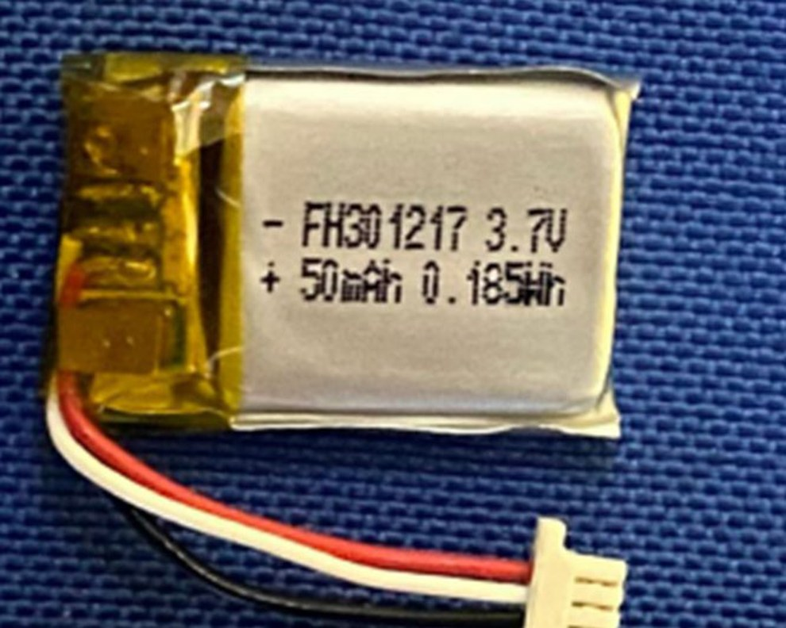{ loading=lazy }
  <figcaption>Label close-up: "- FH301217 3.7V / + 50mAh 0.185Wh". CRL IP2 p14 (the same photo is in CRR IP1 p11).</figcaption>
</figure>

<figure markdown="span">
  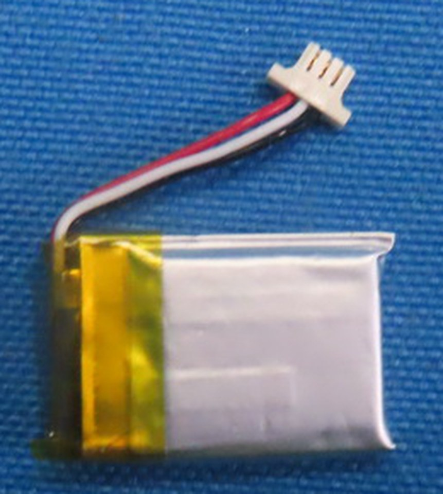{ loading=lazy }
  <figcaption>Back of the cell: the protection board is folded at the lead end under yellow tape. CRL IP2 p13 (crop).</figcaption>
</figure>

<figure markdown="span">
  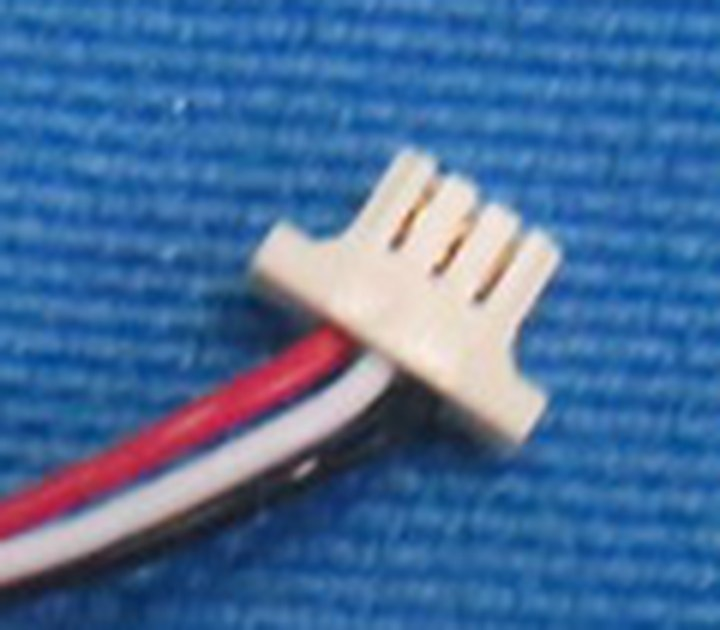{ loading=lazy }
  <figcaption>The 3-way plug: a ribbed front and side protrusions, like a JST SH housing. CRL IP2 p13 (enlarged crop).</figcaption>
</figure>

| Property | Value | Evidence |
|---|---|---|
| Label | `- FH301217 3.7V` / `+ 50mAh 0.185Wh`; no date code | DOC CRL IP2 p13-p14; CRR IP1 p10-p11[^fcc-crl][^fcc-crr] |
| Test reports | "Power Source 1# Supplied from battery. Model: 301217", "DC 3.7V 50mAh 0.185Wh" | DOC CRL BLE p10; CRR BLE p10[^fcc-crl][^fcc-crr] |
| Chemistry | lithium polymer pouch (the manual says "Lithium Ion") | DOC INFERRED (pouch form)[^um106] |
| Voltage | 3.7 V nominal, 4.2 V full charge | DOC (label) INFERRED (4.2 V) |
| Capacity, energy | 50 mAh, 0.185 Wh (the v1.0.6 spec sheet's "45mA" is a typo or a minimum) | DOC INFERRED |
| Size | 3.0 x 12 x 17 mm by its code; on the rule about 12.5 mm wide and 18.5 mm long including the folded protection board (within about 0.5 mm); thickness not measurable from the photos | INFERRED (code, measured on the photo) |
| Protection | a protection board folded at the lead end under yellow tape; no marking legible | DOC INFERRED (function) |
| Lead | 3 wires, red, white, black, about 20-25 mm long (estimated on the photo); at the plug the white wire sits in the middle | DOC INFERRED (order, from the photo) |
| Plug | white 3-way housing about 5.5 mm across its side protrusions and 3.5 mm across the body, with a ribbed front: a close match for JST SH `SHR-03V-S` (6.0 and 4.0 mm, 1.0 mm pitch) within the photo's precision; the rib spacing reads 0.8-0.9 mm on the photos, so 1.0 mm is likely but not proven | DOC INFERRED[^jst-sh] |
| Board side | a receptacle on the mainboard beside pads `VBAT2`, `NTC` and (probably) `MZ_VBAT_2`; its pin count is not resolved | DOC CRL IP1 p9[^fcc-crl] ([details](../open-questions.md#oq-h04)) |
| Thermistor | the white wire is most likely a thermistor (the `NTC` pad); the half's charger is not identified, so its expected value is unknown | INFERRED ([details](../open-questions.md#oq-h03)) |

**Fit criteria.** Thickness at most 3.0 mm; width at most about 12.5 mm; length at most about
18.5 mm including the protection board, unless the space around the cell proves longer
([details](../open-questions.md#oq-h42)); a PCM; a three-wire lead with a thermistor (10 kΩ unless
the half's charger turns out to need another value); a 3-way JST SH-class plug with the board's pin
order; 50 mAh or more if it fits.

**Where to buy** (listings read on 2026-09-23; prices and stock change; nothing bought or tested).
No listing for `FH301217` or any `301217` cell turned up at manufacturers, distributors, marketplaces
or battery shops, and the size code alone is not in the catalogs we checked.

| Rank | Option | Size (mm) | Capacity | As sold | PCM / NTC | Price, minimum | Fit and what to adapt | Evidence |
|---|---|---|---|---|---|---|---|---|
| 1 | [YDL Battery 301215](https://ydlbattery.com/products/301215-30mah-battery) | 3.0 x 12 x 17, including the PCM | 30 mAh, rated 0.2C standard, 0.5C maximum | JST PH 2.0 2-pin, 50 mm leads; options for a JST SH 1.0 plug and other series | PCM yes; NTC option (+$0.50, "connector changes to 3-pin"), value not stated | $2.00 each, volume from $1.20; minimum order stated as 10 | The only stocked cell with the original's exact envelope. Order the SH 1.0 plug with the NTC option, ask for a 10 kΩ NTC, then check the pin order. 60 % of the original capacity: at 0.5C it tolerates 15 mA of charge, and the half's charge current is unknown ([details](../open-questions.md#oq-h48)); watch the first charges | REPORTED listing |
| 2 | [LiPol Battery LP281221](https://li-polymer-battery.com/the-latest-3-7v-li-polymer-battery-by-thickness/) (catalog size) | 2.8 x 12 x 21 | 60 mAh | made to order; the maker's product pages offer a PCM, a 10 kΩ NTC, wire lengths and connectors | on request | quote only; its product pages state samples from 5 pieces | More capacity and 0.2 mm thinner, but about 2.5 mm longer than the original with its fold: use only if the space in the half is measured and has the room | REPORTED catalog table |
| 3 | [LiPol Battery LP301218](https://li-polymer-battery.com/the-latest-3-7v-li-polymer-battery-by-thickness/) (catalog size) | 3.0 x 12 x 18 | 30 mAh | made to order, as above | on request | quote only | Same envelope and caveat as rank 1, from a second maker | REPORTED catalog table |
| 4 | A custom 3.0 x 12 x 17 mm, 50 mAh cell with PCM, 10 kΩ NTC and a 3-way SH plug | as the original | 50 mAh | - | - | quote; both makers above advertise custom cells | The only way to match the original exactly | INFERRED |

Two-wire 301215 cells are also sold on marketplaces; without a thermistor they are not recommended
(see [What every replacement must match](#what-every-replacement-must-match)).

## Tune: FH 202030

The Tune's pack is the only block pack in the set: a wrapped brick rather than a flat pouch.

<figure markdown="span">
  { loading=lazy }
  <figcaption>Label side on the tape (centimeters on the lower scale): about 34 x 20 mm. CRL IP4 p25 (crop).</figcaption>
</figure>

<figure markdown="span">
  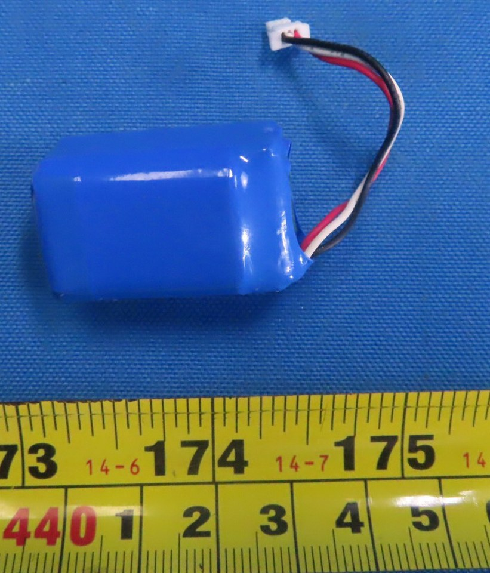{ loading=lazy }
  <figcaption>The same pack turned over: the block is thick, consistent with a roughly square section of about 20 mm. CRL IP4 p25 (crop).</figcaption>
</figure>

<figure markdown="span">
  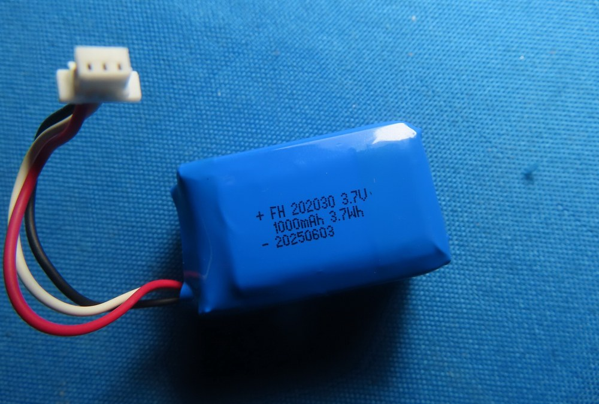{ loading=lazy }
  <figcaption>"+ FH 202030 3.7V / 1000mAh 3.7Wh / - 20250603". CRL IP4 p26 (the same photos are in CRR IP4 p22-p23).</figcaption>
</figure>

<figure markdown="span">
  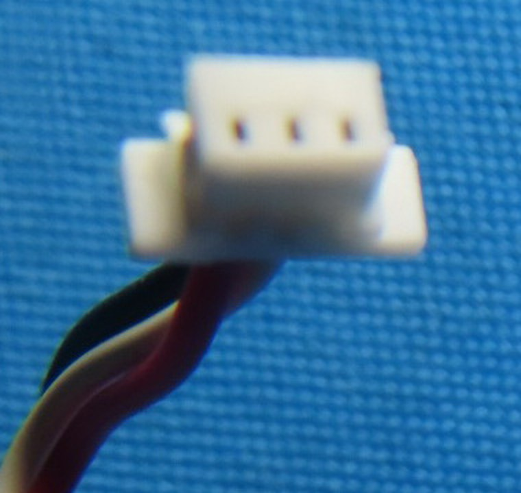{ loading=lazy }
  <figcaption>The 3-way plug: contacts about 1.5 mm apart in a housing about 6 mm wide, like JST ZH. CRL IP4 p26 (crop).</figcaption>
</figure>

<figure markdown="span">
  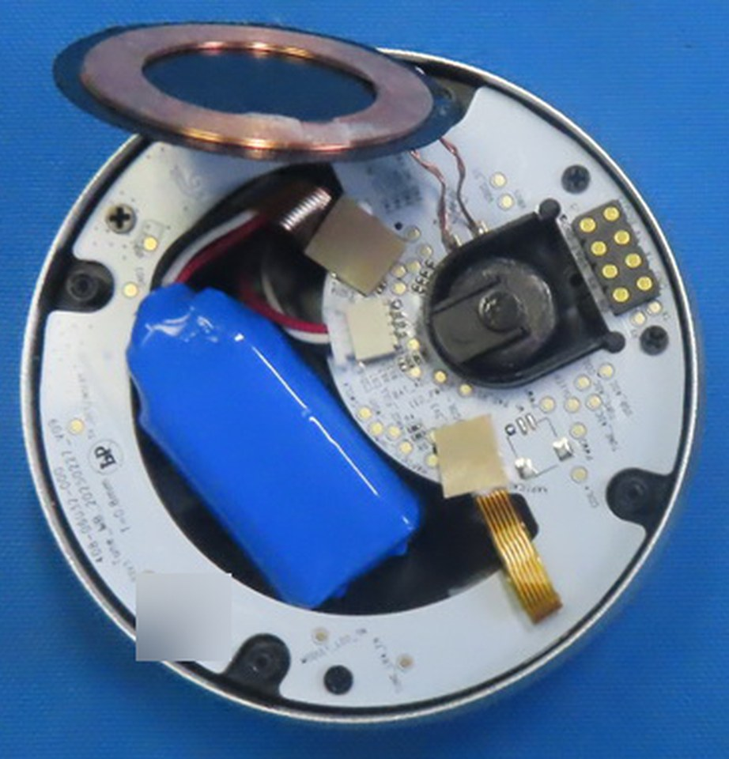{ loading=lazy }
  <figcaption>In place: base cover off, Qi coil lifted, the pack beside the ring board with its lead to the inner island. A 2D code is blurred. CRL IP2 p18 (crop).</figcaption>
</figure>

| Property | Value | Evidence |
|---|---|---|
| Label | `+ FH 202030 3.7V` / `1000mAh 3.7Wh` / `- 20250603` | DOC CRL IP4 p25-p26 = CRR IP4 p22-p23[^fcc-crl] |
| Chemistry, build | 3.7 V lithium polymer (or lithium-ion) cells in a blue PVC heat-shrink block; the cells are not visible | DOC INFERRED |
| Voltage | 3.7 V nominal, 4.2 V full charge | DOC INFERRED |
| Capacity, energy | 1000 mAh, 3.7 Wh on the filed sample; the website, the 2023 campaign and the v1.1.0 manual say 1500 mAh, and a 2024 update says the Tune was redesigned to fit a larger battery | DOC[^man-tu][^ks-camp][^ks-15] ([details](../open-questions.md#oq-h21)) |
| Size | code `202030` read as 20 x 20 x 30 mm (the tenths reading, 2.0 x 20 x 30 mm, gives about 110-140 mAh in makers' catalogs, far short of 1000 mAh); the label face measures about 34 x 20 mm on the tape; thickness not measured | DOC INFERRED[^lipol-table] |
| Probable build | two 10 x 20 x 30 mm cells in parallel under one wrap: `102030` cells are sold at 500-600 mAh each, which matches 1000 mAh and 20 mm; one thick cell is also possible | INFERRED REPORTED (the 102030 listings below) ([details](../open-questions.md#oq-h46)) |
| Protection | none visible outside the wrap | DOC |
| Lead | 3 wires, red, white, black, about 35-40 mm long (estimated on the photo), twisted at the plug | DOC INFERRED (length) |
| Plug | white 3-way housing about 6.0 mm wide with contacts about 1.5 mm apart: JST ZH class (`ZHR-3` is 6.0 mm wide, 1.5 mm pitch) | DOC INFERRED[^jst-zh] |
| Board side | a white wire-to-board header on the ring board's inner island (`J6`, contact count not resolved) | DOC CRL IP3 p19[^fcc-crl] |
| Thermistor | the board has an `NTC` pad and `RT1`/`RT2` beside the SGM41523 charger, whose datasheet recommends a 103AT-2 (10 kΩ) thermistor | DOC INFERRED[^sgm] |

**Fit criteria.** A pack no larger than about 20 x 21 x 34 mm including its wrap and protection
board; a PCM; a 10 kΩ NTC on the third wire; a JST ZH 1.5 mm 3-way plug with the board's pin order;
1000 mAh or more.

**Where to buy** (listings read on 2026-09-23; nothing bought or tested). No listing for
`FH 202030`, or any 1000 mAh pack of this size, was found.

| Rank | Option | Size (mm) | Capacity | As sold | PCM / NTC | Price, minimum | Fit and what to adapt | Evidence |
|---|---|---|---|---|---|---|---|---|
| 1 | Two [LiPol Battery LP902030](https://li-polymer-battery.com/3-7v-rechargeable-li-polymer-battery-lp902030-500mah-with-pcm-and-wires/) in parallel, ordered as one 1S2P pack | each 9.0 x 20 x 30; the pair about 18 x 20 x 30 | 2 x 500 mAh = 1000 mAh; each 250 mA maximum charge, 500 mA continuous discharge | wires; the page offers a 10 kΩ NTC, wire lengths and connectors | PCM yes; NTC on request | price not shown; samples from 5 pieces | Matches the original capacity and fits the envelope. Ask the maker to build the pair as one pack with one 10 kΩ NTC and a ZH 1.5 mm 3-way plug (the maker lists assembled 2P packs with an NTC, for example its [LP351624 2P](https://li-polymer-battery.com/3-7v-rechargeable-li-polymer-battery-pack-lp351624-2p-200mah-with-ntc-and-jst-connector/)) | REPORTED listing |
| 2 | Two [YDL Battery 102030](https://ydlbattery.com/products/ydl-102030-600mah-3-7v-lithium-polymer-battery-10x20x32mm-with-ph2-0-connector) in parallel | each 10 x 20 x 32 including the PCM | 2 x 600 mAh = 1200 mAh; 0.5C maximum | JST PH 2.0 2-pin; options for a JST ZH 1.5 plug and an NTC (3-pin) | PCM yes; NTC option | $3.73 each; minimum order stated as 10 | More capacity; about 2 mm longer than the code, likely within the 34 mm wrapped length ([details](../open-questions.md#oq-h46)). Two separately protected cells must be joined in parallel at equal voltage (see the Track section), with one NTC on the lead: an advanced job | REPORTED listing |
| 3 | One YDL 102030 alone | 10 x 20 x 32 | 600 mAh | as above | as above | as above | Fits with room to spare, but 60 % of the capacity, and at 0.5C it tolerates 300 mA while the Tune may charge at up to about 0.5 A. Not recommended until the Tune's charge current is known ([details](../open-questions.md#oq-h48)) | REPORTED INFERRED |

## Touch: FH364046

The Touch holds one flat cell in a molded recess under two flex cables.

<figure markdown="span">
  { loading=lazy }
  <figcaption>The cell on the tape (centimeters on the lower scale): about 40 x 45 mm including the taped protection fold. CRL IP5 p33 (crop).</figcaption>
</figure>

<figure markdown="span">
  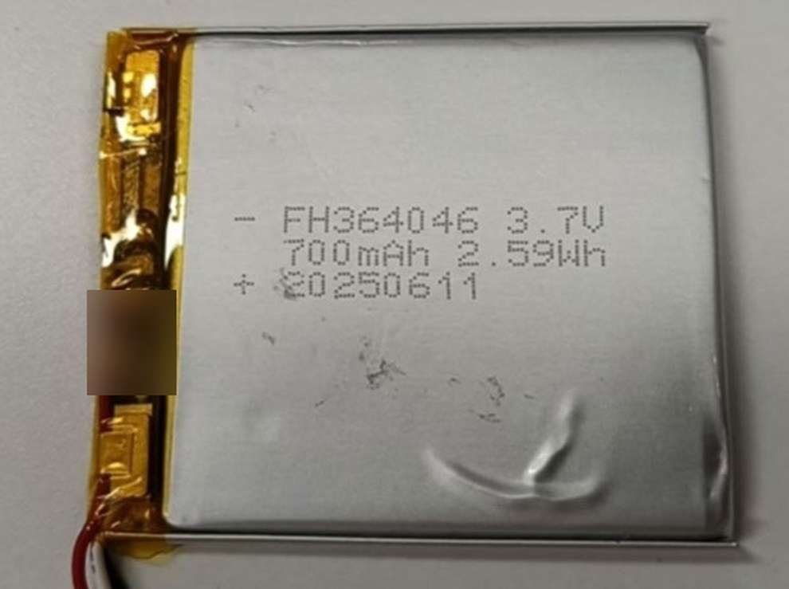{ loading=lazy }
  <figcaption>"- FH364046 3.7V / 700mAh 2.59Wh / + 20250611"; the protection board under the tape at left. A hand mark on the tape is blurred. CRL IP5 p34.</figcaption>
</figure>

<figure markdown="span">
  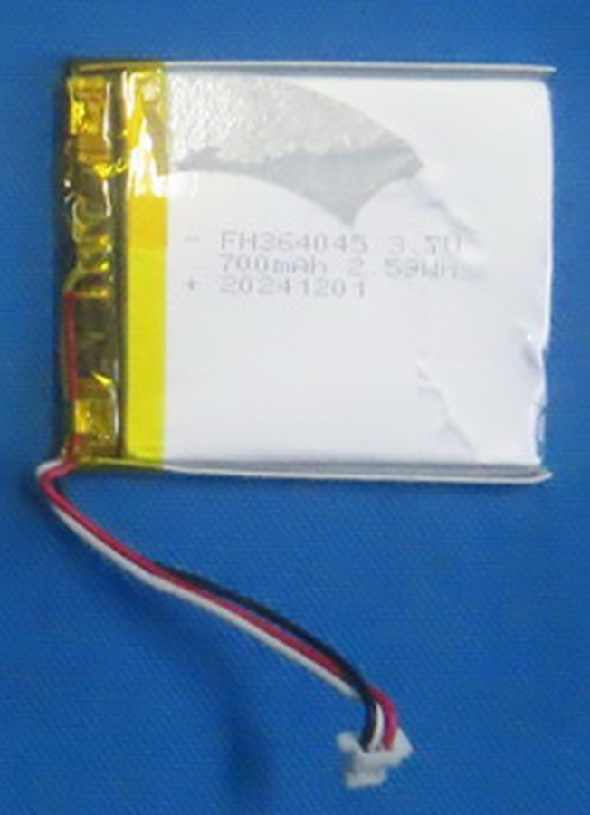{ loading=lazy }
  <figcaption>A second sample: "FH364045 3.7V 700mAh 2.59WH 20241201", from the teardown layout. CRL IP4 p28 (crop).</figcaption>
</figure>

<figure markdown="span">
  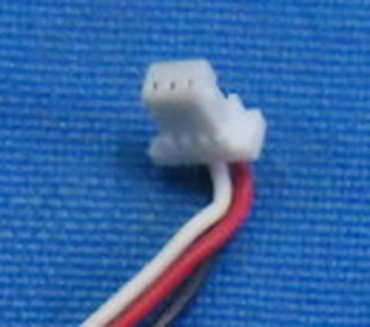{ loading=lazy }
  <figcaption>The 3-way plug, about 4 mm across the body. CRL IP5 p33 (enlarged crop).</figcaption>
</figure>

<figure markdown="span">
  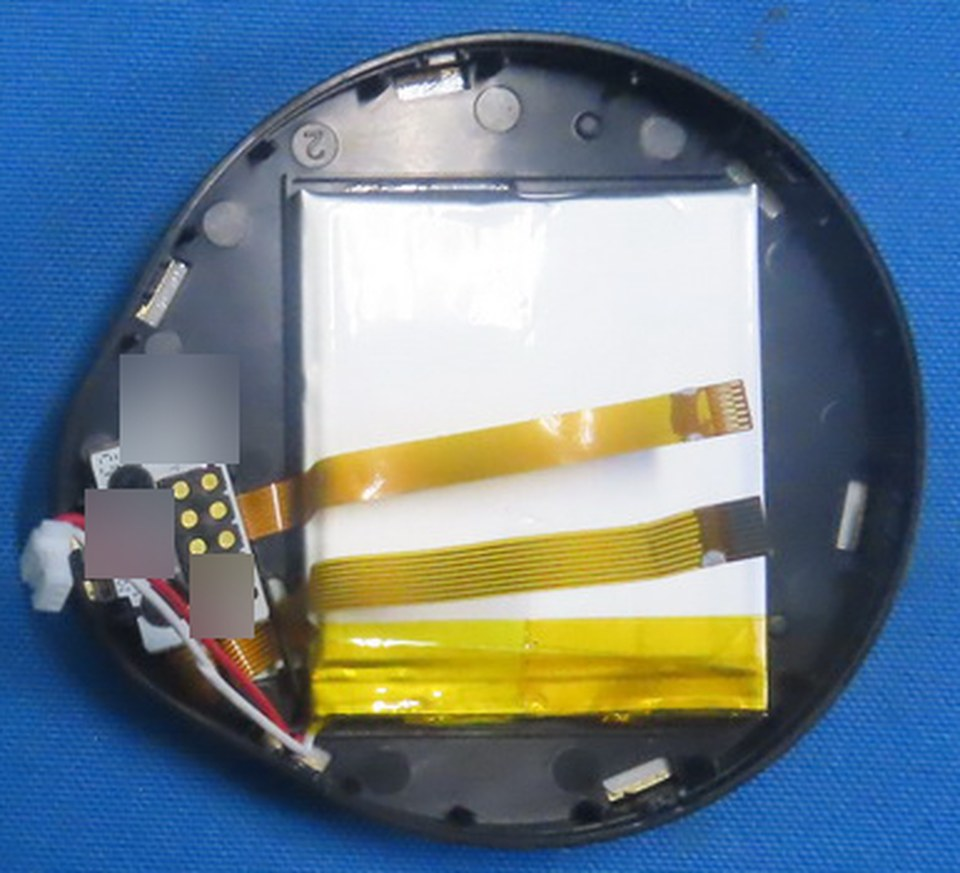{ loading=lazy }
  <figcaption>In place: one cell in its recess, two flex cables over it, the lead to the pogo-board side. 2D codes are blurred. CRL IP4 p28 (crop).</figcaption>
</figure>

| Property | Value | Evidence |
|---|---|---|
| Labels | `- FH364046 3.7V` / `700mAh 2.59Wh` / `+ 20250611` (CRL IP5 p34); a second sample `FH364045`, same rating, `20241201` (CRL IP4 p28); a third photo on CRL IP5 p33 reads `FH364046` with a date ending `0250519` | DOC[^fcc-crl] |
| How many cells | one in the opened Touch; the different dates suggest several sample cells were photographed, not two per module | DOC INFERRED ([details](../open-questions.md#oq-h20)) |
| Chemistry | lithium polymer pouch | INFERRED (pouch form) |
| Voltage | 3.7 V nominal, 4.2 V full charge | DOC INFERRED |
| Capacity, energy | 700 mAh, 2.59 Wh on the filed samples; the website and 2023 campaign said 800 mAh, the v1.1.0 manual 1500 mAh | DOC[^man-to][^ks-camp] ([details](../open-questions.md#oq-h21)) |
| Size | 3.6 x 40 x 46 mm by its code (`364045`: 3.6 x 40 x 45 mm); on the tape about 40 x 45 mm including the protection fold; the lower-resolution ruler photo on the same page reads about 40 x 44 mm for the body and up to 49 mm with the fold | DOC INFERRED (measured on the photos) |
| Protection | a protection board folded along one short edge under yellow tape; no marking legible | DOC INFERRED (function) |
| Lead | 3 wires, red, black, white, about 40-45 mm long (estimated on the photo); the order at the plug is not legible | DOC INFERRED (length) |
| Plug | white 3-way housing, about 4 mm across the body, contacts about 1.0 mm apart: JST SH class | DOC INFERRED[^jst-sh] |
| Board side | `J3`, a 3-position right-angle header with two hold-down tabs, about 1.0 mm pitch, beside `VBAT` and `NTC` pads and a 5 V TVS diode | DOC CRL IP5 p31[^fcc-crl] ([parts TCM-22](parts.md#tcm-22)) |
| Thermistor | `NTC` pad and `RT1`-`RT3` beside the SGM41523 charger: a 10 kΩ 103AT-type NTC expected | DOC INFERRED[^sgm] |

**Fit criteria.** Thickness at most 3.6 mm; width at most 40 mm; length at most about 45 mm
including the protection board, unless the recess proves longer ([details](../open-questions.md#oq-h47));
a PCM; a 10 kΩ NTC; a JST SH 1.0 mm 3-way plug with the `J3` pin order; 700 mAh if you can get it.

**Where to buy** (listings read on 2026-09-23; nothing bought or tested). No listing for `FH364046`,
`FH364045` or any `364046`/`364045` cell was found, and no stocked cell reaches 700 mAh within
3.6 x 40 x 46 mm.

| Rank | Option | Size (mm) | Capacity | As sold | PCM / NTC | Price, minimum | Fit and what to adapt | Evidence |
|---|---|---|---|---|---|---|---|---|
| 1 | [LiPol Battery LP304045](https://li-polymer-battery.com/the-latest-3-7v-li-polymer-battery-by-thickness/) (catalog size) | 3.0 x 40 x 45 | 500 mAh | made to order; PCM, 10 kΩ NTC, wires and connectors offered on the maker's product pages | on request | quote only; samples from 5 pieces | Fits every known dimension and is 0.6 mm thinner. 71 % of the capacity, so the charge-rate caveat applies ([details](../open-questions.md#oq-h48)). Order with a 10 kΩ NTC and an SH 1.0 mm 3-way plug | REPORTED catalog table |
| 2 | [LiPol Battery LP353045](https://li-polymer-battery.com/3-7v-rechargeable-li-polymer-battery-lp353045-480mah-with-protection-circuit-and-wires/) | 3.5 x 30 x 45 | 480 mAh, 1.776 Wh | 50 mm wires | PCM yes; NTC "No" as listed | price not shown | Fits, 10 mm narrower than the recess (pad it so it cannot move). Needs a thermistor added by the maker and a plug | REPORTED listing |
| 3 | A custom 3.6 x 40 x 46 mm, 700 mAh cell with PCM, 10 kΩ NTC and SH plug | as the original | 700 mAh | - | - | quote | The only way to keep the original runtime and charge rate | INFERRED |
| Not recommended | [LiPol Battery LP384046](https://li-polymer-battery.com/the-latest-3-7v-li-polymer-battery-by-thickness/) (catalog size) | 3.8 x 40 x 46 | 840 mAh | made to order | on request | quote only | 0.2 mm thicker than the original. Only if the recess depth is measured and has the room | REPORTED catalog table |

## Track: QS801630 1S2P

The Track's pack is two small cells wired in parallel and joined at an angle so the pack follows the
ring around the ball.

<figure markdown="span">
  { loading=lazy }
  <figcaption>The pack, with the print on one cell: "QS801630 300mAh ... 3.7V 1.11Wh". The lead is red, yellow and black. CRL IP7 p42 (crop).</figcaption>
</figure>

<figure markdown="span">
  { loading=lazy }
  <figcaption>The pack label: "QS801630 1S2P 600mAh / 25H09 3.7V 2.22Wh" (rotated to read upright). CRL IP7 p42 (crop).</figcaption>
</figure>

<figure markdown="span">
  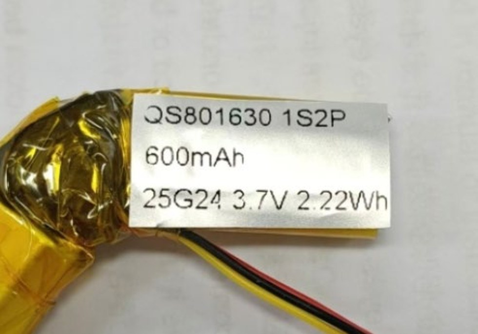{ loading=lazy }
  <figcaption>A second pack: "QS801630 1S2P / 600mAh / 25G24 3.7V 2.22Wh". CRL IP7 p43.</figcaption>
</figure>

<figure markdown="span">
  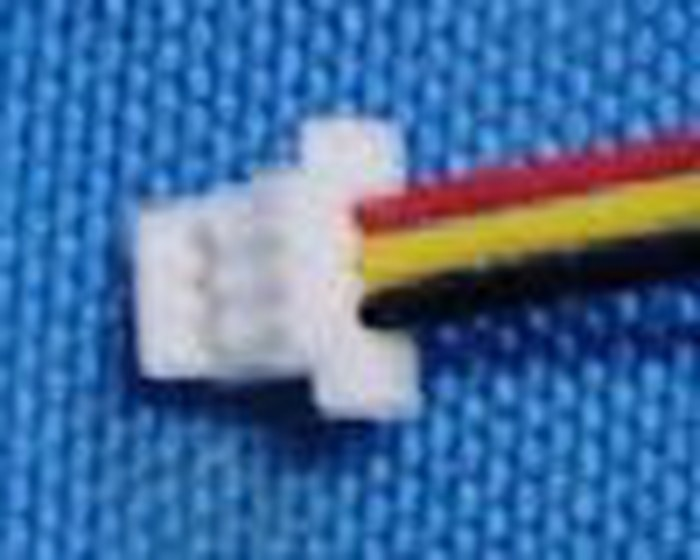{ loading=lazy }
  <figcaption>The 3-way plug; the yellow wire enters in the middle. CRL IP7 p42 (enlarged crop).</figcaption>
</figure>

<figure markdown="span">
  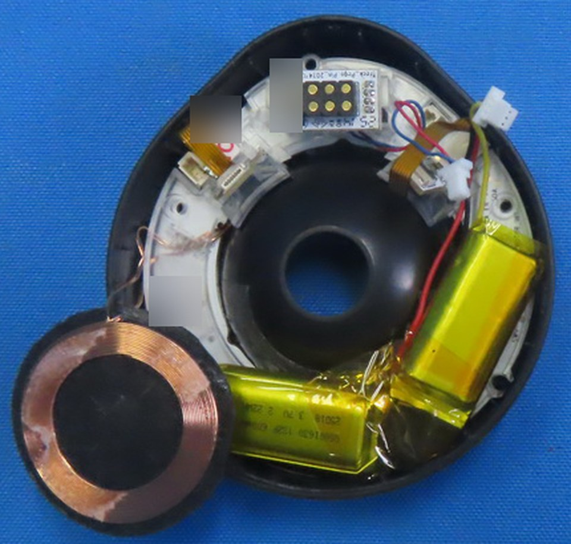{ loading=lazy }
  <figcaption>In place: one cell along the right side, one along the bottom, joined at the corner; the Qi coil flipped out. 2D codes and a lab mark are blurred. CRL IP6 p38 (crop).</figcaption>
</figure>

| Property | Value | Evidence |
|---|---|---|
| Labels | pack `QS801630 1S2P 600mAh` / `25H09 3.7V 2.22Wh` (CRL IP7 p42) and `QS801630 1S2P` / `600mAh` / `25G24 3.7V 2.22Wh` (p43, a second pack); each cell printed `QS801630 300mAh` / `…5H09 3.7V 1.11Wh` | DOC[^fcc-crl] |
| Build | two pouch cells in parallel (1S2P), wrapped in yellow polyimide tape, joined with nickel tabs at an angle; in the module one lies along the side, one along the bottom | DOC CRL IP6 p38; CRL IP7 p42[^fcc-crl] |
| Chemistry | lithium polymer pouch | INFERRED |
| Voltage | 3.7 V nominal, 4.2 V full charge | DOC INFERRED |
| Capacity, energy | 600 mAh, 2.22 Wh (2 x 300 mAh, 2 x 1.11 Wh) on the filed samples; the website and 2023 campaign said 800 mAh, the v1.1.0 manual 700 mAh | DOC[^man-tr][^ks-camp] ([details](../open-questions.md#oq-h21)) |
| Size | each cell 8.0 x 16 x 30 mm by its code; on the tape each cell's face is about 16-17 mm wide, and the ends are hidden under the joint tape; `801630` cells are sold at 300 mAh, which matches | DOC INFERRED REPORTED (Vats listing below) |
| Protection | none visible outside the wrap; probably inside the joint | DOC INFERRED |
| Lead | 3 wires, red, yellow, black, about 35-40 mm long (estimated on the photo); yellow enters the plug in the middle | DOC INFERRED (order, from the photo) |
| Plug | white 3-way housing, about 4.5 mm across the body and 6.5 mm across its side protrusions: JST SH class like the half's, within the photo's precision | DOC INFERRED[^jst-sh] |
| Board side | a white 3-pin connector; not identified on the board photos | DOC ([parts TKX-17](parts.md#tkx-17)) |
| Thermistor | `NTC` pad on the ring board and an SGM41523 charger: a 10 kΩ 103AT-type NTC expected | DOC INFERRED[^sgm] |

**Fit criteria.** Each cell at most 8.0 x 16 x 30 mm, including its protection board if it has one;
the two joined at the original angle so the pack lies in the same two pockets
([details](../open-questions.md#oq-h47)); a PCM per cell or one for the pack; a 10 kΩ NTC; a JST
SH-class 3-way plug with the board's pin order; 600 mAh or more in total.

**Where to buy** (listings read on 2026-09-23; nothing bought or tested). No listing for `QS801630`
was found; `801630` is a standard size and single cells are sold, but no ready-made angled 1S2P pack.

| Rank | Option | Size (mm) | Capacity | As sold | PCM / NTC | Price, minimum | Fit and what to adapt | Evidence |
|---|---|---|---|---|---|---|---|---|
| 1 | Two [LiPol Battery LP801530](https://li-polymer-battery.com/3-7v-rechargeable-li-polymer-battery-lp801530-300mah-with-pcm-and-wires/), ordered as one angled 1S2P pack | each 8.0 x 15 x 30 | 2 x 300 mAh = 600 mAh; each 150 mA maximum charge, 300 mA continuous discharge | wires; the page offers a 10 kΩ NTC, wire lengths and connectors | PCM yes; NTC on request | price not shown; samples from 5 pieces | Matches the original capacity; 1 mm narrower. Ask for the two cells joined at the original angle with one 10 kΩ NTC and an SH 1.0 mm 3-way plug | REPORTED listing |
| 2 | Two [Shenzhen Vats Power Source 801630](https://vatsbattery.en.made-in-china.com/product/znxUBqFYhSWI/China-Kc-CE-3-7V-801630-300mAh-Polymer-Rechargeable-Lithium-Battery.html) | each 8.0 x 16 x 30 (tolerance ±0.2 x ±0.5 x ±3) | 300 mAh each | "JST or Molex connectors can be selected" | PCM yes (overcharge, overdischarge, overcurrent, short circuit); NTC not stated | $1.48 each at 10-999; no minimum if in stock | The original's own size code. The length tolerance is wide: measure the cells you receive. Needs the same pack assembly and a thermistor | REPORTED listing |
| 3 | Two [YDL Battery 801530](https://ydlbattery.com/products/ydl-801530-350mah-3-7v-lithium-polymer-battery-8x15x32mm-with-ph2-0-connector) | each 8 x 15 x 32, including the PCM | 350 mAh each, 0.5C maximum | JST PH 2.0 2-pin; SH 1.0 and ZH 1.5 plug options; NTC option | PCM yes; NTC option | $3.47 each; minimum order stated as 10 | More capacity, but 2 mm longer than the code: fit in the pockets is unmeasured | REPORTED listing |

!!! danger "Building a two-cell pack yourself"
    Joining two cells in parallel is for people who solder battery tabs routinely. Use two cells of the
    same make, model, capacity and age; bring both to the same voltage (within about 0.01 V) before
    joining them, because two cells at different voltages dump current into each other the moment they
    touch; protect each cell with its own PCM or the pack with one PCM rated for both; fit one thermistor
    against a cell; insulate every joint with polyimide tape. Battery University's guidance on parallel
    packs: use "the same battery type with equal voltage and capacity (Ah) and never ... mix different
    makes and sizes", and a shorted cell in a parallel pack "could cause excessive heat and become a fire
    hazard" DOC[^bu302]. Never solder directly to a cell's tabs with a hot iron held long; a pack
    maker can spot-weld the tabs instead. Untested by us.

## Connectors and re-terminating a lead

Most replacement cells arrive with a JST PH 2.0 mm 2-pin plug or bare wires, so you will usually move
the lead to a matching 3-way housing, or order the cell with the right plug. The series below are the
likely matches; confirm yours by measuring ([details](../open-questions.md#oq-h43)).

| Battery | Likely series | Housing and contacts | Width across the housing | Evidence |
|---|---|---|---|---|
| Half, Touch, Track | JST SH, 1.0 mm pitch | `SHR-03V-S` (with side protrusions) or `SHR-03V-S-B` (without); contact `SSH-003T-P0.2` | 6.0 mm with protrusions, 4.0 mm without | DOC[^jst-sh] (catalog); INFERRED (match) |
| Tune | JST ZH, 1.5 mm pitch | `ZHR-3`; contact `SZH-002T-P0.5` or `SZH-003T-P0.5` | 6.0 mm | DOC[^jst-zh] (catalog); INFERRED (match) |
| If a plug measures 1.25 mm | JST GH or Molex PicoBlade class | `GHR-03V-S` (JST GH) | 5.0 mm | DOC[^jst-gh] |

Ready-made leads (listings read on 2026-09-23): a
[JST SH 1.0 mm 3-pin cable](https://www.adafruit.com/product/5765) (Adafruit 5765, 100 mm, $1.50,
with socket headers on the far end to cut off) and a
[1.25 mm 3-pin matching cable pair](https://www.adafruit.com/product/4721) (Adafruit 4721,
PicoBlade-compatible, 40 cm, $0.95) REPORTED. Their wire colors follow the seller's own
convention, not a battery's: map every wire with a meter. The crimp contacts are too small to crimp
well without the maker's tool, so a pre-crimped lead spliced to the cell's wires (soldered, then
covered in heat-shrink, one joint at a time so two bare wires never touch) is the practical route
INFERRED.

## Measurements that would confirm fit

Nobody has published these numbers yet. If you open a half or a module, these are the measurements
that turn the estimates on this page into facts; each is an open question.

- OPEN The half cell's thickness, width and length, with and without the protection fold, and the free length and depth of the space it sits in ([OQ.H42](../open-questions.md#oq-h42)).
- OPEN Each plug's series and pitch: calipers across the housing (6.0 mm points to JST SH with protrusions or ZH, 5.0 mm to GH, 4.0 mm to SH without protrusions) and between contact centers ([OQ.H43](../open-questions.md#oq-h43)).
- OPEN Each lead's wire order at the plug, and the polarity read with a meter; which board pin is positive ([OQ.H44](../open-questions.md#oq-h44), [OQ.H04](../open-questions.md#oq-h04) for the half).
- OPEN The thermistor's resistance from the third wire to the negative wire at room temperature, with the temperature noted (about 10 kΩ at 25 °C for a 103AT type) ([OQ.H44](../open-questions.md#oq-h44)).
- OPEN Whether each pack has a protection board, and its IC markings ([OQ.H45](../open-questions.md#oq-h45)).
- OPEN The Tune pack's thickness and whether it holds one cell or two ([OQ.H46](../open-questions.md#oq-h46)).
- OPEN The Touch recess and the Track pockets: the largest cell each holds, the Track's bend angle and lead length ([OQ.H47](../open-questions.md#oq-h47)).
- OPEN The charge settings: the resistors on each module charger's CC and CV pins, and the half's charger part ([OQ.H48](../open-questions.md#oq-h48)).
- OPEN The label on your own retail pack, since retail capacities may differ from the filed samples ([OQ.H21](../open-questions.md#oq-h21)).

## Replacement procedure

This is as far as the evidence goes. Nobody on this project has replaced a Create battery, so every
step below is **untested**; how each case is fastened is only partly visible in the FCC photos.

!!! danger "Before you start"
    Unplug USB, undock both modules, and switch the half off. Have the replacement's polarity and
    thermistor already measured (above). Keep the old battery until the new one works.

**Keyboard half (untested).** The only description is the v1.0.6 manual's end-of-life procedure:
remove the switches, screws and hinges, take the circuit board out of the aluminum body, then detach
the battery from the circuit board DOC[^um106]. The label artwork shows 12 screws on each half's
underside DOC[^fcc-crr]. The cell plugs into a receptacle on the mainboard beside the `VBAT2` and
`NTC` pads DOC[^fcc-crl]; no photo shows where the cell lies in the assembled half or how it is held
([details](../open-questions.md#oq-h42)). Unplug it by the housing, never by the wires. The keymap and
pairings live in flash, so a cell swap should not erase them INFERRED, untested.

**Tune (untested).** The photos show the base cover off (it carries six metal blocks), the Qi coil
lifted on its fine wires, and the pack lying beside the ring board with its lead running to a white
header on the inner island (CRL IP2 p18) DOC[^fcc-crl]. How the base is held (screws, clips or
adhesive) is not visible. Do not pull on the Qi coil's wires.

**Touch (untested).** The Touch opens into two shells: the main board sits in one, and the cell lies
in a molded recess in the other, under two flex cables, with its lead running to `J3` on the main
board past the pogo board (CRL IP4 p28) DOC[^fcc-crl]. Free the flex cables before lifting the cell,
and do not pry under the cell with metal.

**Track (untested).** The photos show the base cover off (it carries six metal inserts) and the Qi coil
flipped out on its wires, exposing the two cells in pockets along the ring, joined at the corner, with the lead running to a white 3-pin connector near the pogo board
(CRL IP6 p38) DOC[^fcc-crl]. The cells may be held with tape or adhesive; do not lever them out.

**After fitting.** Charge on USB with the half or module where you can watch it, and check the voltage
climbs and settles near 4.2 V. The half's own cell reads as "Internal Battery Voltage (mV)" in
NayaFlow, and a docked module's cell through the module battery reading; both are described on
[Power and batteries](power.md#reading-battery-values).

!!! note "Reading battery voltages is read-only"
    The voltage reads (`fe/1006` for the half's cell, `de/100b` for a docked module's cell, in mV) change
    nothing on the keyboard. Tested by us on 3.41.0 with modules on 2.3.3; see
    [Power and batteries](power.md#reading-battery-values).

## Open questions

- OPEN The cell makers behind the `FH` and `QS` prefixes; none of the catalogs we checked (LiPol Battery, YDL, Shenzhen Data Power, EEMB, PKCELL) uses them, so they may be the pack assembler's or Naya's own codes INFERRED ([details](../open-questions.md#oq-h21)).
- OPEN Retail pack capacities ([details](../open-questions.md#oq-h21)) and one or two cells per Touch ([details](../open-questions.md#oq-h20)).
- OPEN The half cell's size and cavity ([details](../open-questions.md#oq-h42)), and its connector and pin order ([details](../open-questions.md#oq-h04)).
- OPEN Connector series and pitch for all four batteries ([details](../open-questions.md#oq-h43)).
- OPEN Wire order and thermistor value ([details](../open-questions.md#oq-h44)); protection boards ([details](../open-questions.md#oq-h45)).
- OPEN The Tune pack's thickness and build ([details](../open-questions.md#oq-h46)); the Touch and Track battery spaces ([details](../open-questions.md#oq-h47)).
- OPEN Charge voltage and current on each board ([details](../open-questions.md#oq-h48)); the half's power tree ([details](../open-questions.md#oq-h03)).

See also: [Power and batteries](power.md), [The keyboard half](half.md), [Tune](tune.md),
[Touch](touch.md), [Track](track.md), [Module dock](dock.md) and the [Parts list](parts.md).

## Sources

[^fcc-crl]: FCC ID 2BQ4V0825CRL (left half; the module photos are in both filings): internal photos 1-7 and test reports, on the FCC record ([FCC EAS search](https://apps.fcc.gov/oetcf/eas/reports/GenericSearch.cfm), grantee 2BQ4V; mirror [fccid.io/2BQ4V0825CRL](https://fccid.io/2BQ4V0825CRL)). Page codes such as CRL IP2 p13 are explained on [Regulatory records](regulatory.md#how-to-cite-an-fcc-photo). The images on this page are crops of these exhibits, with 2D codes and a hand mark blurred.
[^fcc-crr]: FCC ID 2BQ4V0825CRR (right half): internal photos, test reports and the label artwork; mirror [fccid.io/2BQ4V0825CRR](https://fccid.io/2BQ4V0825CRR).
[^fcc-dg]: FCC ID 2BQ4V0825DG (dongle); mirror [fccid.io/2BQ4V0825DG](https://fccid.io/2BQ4V0825DG).
[^um106]: Naya Create User Manual Version 1.0.6, FCC ID 2BQ4V0825CRR user manual exhibits ([fccid.io](https://fccid.io/2BQ4V0825CRR)): spec sheet (p3), power (p4), safety and end-of-life battery removal (part 4, p3); see [Manuals](../product/manuals.md).
[^man-c]: Naya Create User Manual Version 1.1.0 (vendor PDF, 2025-11-10), p4, p11; see [Manuals](../product/manuals.md).
[^man-tu]: Naya Tune User Manual Version 1.1.0 (vendor PDF), p2.
[^man-to]: Naya Touch User Manual Version 1.1.0 (vendor PDF), p2.
[^man-tr]: Naya Track User Manual Version 1.1.0 (vendor PDF), p2.
[^ks-camp]: Kickstarter campaign page with its Specs Sheet, [naya-create/naya-create](https://www.kickstarter.com/projects/naya-create/naya-create) (2023).
[^ks-15]: Kickstarter update 15, [2024-09-03](https://www.kickstarter.com/projects/naya-create/naya-create/posts/4095301).
[^ks-21]: Kickstarter update 21, [2025-06-16](https://www.kickstarter.com/projects/naya-create/naya-create/posts/4409531).
[^sgm]: SG Micro, SGM41523/SGM41523A/B/C/D datasheet, [product page](https://www.sg-micro.com/product/SGM41523): TS pin and 103AT-2 thermistor, JEITA thresholds (0, 10, 45, 60 °C), charge voltage selection (4.2 V when CV is grounded or open), charge current `ICHGREG = K·VREF/RCC` with K = 10 300 and VREF = 1 V. The part is identified on the module boards on [Tune](tune.md), [Touch](touch.md) and [Track](track.md).
[^jst-sh]: JST, SH connector catalog, [eSH.pdf](https://www.jst-mfg.com/product/pdf/eng/eSH.pdf): housing `SHR-03V-S` (A 2.0 mm; B 6.0 mm with protrusions, 4.0 mm without), contact `SSH-003T-P0.2`.
[^jst-zh]: JST, ZH connector catalog, [eZH.pdf](https://www.jst-mfg.com/product/pdf/eng/eZH.pdf): housing `ZHR-3` (A 3.0 mm, B 6.0 mm), contacts `SZH-002T-P0.5`, `SZH-003T-P0.5`.
[^jst-gh]: JST, GH connector catalog, [eGH.pdf](https://www.jst-mfg.com/product/pdf/eng/eGH.pdf): housing `GHR-03V-S` (A 2.50 mm, B 5.00 mm).
[^lipol-table]: LiPol Battery, [3.7 V Li-polymer batteries by thickness](https://li-polymer-battery.com/the-latest-3-7v-li-polymer-battery-by-thickness/) (catalog table, read 2026-09-23): for example LP252030 (2.5 x 20 x 30 mm) at 110 mAh and LP302030 (3.0 x 20 x 30 mm) at 140 mAh.
[^bu302]: Battery University, [BU-302: Series and Parallel Battery Configurations](https://www.batteryuniversity.com/article/bu-302-series-and-parallel-battery-configurations/).
