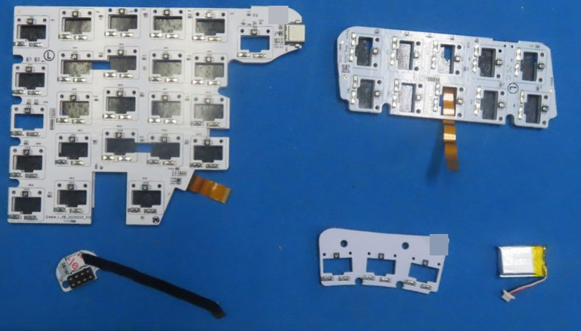
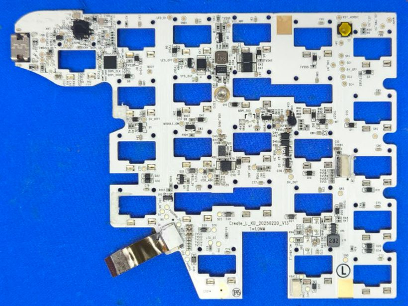
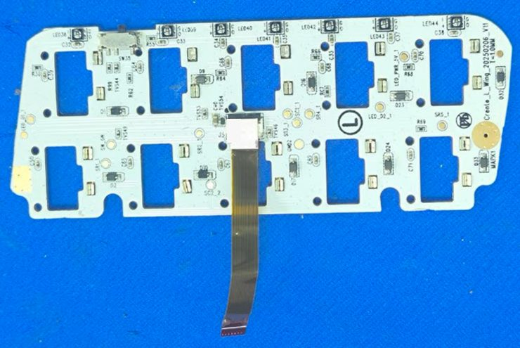
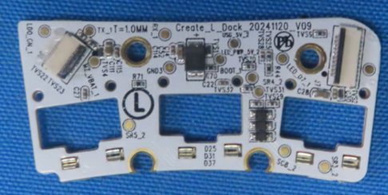
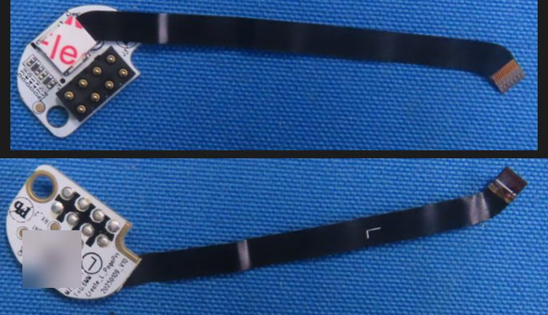
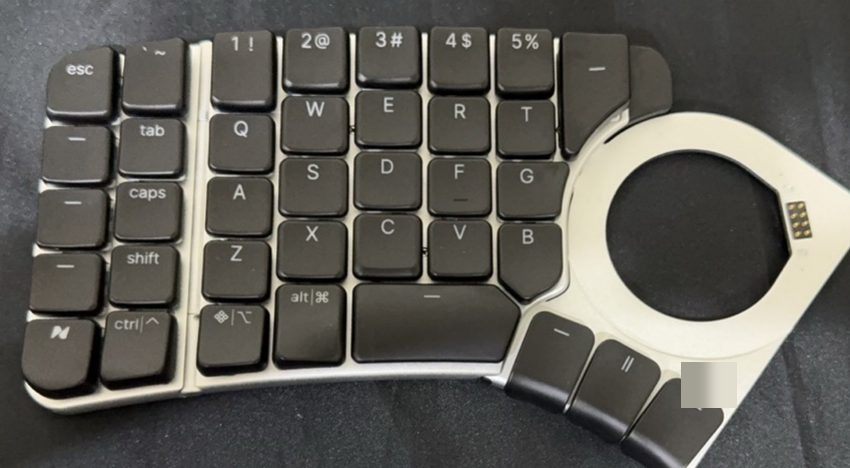
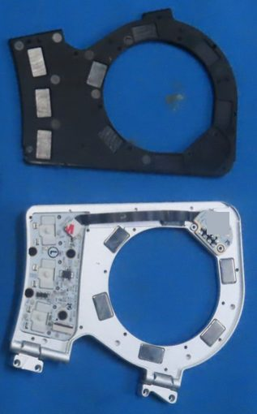

# The keyboard half

This page describes everything physical about one half: the mainboard (SoC, flash, clocks, antenna,
USB-C, debug pads, power parts, LEDs, matrix), the wing board, the dock (thumb-key) board, the pogo
board, switches, keycaps, enclosure, hinges and magnets. The one thing to know: the radio SoC is a
Nordic nRF52840 with native USB, and there is no second microcontroller on the board. All photos are
pre-production samples received by the lab on 2025-06-20; left and right boards are mirror designs, and
one statement covers both unless it says otherwise.

!!! note "At a glance"
    - Three hinged sections (body, wing, dock) and four boards (mainboard, wing, dock, pogo).
    - SoC: nRF52840, package CKAA, build D0, at the rear-inner corner by the USB-C port, next to a Winbond QSPI NOR flash.
    - 37 keys per half on Kailh CPG-1232 (PG1232 "Choc Mini") hot-swap switches; 24 + 10 + 3 key LEDs plus a 7-LED light bar.
    - SWD pads are labeled at the USB-C corner; the debug-lock state is unknown.
    - Each module bay holds 6 magnets (measured); the halves also attach to each other magnetically.

!!! info "Manual"
    [Create user manual v1.1.0](../assets/manuals/naya-create-user-manual-v1.1.0.pdf) and [v1.1.1](../assets/manuals/naya-create-user-manual-v1.1.1.pdf) (PDF); every version is listed on [Manuals](../product/manuals.md).

## Sections and boards

<!-- half facts 1-2 -->
<!-- fcc-images:start -->

<figure markdown="span">
  { width="560" loading=lazy }
  <figcaption>Left half boards laid out: mainboard, wing, pogo board with flex, dock board, cell. FCC ID 2BQ4V0825CRL, Internal Photos 1, page 7, upper photo. Identifying marks removed.</figcaption>
</figure>

<figure markdown="span">
  { width="560" loading=lazy }
  <figcaption>Left half mainboard (Create_L_KB_20250220_V13), component side. FCC ID 2BQ4V0825CRL, Internal Photos 1, page 9, upper photo. Identifying marks removed.</figcaption>
</figure>

<!-- fcc-images:end -->

A half has three hinged sections (body, wing, dock) and four boards: the mainboard under the body, a
wing board, a dock (thumb-key) board and a small pogo board carrying the dock contacts
DOC[^fcc-crl][^um106]. The mainboards are `Create_L_KB_20250220_V13` (left) and
`Create_R_KB_20250221_V13` (right), 1.0 mm thick (`T=1.0MM`), with a circled `L` or `R`; the left board
shows the same string on both faces DOC CRL IP1 p8, p9; CRR IP1 p6[^fcc-crl][^fcc-crr]. This agrees
with naya-create-kb's hardware page and contradicts its exhibit page, which calls the mainboard
V11[^kb-hardware][^kb-exhibits]. The full board list is on [Board inventory](index.md#boards).

## The SoC is an nRF52840

<!-- half facts 3-7 -->
The radio SoC (`U2`) in both halves is a Nordic nRF52840 in the CKAA package (wafer-level chip-scale,
about 3.5 x 3.6 mm), build code D0, lot `2301ME`. The marking reads `N528…` / `CKAAD0` / `2301ME`; the
end of line 1 is partly hidden by the potting edge in the photos DOC INFERRED CRL IP1 p10 (crop re-viewed
2026-09-23), CRR IP1 p8[^fcc-crl][^fcc-crr]. This contradicts the nRF52811 named on several
naya-create-kb pages[^kb-hardware][^kb-exhibits].

Why nRF52840 and not nRF52811, without relying on line 1:

1. CKAA is an nRF52840 package code; the nRF52811 codes are QFAA, QCAA and CAAA DOC.
2. Conducted peak output reached 8.2-9.3 dBm at power setting 8, above an nRF52811's +4 dBm maximum
   DOC INFERRED CRL BLE report p10, p13[^fcc-crl].
3. Each half enumerates USB with no second MCU on either face, and the nRF52840 has native USB DOC INFERRED.
4. Keyboard images are 218 064 to 361 632 bytes in 663 552-byte bootloader slots, far beyond an
   nRF52811's 192 KB flash STATIC[^nh-fh].
5. The dongle's clearly marked nRF52840 carries the same lot, `2301ME` DOC[^fcc-dg].

Coded-PHY support (the FCC reports test 125 kbps S=8) does not tell the two parts apart: both support
it. It only rules out parts such as the nRF52810 DOC INFERRED[^fcc-crl]. naya-create-kb uses coded PHY as its
evidence for the nRF52811[^kb-hardware].

The nRF52840 has 1 MB flash, 256 KB RAM, a full-speed USB 2.0 device, a QSPI controller and a
CryptoCell security core; the firmware images are decrypted on the device during the bootloader swap,
so the host never holds a key DOC STATIC[^nordic]. The 192 KB and 24 KB figures naya-create-kb quotes are
the nRF52811's[^kb-zmk]. See [Firmware images](../firmware/images.md).

The SoC and the flash sit at the rear-inner corner next to the USB-C port, under a cut-out in a white
foam layer, not in the middle of the board DOC CRL IP1 p8-p10; CRR IP1 p8[^fcc-crl][^fcc-crr].

## Flash and clocks

<!-- half facts 8-11 -->
- **External flash (`U1`).** A Winbond serial NOR flash in a leadless 8-pad package about 4 mm square
  (not SOIC-8), on the nRF52840's QSPI bus; part number and capacity are not legible DOC CRR IP1 p8
  (`winbond` wordmark), CRL IP1 p9[^fcc-crr][^fcc-crl]. naya-create-kb calls it an external SPI flash
  without a maker[^kb-hardware].
- **QSPI test pads** beside the flash: left `QSPI_CS`, `QSPI_CLK`, `QSPI_SIO0`, `QSPI_SIO1`; right
  `QSPI_CLK`, `QSPI_SIO0`, `QSPI_SIO3` and a CS pad DOC (right crop re-viewed 2026-09-23).
- **Two image families.** NayaCore ships two families of keyboard images ("flash generation" A and B,
  the `_64` files) and picks one by a bit in the USB PID; this may mean two flash parts or capacities
  exist. Only generation A has been seen on hardware STATIC INFERRED[^nc] (the owner's boards enumerate
  generation-A PIDs). naya-create-kb reads `_64` as "dual-bank slots"[^kb-versions]; details on
  [Firmware images](../firmware/images.md).
- **Clocks.** `Y1` is a 32.000 MHz crystal marked `YC32.0` (2016 class); a second two-pad part `Y2` has
  an illegible lid (a 32.768 kHz crystal is the likely reading) DOC INFERRED CRL IP1 p10; CRR IP1 p8.

## Antenna and radio

<!-- half facts 12-16 -->
The antenna is a Boen RF0400A printed meander trace on the mainboard (about 7.8 x 3.2 mm), silkscreen
`ANT`, at the rear-inner corner beside USB-C, behind the black non-metal end cap. The vendor confirms
the cap is the RF window: the all-metal body blocked the signal, so the antenna was moved next to the
USB-C port under a plastic section DOC CRL ANT p4; CRL IP1 p7; CRR EP p3[^fcc-crl][^ks-14][^ks-15].

The vendor sheet gives the RF0400A 0.8 dBi peak at 2400 MHz (the filed value); across 2400-2480 MHz
its gain is -0.3 to 0.8 dBi and its efficiency 46.1-63.0 %. The sheet's "Directivity" column equals
minus the efficiency in dB, so that column is mislabeled INFERRED. The left half's RF-exposure report (R00,
never revised) still files 0.59 dBi, the sheet's 2460 MHz value; the R01 reports switched to 0.8 dBi
DOC CRL ANT p1; CRL BLE p11; CRL MPE p4[^fcc-crl].

| Radio as tested | Left half | Right half | Evidence |
|---|---|---|---|
| PHYs | BLE 1M, 2M and coded 125k (S=8), 2402-2480 MHz, GFSK | same | DOC BLE reports p10[^fcc-crl][^fcc-crr] |
| Maximum peak conducted output | 9.30 dBm (2M), 8.5 mW | 8.36 dBm (2M), 6.9 mW | DOC (text layers verified 2026-09-23) |
| Maximum average output | 7.14 dBm (1M) | 7.25 dBm (1M) | DOC |

naya-create-kb's "about 0.007 W" matches the right half's peak; the left half's is 8.5 mW DOC
INFERRED[^kb-hardware]. The manual gives Bluetooth 5.4; the Bluetooth SIG listing's core-spec field reads 5.1
and references Zephyr's host and nRF52 controller designs DOC[^um106][^sig]. Each half's filing also
carries a separate "2.4G SRD" 2 Mbps test report besides BLE DOC; whether shipping firmware ever uses
that mode is OPEN ([details](../open-questions.md#oq-c14); see [Regulatory records](regulatory.md#test-reports)).

## USB, debug pads and reset

<!-- half facts 17-21 -->
- **USB-C.** One unmarked USB Type-C receptacle (`USB1`) per half at the rear-inner corner, facing the
  other half; whether it is a 16-pin or 24-pin part is not resolvable DOC CRL IP1 p6-p9; CRR IP1 p8.
- **Debug and test pads** at the USB-C corner: left `SWDIO`, `SWDCLK`, `TP1`, `TP7`, `USB`, `D+`; right
  `SWDIO`, `SWDCLK`, `TP2`. A re-view of the right-half crop on 2026-09-23 also shows a `D+` label and
  one beginning `US`, so the two halves most likely carry the same set. No `D-` label is visible in any
  crop DOC INFERRED CRL IP1 p7, p9; CRR IP1 p8[^fcc-crl][^fcc-crr]. naya-create-kb also lists `D-`, which no
  crop shows[^kb-exhibits].
- **Debug lock.** Whether the SoC's debug port is locked (APPROTECT) on shipped halves is unknown;
  build code D0 fits Revision 2 silicon, while the hardened Revision 3 uses a different code INFERRED
  ([details](../open-questions.md#oq-h05)).
- **Reset.** A tactile switch `S2` with a yellow cap beside a pad labeled `RST_NORDIC`, plus a `BOOT`
  pad (possibly `BOOT1`) DOC CRL IP1 p9; CRR IP1 p7.
- **Protection.** Many unmarked ESD and TVS parts (`ESD1`-`ESD11`, `TVS...`) sit around USB-C and VBUS
  DOC CRL IP1 p7-p10; CRR IP1 p8.

## Power parts and rails

<!-- half facts 22-24 -->
The power parts are unread: a 0.47 uH inductor (`R47`, `L11`) and a 2.2 uH inductor (`2R2`, `L10`),
each next to an unmarked converter IC; a square QFN near the `USB_ADC`, `BAT_ADC`, `VBUS_5V` and
`CHG_?NT` pads (a charger or power manager, inferred); SOT-23 load switches (one marked `S2U`); two
polarized bulk capacitors; one potted glob DOC INFERRED CRL IP1 p9; CRR IP1 p8. Rail and sense pads on the
mainboard: `VBUS_5V`, `USB_ADC`, `BAT_ADC`, `SYS`, `SYS_OUT`, `5V_OUT`, `5V_OFF`, `5V_OFF1`,
`MODULE_ON`, `LED_PWR_5V`, `LED_OFF`, `LED_01`, `LED_02`, `INT` and grounds; their roles (switched
module, LED and 5 V rails; ADC sense points) are read from the names DOC INFERRED. The cell connects at a
receptacle on pads `VBAT2`, `NTC` and (probably) `MZ_VBAT_2`, for the cell's three-wire lead (red,
white, black; the white wire is most likely an NTC or ID line) DOC INFERRED CRL IP1 p9; CRL IP2 p14. See
[Power and batteries](power.md).

## Per-key lighting and the key matrix

<!-- half facts 25-28, 57, 60 -->
- **LEDs.** Each mainboard carries 24 addressable 4-pad RGB LEDs, daisy-chained with no LED driver IC;
  the parts are unmarked (WS2812/SK6812 class is a reading from the footprint) DOC INFERRED CRL IP1 p8, p9;
  CRR IP1 p6.
- **Matrix.** Test pads `SR1`-`SR5` (rows) and `SC1`-`SC6` (columns); one small diode per key
  (`D3`-`D47`); the dock board continues the scheme (`SR*_2`, `SC8_2`) DOC INFERRED CRL IP1 p9; CRL IP2 p16.
  naya-create-kb lists the matrix wiring as unknown[^kb-zmk]; the exact wiring is still not recovered.
- **Keyscan bypasses the split link.** Key-matrix events can be read straight from each half with the
  keyscan command: 143 events from a right half that was not typing through the left MEASURED (owner's
  board, 2026-09-20, during a firmware mismatch). See [Command map](../protocol/commands.md).
- **Sockets.** The mainboard carries 24 hot-swap key positions (two socket pads per window) DOC.
- **The LED map.** The whole-board LED map has 136 entries per layer (0-73 keys, 74-87 the two light
  bars, 88-111 and 112-135 the two module-bay blocks); the left half drives both halves' LEDs from it.
  Per half, 24 + 10 + 3 key LEDs plus 7 bar LEDs make 44; two halves make 88 = indices 0-87 MEASURED DOC INFERRED
  (owner's board, 3.41.0, 2026-09-08; a second board, 3.28.7, 2026-09-19). Details on
  [Layout and positions](layout.md) and [LEDs](../protocol/led.md).
- **Campaign count.** The 2023 campaign promised "90 individually addressable RGB LEDs" in zones of 68
  (body), 6 (dock edge) and 10 (wing indicators), which add up to 84; the shipped board has 44 key and
  light-bar LEDs per half (88 in all) DOC INFERRED[^ks-camp].

## Board-to-board links

<!-- half fact 29 -->
A flip-lock ZIF connector takes the wing flex (about 12-14 contacts), and a gold flex of about 12-13
conductors runs to the dock board, exiting beside pads `LDO_ON`, `TX`, `RX` and `POGOPIN_5V` DOC CRL IP1
p8, p9; CRR IP1 p6, p7.

## Wing board, light bar and power switch

<!-- half facts 30-33 -->
<!-- fcc-images:start -->

<figure markdown="span">
  { width="560" loading=lazy }
  <figcaption>Left wing board (Create_L_Wing_20250206_V11), component side. FCC ID 2BQ4V0825CRL, Internal Photos 1, page 12, upper photo. Identifying marks removed.</figcaption>
</figure>

<!-- fcc-images:end -->

The wing boards are `Create_L_Wing_20250206_V11` and `Create_R_Wing_20250206_V11` (right middle
hidden), 1.0 mm, with 10 key positions carrying the same designators on both wings (`SW1`, `SW2`,
`SW9`, `SW10`, `SW16`, `SW17`, `SW23`, `SW24`, `SW32`, `SW33`) and 10 per-key LEDs (`LED36`-`LED45`)
DOC CRL IP1 p11, p12; CRR IP1 p9.

The light bar is exactly 7 addressable LEDs in a row along one long edge of the wing board's back face
(seen on the right wing; the left wing's back is under black film); in the LED map the two bars are
indices 74-80 and 81-87 DOC MEASURED (LED map measured on the owner's board, 3.41.0, 2026-09-08).

The power switch is a right-angle SMD slide switch (unmarked) on the outer end face of each wing; on
the right wing it sits between the 6th and 7th light-bar LEDs. Each half has its own switch DOC CRL IP1
p12; CRR IP1 p9[^um106]. Which slide direction is ON cannot be read from the part: the v1.0.6 manual's
drawings disagree, and v1.1.0 draws slide up = ON DOC[^um106][^man-c]. Batch 1 units got "a bit thicker"
power switches DOC[^ks-20]. The switch works while USB is connected: switching OFF on USB shuts the half
off, and switching back ON restarts it MEASURED (owner's board, 2026-09-23). This contradicts
naya-create-kb's statement that a flip on USB is not a reset[^kb-power]; see
[Power and batteries](power.md#resets).

## Dock (thumb-key) board and pogo board

<!-- half facts 34-36 -->
<!-- fcc-images:start -->

<figure markdown="span">
  { width="560" loading=lazy }
  <figcaption>Left dock (thumb-key) board, component face. FCC ID 2BQ4V0825CRL, Internal Photos 2, page 16, upper photo. Identifying marks removed.</figcaption>
</figure>

<figure markdown="span">
  { width="560" loading=lazy }
  <figcaption>Left pogo board with its flex: contact face (top) and back (bottom). FCC ID 2BQ4V0825CRL, Internal Photos 2, page 15, upper and lower, stacked. Identifying marks removed.</figcaption>
</figure>

<!-- fcc-images:end -->

The dock boards are `Create_L_Dock_20241120_V09` and `Create_R_Dock_20241120_V09`, 1.0 mm, about
47 x 21 mm (inferred), under the module bay. Each carries 3 hot-swap thumb-key positions, 3
addressable LEDs, one diode per key (`D25`, `D31`, `D37`), TVS parts on every line and two FPC
connectors (mainboard flex and pogo flex) DOC INFERRED CRL IP2 p16; CRR IP1 p12. Its test pads: `TX_1`,
`RX_1`, `BOOT_1`, `MZ_VBAT_1`, `LDO_ON_1`, `USB_5V_2`, `GND3`; matrix `SR1_2`, `SR3_2`, `SR4_2`,
`SR5_2`, `SC8_2`; LED `LED_D7_1`, `LED_PWR_5V_2`. There is no `D+` or `D-` anywhere DOC.

The pogo board, `Create_L_PogoPin_20250109_V10` (0.6 mm), carries the half's 8 dock spring pins and
hangs on a black flex of about 50 mm to the dock board DOC CRL IP2 p15. Detail on
[Module dock](dock.md).

## Switches and sockets

<!-- half facts 37-40 -->
The switches are Kailh CPG-1232, which is Kailh's PG1232 "Choc Mini" low-profile switch, in the
0.45 x 0.42 mm pin variant; Kailh lists the PG1232 at 14.5 x 13.5 x 8.2 mm with 2.4 mm travel. There are
37 per half, 24 on the body, 10 on the wing and 3 on the dock, 74 in total DOC[^um106][^kailh]. They sit
in hot-swap sockets (two slotted pads per key; the socket part is not legible, PG1232-compatible
inferred) DOC INFERRED[^um106]. The lab samples carry red-stemmed switches with clear housings; the switch
type was a purchase option (the 2026 shop listed Clicky, Linear, Tactile, Silent Linear and Silent
Tactile packs) DOC CRL IP1 p5, p6; CRR IP1 p5[^wb-naya].

Switch history: Gateron KS-28 in the 2023 campaign; Kailh PG1232 adopted in March 2024 (the promised
KS-28 hot-swap socket never came, and the KS-28 had quality problems); the dock keys moved from Kailh
CPG1316 scissor switches to PG1232 in September 2024, about 3 mm taller, making every key hot-swappable
with one switch type; Batch 0 came with linear switches, Batch 1 with tactile, and linear was the
default from 2025-06. The campaign gave an 11.2 mm typing height for the main keys and 9 mm for the dock
keys DOC[^ks-camp][^ks-12][^ks-15][^ks-17][^ks-21].

## Keycaps

<!-- half facts 41-43 -->
Keycaps are polycarbonate, individually sculpted, each labeled on its underside with a coordinate
(`LA1`...`RH4`); the keyboard takes only its own keycaps (vendor, 2023). The 2023 campaign specified
backlit ABS shine-through keycaps; polycarbonate and PC-ABS were sampled in 2024
DOC[^um106][^reddit-jkqzcq4][^ks-camp][^ks-13]. Larger keycaps have wire stabilizers; the manual does not
say which keys. NayaFlow draws two tall inner keys (`LH1`, `RH1`) and two wide space keys (`LE5`, `RE5`)
DOC STATIC[^um106][^nc]. The vendor showed US QWERTY, German, JIS and blank keycap layouts DOC[^wb-naya].

## Enclosure

<!-- half facts 44-50, 56 -->
<!-- fcc-images:start -->

<figure markdown="span">
  { width="560" loading=lazy }
  <figcaption>Left half exterior, top view with the empty module bay and its 8 contacts. FCC ID 2BQ4V0825CRL, External Photos, page 2, upper photo. Identifying marks removed.</figcaption>
</figure>

<!-- fcc-images:end -->

- **Materials.** Body, dock and wing are "Aerospace Grade Aluminum" (the alloy is not stated); the
  dock's underside plate is black, material unknown; a black non-metal end cap carries the USB-C port
  DOC[^um106][^fcc-crr]. naya-create-kb's "Aluminum + polycarbonate" body is not the manual's
  wording[^kb-manual].
- **Machining.** The body is built from 10 custom CNC-machined parts (20 operations); each hinge is
  press-fitted into two machined blocks DOC[^ks-22].
- **Plates.** Separate rigid metal switch plates for the body (24), wing (10) and dock ring (3), butted
  at seams with screws and linked only by flex; the hinging is in the case. The PCBs float on foam
  ("foam-suspended PCB for sound dampening") DOC CRR IP1 p5; CRL IP1 p5, p6[^um106].
- **Tenting.** Two torque hinges per half (a round pivot on the wing, two knuckle assemblies on the
  dock), up to 27° DOC[^um106][^ks-06][^reddit-jn3t9dt].
- **Underside.** 12 silver screws matching 12 screw symbols on the label outline, at least 13 small black
  screws around the dock ring plate, raised foot strips (body 2 curved, wing 2 short plus 1 long, dock
  1 plus a small pad), and a filled `L` or `R` circle near the lower dock hinge DOC[^fcc-crr][^fcc-crl].
- **Engraving.** The Naya "N" logo with "Naya Create" (registered mark), "Designed by Naya in the
  Netherlands", "Made in China"; the regulatory block sits on the wing's underside plate, rotated 90°
  DOC[^fcc-crr][^fcc-crl]. See [Regulatory records](regulatory.md#the-label).
- **Size and weight.** The manual gives 212 x 118 x 18 mm and 1.4 kg; the size fits one half (the 1:1
  label outline of one half is about 210 x 121 mm, inferred); whether the weight is per half or per
  pair is not stated. The 2023 campaign spec sheet gave 205 x 120 mm, 17 mm total height and 225 g per
  half (pre-production) DOC INFERRED[^um106][^fcc-crr][^ks-camp].
- **Batch changes.** Batch 0 testers reported loose body screws and switches loose in their sockets;
  Batch 1 tightened socket tolerance and changed the rubber feet and laser-etch color
  DOC[^ks-19][^ks-20].

## Magnets

<!-- half facts 51-55 -->
<!-- fcc-images:start -->

<figure markdown="span">
  { width="560" loading=lazy }
  <figcaption>Left half module bay: magnet carrier plate (top) and bay bracket with the dock and pogo boards mounted (bottom). FCC ID 2BQ4V0825CRL, Internal Photos 1, page 5, upper photo. Identifying marks removed.</figcaption>
</figure>

<!-- fcc-images:end -->

Each half's module bay holds 6 magnets, one on either side of the contact block and 4 more spaced
around the circular bay (a steel paper clip is attracted at those 6 points), so the half side is
magnetized, not a plain steel strike plate MEASURED (owner's board, 2026-09-23). Mapped onto the FCC photos:
the two small features flanking the contact block on the dock chord and the 4 blocks on the black
carrier plate are the 6 magnets; the 5 rectangular blocks on the metal bay bracket (a frame with a
circular opening and two hinge lugs) did not attract the clip, so they are not magnets MEASURED DOC INFERRED CRL
IP1 p5; CRR IP1 p5; CRR EP p2-p3[^fcc-crl][^fcc-crr]. naya-create-kb's caption speaks of "module-bay
frames with dock magnets" without a count[^kb-hardware].

Each module's base holds 6 rectangular metal blocks or plates (Tune, Touch, Track); whether those are
magnets or steel is not tested (the half side is magnetized, so steel would be enough). The manuals say
there are magnets both in the dock and on the module's bottom DOC[^fcc-crl][^um106]
([details](../open-questions.md#oq-h13)).

The two halves also attach to each other back to back magnetically, for storage and transport; the
vendor suggested those magnets for DIY mounts, as there are no mounting holes. The switches themselves
are not magnetic; the magnets are for modules (vendor, 2023)
DOC[^um106][^man-c][^ks-camp][^ks-11][^reddit-j35i18k]. The dock opening is a circular through-cutout
with one straight chord where the contacts sit; modules are removed by pushing up through the cutout
DOC[^fcc-crr][^um106].

## What a port of open firmware would need

<!-- half facts 58-59 -->
The bootloader banner names MCUboot `9ddeffa8169c` and Zephyr `v3.7.0-5411-g31fea97e05fd` MEASURED (owner's
board, 3.41.0, 2026-09-08). That Zephyr hash is an upstream Zephyr `main` commit of 2024-10-25 (between
v3.7.0 and v4.0.0), not an nRF Connect SDK tag, and the MCUboot hash is in no public MCUboot repository
(a vendor-local build) DOC INFERRED. naya-create-kb reads the banner as "Zephyr 3.7" on the same SDK
generation[^kb-hardware].

Not everything needed for a port of open firmware is known: the board definition (matrix pin-out, LED
chain, split-link and dock protocol) sits in the encrypted firmware and is not recovered, and stock
MCUboot boots only images signed with Naya's RSA-2048 key, so a custom build needs the bootloader
replaced over SWD, whose lock state is unknown STATIC INFERRED. This contradicts naya-create-kb's "everything
else needed for a ZMK port is known"[^kb-hardware]. Detail on [ZMK](../firmware/zmk.md) and
[Bootloader](../firmware/bootloader.md).

## Safety

!!! warning "Opening a half"
    Opening a half exposes a Li-ion cell on a three-wire lead: do not short or puncture it (manual).
    The SWD pads are not a recovery path to try casually: the lock state is unknown, and an SWD erase
    would remove the stock bootloader and its key (see [ZMK](../firmware/zmk.md)). Untested by us.

## Open questions

- OPEN QSPI flash part number and capacity; whether generation B uses another part ([details](../open-questions.md#oq-h02)).
- OPEN The half's power tree: charger, DC-DC ICs, load switches, the potted part ([details](../open-questions.md#oq-h03)).
- OPEN Cell connector pin count and which wire is the NTC ([details](../open-questions.md#oq-h04)).
- OPEN Whether `Y2` is a fitted and used 32.768 kHz crystal ([details](../open-questions.md#oq-h06)).
- OPEN LED part number and protocol ([details](../open-questions.md#oq-h07)).
- OPEN SoC silicon revision and debug-lock state ([details](../open-questions.md#oq-h05)).
- OPEN Slide switch part and ON direction; socket part ([details](../open-questions.md#oq-h22)); USB-C pin class ([details](../open-questions.md#oq-h23)).
- OPEN Whether the module-base blocks are magnets or steel ([details](../open-questions.md#oq-h13)).
- OPEN Which light bar is indices 74-80 ([details](../open-questions.md#oq-h08)).

## Sources

[^fcc-crl]: FCC ID 2BQ4V0825CRL (left half; the module photos are in both filings): exhibits on the FCC record ([FCC EAS search](https://apps.fcc.gov/oetcf/eas/reports/GenericSearch.cfm), grantee 2BQ4V; mirror [fccid.io/2BQ4V0825CRL](https://fccid.io/2BQ4V0825CRL)). Codes such as "CRL IP1 p10" are explained on [Regulatory records](regulatory.md#how-to-cite-an-fcc-photo).
[^fcc-crr]: FCC ID 2BQ4V0825CRR (right half), including the label artwork; mirror [fccid.io/2BQ4V0825CRR](https://fccid.io/2BQ4V0825CRR).
[^fcc-dg]: FCC ID 2BQ4V0825DG (dongle); mirror [fccid.io/2BQ4V0825DG](https://fccid.io/2BQ4V0825DG).
[^um106]: Naya Create User Manual Version 1.0.6, FCC ID 2BQ4V0825CRR user manual exhibits ([fccid.io](https://fccid.io/2BQ4V0825CRR)); see [Manuals](../product/manuals.md).
[^man-c]: Naya Create User Manual Version 1.1.0 (vendor PDF, 2025-11-10); see [Manuals](../product/manuals.md).
[^sig]: Bluetooth SIG qualification listing 311198 ([listing search](https://qualification.bluetooth.com/Listings/Search)), read 2026-09-23.
[^nordic]: Nordic Semiconductor, nRF52840 Product Specification.
[^kailh]: Kailh product data for the PG1232 low-profile switch.
[^nc]: NayaFlow 1.25.1: NayaCore 6.11.0 strings (`setCreateFlashGenerationFromPid`) and the renderer's key geometry (static reading).
[^nh-fh]: create-legacy-firmware, [`FIRMWARE-HISTORY.md`](https://github.com/create-collective/create-legacy-firmware/blob/79eeefb/FIRMWARE-HISTORY.md) (image catalog of the 25 stable releases).
[^wb-naya]: The vendor's former website and shop images, archived by the Wayback Machine ([naya.tech captures](https://web.archive.org/web/2026*/naya.tech/*)); cited only, images not reproduced.
[^kb-hardware]: naya-create-kb, [hardware deep dive](https://nemezzizz.github.io/naya-create-kb/device/hardware/) (third party).
[^kb-exhibits]: naya-create-kb, [exhibit inventory](https://nemezzizz.github.io/naya-create-kb/device/exhibits/) (third party).
[^kb-power]: naya-create-kb, [power architecture](https://nemezzizz.github.io/naya-create-kb/device/power/) (third party).
[^kb-manual]: naya-create-kb, [official manual claims](https://nemezzizz.github.io/naya-create-kb/device/manual/) (third party).
[^kb-zmk]: naya-create-kb, [ZMK](https://nemezzizz.github.io/naya-create-kb/firmware/zmk/) (third party).
[^kb-versions]: naya-create-kb, [firmware versions](https://nemezzizz.github.io/naya-create-kb/firmware/versions/) (third party).
[^ks-camp]: Kickstarter campaign page with its Specs Sheet and FAQ, [naya-create/naya-create](https://www.kickstarter.com/projects/naya-create/naya-create) (2023).
[^ks-06]: Kickstarter update 6, [2023-09-28](https://www.kickstarter.com/projects/naya-create/naya-create/posts/3921225).
[^ks-11]: Kickstarter update 11, [2024-02-15](https://www.kickstarter.com/projects/naya-create/naya-create/posts/4029736).
[^ks-12]: Kickstarter update 12, [2024-03-01](https://www.kickstarter.com/projects/naya-create/naya-create/posts/4041543).
[^ks-13]: Kickstarter update 13, [2024-05-08](https://www.kickstarter.com/projects/naya-create/naya-create/posts/4061393).
[^ks-14]: Kickstarter update 14, [2024-07-24](https://www.kickstarter.com/projects/naya-create/naya-create/posts/4157656).
[^ks-15]: Kickstarter update 15, [2024-09-03](https://www.kickstarter.com/projects/naya-create/naya-create/posts/4095301).
[^ks-17]: Kickstarter update 17, [2024-11-04](https://www.kickstarter.com/projects/naya-create/naya-create/posts/4243300).
[^ks-19]: Kickstarter update 19, [2025-02-11](https://www.kickstarter.com/projects/naya-create/naya-create/posts/4312089).
[^ks-20]: Kickstarter update 20, [2025-03-19](https://www.kickstarter.com/projects/naya-create/naya-create/posts/4341013).
[^ks-21]: Kickstarter update 21, [2025-06-16](https://www.kickstarter.com/projects/naya-create/naya-create/posts/4409531).
[^ks-22]: Kickstarter update 22, [2025-07-28](https://www.kickstarter.com/projects/naya-create/naya-create/posts/4444562).
[^reddit-jkqzcq4]: Reddit, vendor comment [jkqzcq4](https://www.reddit.com/r/ErgoMechKeyboards/comments/13jydnp/_/jkqzcq4/) (2023-05-19); archived text, not live-verified.
[^reddit-jn3t9dt]: Reddit, vendor comment [jn3t9dt](https://www.reddit.com/r/ErgoMechKeyboards/comments/13jydnp/_/jn3t9dt/) (2023-06-06); archived text, not live-verified.
[^reddit-j35i18k]: Reddit, vendor comment [j35i18k](https://www.reddit.com/comments/1047jlm/_/j35i18k/) (2023-01-06); archived text, not live-verified.
