# Parts list

This is the full list of parts read from Naya's public FCC filings for the Create halves, the
Speedlink dongle and the Tune, Touch and Track modules, with the unconfirmed readings kept apart
from confirmed part numbers, and the open hardware questions with what would settle each. The same list is published as a data file,
[`parts.json`](../assets/data/parts.json). The one thing to know: every photographed unit is a
pre-production sample the lab received on 2025-06-20, so retail boards may differ.

!!! note "At a glance"
    - 222 main rows: 199 confirmed and 16 corrected by a blind re-read, plus 7 new rows from the exhibits obtained on 2026-09-23 (one extraction pass).
    - 21 identified part numbers, 20 boards, 47 unconfirmed readings, 26 open questions.
    - Nothing was opened for this list: it reads only public FCC exhibits, vendor manuals and datasheets.
    - Candidates in the unconfirmed table are reasoning, never part numbers.
    - Data file and page are CC BY 4.0; the facts come from public records.

## What the list is and how it was verified

<!-- parts facts 1-2, 5, 15-16 -->
The list was built from the FCC exhibits in 25 extraction passes and then checked by 16 adversarial
passes that re-read every cited crop blind and gave each row a verdict; the method is described on
[Board inventory](index.md#how-the-parts-were-read) DOC. When it was built it had 215 main rows (199
confirmed, 16 corrected), 21 identified part numbers, 48 unconfirmed readings, 50 rejected readings
and 27 open questions across 20 board entries. The 16 exhibits obtained on 2026-09-23 add 7 rows
(LB-20 left label, LB-21 dongle label, LB-22 confidentiality letters, LB-23 dongle SAR report, LB-24
left-half RF-exposure report, DG-19 dongle antenna position, ACC-08 SAR extension cable), settle one
unconfirmed reading (U-LB-04b, the ISED numbers) and one open question (OQ-25, the missing exhibits),
and extend about 20 rows: 222 main rows, 47 unconfirmed readings, 50 rejected readings and 26 open
questions now. The 7 new rows had one extraction pass, not the blind re-read DOC[^fcc].

Verdicts: **confirmed** (a blind re-read found the same marking and the identity holds),
**corrected** (the re-read found a different or fuller value, which the row now carries),
**unverifiable** (kept only in the unconfirmed table), **refuted** (dropped from the list), and
**new** for the 2026-09-23 rows DOC. The list reads only public FCC exhibits and vendor manuals
and datasheets; no hardware was opened for it DOC. The page and the data file are licensed CC BY 4.0
like the rest of the site; the underlying facts come from public FCC records[^license].

## How to read a row

<!-- parts facts 3-4, 6, 9 -->
Each row carries an ID, the location on the board, the part, the maker, the function, the marking as
read (verbatim, followed by a legibility mark [clear], [partial] or [illegible]), the source (FCC ID,
exhibit and lab attachment page, as explained on
[Regulatory records](regulatory.md#how-to-cite-an-fcc-photo)), the basis (tag and verdict) and notes
DOC. The sections are: identifiers and marks; board inventory; half mainboard; wing; dock (thumb-key)
board; module dock interface; half enclosure, switches, keycaps and mechanics; dongle; Tune main
board; Tune disc, dial and enclosure; Touch main board; Touch sensor, pogo and enclosure; Track main
board; Track sensors, pogo, interposer, motor and enclosure; batteries and ratings; accessories in
the box DOC.

A "candidate" in the unconfirmed table is reasoning and never a part number: for example a Winbond
W25Q family and capacity for the flash, a C&K PCM12-class slide switch, `NAYA-700-3` for the Tune
base, WS2812/SK6812 for the LEDs, CST3640 for the Tune disc DOC INFERRED. Rows measured on hardware read
`measured on one <unit>, <firmware>, <date>`. The list contains no serial number, serial-number
template value, lab sample number or QR payload: where a label has a serial field, the row says that
the field exists and gives no value DOC.

## The published data file

<!-- parts facts 8, 10-11, 17-19 -->
[`parts.json`](../assets/data/parts.json) holds the same rows as this page: `boards`,
`part_number_index`, `parts` (fields `id`, `section`, `location`, `part_number`, `manufacturer`,
`function`, `marking`, `verdict`, `verdict_note`, `tag`, `source`, `notes`, `image`, `image_source`), `unconfirmed`,
`open_questions`, `exhibits` (the citation codes) and `counts`. Compared with the working file behind it, this edition:

- drops every research-run field (verification pass pointers, local file names, inputs, per-row
  comparisons) and carries no private references;
- corrects two rows from the dongle report's text layer: the dongle's filing is "2 Mbps only" (not
  1M / 2M / 125k), and its power setting is 8 / 7 / 8 across 2402 / 2442 / 2480 MHz; the half SoC's
  first marking line is published as `N528…` (partial) DOC[^fcc];
- applies the 2026-09-23 exhibits to the rows they touch: the grant dates and grant lines now come
  from FCC EAS (LB-02a/b/c), all three ISED numbers (LB-04), the left half's KC and MIC numbers and the
  dongle's placeholders (LB-05, LB-06), the marks on the left and dongle labels (LB-07 to LB-13), the
  left label exhibit (LB-15), the SAR test software (LB-19), the 0.59 dBi in the left half's MPE report
  (HM-12), the dongle's exterior photos (DG-15, DG-18), its 5 V 30 mA rating (BAT-20), the left
  enclosure marks (EN-10 to EN-13), the lab cable (ACC-02) and the dongle's one troubleshooting line
  (ACC-03) DOC[^fcc];
- states the three-way disagreement on module capacities in BAT-16 (website 1500 / 800 / 800, v1.1.0
  manuals 1500 / 1500 / 700, filed 1000 / 700 / 600 mAh) instead of the website figures alone DOC;
- extends HM-14: the right-half crop also shows a `D+` label and one beginning `US` (the left half's
  `USB`), so both halves most likely carry the same debug and USB test-pad set; `D-` is still not seen
  on either DOC INFERRED;
- rewords PD-09, PD-10 and PD-11 after the paper-clip test (below), and moves EN-06 (the end cap as the
  RF window) from INFERRED to DOC on the vendor's own statement MEASURED DOC[^ks-14][^ks-15].

Already answered since the list was built: the half's dock magnets are real magnets, 6 per bay, the 2
features beside the contacts (PD-11) and the 4 blocks on the carrier plate (PD-10); the 5 blocks on the
bay bracket (PD-09) did not attract a steel paper clip MEASURED (owner's board, 2026-09-23) INFERRED. OQ-13 stays
open for the module bases.

<!-- fcc-images:start -->

## About the images

The photos on this page and the other hardware pages are crops of Naya B.V.'s FCC exhibits, which
are public records on [apps.fcc.gov](https://apps.fcc.gov/oetcf/eas/reports/GenericSearch.cfm)
(grantee code 2BQ4V). Identifying marks were removed before publication: QR and 2D codes, serial
numbers and serial-number fields, lab sample tags and handwriting are blurred or blacked out, while
part markings and board silkscreen are left legible. Each image cites its FCC ID and exhibit: board
views in their caption, part crops in the title shown when the image is opened. A row without a crop
of its own shows its board instead, and a dash means there is nothing to photograph (report text,
USB descriptors, manual text). Click any image to zoom DOC[^fcc].

<!-- fcc-images:end -->

## Boards

<!-- rendered from parts.json "boards" -->

| Board | Image | Name | Marking as read | Verdict | Row |
|---|---|---|---|---|---|
| Left half mainboard | [{ width="120" loading=lazy }](../assets/images/fcc/boards/half-mainboard-left-components.jpg){ .glightbox data-title="Left half mainboard: FCC ID 2BQ4V0825CRL, Internal Photos 1, page 9" } | `Create_L_KB_20250220_V13` | `Create_L_KB_20250220_V13` / `T=1.0MM`, circled `L`, on both faces [clear] | confirmed | [HM-01](#hm-01) |
| Right half mainboard | [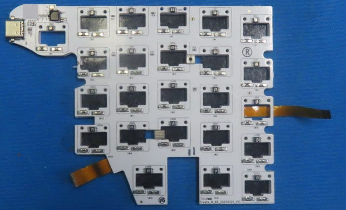{ width="120" loading=lazy }](../assets/images/fcc/boards/half-mainboard-right.jpg){ .glightbox data-title="Right half mainboard: FCC ID 2BQ4V0825CRR, Internal Photos 1, page 6" } | `Create_R_KB_20250221_V13` | `Create_R_KB_20250221_V13` / `T=1.0MM`, circled `R` [clear] | confirmed | [HM-02](#hm-02) |
| Left wing board | [{ width="120" loading=lazy }](../assets/images/fcc/boards/wing-board-left.jpg){ .glightbox data-title="Left wing board: FCC ID 2BQ4V0825CRL, Internal Photos 1, page 12" } | `Create_L_Wing_20250206_V11` | `Create_L_Wing_20250206_V11` / `T=1.0MM` [clear]; separate stamp `25 15` [clear] | confirmed | [WG-01](#wg-01) |
| Right wing board | [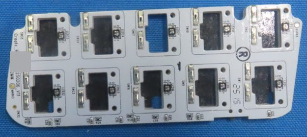{ width="120" loading=lazy }](../assets/images/fcc/boards/wing-board-right.jpg){ .glightbox data-title="Right wing board: FCC ID 2BQ4V0825CRR, Internal Photos 1, page 9" } | `Create_R_Wing_20250206_V11` (middle INFERRED) | `Create_R` ... `0250206_V11`, `1.0MM`; `_Wing_2` hidden under a QR label; fiducial `MARK3` beside [partial] | confirmed | [WG-02](#wg-02) |
| Left dock (thumb-key) board | [{ width="120" loading=lazy }](../assets/images/fcc/boards/dock-board-left.jpg){ .glightbox data-title="Left dock (thumb-key) board: FCC ID 2BQ4V0825CRL, Internal Photos 2, page 16" } | `Create_L_Dock_20241120_V09` | `Create_L_Dock_20241120_V09` / `T=1.0MM`, circled `L`, struck-through `Pb` (lead-free) circle [clear] | corrected | [DK-01](#dk-01) |
| Right dock board | [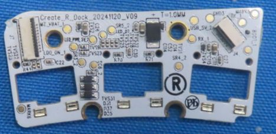{ width="120" loading=lazy }](../assets/images/fcc/boards/dock-board-right.jpg){ .glightbox data-title="Right dock board: FCC ID 2BQ4V0825CRR, Internal Photos 1, page 12" } | `Create_R_Dock_20241120_V09` | `Create_R_Dock_20241120_V09` / `T=1.0MM`, circled `R`, `MARK5`, `MARK6`, Pb-free circle [clear] | confirmed | [DK-02](#dk-02) |
| Left pogo board | [{ width="120" loading=lazy }](../assets/images/fcc/boards/pogo-board-left.jpg){ .glightbox data-title="Left pogo board: FCC ID 2BQ4V0825CRL, Internal Photos 2, page 15" } | `Create_L_PogoPin_20250109_V10` | `Create_L_PogoPin` / `20250109_V10`, `T=0.6MM`, circled `L`, Pb-free circle, QR label [clear] | confirmed | [PD-01](#pd-01) |
| Dongle board | [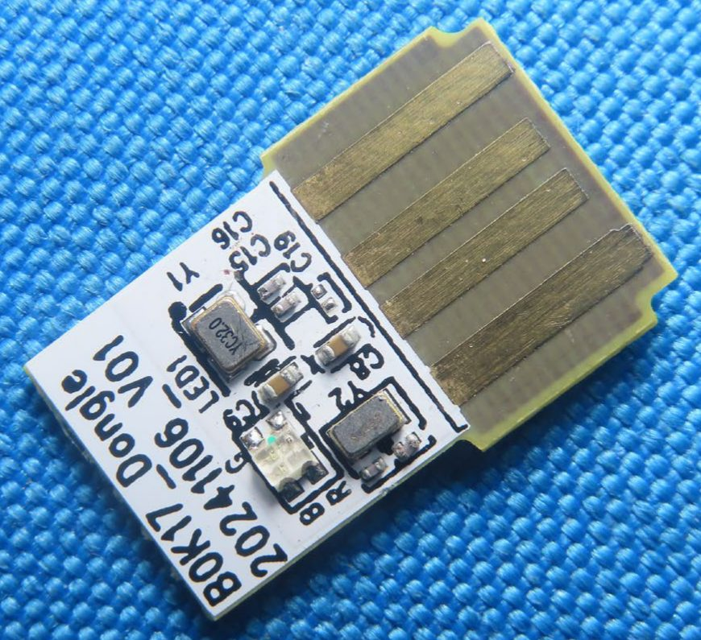{ width="120" loading=lazy }](../assets/images/fcc/boards/dongle-board-front.jpg){ .glightbox data-title="Dongle board: FCC ID 2BQ4V0825DG, Internal Photos, page 5" } | `B0K17_Dongle_20241106_V01` | Silkscreen `B0K17_Dongle` / `20241106_V01` [clear]; report text layer spells the second character as digit zero (U+0030) | confirmed | [DG-01](#dg-01) |
| Tune main board (ring) | [{ width="120" loading=lazy }](../assets/images/fcc/boards/tune-main-board-front.jpg){ .glightbox data-title="Tune main board (ring): FCC ID 2BQ4V0825CRL, Internal Photos 3, page 19" } | `Tune_MB_20250227_V09`, part no. `408-06032-000` | `Tune_MB_20250227_V09` / `408-06032-000` / `T=0.8mm` on both faces, Pb-free circle, stamp `25 12`, chevron fab logo [clear] | confirmed | [TUM-01](#tum-01) |
| Tune touch/LED disc | [{ width="120" loading=lazy }](../assets/images/fcc/boards/tune-touch-disc.jpg){ .glightbox data-title="Tune touch/LED disc: FCC ID 2BQ4V0825CRL, Internal Photos 4, page 23" } | `Tune_touch 20240926 V00` | `Tune_touch` / `20240926` / `V00` (lower-case 'touch'), chevron logo, gold edge ring [clear] | confirmed | [TUX-01](#tux-01) |
| Touch main board | [{ width="120" loading=lazy }](../assets/images/fcc/boards/touch-main-board.jpg){ .glightbox data-title="Touch main board: FCC ID 2BQ4V0825CRL, Internal Photos 5, page 31" } | `Touch_MB_20250227_V10`, part no. `408-06025-000` | `Touch_MB_20250227_V10` / `408-06025-000` / `T=1.0MM` on three lines, Pb-free, chevron logo [clear] | confirmed | [TCM-01](#tcm-01) |
| Touch sensor board | [{ width="120" loading=lazy }](../assets/images/fcc/boards/touch-sensor-board.jpg){ .glightbox data-title="Touch sensor board: FCC ID 2BQ4V0825CRL, Internal Photos 6, page 35" } | `Touch_touch_20250106_V02` | `Touch_touch_20250106_V02`, stamp `25 12`, chevron logo [clear] | confirmed | [TCX-01](#tcx-01) |
| Touch pogo board | [{ width="120" loading=lazy }](../assets/images/fcc/boards/touch-pogo-board.jpg){ .glightbox data-title="Touch pogo board: FCC ID 2BQ4V0825CRL, Internal Photos 5, page 32" } | `Touch_Pogo_Pin_<date>_V0x` (INFERRED from the Track name) | `Tou`...`in` / `20`...`V0?` (middle under a 2D sticker); stamp `25 10`; Pb-free, chevron logo [partial] | confirmed | [TCX-08](#tcx-08) |
| Track main board (ring) | [{ width="120" loading=lazy }](../assets/images/fcc/boards/track-main-board-front.jpg){ .glightbox data-title="Track main board (ring): FCC ID 2BQ4V0825CRL, Internal Photos 7, page 45" } | `Track_MB_20250305_V13`, part no. `408-06028-000` | `408-06028-000` / `Track_MB_20250305_V13` / `T=1.0MM`, Pb-free, stamp `25 15`, chevron logo [clear] | confirmed | [TKM-01](#tkm-01) |
| Track sensor board, left | [{ width="120" loading=lazy }](../assets/images/fcc/boards/track-sensor-boards.jpg){ .glightbox data-title="Track sensor board, left: FCC ID 2BQ4V0825CRL, Internal Photos 6, page 39" } | `SensorL_20241125_V09` | `SensorL_20241125_V09`, circled `L` [clear] | confirmed | [TKX-01a](#tkx-01a) |
| Track sensor board, right | [{ width="120" loading=lazy }](../assets/images/fcc/boards/track-sensor-boards.jpg){ .glightbox data-title="Track sensor board, right: FCC ID 2BQ4V0825CRL, Internal Photos 6, page 39" } | `SensorR_20241125_V09` | `SensorR_20241125_V09`, circled `R`, Pb-free [clear; R glyph faint] | confirmed | [TKX-01b](#tkx-01b) |
| Track pogo board | [{ width="120" loading=lazy }](../assets/images/fcc/boards/track-pogo-interposer.jpg){ .glightbox data-title="Track pogo board: FCC ID 2BQ4V0825CRL, Internal Photos 6, page 40" } | `Track_Pogo_Pin_20241122_V08` | `Track_Pogo_Pin_20241122_V08`, Pb-free; date stamp `25 1?` [name clear; stamp partial] | corrected | [TKX-05](#tkx-05) |
| Track dock interposer board | [{ width="120" loading=lazy }](../assets/images/fcc/boards/track-pogo-interposer.jpg){ .glightbox data-title="Track dock interposer board: FCC ID 2BQ4V0825CRL, Internal Photos 6, page 40" } | no name visible | `J11` 4-pin male header (`GND`, `RX`, `TX` + 1 unlabeled pin); `J4` 4-pin header (`ON`, `5V`, `GND` + 1 unlabeled); `BOOT1` pad; `C39`, `C47`, `C51`, `C52`, `D40`, `D44` (partial), `D75`; QR sticker [clear except where marked] | confirmed | [TKX-09](#tkx-09) |
| Right pogo board name | [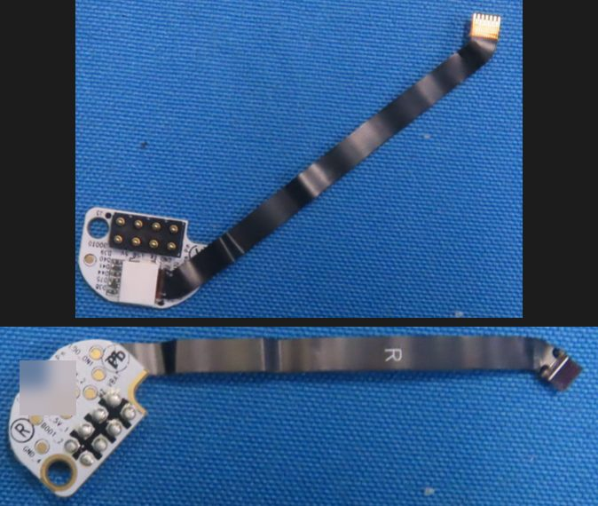{ width="120" loading=lazy }](../assets/images/fcc/boards/pogo-board-right.jpg){ .glightbox data-title="Right pogo board name: FCC ID 2BQ4V0825CRR, Internal Photos 2, page 13" } | - | Circled `R`, Pb mark, `GND_4`, `BOOT_2`, `5V_1`, `RX_2`; name under a QR sticker; `Cr` / `Pin` / `10` fragments very low confidence; edge text `?0010` | unverifiable | [U-PD-02](#u-pd-02) |
| T-shaped sub-board | [{ width="120" loading=lazy }](../assets/images/fcc/boards/tune-sub-board.jpg){ .glightbox data-title="T-shaped sub-board: FCC ID 2BQ4V0825CRL, Internal Photos 4, page 24" } | - | Green PCB about 10 x 7-9 mm; metal frame about 9.3 x 3.7 mm with a white 'pill' about 3.3 x 1 mm at one end of a slot; 6 pads on the crossbar; about 1.2-1.5 mm unmarked IC; no board name | unverifiable | [U-TUX-16](#u-tux-16) |

## Part-number index

Confirmed identities only, one row per part; the Rows column points to the full rows below DOC.

| Part | Maker | Function | Where | Rows |
|---|---|---|---|---|
| nRF52840, CKAA (WLCSP), build D0 | Nordic Semiconductor | BLE SoC | Both halves (U2), dongle (U1) | HM-04, DG-04 |
| Serial NOR flash, P/N unread | Winbond | External QSPI flash | Both halves (U1) | HM-09 |
| RF0400A | Boen | PCB antenna, 0.8 dBi | Both halves | HM-12 |
| RF0401A | Boen | PCB antenna, 3.11 dBi | Dongle | DG-09 |
| CPG-1232 (Kailh PG1232) | Kailh | Low-profile key switch | Both halves, spares | EN-01, ACC-06 |
| STM32F411CEU6 | STMicroelectronics | Module MCU | Tune, Touch, Track | TUM-03, TCM-03, TKM-03 |
| MT5705 | Maxic Technology | Qi 5 W receiver | Tune, Touch, Track | TUM-04, TCM-05, TKM-05 |
| SGM41523 (base variant, `41523DF`) | SG Micro | 1-cell switch-mode charger | Tune, Touch, Track (U8) | TUM-05, TCM-06, TKM-06 |
| SGM62117 (`01KGH`) | SG Micro | Buck-boost converter | Tune (U6), Touch (U3) | TUM-06, TCM-09 |
| CST3640 | Hynitron | Capacitive touch controller | Touch sensor board (Tune: candidate, U-TUX-03) | TCX-02 |
| MMBT3904 class (`1AM`) | multi-source | NPN transistor | Tune Q3, Touch Q4 | TUM-10, TCM-12 |
| B5819W / 1N5819W class (`SL`) | multi-source | Schottky 40 V 1 A | Tune, Touch, Track | TUM-11, TCM-13, TKM-11 |
| 1N4148W / 1N4148WS class (`T4`) | multi-source | Switching diode | Tune, Touch, Track | TUM-12, TCM-17, TKM-11 |
| 100 uF 6.3 V tantalum (`J107`) | not identified | Bulk capacitor | Tune, Touch | TUM-14, TCM-15 |
| `YC32.0` 32 MHz crystal | not identified | HFXO | Halves, dongle | HM-07, DG-06 |
| `YC16.0` 16 MHz crystal | not identified | STM32 HSE | Tune, Touch, Track | TUM-15, TCM-10, TKM-07 |
| `FH301217` 3.7 V 50 mAh 0.185 Wh | not identified | Half cell | Each half | BAT-01 |
| `FH 202030` 3.7 V 1000 mAh 3.7 Wh | not identified | Tune pack | Tune | BAT-06 |
| `FH364046` / `FH364045` 3.7 V 700 mAh 2.59 Wh | not identified | Touch cell(s) | Touch | BAT-09, BAT-10 |
| `QS801630 1S2P` 3.7 V 600 mAh 2.22 Wh (2 x 300 mAh) | not identified | Track pack | Track | BAT-13, BAT-14 |
| `NAYA-800-1(NAYA-CREATE)`; `NAYA-100-1(Dongle)` | Naya B.V. | Model numbers | Halves; dongle | LB-01, DG-17a |

## The tables, board by board

Each table follows one section of the data file. The accessories rows include the 1 m USB-C Y-cable
(jacket print `30V`, `VW-1`, a temperature rating and a partly legible style number: a UL AWM-class
cable, INFERRED); the lab used a 0.8 m unshielded USB cable without ferrite, which is not the retail
cable DOC INFERRED.

### Identifiers, grants and certification marks

Both halves and the dongle. Label artwork: right half CRR LBL, left half CRL LLOC, dongle DG LBL. Rows LB-20 to LB-24 come from the exhibits obtained on 2026-09-23 (one extraction pass).

<!-- fcc-images:start -->

<figure markdown="span">
  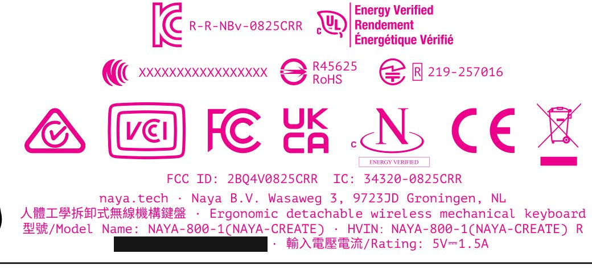{ width="640" loading=lazy }
  <figcaption>Right half label artwork, regulatory block ('Create-R Engraving Reference Sheet'). FCC ID 2BQ4V0825CRR, Label (Create-R Engraving Reference Sheet), page 1, vector artwork, rotated upright. Identifying marks removed.</figcaption>
</figure>

<figure markdown="span">
  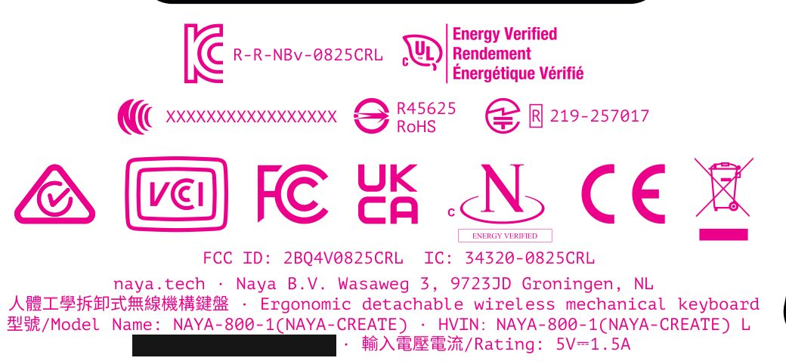{ width="640" loading=lazy }
  <figcaption>Left half label artwork, regulatory block ('Create-L Engraving Reference Sheet'). FCC ID 2BQ4V0825CRL, Label Location, page 1, vector artwork, rotated upright. Identifying marks removed.</figcaption>
</figure>

<figure markdown="span">
  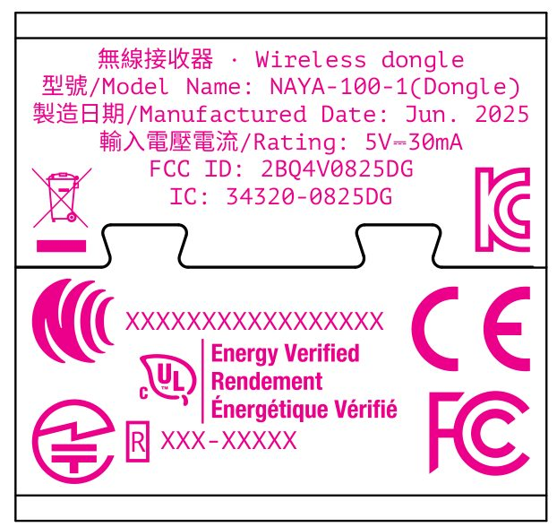{ width="640" loading=lazy }
  <figcaption>Speedlink dongle label artwork. FCC ID 2BQ4V0825DG, Label, page 1, vector artwork. Identifying marks removed.</figcaption>
</figure>

<!-- fcc-images:end -->

| ID | Image | Location | Part | Maker | Function | Marking as read | Source | Basis | Notes |
|---|---|---|---|---|---|---|---|---|---|
| LB-02a | [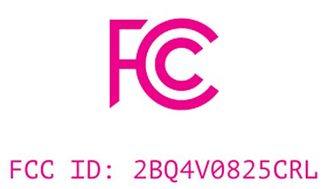{ width="120" loading=lazy }](../assets/images/fcc/parts/lb-02a.jpg){ .glightbox data-title="LB-02a: FCC ID 2BQ4V0825CRL, Label Location, page 1: FC mark and 'FCC ID: 2BQ4V0825CRL' (left label artwork, rotated upright)" } | Grant, left half | FCC ID `2BQ4V0825CRL` | Grantee Naya B.V. (grantee code 2BQ4V) | Naya Create left half; 47 CFR 15.247 DTS, 2402-2480 MHz GFSK, BLE 1M / 2M / 125k (S=8); max peak 9.30 dBm (2M), max average 7.14 dBm (1M); BTL project 2506C291 | Report cover `FCC ID: 2BQ4V0825CRL` [clear]; grant date 2025-08-26 | CRL BLE p1, p10; CRL SRD p1; grant date and grant lines from FCC EAS (read 2026-09-23) | DOC; confirmed (Grant date confirmed on FCC EAS (2026-09-23); this ID has two grant lines, 2402-2480 and 2404-2480 MHz) | The SRD report BTL-FCCP-2-2506C291 carries the same FCC ID: it is a second 15.247 report inside this grant, not a second grant. Report R01 issued 2025-08-27, after the grant (R00 was superseded for the antenna gain). The left half's RF-exposure report is BTL-FCCP-3-2506C291 R00 (LB-24). |
| LB-02b | [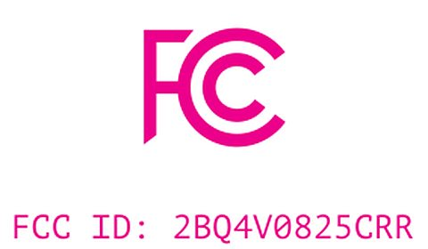{ width="120" loading=lazy }](../assets/images/fcc/parts/lb-02b.jpg){ .glightbox data-title="LB-02b: FCC ID 2BQ4V0825CRR, Label artwork, page 1: FC mark and 'FCC ID: 2BQ4V0825CRR' (right label artwork, rotated upright)" } | Grant, right half | FCC ID `2BQ4V0825CRR` | Grantee Naya B.V. | Naya Create right half; 15.247 DTS 2402-2480 MHz; max peak 8.36 dBm (2M), max average 7.25 dBm (1M); BTL project 2506C430; RF-exposure report BTL-FCCP-3-2506C430 R01 (SAR-exclusion calculation) | Report cover and label `FCC ID: 2BQ4V0825CRR` [clear]; grant date 2025-08-29 | CRR BLE p1, p10; CRR LBL; CRR MPE p1; grant date and grant lines from FCC EAS (read 2026-09-23) | DOC; confirmed | - |
| LB-02c | [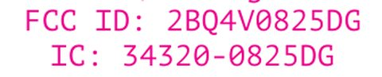{ width="120" loading=lazy }](../assets/images/fcc/parts/lb-02c.jpg){ .glightbox data-title="LB-02c: FCC ID 2BQ4V0825DG, Label artwork, page 1: 'FCC ID: 2BQ4V0825DG' and 'IC: 34320-0825DG'" } | Grant, dongle | FCC ID `2BQ4V0825DG` | Grantee Naya B.V. | Speedlink dongle; 15.247 DTS 2402-2480 MHz GFSK, tested at 2 Mbps only; 8.97 dBm (2M); BTL project 2506C290; RF report R00 issued 2025-08-12; antenna report BTL-OTA-1-2506C290 R00 | Report cover `FCC ID: 2BQ4V0825DG` [clear]; grant date 2025-09-03 | DG RF p1, p10, p11 (EUT table and test modes: 2 Mbps only); grant date and grant lines from FCC EAS (read 2026-09-23) | DOC; corrected (PHY corrected 2026-09-23: the dongle report tests 2 Mbps only (was '1M / 2M / 125k')) | SAR report BTL-FCC SAR-1-2506C290 R00 (LB-23); ISED 34320-0825DG. |
| LB-01 | [{ width="120" loading=lazy }](../assets/images/fcc/parts/lb-01.jpg){ .glightbox data-title="LB-01: FCC ID 2BQ4V0825CRR, Label artwork, page 1: the Model Name and HVIN line, split in two for size" } | Model / HVIN, both halves | `NAYA-800-1(NAYA-CREATE)` | Naya B.V. (brand 'NAYA TECH, Naya Create') | One model number for both halves, told apart by FCC ID suffix (CRL/CRR); equipment 'Ergonomic detachable wireless mechanical keyboard' | Label `Model Name: NAYA-800-1(NAYA-CREATE)`, `HVIN: NAYA-800-1(NAYA-CREATE)` followed by ` R` (right-half marker) [clear]; reports 'Keyboard: Left Keyboard' | CRR LBL; CRL BLE p1, p10; CRR BLE p1; CRR UM1 p1; CRR UM5 p1 | DOC; confirmed | The left label reads HVIN `NAYA-800-1(NAYA-CREATE) L` (LB-20); ISED lists both HVINs with the side suffix. |
| DG-17a | [{ width="120" loading=lazy }](../assets/images/fcc/parts/dg-17a.jpg){ .glightbox data-title="DG-17a: FCC ID 2BQ4V0825DG, Label artwork, page 1: 'Wireless dongle' and 'Model Name: NAYA-100-1(Dongle)'" } | Model, dongle | `NAYA-100-1(Dongle)` | Naya B.V. | Speedlink dongle, equipment 'Wireless dongle' | `Test Model: NAYA-100-1(Dongle)` [clear]; manual box list subtitle 'Wireless dongle · NAYA-100-1(Dongle)' | DG RF p1, p10; CRR UM1 p2 | DOC; confirmed | - |
| LB-04 | [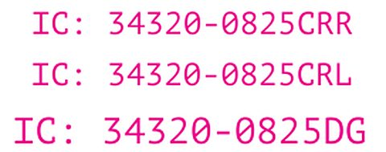{ width="120" loading=lazy }](../assets/images/fcc/parts/lb-04.jpg){ .glightbox data-title="LB-04: FCC ID 2BQ4V0825CRR, Label artwork, page 1, CRL LLOC p1 and DG LBL p1: the three IC numbers stacked" } | ISED Canada, right half | `IC: 34320-0825CRR`; `34320-0825CRL`; `34320-0825DG` | ISED company number 34320 | Canadian radio certification number | `IC: 34320-0825CRR` on the same line as the FCC ID [clear] | CRR LBL; CRR UM5 p2 (IC statements, no number); CRL LLOC p1; DG LBL; ISED REL (read 2026-09-23) | DOC; confirmed | All three numbers are on their label artwork (CRR LBL, CRL LLOC p1, DG LBL) and on the ISED Radio Equipment List for company 34320 (approved 2025-09-11 CRL, 2025-09-08 CRR and DG). |
| LB-05 | [{ width="120" loading=lazy }](../assets/images/fcc/parts/lb-05.jpg){ .glightbox data-title="LB-05: FCC ID 2BQ4V0825CRR, Label artwork, page 1: KC mark and R-R-NBv-0825CRR" } | Korea KC, right half | `R-R-NBv-0825CRR` | Korea RRA (KC mark) | Korean radio certificate | KC mark + `R-R-NBv-0825CRR` [clear on label artwork]; KC logo also engraved on the left half, its number [illegible]; left label artwork `R-R-NBv-0825CRL` [clear]; dongle label: KC logo without a number | CRR LBL; CRL EP p2; CRR EP p2-p3; CRL LLOC p1; DG LBL | DOC; confirmed | - |
| LB-06 | [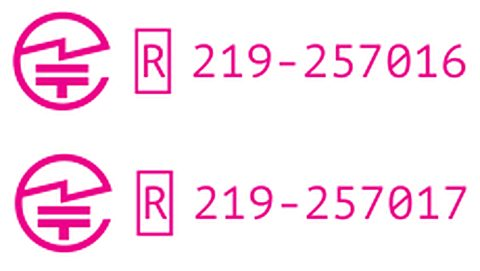{ width="120" loading=lazy }](../assets/images/fcc/parts/lb-06.jpg){ .glightbox data-title="LB-06: FCC ID 2BQ4V0825CRR, Label artwork, page 1 (219-257016, top) and CRL LLOC p1 (219-257017, bottom): Giteki mark and boxed R" } | Japan MIC, right half | `219-257016` (right), `219-257017` (left) | MIC technical conformity (Giteki); certification body `219` not identified | Japanese radio certification: 3-digit body code + 6-digit number, boxed `R` = radio equipment | Giteki mark + boxed `R` + `219-257016` [clear] | CRR LBL; CRL LLOC p1; DG LBL | DOC; INFERRED (format decode from public MIC guides); confirmed | The two numbers are consecutive (one batch, INFERRED). The dongle label carries only an `XXX-XXXXX` placeholder. The certification body behind code 219 is not identified. |
| LB-07 | [{ width="120" loading=lazy }](../assets/images/fcc/parts/lb-07.jpg){ .glightbox data-title="LB-07: FCC ID 2BQ4V0825CRR, Label artwork, page 1: BSMI mark, R45625, RoHS" } | Taiwan BSMI, right half | `R45625` | BSMI (Taiwan) | Commodity-inspection registration with RoHS declaration | Circle-with-arrow mark + `R45625` over `RoHS` [clear, also in the PDF text layer] | CRR LBL; CRL LLOC p1 | DOC; INFERRED (registrant-level number); confirmed | The same number appears on unrelated Taiwan-market products, so it most likely identifies the importer/registrant, not this product (INFERRED). On the left label as on the right; not on the dongle label. |
| LB-08 | [{ width="120" loading=lazy }](../assets/images/fcc/parts/lb-08.jpg){ .glightbox data-title="LB-08: FCC ID 2BQ4V0825CRR, Label artwork, page 1: NCC-style mark with the 17-character placeholder" } | Taiwan NCC-style mark, right half | placeholder `XXXXXXXXXXXXXXXXX` (17 characters) | - | Placeholder for an NCC number in the artwork; real NCC numbers are 12-14 characters (INFERRED) | Stylised three-arc mark + 17 `X` [clear] | CRR LBL; CRL LLOC p1 | DOC; INFERRED; confirmed | On both half labels and on the dongle label. |
| LB-09 | [{ width="120" loading=lazy }](../assets/images/fcc/parts/lb-09.jpg){ .glightbox data-title="LB-09: FCC ID 2BQ4V0825CRR, Label artwork, page 1: UKCA, the N energy mark, CE, WEEE bin" } | EU/UK marks, both halves | CE, UKCA, WEEE | - | EU and UK conformity marks; WEEE disposal mark | `CE`; `UK` over `CA`; crossed-out wheelie bin with bar [clear on artwork; faint engraving on both photographed halves] | CRR LBL; CRL EP p2; CRR EP p2-p3; CRL LLOC p1 | DOC; confirmed | An earlier text search reported CE and UKCA as not found: the marks are vector graphics, invisible to a text search. The dongle label has CE and WEEE, no UKCA. |
| LB-10 | [{ width="120" loading=lazy }](../assets/images/fcc/parts/lb-10.jpg){ .glightbox data-title="LB-10: FCC ID 2BQ4V0825CRR, Label artwork, page 1: RCM triangle and VCCI box" } | Australia/NZ and Japan EMC marks | RCM, VCCI | - | Supplier-declaration marks, no number printed | Triangle with a tick in a circle; double box with `VCI` letterforms [clear on artwork; faint on samples] | CRR LBL; CRL EP p2; CRR EP p3; CRL LLOC p1 | DOC; INFERRED (shape identification); confirmed | On both half labels; not on the dongle label. |
| LB-11 | [{ width="120" loading=lazy }](../assets/images/fcc/parts/lb-11.jpg){ .glightbox data-title="LB-11: FCC ID 2BQ4V0825CRR, Label artwork, page 1: c-UL Energy Verified mark (top) and c + N-in-ellipse ENERGY VERIFIED mark (bottom)" } | Energy-verification marks | c-UL 'Energy Verified'; c + N-in-ellipse 'ENERGY VERIFIED' | UL (first mark); issuer of the N mark not identified | Canadian energy-efficiency verification marks | `c` + UL leaf + 'Energy Verified / Rendement / Énergétique Vérifié'; `c` + N crossed by an ellipse + boxed 'ENERGY VERIFIED' [clear] | CRR LBL; CRL LLOC p1 | DOC; confirmed | Both marks on both half labels; the dongle label has the c-UL mark only. |
| LB-12 | [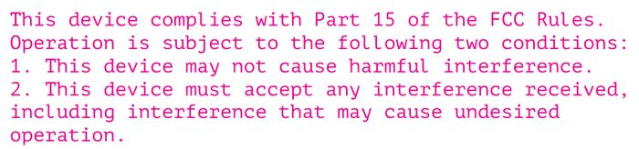{ width="120" loading=lazy }](../assets/images/fcc/parts/lb-12.jpg){ .glightbox data-title="LB-12: FCC ID 2BQ4V0825CRR, Label artwork, page 1: the 6-line Part 15 statement on the body-plate artwork" } | FCC statement on the body plate | Part 15 two-condition statement (6 lines) | - | Required FCC label text | 'This device complies with Part 15 of the FCC Rules. Operation is subject to the following two conditions: ...' [clear in artwork text layer]; not visible on the photographed sample | CRR LBL; CRR EP p3; CRL LLOC p1 | DOC; confirmed | The photographed sample probably carried an earlier engraving (INFERRED). On the left body plate as on the right; not on the dongle label (it is in the manual). |
| LB-13 | [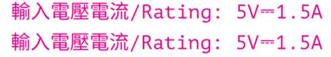{ width="120" loading=lazy }](../assets/images/fcc/parts/lb-13.jpg){ .glightbox data-title="LB-13: FCC ID 2BQ4V0825CRR, Label artwork, page 1 (top) and CRL LLOC p1 (bottom): Rating 5V 1.5A" } | Half input rating | `5V⎓1.5A` | - | DC input rating of one half | `輸入電壓電流/Rating: 5V⎓1.5A` [clear] | CRR LBL; CRL LLOC p1 | DOC; confirmed | The left label gives the same rating. |
| LB-14 | - | Manual power figures | 'Input Voltage 4.2V'; charge from 'USB 2.0 5V-1A' | - | Spec-sheet power figures; 4.2 V reads as the Li-ion full-charge voltage, not the input (INFERRED; the label rates the input 5 V 1.5 A) | Spec sheet 'Input Voltage 4.2V'; best practices 'connecting the provided USB cable to a computer (USB 2.0 5V-1A)' [clear] | CRR UM1 p3, p5; CRL UM1 p3, p5 | DOC; INFERRED (meaning); confirmed | - |
| LB-15 | [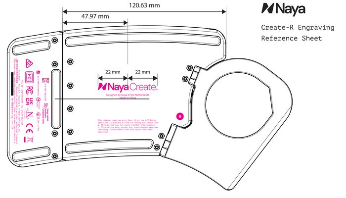{ width="120" loading=lazy }](../assets/images/fcc/parts/lb-15.jpg){ .glightbox data-title="LB-15: FCC ID 2BQ4V0825CRR, Label artwork, page 1: the whole 1:1 engraving sheet with its dimensions" } | Label layout (right half) | 'Create-R Engraving Reference Sheet' | - | 1:1 laser-engraving artwork: regulatory block on the wing underside plate, rotated 90°; logo on the body plate 47.97 mm from the seam; serial-number field (no value reproduced) | Dimension line 120.63 mm (re-measured 120.73 mm at 150 dpi: artwork is 1:1); PDF title 'Create 镭雕-20250820', created 2025-08-20, modified 2025-08-27 | CRR LBL (exhibit R15) | DOC; confirmed | The serial-number field value is not reproduced. The left filing's 'Label Location' exhibit holds both sheets (CRL LLOC p1 left, p2 right; p2 equals the CRR exhibit). |
| LB-16 | - | Manufacturer and test lab | Dongguan Boen Intelligent Technology Co., Ltd.; BTL Inc. (Dongguan) | - | ODM (manufacturer and factory of record for all three filings) and the test lab; also the antenna maker (RF0400A, RF0401A) | Report covers: 'Manufacturer / Factory: Dongguan Boen Intelligent Technology Co., Ltd.'; test facility: FCC registration `747969`, designation `CN1377`; A2LA certificate 7130.01 [clear] | CRR BLE p1, p8; CRL BLE p1; DG RF p1 | DOC; confirmed | - |
| LB-17 | - | Taiwan RoHS table | CNS 15663-style restricted-substance table | - | Declaration for units Cable, PWAs, Plastic parts, Metal parts, Rubber parts against Pb, Hg, Cd, Cr+6, PBB, PBDE; every cell '○'; no battery row | Table text [clear]; equipment 人體工學拆卸式無線機構鍵盤, type NAYA-800-1(NAYA-CREATE) | CRR UM5 p1; CRL UM3 p5 | DOC; confirmed | - |
| LB-18 | - | USB identity, halves | VID `0x37D1`; PID left `0x0064` / right `0x00C8`; MCUboot `0x006F` / `0x00D3`; DFU `0x007A` / `0x00DE`; generation-B bit `0x1000` | Naya (VID not in public USB-ID lists) | USB identity of each half in application, MCUboot recovery and DFU modes; bit 0x1000 marks QSPI flash generation B (`0x1064` / `0x10C8`) | n/a (USB descriptors); product strings 'Naya Create Left' / 'Naya Create Right' | STATIC: NayaCore 6.11.0 PID table (vendor host binary); measured on one pair of halves, keyboard firmware 3.41.0, generation A, by 2026-09-16 | STATIC (NayaCore 6.11.0); MEASURED (`0x0064`, `0x00C8`, `0x006F` on keyboard firmware 3.41.0, generation A); confirmed | `0x00D3` and the DFU pair are STATIC only (not yet seen on hardware). |
| DG-17b | - | USB identity, dongle | VID `0x37D1`, PID `0x012C` (transient boot identity `0x0137`), bcdDevice `0x0307` | Naya | Dongle USB identity: CDC composite, product string 'Dongle' | n/a (USB descriptors) | measured on one dongle: USB enumeration capture, 2026-09-11 | MEASURED (one dongle, 2026-09-11); INFERRED (bcdDevice 0x0307 read as dongle firmware 3.07); confirmed | - |
| LB-19 | - | Declared EUT software and lab tool | `Naya_Temp_Flash_Pair.exe`; `nrfconnect-setup-5.1.0-x64` | Naya (EUT software); Nordic (lab tool) | Software version declared for the tested samples (halves and dongle); channel/power control tool = the installer name of nRF Connect for Desktop 5.1.0 (INFERRED), power setting 8 on every channel and PHY for the halves; the dongle table reads 8 / 7 / 8 at 2402 / 2442 / 2480 MHz | 'Software Version Naya_Temp_Flash_Pair.exe'; 'Test Software Version nrfconnect-setup-5.1.0-x64'; power setting tables: halves all `8`; dongle `8` `7` `8` [clear, text layer] | CRL BLE p10, p13; CRL SRD p10, p12; DG RF p10, p11 | DOC; INFERRED (meaning of the installer name); corrected (Dongle power setting corrected 2026-09-23 from the DG RF p11 text layer (middle channel 7, not 8)) | No keyboard firmware version is printed anywhere in the filings; samples were pre-production units received by the lab on 2025-06-20. The dongle's SAR sample also ran `Naya_Temp_Flash_Pair.exe`; its continuous transmission came from '2.4G SRD engineering testing software installed on the DUT' (DG SAR p7, p23). |
| LB-20 | [{ width="120" loading=lazy }](../assets/images/fcc/boards/label-left-half.jpg){ .glightbox data-title="LB-20: no crop of its own; Left half label artwork, regulatory block ('Create-L Engraving Reference Sheet') (FCC ID 2BQ4V0825CRL, Label Location, page 1)" } | Left-half label artwork | `FCC ID: 2BQ4V0825CRL`; `IC: 34320-0825CRL`; KC `R-R-NBv-0825CRL`; MIC `219-257017`; HVIN `NAYA-800-1(NAYA-CREATE) L` | Naya B.V. | 'Create-L Engraving Reference Sheet', 1:1: the regulatory block on the left wing plate underside, mirrored from the right; the same marks, BSMI number, NCC-style placeholder, maker line, serial-number field (no value reproduced) and Part 15 text as the right half; rating `5V⎓1.5A`; `L` circle by the dock hinge; 12 screw symbols | [clear, vector artwork] | CRL LLOC p1 | DOC; new (2026-09-23 exhibits) (one extraction pass, no blind re-read) | - |
| LB-21 | [{ width="120" loading=lazy }](../assets/images/fcc/boards/label-dongle.jpg){ .glightbox data-title="LB-21: no crop of its own; Speedlink dongle label artwork (FCC ID 2BQ4V0825DG, Label artwork, page 1)" } | Dongle label artwork | engraving artwork 'Dongle', 2025-07-25, 12.55 x 12.00 mm | Naya B.V. | Text: 'Wireless dongle', `Model Name: NAYA-100-1(Dongle)`, 'Manufactured Date: Jun. 2025', `Rating: 5V⎓30mA`, `FCC ID: 2BQ4V0825DG`, `IC: 34320-0825DG`; marks WEEE, KC without a number, an NCC-style 17-character placeholder, c-UL Energy Verified, a Japanese Giteki mark with an `XXX-XXXXX` placeholder, CE and FCC. No UKCA, RCM, VCCI, BSMI or N-in-ellipse mark, no address, serial-number field or Part 15 text | [clear, vector artwork] | DG LBL; DG EP p2-p3 | DOC; INFERRED (1:1 scale from the USB-A shell width; placement); new (2026-09-23 exhibits) (one extraction pass, no blind re-read) | The photographed sample carries no engraving; where on the dongle the label goes is not stated. |
| LB-22 | - | Confidentiality requests (all three IDs) | - | Naya B.V. | Letters dated 2025-08-06 (CRL) and 2025-08-04 (CRR, DG) request confidentiality under 47 CFR 0.457 and 0.459 for exactly the block diagram, schematics and operational description, as trade secrets; no short-term request for any other exhibit, so these three are permanent | [clear, text] | CL (CRL, CRR, DG) | DOC; INFERRED (permanent); new (2026-09-23 exhibits) (one extraction pass, no blind re-read) | - |
| LB-23 | - | Dongle RF exposure | SAR report BTL-FCC SAR-1-2506C290 R00 | BTL Inc. (Dongguan) | Issued 2025-08-12, tested 2025-07-12 to 07-22; EUT `NAYA-100-1(Dongle)`, hardware `B0K17_Dongle_20241106_V01`, software `Naya_Temp_Flash_Pair.exe`; mode '2.4G SRD', GFSK, 2M, 2400-2483.5 MHz; RF0401A 3.11 dBi; average conducted 6.28 / 6.60 / 6.71 dBm at 2402 / 2442 / 2480 MHz, tune-up 8.00 dBm; 100 % duty; five positions (horizontal up and down, vertical front and back, tip) at 5 mm; highest reported 1-g SAR 0.080 W/kg (2402 MHz, horizontal down; measured 0.054 scaled to tune-up) against 1.6 W/kg | [clear, text] | DG SAR p1, p7, p22-p26; DG SAR-D | DOC; new (2026-09-23 exhibits) (one extraction pass, no blind re-read) | - |
| LB-24 | - | Left-half RF exposure | MPE report BTL-FCCP-3-2506C291 R00 | BTL Inc. (Dongguan) | Issued 2025-08-15, never revised: RF0400A filed at 0.59 dBi (the specification table's 2460 MHz value); BLE 7.14 dBm and '2.4G SRD' 4.35 dBm tune-up at 2480 MHz; results 1.630 and 0.858 against 3.0 (1-g SAR exclusion); 'No SAR evaluation required' | [clear, text] | CRL MPE p1-p4 | DOC; INFERRED (reproduced with 5 mm and unrounded mW); new (2026-09-23 exhibits) (one extraction pass, no blind re-read) | - |

### PCB inventory: board names, revisions, silkscreens

Every board whose name is legible in the filings. Rows here are not repeated in the per-board tables below. The right pogo board and the Tune T-shaped sub-board have no legible name and are in the Unconfirmed table.

| ID | Image | Location | Part | Maker | Function | Marking as read | Source | Basis | Notes |
|---|---|---|---|---|---|---|---|---|---|
| HM-01 | [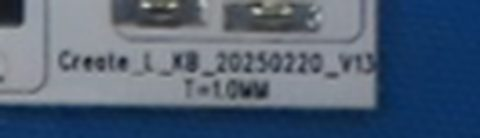{ width="120" loading=lazy }](../assets/images/fcc/parts/hm-01.jpg){ .glightbox data-title="HM-01: FCC ID 2BQ4V0825CRL, Internal Photos 1, page 8, upper photo (switch-side silkscreen)" } | Left half mainboard | `Create_L_KB_20250220_V13` | Custom PCB (board house not named; ODM Dongguan Boen) | Left main PCB, 1.0 mm; design date 2025-02-20, revision V13 | `Create_L_KB_20250220_V13` / `T=1.0MM`, circled `L`, on both faces [clear] | CRL IP1 p8, p9; declared HW version CRL BLE p10, CRL SRD p10, CRR BLE p10, CRR SRD p10, CRR MPE p1 | DOC; confirmed | Both faces read V13 (V11 is the wing). |
| HM-02 | [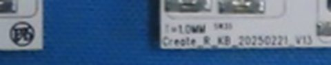{ width="120" loading=lazy }](../assets/images/fcc/parts/hm-02.jpg){ .glightbox data-title="HM-02: FCC ID 2BQ4V0825CRR, Internal Photos 1, page 6, lower photo" } | Right half mainboard | `Create_R_KB_20250221_V13` | Custom PCB | Right main PCB, 1.0 mm; 2025-02-21, V13 | `Create_R_KB_20250221_V13` / `T=1.0MM`, circled `R` [clear] | CRR IP1 p6; CRL BLE p10 (the SRD report prints `Create_R_KB20250221_V13`) | DOC; confirmed | - |
| WG-01 | [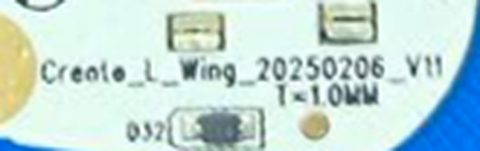{ width="120" loading=lazy }](../assets/images/fcc/parts/wg-01.jpg){ .glightbox data-title="WG-01: FCC ID 2BQ4V0825CRL, Internal Photos 1, page 12, upper photo (rotated to read upright)" } | Left wing board | `Create_L_Wing_20250206_V11` | Custom PCB | Left wing PCB (outer two key columns), 1.0 mm; 2025-02-06, V11 | `Create_L_Wing_20250206_V11` / `T=1.0MM` [clear]; separate stamp `25 15` [clear] | CRL IP1 p11, p12 | DOC; INFERRED (stamp = fab year 25, week 15); confirmed (Stamp now read in full (was `25 ?5`)) | - |
| WG-02 | [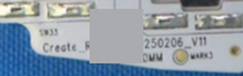{ width="120" loading=lazy }](../assets/images/fcc/parts/wg-02.jpg){ .glightbox data-title="WG-02: FCC ID 2BQ4V0825CRR, Internal Photos 1, page 9, upper photo (rotated)" } | Right wing board | `Create_R_Wing_20250206_V11` (middle INFERRED) | Custom PCB | Right wing PCB, 1.0 mm | `Create_R` ... `0250206_V11`, `1.0MM`; `_Wing_2` hidden under a QR label; fiducial `MARK3` beside [partial] | CRR IP1 p9 | DOC (legible part); INFERRED (hidden part, from the left twin); confirmed | - |
| DK-01 | [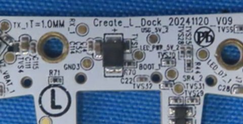{ width="120" loading=lazy }](../assets/images/fcc/parts/dk-01.jpg){ .glightbox data-title="DK-01: FCC ID 2BQ4V0825CRL, Internal Photos 2, page 16, upper photo (rotated 180 degrees): name, T=1.0MM, circled L, Pb-free mark" } | Left dock (thumb-key) board | `Create_L_Dock_20241120_V09` | Custom PCB | Board under the module bay carrying the three thumb keys and the dock signals; 1.0 mm; about 47 x 21 mm (INFERRED) | `Create_L_Dock_20241120_V09` / `T=1.0MM`, circled `L`, struck-through `Pb` (lead-free) circle [clear] | CRL IP2 p16; CRL IP1 p5, p7 (low resolution) | DOC; corrected (No separate 'UL-like' mark: that was the Pb-free circle seen at low resolution) | - |
| DK-02 | [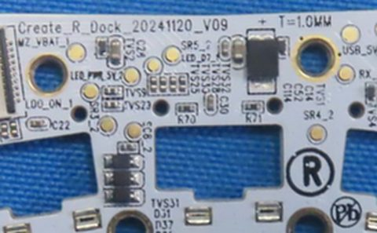{ width="120" loading=lazy }](../assets/images/fcc/parts/dk-02.jpg){ .glightbox data-title="DK-02: FCC ID 2BQ4V0825CRR, Internal Photos 1, page 12, upper photo: name, T=1.0MM, circled R, Pb-free mark" } | Right dock board | `Create_R_Dock_20241120_V09` | Custom PCB | Right dock board, 1.0 mm | `Create_R_Dock_20241120_V09` / `T=1.0MM`, circled `R`, `MARK5`, `MARK6`, Pb-free circle [clear] | CRR IP1 p12 | DOC; confirmed | - |
| PD-01 | [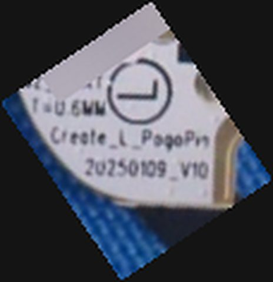{ width="120" loading=lazy }](../assets/images/fcc/parts/pd-01.jpg){ .glightbox data-title="PD-01: FCC ID 2BQ4V0825CRL, Internal Photos 2, page 15, lower photo (rotated): Create_L_PogoPin / 20250109_V10, T=0.6MM, circled L" } | Left pogo board | `Create_L_PogoPin_20250109_V10` | Custom PCB | D-shaped board carrying the half's 8 dock spring pins; 0.6 mm; about 16 x 17 mm (INFERRED) | `Create_L_PogoPin` / `20250109_V10`, `T=0.6MM`, circled `L`, Pb-free circle, QR label [clear] | CRL IP2 p15; CRL IP1 p5, p7 | DOC; confirmed | - |
| DG-01 | [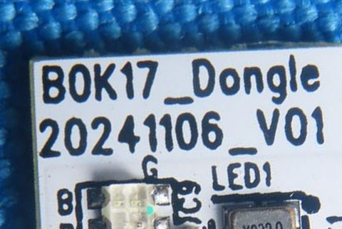{ width="120" loading=lazy }](../assets/images/fcc/parts/dg-01.jpg){ .glightbox data-title="DG-01: FCC ID 2BQ4V0825DG, Internal Photos, page 5, upper photo (rotated upright)" } | Dongle board | `B0K17_Dongle_20241106_V01` | Custom PCB | Dongle PCB, 2024-11-06, V01; double-sided, stepped outline about 16.5-18 x 10-11.6 mm (INFERRED) | Silkscreen `B0K17_Dongle` / `20241106_V01` [clear]; report text layer spells the second character as digit zero (U+0030) | DG IP p4, p5; DG RF p10 | DOC; confirmed | - |
| TUM-01 | [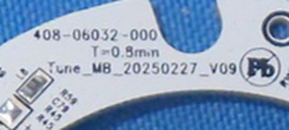{ width="120" loading=lazy }](../assets/images/fcc/parts/tum-01.jpg){ .glightbox data-title="TUM-01: FCC ID 2BQ4V0825CRL, Internal Photos 3, page 19, lower photo (= CRR IP2 p16), rotated upright" } | Tune main board (ring) | `Tune_MB_20250227_V09`, part no. `408-06032-000` | Custom PCB | Tune ring PCB about 58-60 mm across with a C-shaped inner island (INFERRED size); 0.8 mm | `Tune_MB_20250227_V09` / `408-06032-000` / `T=0.8mm` on both faces, Pb-free circle, stamp `25 12`, chevron fab logo [clear] | CRL IP2 p18; CRL IP3 p19, p21 = CRR IP2 p15-p16; CRR IP3 p18 | DOC; INFERRED (stamp = 2025 week 12); confirmed | `408-060xx-000` is one numbering series with the Touch (`06025`) and Track (`06028`) main boards (INFERRED). |
| TUX-01 | [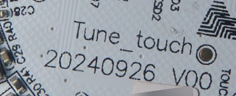{ width="120" loading=lazy }](../assets/images/fcc/parts/tux-01.jpg){ .glightbox data-title="TUX-01: FCC ID 2BQ4V0825CRL, Internal Photos 4, page 23, upper photo (= CRR IP3 p20), rotated upright" } | Tune touch/LED disc | `Tune_touch 20240926 V00` | Custom PCB | Round disc about 45 mm bonded under the glass: touch controller and 24-LED ring | `Tune_touch` / `20240926` / `V00` (lower-case 'touch'), chevron logo, gold edge ring [clear] | CRL IP2 p18; CRL IP3 p22; CRL IP4 p23 = CRR IP2 p15; CRR IP3 p19-p20 | DOC; confirmed | - |
| TCM-01 | [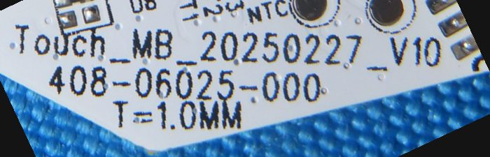{ width="120" loading=lazy }](../assets/images/fcc/parts/tcm-01.jpg){ .glightbox data-title="TCM-01: FCC ID 2BQ4V0825CRL, Internal Photos 5, page 31, lower photo (= CRR IP5 p28 lower)" } | Touch main board | `Touch_MB_20250227_V10`, part no. `408-06025-000` | Custom PCB | Round, about 44 mm (anchored to the 7 x 7 mm STM32 package), single-sided, 1.0 mm | `Touch_MB_20250227_V10` / `408-06025-000` / `T=1.0MM` on three lines, Pb-free, chevron logo [clear] | CRL IP4 p28; CRL IP5 p29-p31 = CRR IP4 p25-p27; CRR IP5 p28 | DOC; INFERRED (size); confirmed | - |
| TCX-01 | [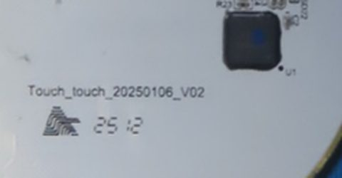{ width="120" loading=lazy }](../assets/images/fcc/parts/tcx-01.jpg){ .glightbox data-title="TCX-01: FCC ID 2BQ4V0825CRL, Internal Photos 6, page 35, upper photo (= CRR IP5 p32 upper)" } | Touch sensor board | `Touch_touch_20250106_V02` | Custom PCB | Teardrop capacitive sensor board, diamond-lattice electrodes, gold edge ring; size unresolved (U-TCX-16b) | `Touch_touch_20250106_V02`, stamp `25 12`, chevron logo [clear] | CRL IP4 p28; CRL IP6 p35-p36 = CRR IP4 p25; CRR IP5 p32-p33 | DOC; confirmed | - |
| TCX-08 | [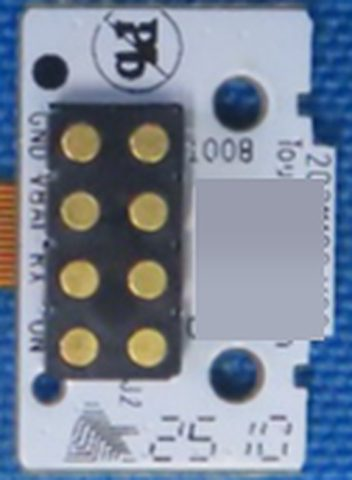{ width="120" loading=lazy }](../assets/images/fcc/parts/tcx-08.jpg){ .glightbox data-title="TCX-08: FCC ID 2BQ4V0825CRL, Internal Photos 5, page 32, upper photo (= CRR IP5 p29 upper)" } | Touch pogo board | `Touch_Pogo_Pin_<date>_V0x` (INFERRED from the Track name) | Custom PCB | Module-side dock contact board, about 11 x 16.5-18 mm (INFERRED) | `Tou`...`in` / `20`...`V0?` (middle under a 2D sticker); stamp `25 10`; Pb-free, chevron logo [partial] | CRL IP4 p28; CRL IP5 p32 = CRR IP4 p25; CRR IP5 p29 | DOC (fragments); INFERRED (full name); confirmed (Only the fragments are confirmed) | - |
| TKM-01 | [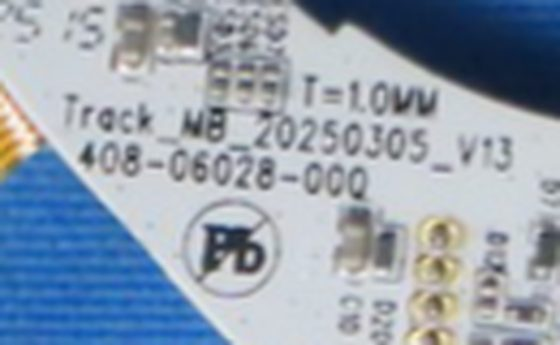{ width="120" loading=lazy }](../assets/images/fcc/parts/tkm-01.jpg){ .glightbox data-title="TKM-01: FCC ID 2BQ4V0825CRL, Internal Photos 7, page 45, upper photo (= CRR IP7 p42)" } | Track main board (ring) | `Track_MB_20250305_V13`, part no. `408-06028-000` | Custom PCB | Track ring PCB about 60-66 mm OD with a 40-43 mm opening for the 40 mm ball (INFERRED); 1.0 mm | `408-06028-000` / `Track_MB_20250305_V13` / `T=1.0MM`, Pb-free, stamp `25 15`, chevron logo [clear] | CRL IP7 p44-p46 = CRR IP6 p41; CRR IP7 p42-p43 | DOC; INFERRED (size, stamp = 2025 week 15); confirmed | - |
| TKX-01a | [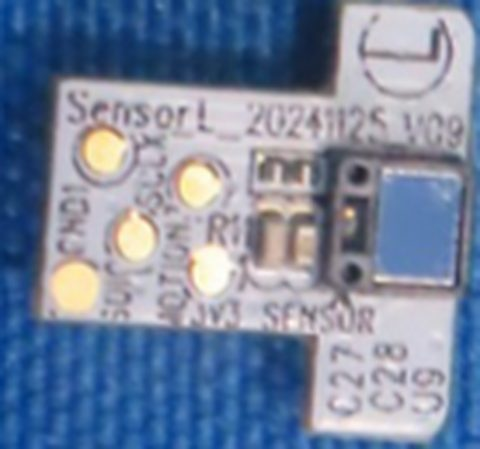{ width="120" loading=lazy }](../assets/images/fcc/parts/tkx-01a.jpg){ .glightbox data-title="TKX-01a: FCC ID 2BQ4V0825CRL, Internal Photos 6, page 39, lower photo (= CRR IP6 p36)" } | Track sensor board, left | `SensorL_20241125_V09` | Custom PCB | T-shaped rigid board about 11 x 11 mm carrying optical ball sensor U9 (optical INFERRED from `SCLK`/`SDIO`/`MOTION` pads) | `SensorL_20241125_V09`, circled `L` [clear] | CRL IP6 p38-p39 = CRR IP6 p35-p36 | DOC; INFERRED (function); confirmed | - |
| TKX-01b | [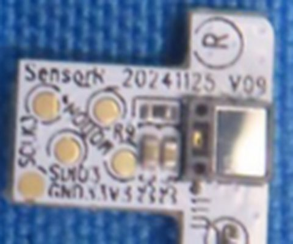{ width="120" loading=lazy }](../assets/images/fcc/parts/tkx-01b.jpg){ .glightbox data-title="TKX-01b: FCC ID 2BQ4V0825CRL, Internal Photos 6, page 39, lower photo (= CRR IP6 p36)" } | Track sensor board, right | `SensorR_20241125_V09` | Custom PCB | Twin of SensorL carrying optical sensor U11 | `SensorR_20241125_V09`, circled `R`, Pb-free [clear; R glyph faint] | CRL IP6 p38-p39 = CRR IP6 p35-p36 | DOC; INFERRED (function); confirmed | Two sensor boards, not four: each is photographed front and back. |
| TKX-05 | [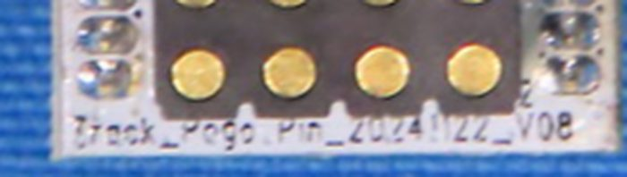{ width="120" loading=lazy }](../assets/images/fcc/parts/tkx-05.jpg){ .glightbox data-title="TKX-05: FCC ID 2BQ4V0825CRL, Internal Photos 6, page 40, lower photo (= CRR IP6 p37)" } | Track pogo board | `Track_Pogo_Pin_20241122_V08` | Custom PCB | Module-side dock contact board, about 17 x 10 mm (INFERRED) | `Track_Pogo_Pin_20241122_V08`, Pb-free; date stamp `25 1?` [name clear; stamp partial] | CRL IP6 p38, p40 = CRR IP6 p35, p37; CRL IP6 p37 = CRR IP5 p34 (in the base) | DOC; corrected (Revision V08 confirmed on three views; the stamp's `14` reading is not confirmed (U-TKX-05b)) | - |
| TKX-09 | [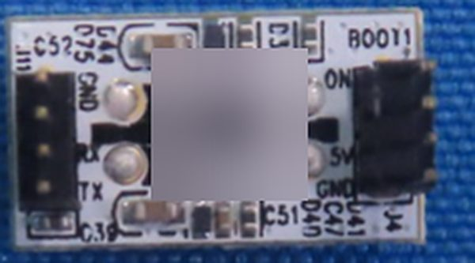{ width="120" loading=lazy }](../assets/images/fcc/parts/tkx-09.jpg){ .glightbox data-title="TKX-09: FCC ID 2BQ4V0825CRL, Internal Photos 6, page 40, upper photo (= CRR IP6 p37)" } | Track dock interposer board | no name visible | Custom PCB | Separate small board between the pogo contacts and the main board's two 4-way sockets | `J11` 4-pin male header (`GND`, `RX`, `TX` + 1 unlabeled pin); `J4` 4-pin header (`ON`, `5V`, `GND` + 1 unlabeled); `BOOT1` pad; `C39`, `C47`, `C51`, `C52`, `D40`, `D44` (partial), `D75`; QR sticker [clear except where marked] | CRL IP6 p40 = CRR IP6 p37 (upper photo) | DOC; confirmed | A dark SOT/DFN part sits in the lower row; its `U41` refdes is not legible (U-TKX-09b). |

### Keyboard half mainboard (`Create_L_KB_20250220_V13`, `Create_R_KB_20250221_V13`)

Left and right are mirror designs; one row covers both boards unless it says otherwise. Photos: left CRL IP1 p7-p10, right CRR IP1 p6-p8 (the SoC and flash close-up is CRR IP1 p8, which is PDF page 4 of that file).

<!-- fcc-images:start -->

<figure markdown="span">
  { width="640" loading=lazy }
  <figcaption>Left half mainboard (Create_L_KB_20250220_V13), component side. FCC ID 2BQ4V0825CRL, Internal Photos 1, page 9, upper photo. Identifying marks removed.</figcaption>
</figure>

<figure markdown="span">
  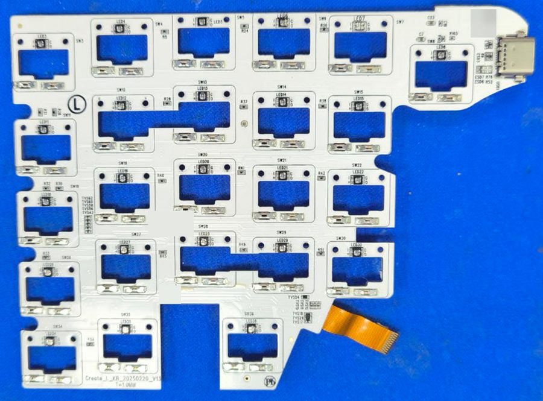{ width="640" loading=lazy }
  <figcaption>Left half mainboard, switch side. FCC ID 2BQ4V0825CRL, Internal Photos 1, page 9, lower photo. Identifying marks removed.</figcaption>
</figure>

<figure markdown="span">
  { width="640" loading=lazy }
  <figcaption>Right half mainboard (Create_R_KB_20250221_V13), switch side. FCC ID 2BQ4V0825CRR, Internal Photos 1, page 6, lower photo. Identifying marks removed.</figcaption>
</figure>

<figure markdown="span">
  { width="640" loading=lazy }
  <figcaption>Left half boards laid out: mainboard, wing, pogo board with flex, dock board, cell. FCC ID 2BQ4V0825CRL, Internal Photos 1, page 7, upper photo. Identifying marks removed.</figcaption>
</figure>

<!-- fcc-images:end -->

| ID | Image | Location | Part | Maker | Function | Marking as read | Source | Basis | Notes |
|---|---|---|---|---|---|---|---|---|---|
| HM-04 | [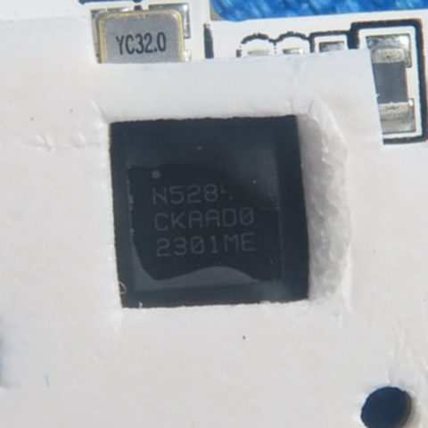{ width="120" loading=lazy }](../assets/images/fcc/parts/hm-04.jpg){ .glightbox data-title="HM-04: FCC ID 2BQ4V0825CRL, Internal Photos 1, page 10, upper photo (left half; rotated 32 degrees so the marking reads level)" } | `U2`, both halves, under a cut-out in white foam | nRF52840, package code CKAA (WLCSP, about 3.5 x 3.6 mm; about 4 mm with underfill), build code D0 | Nordic Semiconductor | BLE SoC: 2.4 GHz radio, native USB 2.0 full-speed device, 1 MB flash, 256 KB RAM, QSPI host | `N528…` / `CKAAD0` / `2301ME` on both halves [line 1 partial: `N528` plus one or two partly hidden glyphs; lines 2-3 clear] | CRL IP1 p10 (two close-ups), p7, p9; CRR IP1 p8; transmit data CRL BLE p13, CRR BLE p13 | DOC (marking; CKAA = nRF52840 WLCSP per distributor listings); INFERRED (D0 = Revision 2); confirmed (Identity rests on package code CKAA, conducted power and native USB with no second MCU, not on line 1; one verification pass read line 1 as `N52840` after gamma correction) | Build code D0 matches Nordic's Revision 2 pattern; Revision 3 (hardened APPROTECT) uses Fx0 (INFERRED from Nordic DevZone; confirm in Nordic's revision document, OQ-05). Same lot `2301ME` as the dongle. Conducted peak 8.2-9.3 dBm at power setting 8 is above an nRF52811's +4 dBm (INFERRED). |
| HM-07 | [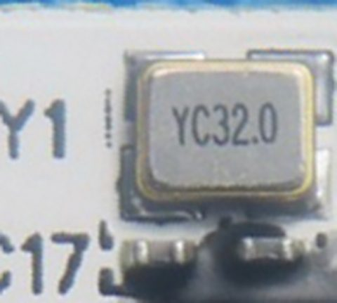{ width="120" loading=lazy }](../assets/images/fcc/parts/hm-07.jpg){ .glightbox data-title="HM-07: FCC ID 2BQ4V0825CRR, Internal Photos 1, page 8, upper photo (right half; shows the Y1 refdes; rotated 25 degrees)" } | `Y1`, both halves, beside U2 | 32.000 MHz crystal, 4-pad metal lid, about 2.0 x 1.6 mm (2016 class) | not identified (`YC` prefix; no marking-database match) | nRF52840 32 MHz HFXO (radio clock) | `YC32.0` [clear] | CRL IP1 p10, p7; CRR IP1 p8 | DOC (marking); INFERRED (size); confirmed | Same marking on the dongle (DG-06). |
| HM-09 | [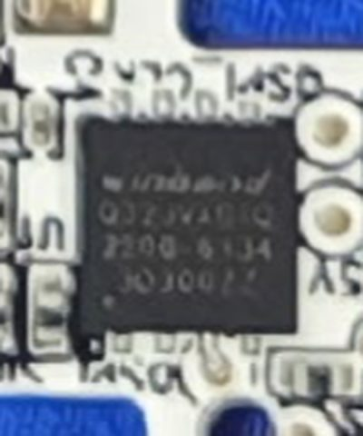{ width="120" loading=lazy }](../assets/images/fcc/parts/hm-09.jpg){ .glightbox data-title="HM-09: FCC ID 2BQ4V0825CRR, Internal Photos 1, page 8, lower photo (right half; rotated so the winbond wordmark reads upright)" } | `U1`, both halves, at the USB-C corner | not read (Winbond serial NOR flash; W25Q family INFERRED from a `Q` on line 2) | Winbond | External QSPI NOR flash on the nRF52840 QSPI bus | Right: line 1 `winbond` [clear], lines 2-4 [illegible to partial, see U-HM-09b]; left: square leadless IC beside `QSPI_CLK` [illegible]; package 8-pad leadless USON/WSON class, about 4 mm square, not SOIC-8 | CRR IP1 p8; CRL IP1 p9 | DOC; confirmed (Maker and package confirmed; part number unverifiable) | Part number and capacity unverifiable (U-HM-09b, U-HM-10). The package is leadless, so a SOIC-8 clip does not fit; only the Winbond wordmark is confirmed (no W25Q suffix, no capacity). |
| HM-11 | [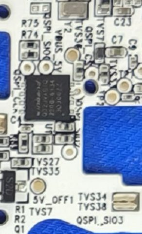{ width="120" loading=lazy }](../assets/images/fcc/parts/hm-11.jpg){ .glightbox data-title="HM-11: FCC ID 2BQ4V0825CRR, Internal Photos 1, page 8, lower photo (right half; rotated 180 degrees)" } | QSPI test pads beside U1 | test pads | - | nRF52840 QSPI bus to U1 | Left: `QSPI_CS`, `QSPI_CLK`, `QSPI_SIO0`, `QSPI_SIO1`; right: `QSPI_CS?`, `QSPI_CLK`, `QSPI_SIO0`, `QSPI_SIO3` [clear except the right CS suffix] | CRL IP1 p9; CRR IP1 p8 | DOC; corrected (Right-half SIO digits now legible (were `SIO?` x2)) | - |
| HM-12 | [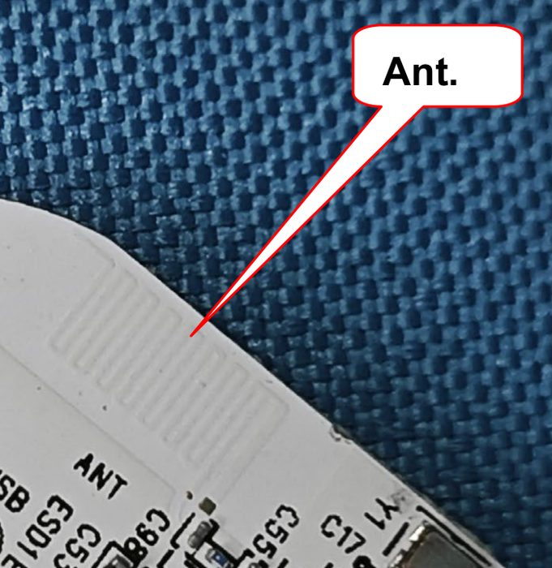{ width="120" loading=lazy }](../assets/images/fcc/parts/hm-12.jpg){ .glightbox data-title="HM-12: FCC ID 2BQ4V0825CRL, Internal Photos 1, page 7, lower photo (left half, with the lab's 'Ant.' callout)" } | `ANT`, both halves, rear-inner corner beside USB-C | RF0400A (spec ver1.1) | Boen (Dongguan Boen Intelligent Technology Co., Ltd.) | 2.4 GHz printed meander PCB antenna, connector N/A; peak 0.8 dBi at 2400 MHz; -0.3 to 0.8 dBi and 46.1-63.0 % efficiency over 2400-2480 MHz; trace 7.8 x 3.2 mm (spec drawing) | Silkscreen `ANT`; lab callout 'Ant.'; spec header 'keyboard antenna RF0400A specification ver1.1'; filed 'BOEN RF0400A PCB N/A 0.8' [clear] | CRL ANT p1 (table), p4 (drawing); CRR ANT; CRL IP1 p7; CRR EP p3; CRL BLE p11; CRR BLE p11; CRR MPE p4; CRL MPE p4 | DOC; confirmed | Sits behind the black end cap (EN-06; the vendor confirms the cap is the RF window). The spec's 'Directivity' column equals minus efficiency in dB (spreadsheet error). The R01 reports file 0.8 dBi (the 2400 MHz maximum); the left half's MPE report R00, never revised, files 0.59 dBi (the 2460 MHz value), and the right half's superseded R00 most likely did too (INFERRED). |
| HM-13 | [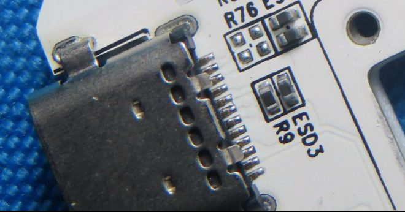{ width="120" loading=lazy }](../assets/images/fcc/parts/hm-13.jpg){ .glightbox data-title="HM-13: FCC ID 2BQ4V0825CRR, Internal Photos 1, page 8, upper photo (right half; shows the SMT leg row)" } | `USB1`, rear-inner corner facing the other half | USB Type-C receptacle, unmarked | not identified | Half USB port: power and USB 2.0 full-speed data | No marking; oval metal shell, through-hole shell legs, a row of SMT legs [clear shape] | CRL IP1 p6, p7, p9; CRR IP1 p8; CRL EP p4; CRR EP p4; CRR UM1 p6 | DOC; confirmed | 16-pin vs 24-pin class not resolvable (U-HM-13b). |
| HM-14 | [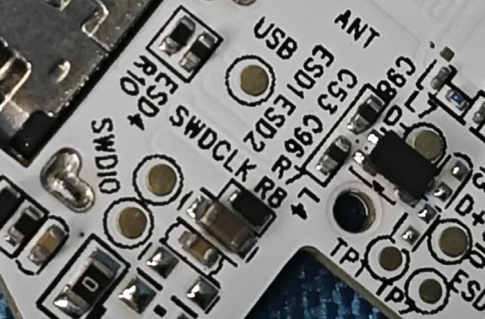{ width="120" loading=lazy }](../assets/images/fcc/parts/hm-14.jpg){ .glightbox data-title="HM-14: FCC ID 2BQ4V0825CRL, Internal Photos 1, page 7, lower photo (left half)" } | SWD and USB test pads at the USB-C corner | test pads | - | nRF52840 Serial Wire Debug; USB D+ test point | Left: `SWDIO`, `SWDCLK`, `TP1`, `TP7`, `USB`, `D+`; right: `SWDIO`, `SWDCLK`, `TP2` [clear]; `D-` not visible in any crop | CRL IP1 p7, p9; CRR IP1 p8 | DOC; confirmed | A re-view of the right-half crop (2026-09-23) also shows a `D+` label and one beginning `US` on the right, so both halves most likely carry the same debug and USB test-pad set; `D-` is still not seen on either. |
| HM-15 | [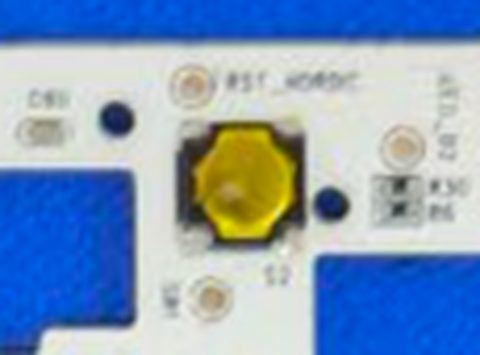{ width="120" loading=lazy }](../assets/images/fcc/parts/hm-15.jpg){ .glightbox data-title="HM-15: FCC ID 2BQ4V0825CRL, Internal Photos 1, page 9, upper photo (left half; rotated 180 degrees)" } | `S2` and pads `RST_NORDIC`, `BOOT` | tactile switch, yellow cap, unmarked | not identified | nRF52840 reset button; `BOOT` pad function not documented | `S2`, `RST_NORDIC`, `BOOT` [clear; `BOOT` may read `BOOT1`, U-HM-15b] | CRL IP1 p9; CRR IP1 p7 (switch through a window, no refdes) | DOC; confirmed | The silkscreen `RST_NORDIC` names the SoC vendor. |
| HM-16 | [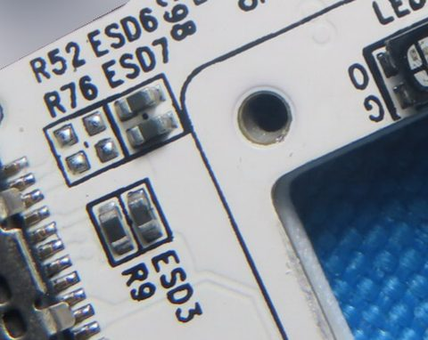{ width="120" loading=lazy }](../assets/images/fcc/parts/hm-16.jpg){ .glightbox data-title="HM-16: FCC ID 2BQ4V0825CRR, Internal Photos 1, page 8, upper photo (right half)" } | USB, VBUS and CC protection around USB1 | ESD/TVS parts, unmarked | not identified | ESD and surge protection on USB and VBUS; `L1`/`L4` beside U2 are probably the nRF DC/DC and RF-match positions (INFERRED) | Refs (subset per half): `ESD1`-`ESD11`, `TVS7`, `TVS27`, `TVS34`, `TVS35`, `TVS37`, `TVS38`, `TVS40`, `L1`, `L2`, `L4`, R and C refs, `TP2` [refs clear; parts unmarked] | CRL IP1 p7, p9, p10; CRR IP1 p8 | DOC; confirmed | - |
| HP-01 | [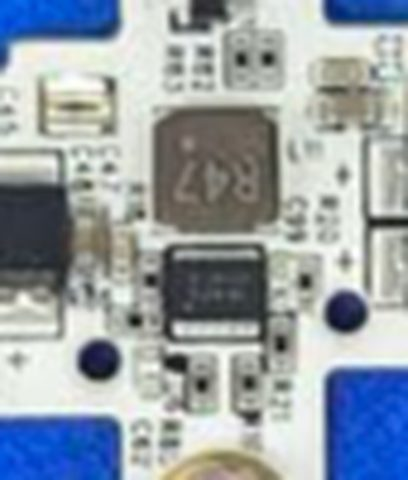{ width="120" loading=lazy }](../assets/images/fcc/parts/hp-01.jpg){ .glightbox data-title="HP-01: FCC ID 2BQ4V0825CRL, Internal Photos 1, page 9, upper photo (rotated 180 degrees)" } | `L11` (left), with an adjacent unmarked IC | 0.47 uH SMD power inductor (EIA code `R47`) | not identified | Switching-regulator inductor (DC-DC 1, INFERRED from the paired IC) | Inductor body `R47` [clear]; adjacent 4-6 pad IC with pin-1 dot [illegible] | CRL IP1 p9 | DOC; corrected (Value is a direct decode of the printed EIA code (was tagged INFERRED)) | The IC is U-HP-01b. |
| HP-02 | [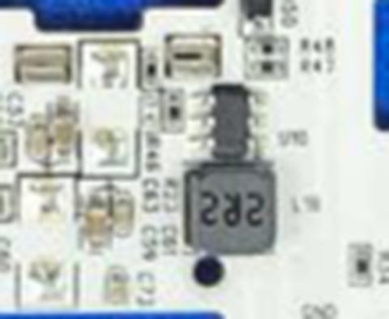{ width="120" loading=lazy }](../assets/images/fcc/parts/hp-02.jpg){ .glightbox data-title="HP-02: FCC ID 2BQ4V0825CRL, Internal Photos 1, page 9, upper photo (rotated 180 degrees)" } | `L10` (left), with `U10` | 2.2 uH SMD power inductor (EIA code `2R2`) | not identified | Switching-regulator inductor (DC-DC 2, INFERRED) | Inductor `2R2` [clear]; `U10` 6-lead SOT-23-6 [illegible] | CRL IP1 p9 | DOC; corrected (Value decoded from the printed code) | U10 is U-HP-02b. |
| HP-05 | [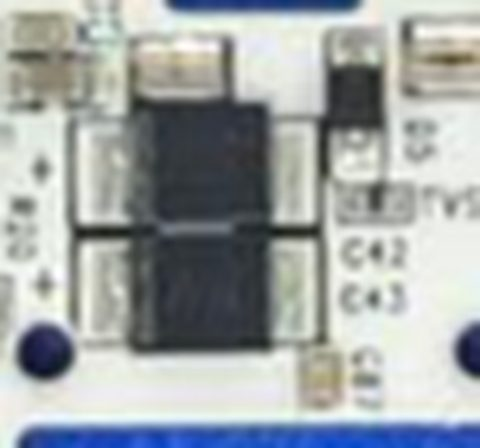{ width="120" loading=lazy }](../assets/images/fcc/parts/hp-05.jpg){ .glightbox data-title="HP-05: FCC ID 2BQ4V0825CRL, Internal Photos 1, page 9, upper photo (rotated 180 degrees)" } | `C42`, `C43` (left), beside `TVS45` | polarised molded chip capacitors (tantalum or polymer class) | not identified | Bulk capacitance | Refs `C42`, `C43`; `+` printed on each case; end band [clear]; no value code | CRL IP1 p9 | DOC; confirmed | - |
| HP-09 | [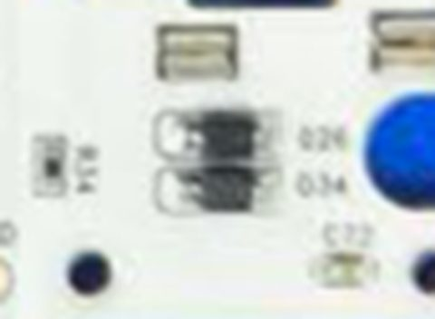{ width="120" loading=lazy }](../assets/images/fcc/parts/hp-09.jpg){ .glightbox data-title="HP-09: FCC ID 2BQ4V0825CRL, Internal Photos 1, page 9, upper photo (D34, D36; rotated 180 degrees)" } | Diode and TVS arrays (left) | small signal diodes and TVS parts, unmarked | not identified | Key-matrix diodes and line protection | `D3`-`D47` and `TVS3`-`TVS88` (subsets) [refs clear; parts unmarked] | CRL IP1 p8, p9 | DOC; confirmed | - |
| HP-11 | [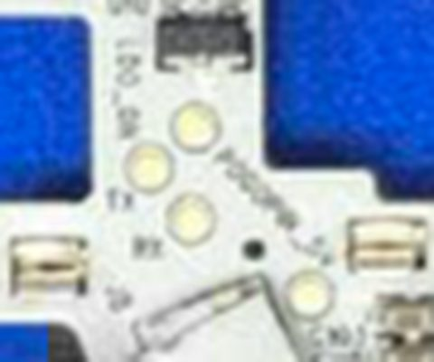{ width="120" loading=lazy }](../assets/images/fcc/parts/hp-11.jpg){ .glightbox data-title="HP-11: FCC ID 2BQ4V0825CRL, Internal Photos 1, page 9, upper photo (rotated 180 degrees)" } | Pads at the dock-flex exit (left) | test pads | - | Half-to-module UART, 5 V pogo rail, module LDO enable (roles from the names) | `LDO_ON`, `TX`, `RX`, `POGOPIN_5V` [clear] | CRL IP1 p9 | DOC; INFERRED (roles); confirmed | Full dock net set: PD-13. |
| HP-12 | [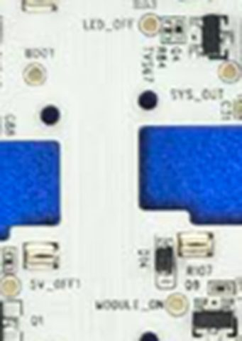{ width="120" loading=lazy }](../assets/images/fcc/parts/hp-12.jpg){ .glightbox data-title="HP-12: FCC ID 2BQ4V0825CRL, Internal Photos 1, page 9, upper photo (MODULE_ON, 5V_OFF1, SYS_OUT, LED_OFF, BOOT; rotated 180 degrees)" } | Power and rail test pads | test pads | - | Switched module, LED and 5 V rails; ADC sense points (INFERRED from names) | `VBUS_5V`, `USB_ADC`, `BAT_ADC`, `SYS`, `SYS_OUT`, `5V_OUT`, `5V_OFF`, `5V_OFF1`, `MODULE_ON`, `VCC_A?T`, `CHG_?NT`, `LED_PWR_5V`, `LED_OFF`, `LED_01`, `LED_02`, `LED_0?`, `GND1`, `GND`, `INT`, `MARK1`, `MARK2` (left); `VBUS_5V` (right) [clear except `?`] | CRL IP1 p9; CRR IP1 p8 | DOC; confirmed (Subset re-read (`5V_OFF1`, `MODULE_ON`, `VBUS_5V`); rest uncontradicted) | - |
| HP-13 | [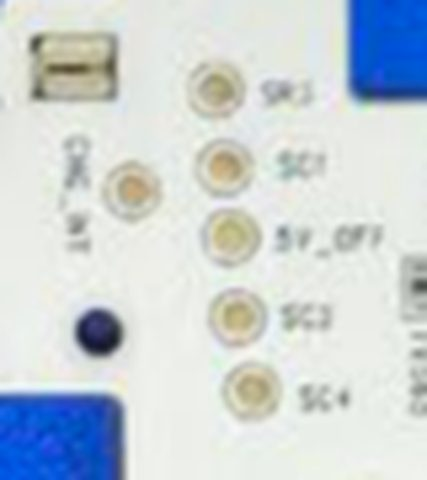{ width="120" loading=lazy }](../assets/images/fcc/parts/hp-13.jpg){ .glightbox data-title="HP-13: FCC ID 2BQ4V0825CRL, Internal Photos 1, page 9, upper photo (SR1, SC1, SC3, SC4; rotated 180 degrees)" } | Key-matrix test pads | test pads | - | Switch rows (`SR`) and columns (`SC`) (INFERRED from names) | `SR1`-`SR5`, `SC1`-`SC6` [clear] | CRL IP1 p9 | DOC; confirmed | The dock board continues the scheme (`SR*_2`, `SC8_2`). |
| HP-14 | [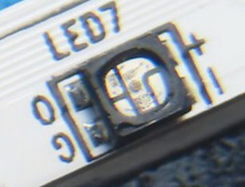{ width="120" loading=lazy }](../assets/images/fcc/parts/hp-14.jpg){ .glightbox data-title="HP-14: FCC ID 2BQ4V0825CRR, Internal Photos 1, page 8, upper photo (LED7 on the right mainboard; same footprint on both halves)" } | Per-key LEDs, 24 per mainboard | addressable RGB LED, 4-pad, unmarked | not identified | Per-key RGB backlight, daisy-chained (no LED driver IC on either face); spec sheet 'Backlighting: Reprogrammable RGB' | Refs `LED4`, `LED6`-`LED8`, `LED14`, `LED15`, `LED21`, `LED22`, `LED29`, `LED30`; pad letters `O`, `G`, `I`, `+` (right) and `-`, `+`, `G`, `O` (left) [refs clear; LED body unmarked] | CRL IP1 p8, p9; CRR IP1 p6; CRR UM1 p3 | DOC (footprint, pads); INFERRED (WS2812/SK6812 class); confirmed | LED part numbers: U-LED. |
| HP-15 | [{ width="120" loading=lazy }](../assets/images/fcc/boards/half-mainboard-left-switch-side.jpg){ .glightbox data-title="HP-15: no crop of its own; Left half mainboard, switch side (FCC ID 2BQ4V0825CRL, Internal Photos 1, page 9)" } | LED chain, whole keyboard | - | - | Host LED map, 136 entries per layer: 0-73 keys; 74-80 and 81-87 the two side light bars (7 each); 88-111 left bay block (24); 112-135 right bay block (24) | n/a (host and firmware data) | measured on one keyboard: LED band-painting pass 2026-09-08; LED map size on keyboard firmware 3.41.0 and 3.28.7 | MEASURED (band-painting pass 2026-09-08; map size on keyboard firmware 3.41.0 and 3.28.7); confirmed | Photo count per half: 24 mainboard + 10 wing + 3 dock = 37 key LEDs, plus 7 side-bar LEDs = 44; two halves = 88 = indices 0-87 (INFERRED match). Which physical edge is 74-80 is open (OQ-08). |
| HP-16 | [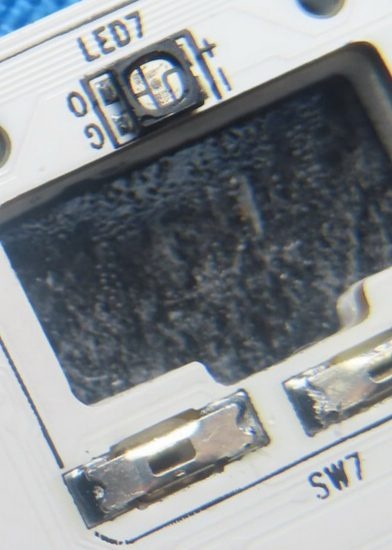{ width="120" loading=lazy }](../assets/images/fcc/parts/hp-16.jpg){ .glightbox data-title="HP-16: FCC ID 2BQ4V0825CRR, Internal Photos 1, page 8, upper photo (SW7 window with its socket pads)" } | Key positions on the mainboard | hot-swap socket footprints (24 per mainboard) | - | 24 hot-swap key positions per mainboard | Refs `SW6`, `SW7`, `SW14`, `SW15`, `SW21`, `SW22`, `SW29`, `SW30`, `SW35`; two socket pads per window [clear] | CRL IP1 p8, p9; CRR IP1 p6 | DOC; confirmed | Socket part: U-EN-02. |
| HP-17 | [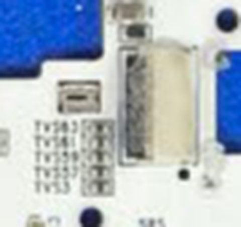{ width="120" loading=lazy }](../assets/images/fcc/parts/hp-17.jpg){ .glightbox data-title="HP-17: FCC ID 2BQ4V0825CRL, Internal Photos 1, page 9, upper photo (rotated 180 degrees)" } | Wing FPC receptacle (left), beside `TVS53`-`TVS63` | flip-lock ZIF/FPC receptacle, unmarked | not identified | Link to the wing board's flex | White/clear ZIF, about 12-14 gold contacts [countable, not exact] | CRL IP1 p9 | DOC; corrected (Way count refined from 'not countable') | - |
| HP-18 | [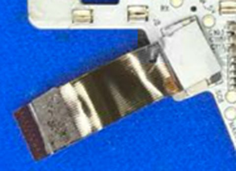{ width="120" loading=lazy }](../assets/images/fcc/parts/hp-18.jpg){ .glightbox data-title="HP-18: FCC ID 2BQ4V0825CRL, Internal Photos 1, page 9, upper photo (rotated 180 degrees)" } | Dock-link flex tail at a white board connector (ref consistent with `CN3`) | flex cable, unmarked | - | Mainboard to dock board link; right half shows two amber tails (to wing and to dock) | Gold/amber flex, about 12-13 conductors, beside the `TX`/`RX`/`POGOPIN_5V`/`LDO_ON` pads [clear] | CRL IP1 p8, p9; CRR IP1 p6, p7 | DOC; INFERRED (destinations); confirmed | - |
| HP-19 | [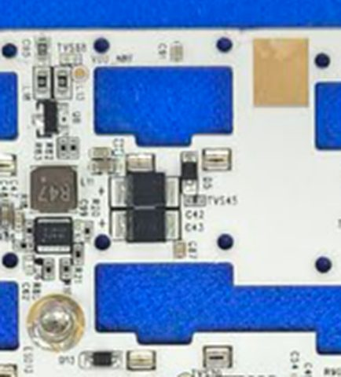{ width="120" loading=lazy }](../assets/images/fcc/parts/hp-19.jpg){ .glightbox data-title="HP-19: FCC ID 2BQ4V0825CRL, Internal Photos 1, page 9, upper photo (gold land and the round boss; rotated 180 degrees)" } | Case ground lands (left) | bare gold lands | - | Case or shield ground contact (INFERRED) | Large rectangular gold pad(s); round metal boss near `ESD12` (not re-checked) | CRL IP1 p9 | DOC; INFERRED (function); confirmed | - |
| HP-20 | [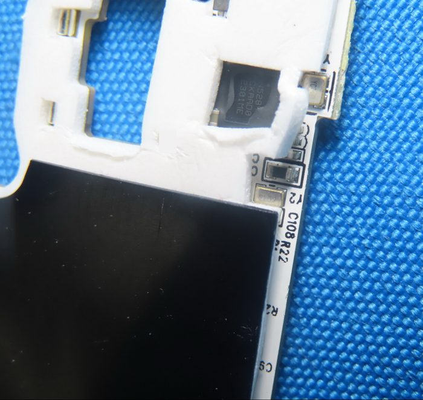{ width="120" loading=lazy }](../assets/images/fcc/parts/hp-20.jpg){ .glightbox data-title="HP-20: FCC ID 2BQ4V0825CRL, Internal Photos 1, page 10, lower photo (white foam with the cut-out over U2, black film)" } | Insulation over the component side | black film with windows; white foam layer | - | Assembly insulation; the foam has a rectangular cut-out exactly over U2 | Black film with windows and red handwriting (not transcribed); white foam with cut-out [clear] | CRL IP1 p8, p10; CRR IP1 p7 | DOC; confirmed | - |

### Wing board (outer two key columns, `Create_L/R_Wing_20250206_V11`)

Photos: left CRL IP1 p11-p12, right CRR IP1 p9.

<!-- fcc-images:start -->

<figure markdown="span">
  { width="640" loading=lazy }
  <figcaption>Left wing board (Create_L_Wing_20250206_V11), component side. FCC ID 2BQ4V0825CRL, Internal Photos 1, page 12, upper photo. Identifying marks removed.</figcaption>
</figure>

<figure markdown="span">
  { width="640" loading=lazy }
  <figcaption>Right wing board (Create_R_Wing_20250206_V11), switch side. FCC ID 2BQ4V0825CRR, Internal Photos 1, page 9, upper photo. Identifying marks removed.</figcaption>
</figure>

<!-- fcc-images:end -->

| ID | Image | Location | Part | Maker | Function | Marking as read | Source | Basis | Notes |
|---|---|---|---|---|---|---|---|---|---|
| WG-03 | [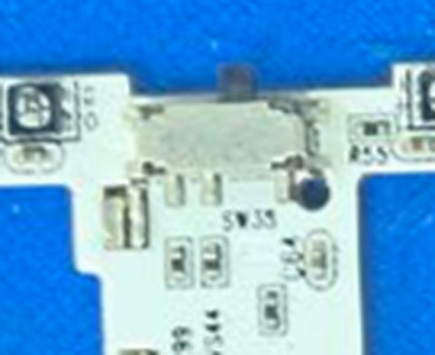{ width="120" loading=lazy }](../assets/images/fcc/parts/wg-03.jpg){ .glightbox data-title="WG-03: FCC ID 2BQ4V0825CRL, Internal Photos 1, page 12, upper photo (left wing; rotated 180 degrees)" } | Wing outer end face; right wing: between side-bar LEDs 6 and 7 | right-angle SMD slide switch, 3 terminals + 2 tabs, unmarked | not identified | Half power on/off switch ('Locate the power switch on the side of each keyboard wing') | No designator or marking on the switch [clear shape]; white body, gray lever past the board edge (right); the nearby `SW33` is a key | CRL IP1 p12; CRR IP1 p9; CRL EP p4; CRR EP p4; CRR UM1 p5 | DOC; confirmed | ON/OFF direction not determinable (manual drawings CRR UM1 p5 and UM2 p3 disagree). Candidate part: U-WG-03b. |
| WG-04 | [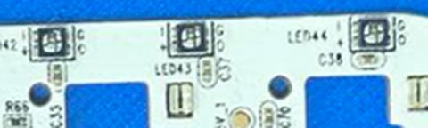{ width="120" loading=lazy }](../assets/images/fcc/parts/wg-04.jpg){ .glightbox data-title="WG-04: FCC ID 2BQ4V0825CRL, Internal Photos 1, page 12, upper photo (LED42-LED44; rotated 180 degrees)" } | Per-key LEDs, 10 per wing | addressable RGB LED, 4-pad, unmarked | not identified | Wing key backlight, same footprint as HP-14 | `LED36`-`LED45` (read `LED36`, `LED38`-`LED42`, `LED44`); pads `O`, `G`, `I`, `+` [refs clear] | CRL IP1 p11, p12 | DOC; INFERRED (class); confirmed | - |
| WG-05 | [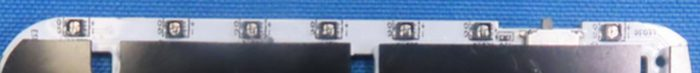{ width="120" loading=lazy }](../assets/images/fcc/parts/wg-05.jpg){ .glightbox data-title="WG-05: FCC ID 2BQ4V0825CRR, Internal Photos 1, page 9, lower photo (right wing face B)" } | Side light bar on one long edge of wing face B | 7 addressable 4-pad LEDs | not identified | The half's side light bar (LED indices 74-80 / 81-87) | Exactly 7 LEDs in a row, pads `O`, `G`, `+`; partial ref `LED56` at one end; slide switch between the 6th and 7th [clear count] | CRR IP1 p9; measured on one keyboard (LED map, 7 side-bar indices per half, 2026-09-08) | DOC; MEASURED (7 per side in the LED map, 2026-09-08); confirmed | The left wing's face B is under black film. |
| WG-06 | [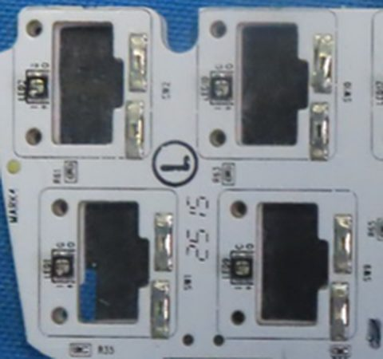{ width="120" loading=lazy }](../assets/images/fcc/parts/wg-06.jpg){ .glightbox data-title="WG-06: FCC ID 2BQ4V0825CRL, Internal Photos 1, page 11, upper photo (left wing switch side; SW1, SW2, SW9, SW10, stamp 25 15)" } | Key windows, 10 per wing | hot-swap socket footprints | - | 10 wing key positions, same numbering mirrored on both wings | `SW1`, `SW2`, `SW9`, `SW10`, `SW16`, `SW17`, `SW23`, `SW24`, `SW32`, `SW33` on each wing [clear] | CRL IP1 p11; CRR IP1 p9 | DOC; corrected (Same designators on both wings (was read as right-wing only)) | - |
| WG-07 | [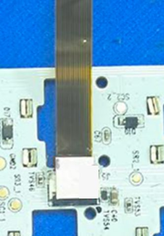{ width="120" loading=lazy }](../assets/images/fcc/parts/wg-07.jpg){ .glightbox data-title="WG-07: FCC ID 2BQ4V0825CRL, Internal Photos 1, page 12, upper photo (left wing flex into J5)" } | Wing flex and connector | flex + FPC connector `J5` (left); ZIF in a central window (right) | not identified | Wing to mainboard link (mates HP-17) | Left: orange/brown flex, about 12 conductors, red/white sticker, into `J5`; right: small white ZIF [clear] | CRL IP1 p12; CRR IP1 p9 | DOC; confirmed (New refdes `J5`) | - |
| WG-08 | [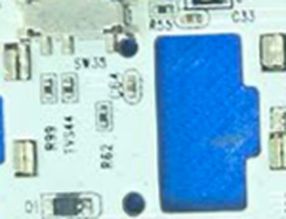{ width="120" loading=lazy }](../assets/images/fcc/parts/wg-08.jpg){ .glightbox data-title="WG-08: FCC ID 2BQ4V0825CRL, Internal Photos 1, page 12, upper photo (R55, R62, R99, TVS44, C33; rotated 180 degrees)" } | Wing passives and fiducials | passives, fiducials | - | Support parts around the slide switch and corners | Left: `MARK1`, `C32`, `R55`, `R62`, `R99`, `TVS44`; right: `MARK3`, `MARK4`, resistor cluster `R56`-`R60` [clear] | CRL IP1 p12; CRR IP1 p9 | DOC; confirmed (`R36` not found (Rejected R-40)) | - |

### Dock (thumb-key) board (`Create_L/R_Dock_20241120_V09`)

Photos: left CRL IP2 p16 (and CRL IP1 p5, p7 at low resolution), right CRR IP1 p12.

<!-- fcc-images:start -->

<figure markdown="span">
  { width="640" loading=lazy }
  <figcaption>Left dock (thumb-key) board, component face. FCC ID 2BQ4V0825CRL, Internal Photos 2, page 16, upper photo. Identifying marks removed.</figcaption>
</figure>

<figure markdown="span">
  { width="640" loading=lazy }
  <figcaption>Right dock (thumb-key) board, component face. FCC ID 2BQ4V0825CRR, Internal Photos 1, page 12, upper photo. Identifying marks removed.</figcaption>
</figure>

<figure markdown="span">
  { width="640" loading=lazy }
  <figcaption>Left half module bay: magnet carrier plate (top) and bay bracket with the dock and pogo boards mounted (bottom). FCC ID 2BQ4V0825CRL, Internal Photos 1, page 5, upper photo. Identifying marks removed.</figcaption>
</figure>

<!-- fcc-images:end -->

| ID | Image | Location | Part | Maker | Function | Marking as read | Source | Basis | Notes |
|---|---|---|---|---|---|---|---|---|---|
| DK-03 | [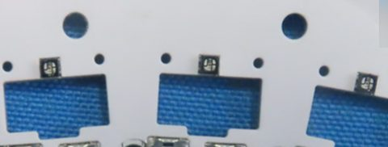{ width="120" loading=lazy }](../assets/images/fcc/parts/dk-03.jpg){ .glightbox data-title="DK-03: FCC ID 2BQ4V0825CRL, Internal Photos 2, page 16, lower photo: the 3 thumb-key LEDs on the LED face (left board)" } | Thumb-key LEDs, 3 per dock board | addressable RGB LED, unmarked | not identified | Thumb-key backlight (addressable, INFERRED from `LED_D7_1` data and `LED_PWR_5V_2` pads) | Left: 3 black square packages about 2 mm; right: 3 four-pad LEDs on face B; faint 1-2 character top mark [illegible] | CRL IP2 p16; CRR IP1 p12 | DOC; INFERRED (class); confirmed | - |
| DK-04 | [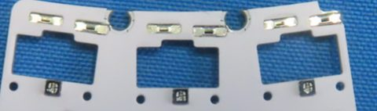{ width="120" loading=lazy }](../assets/images/fcc/parts/dk-04.jpg){ .glightbox data-title="DK-04: FCC ID 2BQ4V0825CRR, Internal Photos 1, page 12, lower photo: 3 windows with the 6 socket parts (right board)" } | Thumb-key positions, 3 per dock board | hot-swap sockets (6 unmarked metal parts, 2 per window) | not identified (Kailh-compatible class INFERRED) | Three hot-swap thumb-key positions | 3 windows, 2 slotted pads each; 6 silver parts about 3 x 1.3 mm on both faces [clear] | CRL IP2 p16; CRL IP1 p7; CRR IP1 p12; CRR UM3 p4 | DOC (manual: 'Hot-Swappable Switches', 'sockets'); INFERRED (the metal parts are the sockets); confirmed | - |
| DK-05 | [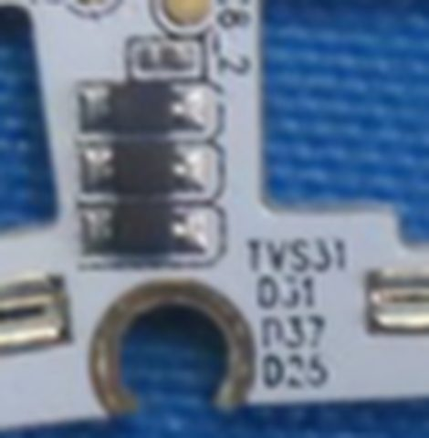{ width="120" loading=lazy }](../assets/images/fcc/parts/dk-05.jpg){ .glightbox data-title="DK-05: FCC ID 2BQ4V0825CRR, Internal Photos 1, page 12, upper photo: the three stacked diodes with the TVS31/D31/D37/D25 labels (right board)" } | `D25`, `D31`, `D37` | small signal diodes, unmarked | not identified | One key diode per thumb key (INFERRED) | Three identical unmarked 2-terminal parts beside `TVS31` [refs clear] | CRL IP2 p16; CRR IP1 p12 | DOC; INFERRED (role); confirmed | - |
| DK-06 | [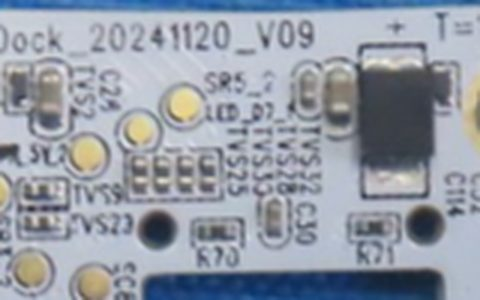{ width="120" loading=lazy }](../assets/images/fcc/parts/dk-06.jpg){ .glightbox data-title="DK-06: FCC ID 2BQ4V0825CRR, Internal Photos 1, page 12, upper photo: TVS9, TVS23, TVS25, TVS28, TVS32 and neighbors (right board)" } | TVS array | TVS parts, unmarked | not identified | ESD protection on every dock and key line | `TVS1`, `TVS2`, `TVS4`, `TVS5`, `TVS9`, `TVS22`, `TVS23`, `TVS25`, `TVS28`-`TVS32` (union of both boards) [clear] | CRL IP2 p16; CRR IP1 p12 | DOC; confirmed | - |
| DK-07 | [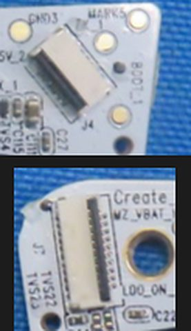{ width="120" loading=lazy }](../assets/images/fcc/parts/dk-07.jpg){ .glightbox data-title="DK-07: FCC ID 2BQ4V0825CRR, Internal Photos 1, page 12, upper photo: the J4 end (top) and J7 end (bottom) stacked (right board)" } | FPC connectors: `J7` + an unlabeled ZIF (left); `J7` + angled `J4` (right) | flip-lock FPC ZIF receptacles, unmarked | not identified | One takes the mainboard flex, one the pogo flex (right: `J4` takes the pogo flex, INFERRED from routing) | Cream/white bodies, gold contact combs, about 10-16 contacts [count not exact] | CRL IP2 p16; CRR IP1 p12 | DOC; INFERRED (mating); confirmed | - |
| DK-08 | [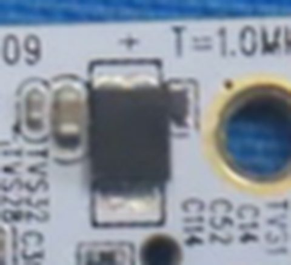{ width="120" loading=lazy }](../assets/images/fcc/parts/dk-08.jpg){ .glightbox data-title="DK-08: FCC ID 2BQ4V0825CRR, Internal Photos 1, page 12, upper photo: black polarised part under the + mark (right board)" } | Polarised part between `TVS1` and `R70` | polarised chip capacitor, tantalum or polymer class, unmarked | not identified | Bulk capacitance | Black molded body, wraparound end terminations, `+` on the silkscreen above [clear] | CRR IP1 p12; CRL IP2 p16 | DOC; INFERRED (class); confirmed (Identity narrowed from 'capacitor or diode') | - |
| DK-10 | [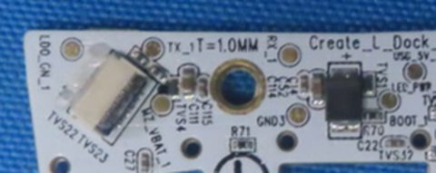{ width="120" loading=lazy }](../assets/images/fcc/parts/dk-10.jpg){ .glightbox data-title="DK-10: FCC ID 2BQ4V0825CRL, Internal Photos 2, page 16, upper photo (rotated 180 degrees): LDO_ON_1, MZ_VBAT_1, TX_1, GND3, BOOT_1, USB_5V_2 (left board)" } | Dock-board test pads | test pads | - | UART to the module, boot select, module battery rail, LDO enable, USB-derived 5 V, thumb-key matrix lines, LED data and power | `TX_1`, `RX_1`, `BOOT_1`, `MZ_VBAT_1`, `LDO_ON_1`, `USB_5V_2`, `GND3`; `SR1_2` (partial), `SR3_2`, `SR4_2`, `SR5_2`, `SC8_2`; `LED_D7_1`, `LED_PWR_5V_2`; `R70`, `R71`, `C14`, `C22`, `C27`-`C30`, `C52`, `C111`, `C114`, `C115` [clear except where marked]; no `D+`/`D-` anywhere | CRL IP2 p16; CRR IP1 p12 | DOC; INFERRED (roles); confirmed (`MZ_VBAT_1` (not `M2_VBAT_1`) and `LDO_ON_1` resolved) | - |

### Module dock interface on the half (pogo board, contacts, bay)

Photos: left CRL IP2 p15, CRL IP1 p5, p7; right CRR IP2 p13, CRR IP1 p5-p6; exterior CRL EP p2-p4, CRR EP p2-p4.

<!-- fcc-images:start -->

<figure markdown="span">
  { width="640" loading=lazy }
  <figcaption>Left pogo board with its flex: contact face (top) and back (bottom). FCC ID 2BQ4V0825CRL, Internal Photos 2, page 15, upper and lower, stacked. Identifying marks removed.</figcaption>
</figure>

<figure markdown="span">
  { width="640" loading=lazy }
  <figcaption>Right pogo board with its flex: contact face (top) and back (bottom); also illustrates U-PD-02. FCC ID 2BQ4V0825CRR, Internal Photos 2, page 13, upper and lower, stacked. Identifying marks removed.</figcaption>
</figure>

<figure markdown="span">
  { width="640" loading=lazy }
  <figcaption>Left half module bay: magnet carrier plate (top) and bay bracket with the dock and pogo boards mounted (bottom). FCC ID 2BQ4V0825CRL, Internal Photos 1, page 5, upper photo. Identifying marks removed.</figcaption>
</figure>

<figure markdown="span">
  { width="640" loading=lazy }
  <figcaption>Left half exterior, top view with the empty module bay and its 8 contacts. FCC ID 2BQ4V0825CRL, External Photos, page 2, upper photo. Identifying marks removed.</figcaption>
</figure>

<!-- fcc-images:end -->

| ID | Image | Location | Part | Maker | Function | Marking as read | Source | Basis | Notes |
|---|---|---|---|---|---|---|---|---|---|
| PD-03 | [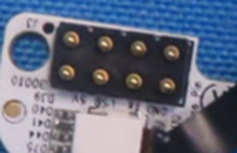{ width="120" loading=lazy }](../assets/images/fcc/parts/pd-03.jpg){ .glightbox data-title="PD-03: FCC ID 2BQ4V0825CRR, Internal Photos 2, page 13, upper photo: 8 domed pins in 2 rows of 4 (right pogo board; the left twin is on CRL IP2 p15)" } | Pogo board contact face, on the straight chord of the bay opening (both halves) | 8-position spring (pogo) pin block, unmarked | not identified | Half-side module dock contacts; pins stand proud on the half, the modules carry the mating pads | 8 gold domed pins, 2 staggered rows of 4, black insulator, 8 through-hole joints [clear count]; no marking | CRL IP2 p15; CRL IP1 p5, p7; CRR IP2 p13; CRR IP1 p5, p6; CRL EP p2-p4; CRR EP p2-p4; CRL BLE p35; CRR BLE p35; CRR UM2 p2 | DOC; confirmed | Identical count on both halves and on every module (TUM-20, TCX-09, TKX-07). |
| PD-05 | [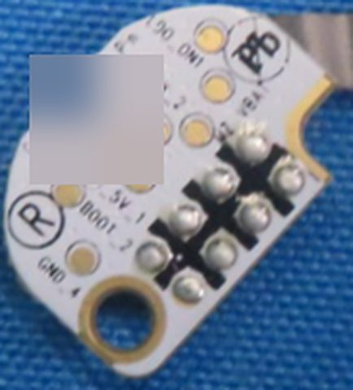{ width="120" loading=lazy }](../assets/images/fcc/parts/pd-05.jpg){ .glightbox data-title="PD-05: FCC ID 2BQ4V0825CRR, Internal Photos 2, page 13, lower photo: back-face pad labels GND, BOOT_2, 5V_1, IO_ON1, VBAT (right board)" } | Pogo board pad labels | silkscreen pads | - | Same signal family as the dock board | Left back: `GND_4`, `BOOT_2`, `MZ_VBAT`, `RX_2`, `…_ON1` (candidate `LDO_ON1`); right back: `GND_4`, `BOOT_2`, `5V_1`, `RX_2`; right pin face: `?ND`, `TX`, `USB_5V` [clear except where marked] | CRL IP2 p15; CRR IP2 p13 | DOC; confirmed | Pin-to-signal mapping not resolvable (OQ-09). |
| PD-06 | [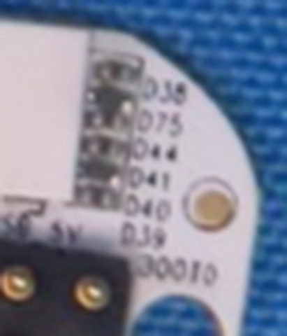{ width="120" loading=lazy }](../assets/images/fcc/parts/pd-06.jpg){ .glightbox data-title="PD-06: FCC ID 2BQ4V0825CRR, Internal Photos 2, page 13, upper photo (rotated 180 degrees): D38, D75, D44, D41, D40, D39 (right board)" } | ESD diodes on the pogo board | small diodes, unmarked | not identified | ESD/TVS on the exposed dock lines (INFERRED) | Left: 5 parts with diode symbols (refs `D19`...`D38`); right: 6 parts (`D39`, `D40`, `D41`, `D75`, `D3?`); edge text `?0010` [counts clear; refs partial] | CRL IP2 p15; CRR IP2 p13 | DOC; INFERRED (role); confirmed | - |
| PD-07 | [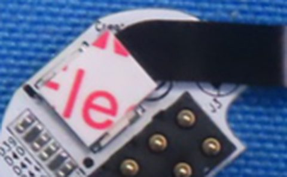{ width="120" loading=lazy }](../assets/images/fcc/parts/pd-07.jpg){ .glightbox data-title="PD-07: FCC ID 2BQ4V0825CRL, Internal Photos 2, page 15, upper photo: J1 under its printed red-and-white sticker, flex exit (left board)" } | Pogo board connectors | flex termination / connector | - | Pogo flex termination (INFERRED) | Left: `J1` under a white sticker (red text fragment `le`), second ref `J5` or `J3`; right: `J3` [clear] beside a round cut-out, white block at the flex exit | CRL IP2 p15; CRR IP2 p13 | DOC; confirmed | - |
| PD-08 | [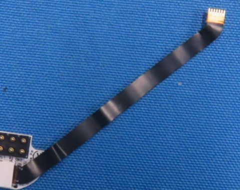{ width="120" loading=lazy }](../assets/images/fcc/parts/pd-08.jpg){ .glightbox data-title="PD-08: FCC ID 2BQ4V0825CRR, Internal Photos 2, page 13, upper photo: black flex with its gold-finger tail (right)" } | Pogo flex | black flat flex about 50 mm with stiffener | - | Pogo board to dock board (right: into dock `J4`, INFERRED) | Right flex printed `R`; fingers: left about 12 (estimate), right about 7 visible [counts partial] | CRL IP2 p15; CRL IP1 p5; CRR IP2 p13; CRR IP1 p5, p6 | DOC; INFERRED (counts, routing); confirmed | - |
| PD-09 | [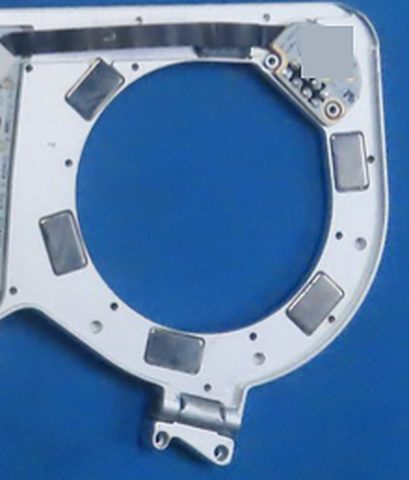{ width="120" loading=lazy }](../assets/images/fcc/parts/pd-09.jpg){ .glightbox data-title="PD-09: FCC ID 2BQ4V0825CRL, Internal Photos 1, page 5, upper photo: bay bracket with its 5 rectangular blocks" } | Module-bay bracket (both halves) | metal frame with circular opening and two hinge lugs; 5 rectangular blocks | not identified | Carries the dock and pogo boards; the 5 blocks did not attract a steel paper clip, so they are not magnets (MEASURED on one board, 2026-09-23; identity INFERRED from the test) | 5 rectangular blocks around the opening on each half [clear count] | CRL IP1 p5; CRR IP1 p5 | DOC; MEASURED (paper-clip test); confirmed | - |
| PD-10 | [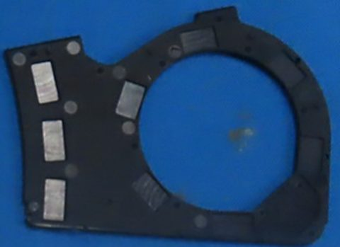{ width="120" loading=lazy }](../assets/images/fcc/parts/pd-10.jpg){ .glightbox data-title="PD-10: FCC ID 2BQ4V0825CRL, Internal Photos 1, page 5, upper photo: black magnet carrier plate with the silver blocks" } | Magnet carrier plate under the bay bracket (left) | black plate with circular opening; at least 4 magnet-colored blocks | not identified | 4 of the 6 module-bay magnets (MEASURED: paper-clip test on one board, 2026-09-23) | 4 silver blocks like PD-09 [clear]; 6-8 darker rectangular segments of unknown material | CRL IP1 p5 | DOC; MEASURED (paper-clip test); corrected (Count narrowed from 'at least 6' to 'at least 4') | - |
| PD-11 | [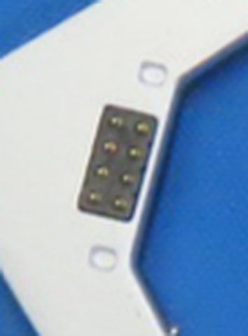{ width="120" loading=lazy }](../assets/images/fcc/parts/pd-11.jpg){ .glightbox data-title="PD-11: FCC ID 2BQ4V0825CRR, External Photos, page 3, upper photo: the contact block with one light feature above it and one below" } | Two features flanking the contact block on the chord | small light oblong/round features | - | Magnets or locating features (not determinable); 2 of the 6 module-bay magnets, one on either side of the contact block (MEASURED: paper-clip test on one board, 2026-09-23) | Present on both halves [clear presence] | CRL EP p2-p4; CRR EP p2-p3; CRL BLE p35; CRR BLE p35; CRR SRD p34; CRR UM2 p2 | DOC; MEASURED (paper-clip test); confirmed | - |
| PD-12 | [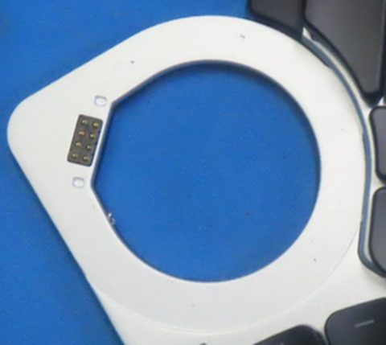{ width="120" loading=lazy }](../assets/images/fcc/parts/pd-12.jpg){ .glightbox data-title="PD-12: FCC ID 2BQ4V0825CRR, External Photos, page 3, upper photo: the dock opening with its straight chord and the contacts" } | Dock opening in the half | circular through-cutout with one straight chord | - | Module bay: contacts on the chord; modules pressed up 'through the module dock cutout' | Small round features on the bore wall (raised or recessed, not determinable) [clear shape] | CRR EP p2, p3; CRR UM2 p2 | DOC; confirmed (Wording refined ('bumps' to 'round features')) | - |
| PD-13 | [{ width="120" loading=lazy }](../assets/images/fcc/boards/pogo-board-left.jpg){ .glightbox data-title="PD-13: no crop of its own; Left pogo board with its flex: contact face (top) and back (bottom) (FCC ID 2BQ4V0825CRL, Internal Photos 2, page 15)" } | Dock link net set (half side and module side) | - | - | UART (`TX`/`RX`), boot select (`BOOT`, `BOOT1`), module battery rail (`MZ_VBAT`/`VBAT`), 5 V feed (`USB_5V`/`POGOPIN_5V`/`5V`), enable (`LDO_ON`/`MODULE_ON`/`ON`), `GND` | Half labels HP-11, DK-10, PD-05; module labels `GND`, `VBAT`, `RX`, `ON`, `GND`, `TX`, `5V`, `BOOT1` (TUM-20, TCX-09, TKX-07); no `D+`/`D-` on any dock, pogo or module contact label | CRL IP1 p9; CRL IP2 p15; CRR IP1 p12; CRR IP2 p13, p16 | DOC (labels); INFERRED (function, direction; pin order unknown); confirmed | Fits a module update driven by the half over UART plus `BOOT1` (INFERRED, untested; OQ-09). |

### Half enclosure, switches, keycaps, mechanics

Manual text is from user manual v1.0.6 (CRR UM1-UM5, native text layer) and the older CRL manual (image-only).

<!-- fcc-images:start -->

<figure markdown="span">
  { width="640" loading=lazy }
  <figcaption>Left half exterior, top view with the empty module bay and its 8 contacts. FCC ID 2BQ4V0825CRL, External Photos, page 2, upper photo. Identifying marks removed.</figcaption>
</figure>

<!-- fcc-images:end -->

| ID | Image | Location | Part | Maker | Function | Marking as read | Source | Basis | Notes |
|---|---|---|---|---|---|---|---|---|---|
| EN-01 | [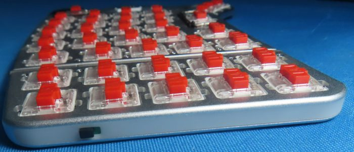{ width="120" loading=lazy }](../assets/images/fcc/parts/en-01.jpg){ .glightbox data-title="EN-01: FCC ID 2BQ4V0825CRL, Internal Photos 1, page 6, lower photo: low-profile switches with red stems and clear housings in the plate" } | Key switches, 37 per half (24 body + 10 wing + 3 dock), 74 total | CPG-1232 = Kailh PG1232 ('Choc Mini'), 0.45 x 0.42 mm pin variant | Kailh (Kaihua Electronics) | Hot-swappable low-profile key switch; red stems and clear housings in the photos; PG1232 is 14.5 x 13.5 x 8.2 mm, 2.4 mm travel (Kailh) | Spec sheet 'Kailh CPG-1232 (0.45x0.42mm pin variant)' [clear, text layer]; `Kailh` wordmark on the manual drawing (CRR copy) | CRR UM1 p3; CRR UM3 p2, p4; CRL UM1 p3; CRL UM2 p4, p6; CRL IP1 p5, p6; CRR IP1 p5 | DOC; confirmed | 74 keys matches NayaFlow 1.25.1's 74 key labels (STATIC). |
| EN-03 | [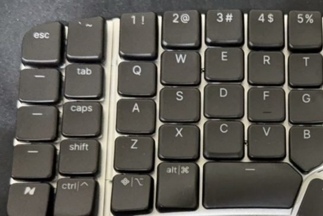{ width="120" loading=lazy }](../assets/images/fcc/parts/en-03.jpg){ .glightbox data-title="EN-03: FCC ID 2BQ4V0825CRL, External Photos, page 2, upper photo: keycaps with their legends (the row's evidence is the manual; the photo illustrates it)" } | Keycaps, 37 per half | polycarbonate keycaps | - | Individually sculpted keycaps with a coordinate label on the underside (scheme `LA1`..`LH4`, `RA1`..`RH4` in NayaFlow 1.25.1 geometry, STATIC) | Spec sheet 'Keycaps: Polycarbonate' [clear]; drawing shows the underside tag as `XXN` | CRR UM1 p3; CRR UM3 p2; CRL UM1 p3; CRL UM2 p4; STATIC: NayaFlow 1.25.1 key geometry | DOC; STATIC (label scheme); confirmed | - |
| EN-04 | [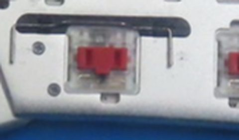{ width="120" loading=lazy }](../assets/images/fcc/parts/en-04.jpg){ .glightbox data-title="EN-04: FCC ID 2BQ4V0825CRR, Internal Photos 1, page 5, lower photo: black wire stabilizer across the wide bottom-row key" } | Stabilizers on the larger keycaps | wire-type stabilizer, unmarked | not identified | 'Larger keycaps ... have stabilizers' | Black wire bar with legs into the plate either side of one switch [clear in photo] | CRR UM3 p1, p2; CRL UM2 p3, p4; CRR IP1 p5 | DOC; confirmed | Which keys carry stabilizers is not stated. |
| EN-05 | [{ width="120" loading=lazy }](../assets/images/fcc/boards/half-exterior.jpg){ .glightbox data-title="EN-05: no crop of its own; Left half exterior, top view with the empty module bay and its 8 contacts (FCC ID 2BQ4V0825CRL, External Photos, page 2)" } | Enclosure: body, dock, wing | 'Aerospace Grade Aluminum' (alloy not stated) | - | Three-section aluminum body; black dock underside plate of unknown material | Spec sheet 'Body / Dock / Wing: Aerospace Grade Aluminum' [clear] | CRR UM1 p3; CRL UM1 p3 | DOC; confirmed | - |
| EN-06 | [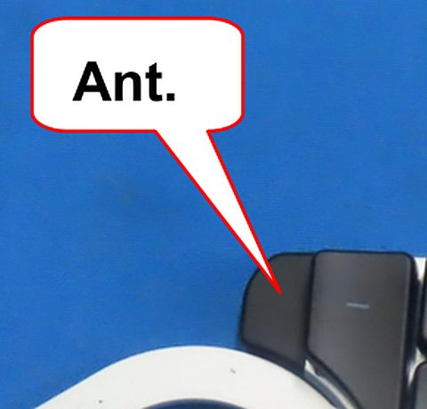{ width="120" loading=lazy }](../assets/images/fcc/parts/en-06.jpg){ .glightbox data-title="EN-06: FCC ID 2BQ4V0825CRR, External Photos, page 3, upper photo: the lab's 'Ant.' callout pointing at the black end cap (vector callout kept as filed)" } | Black end cap at the rear-inner corner | non-metal end cap carrying USB-C | - | Antenna window behind which the RF0400A sits | Dark matte cap with USB-C; the lab's 'Ant.' callout on the top view lands on the black keycap above that corner [clear] | CRR EP p3 (vector callout), p4; CRL EP p2-p4; Kickstarter updates 14 (2024-07-24) and 15 (2024-09-03) | DOC (callout; vendor statement); confirmed | - |
| EN-07 | [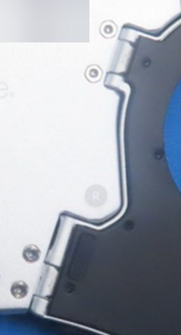{ width="120" loading=lazy }](../assets/images/fcc/parts/en-07.jpg){ .glightbox data-title="EN-07: FCC ID 2BQ4V0825CRR, External Photos, page 3, lower photo: the two dock-hinge knuckle assemblies on the underside" } | Hinges and tenting | wing hinge + dock hinge | - | Two tenting hinges per half, 'In-built tenting up to 27°' | Round silver pivot cap (wing); two knuckle assemblies with screws (dock) [clear] | CRR UM1 p3; CRR UM2 p1; CRL UM1 p3; CRR EP p3, p4; CRL EP p3 | DOC; confirmed | - |
| EN-08 | [{ width="120" loading=lazy }](../assets/images/fcc/boards/half-exterior.jpg){ .glightbox data-title="EN-08: no crop of its own; Left half exterior, top view with the empty module bay and its 8 contacts (FCC ID 2BQ4V0825CRL, External Photos, page 2)" } | PCB suspension | foam layer (part not identified in photos) | - | 'Foam-suspended PCB for sound dampening' | Feature list text [clear] | CRR UM1 p3; CRL UM1 p3 | DOC; confirmed | - |
| EN-09 | [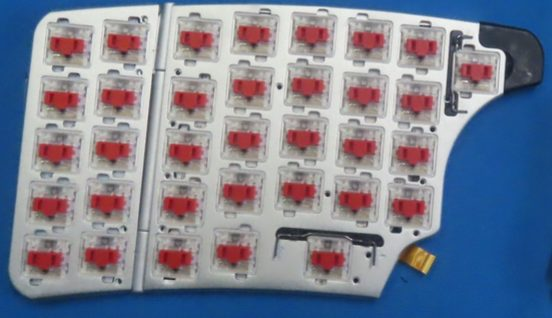{ width="120" loading=lazy }](../assets/images/fcc/parts/en-09.jpg){ .glightbox data-title="EN-09: FCC ID 2BQ4V0825CRL, Internal Photos 1, page 5, upper photo: the body and wing switch plates with the butted seam" } | Switch plates | separate rigid metal plates: body (24), wing (10), dock ring (3) | - | Plates butted at seams with screws, linked only electrically by flex; the hinging is in the case (EN-07) | Plain butted seam with screws [clear] | CRR IP1 p5; CRL IP1 p5, p6 | DOC; corrected (Not 'two hinged sections') | - |
| EN-10 | [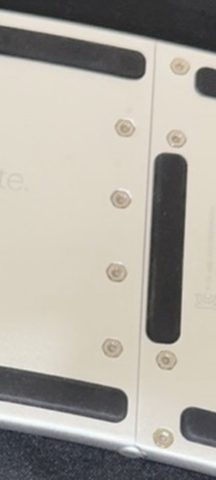{ width="120" loading=lazy }](../assets/images/fcc/parts/en-10.jpg){ .glightbox data-title="EN-10: FCC ID 2BQ4V0825CRL, External Photos, page 2, lower photo: the screw columns either side of the wing seam" } | Underside screws | cross-recess screws | - | Fasteners: 12 silver (4 wing, 8 body) matching 12 symbols on the label outline; at least 13 small black screws around the dock ring plate | Round heads, single cross-slot [clear] | CRR EP p3, p4; CRR LBL; CRL LLOC p1 | DOC; confirmed | The count of 12 is carried from the extraction pass. The left sheet shows the same 12 screw symbols. |
| EN-11 | [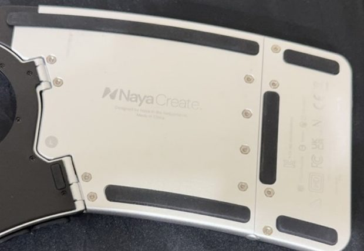{ width="120" loading=lazy }](../assets/images/fcc/parts/en-11.jpg){ .glightbox data-title="EN-11: FCC ID 2BQ4V0825CRL, External Photos, page 2, lower photo: underside with the raised foot strips" } | Feet | raised strips (rubber INFERRED) | - | Body 2 long curved strips; wing 2 short + 1 long; dock 1 long strip + 1 small pad | [clear shape] | CRR EP p3; CRR LBL; CRL LLOC p1 | DOC; INFERRED (material); confirmed | - |
| EN-12 | [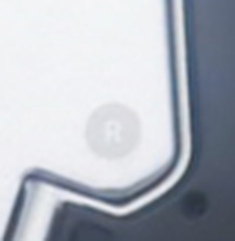{ width="120" loading=lazy }](../assets/images/fcc/parts/en-12.jpg){ .glightbox data-title="EN-12: FCC ID 2BQ4V0825CRR, External Photos, page 3, lower photo: the circled R near the lower dock hinge (faint engraving)" } | Side marker near the lower dock hinge | `L` / `R` in a filled circle | - | Left/right identification | `R` read on photo and artwork; `L` from the CRL photo (extraction pass) [clear] | CRR EP p3; CRR LBL; CRL EP p2; CRL LLOC p1 | DOC; confirmed | - |
| EN-13 | [{ width="120" loading=lazy }](../assets/images/fcc/parts/en-13.jpg){ .glightbox data-title="EN-13: FCC ID 2BQ4V0825CRL, External Photos, page 2, lower photo: 'Naya Create.' wordmark and subtext (faint engraving)" } | Underside wordmark | engraving | - | Branding and origin | 'N Naya Create.®', 'Designed by Naya in the Netherlands', 'Made in China' [clear on artwork; faint engraving] | CRR EP p3; CRR LBL; CRL LLOC p1 | DOC; confirmed | - |
| EN-14 | [{ width="120" loading=lazy }](../assets/images/fcc/boards/half-exterior.jpg){ .glightbox data-title="EN-14: no crop of its own; Left half exterior, top view with the empty module bay and its 8 contacts (FCC ID 2BQ4V0825CRL, External Photos, page 2)" } | Size and weight | '212 x 118 x 18mm', '1.4kg' | - | Spec-sheet dimensions (per half INFERRED from the 1:1 label outline, about 210.3 x 121.3 mm) | Spec sheet [clear] | CRR UM1 p3; CRR LBL | DOC; INFERRED (per half); confirmed | The sheet does not say per half or per pair. |
| EN-15 | [{ width="120" loading=lazy }](../assets/images/fcc/boards/half-exterior.jpg){ .glightbox data-title="EN-15: no crop of its own; Left half exterior, top view with the empty module bay and its 8 contacts (FCC ID 2BQ4V0825CRL, External Photos, page 2)" } | Half-to-half magnets | magnets (count not given) | - | 'The two halves of Naya Create are magnetically attached to one another' | Manual text [clear] | CRR UM1 p8; CRL UM1 p8 | DOC; confirmed | - |

### Speedlink dongle (`NAYA-100-1`, board `B0K17_Dongle_20241106_V01`)

Photos: DG IP p4-p5 (board), DG EP p2-p3 (exterior) and the closed unit in CRR IP7 p44-p45.

<!-- fcc-images:start -->

<figure markdown="span">
  { width="640" loading=lazy }
  <figcaption>Speedlink dongle label artwork. FCC ID 2BQ4V0825DG, Label, page 1, vector artwork. Identifying marks removed.</figcaption>
</figure>

<figure markdown="span">
  { width="640" loading=lazy }
  <figcaption>Speedlink dongle board, front (USB contacts, board name, Y1, LED1). FCC ID 2BQ4V0825DG, Internal Photos, page 5, upper photo.</figcaption>
</figure>

<figure markdown="span">
  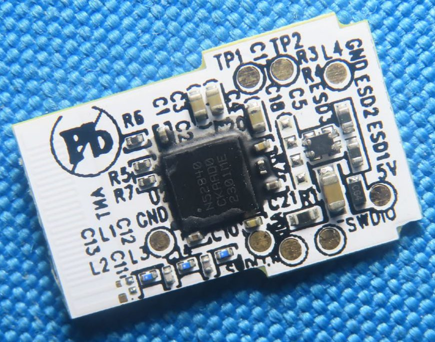{ width="640" loading=lazy }
  <figcaption>Speedlink dongle board, back (nRF52840 U1, antenna end, test pads). FCC ID 2BQ4V0825DG, Internal Photos, page 5, lower photo.</figcaption>
</figure>

<figure markdown="span">
  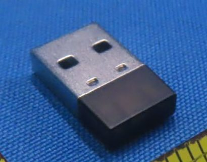{ width="640" loading=lazy }
  <figcaption>Speedlink dongle, closed (metal USB-A shell, black cap). FCC ID 2BQ4V0825DG, External Photos, page 2, lower photo. Identifying marks removed.</figcaption>
</figure>

<!-- fcc-images:end -->

| ID | Image | Location | Part | Maker | Function | Marking as read | Source | Basis | Notes |
|---|---|---|---|---|---|---|---|---|---|
| DG-04 | [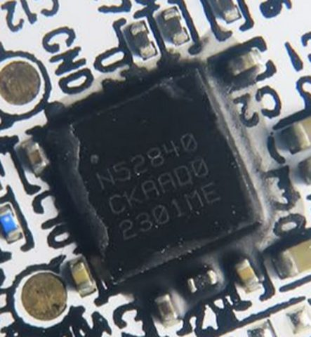{ width="120" loading=lazy }](../assets/images/fcc/parts/dg-04.jpg){ .glightbox data-title="DG-04: FCC ID 2BQ4V0825DG, Internal Photos, page 5, lower photo, rotated upright" } | `U1`, back side | nRF52840, package CKAA (WLCSP; about 4.0 x 3.8 mm with fillet), build code D0 | Nordic Semiconductor | BLE SoC with native USB; firmware in the internal 1 MB flash (no external flash on the board) | `N52840` / `CKAAD0` / `2301ME`, pin-1 dot [clear] | DG IP p5; DG RF p10-p11 (power setting 8 / 7 / 8, 8.97 dBm) | DOC; INFERRED (D0 = Revision 2); confirmed | D0 = Revision 2 (Revision 3 is Fx0), INFERRED from Nordic DevZone. |
| DG-06 | [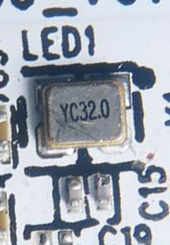{ width="120" loading=lazy }](../assets/images/fcc/parts/dg-06.jpg){ .glightbox data-title="DG-06: FCC ID 2BQ4V0825DG, Internal Photos, page 5, upper photo, rotated upright" } | `Y1`, front | 32.000 MHz crystal, 4-pad metal lid, about 2.1 x 1.7 mm | not identified | nRF52840 HFXO | `YC32.0` [clear] | DG IP p5 | DOC; confirmed | - |
| DG-08 | [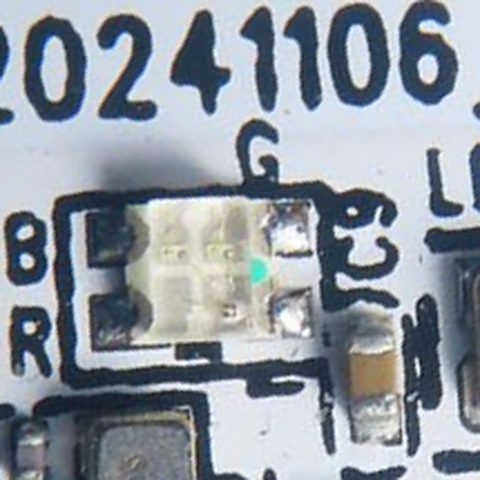{ width="120" loading=lazy }](../assets/images/fcc/parts/dg-08.jpg){ .glightbox data-title="DG-08: FCC ID 2BQ4V0825DG, Internal Photos, page 5, upper photo, rotated upright" } | `LED1`, front | RGB LED, 4-pad, clear lens, 3 die sites, unmarked | not identified | Status LED with a common pad | Silkscreen `G`, `B`, `R` at the pads [clear] | DG IP p4, p5 | DOC; INFERRED (common pad); confirmed | MEASURED behavior: green/red during the boot identity, then white (measured on one dongle, 2026-09-11). |
| DG-09 | [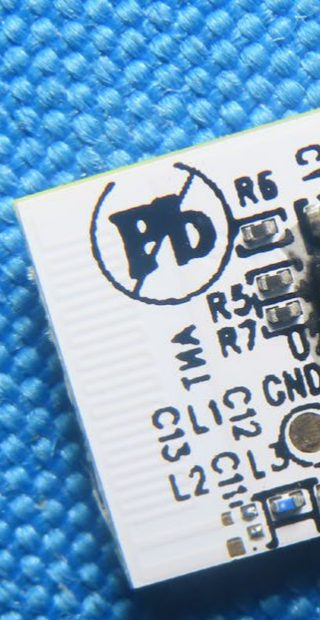{ width="120" loading=lazy }](../assets/images/fcc/parts/dg-09.jpg){ .glightbox data-title="DG-09: FCC ID 2BQ4V0825DG, Internal Photos, page 5, lower photo (antenna end with meander trace and ANT label)" } | `ANT`, end opposite the USB fingers (under the plastic cap) | RF0401A | Boen (Dongguan Boen Intelligent Technology Co., Ltd.) | 2.4 GHz PCB antenna, 10 mm long, connector N/A; filed gain 3.11 dBi = measured gain at 2480 MHz (28.18 % efficiency); 0.91-3.70 dBi and 17.8-31.6 % over 2400-2500 MHz; uncertainty 1.17 dB | Silkscreen `ANT`; report 'BOEN RF0401A PCB N/A 3.11' [clear] | DG RF p10; DG OTA p1, p2, p8, p13; DG IP p5 | DOC; confirmed | OTA report BTL-OTA-1-2506C290 R00, tested 2025-07-14. The DG IP p4 'Antenna' callout arrow lands on a USB finger (probably misplaced). The SAR report's drawing puts the single antenna at the far end of the cap (DG-19). |
| DG-10 | [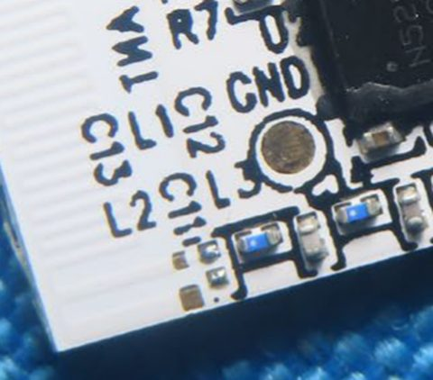{ width="120" loading=lazy }](../assets/images/fcc/parts/dg-10.jpg){ .glightbox data-title="DG-10: FCC ID 2BQ4V0825DG, Internal Photos, page 5, lower photo" } | RF matching network | `L1`-`L3`, `C11`-`C13`, unmarked 0402 | not identified | Pi/LC match between the SoC and the antenna (INFERRED) | Refs [clear] | DG IP p5 | DOC; INFERRED (role); confirmed | - |
| DG-11 | [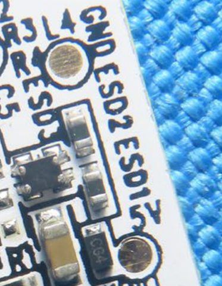{ width="120" loading=lazy }](../assets/images/fcc/parts/dg-11.jpg){ .glightbox data-title="DG-11: FCC ID 2BQ4V0825DG, Internal Photos, page 5, lower photo" } | `ESD1`, `ESD2` at the USB end | 2-terminal 0402 parts, unmarked | not identified | ESD on the USB lines (INFERRED) | Refs [clear] | DG IP p5 | DOC; INFERRED (role); confirmed | The adjacent 4-lead `ESD3` part is U-DG-11b. |
| DG-13 | [{ width="120" loading=lazy }](../assets/images/fcc/boards/dongle-board-back.jpg){ .glightbox data-title="DG-13: no crop of its own; Speedlink dongle board, back (nRF52840 U1, antenna end, test pads) (FCC ID 2BQ4V0825DG, Internal Photos, page 5)" } | Passives | chip resistors and MLCCs, unmarked | not identified | Decoupling and load capacitors (C15/C16 by Y1) | `R1`, `R3`-`R7`; `C1`, `C2`, `C3`, `C5`, `C8`-`C10`, `C15`, `C16`, `C18`-`C21` [mostly clear] | DG IP p4, p5 | DOC; confirmed | - |
| DG-14 | [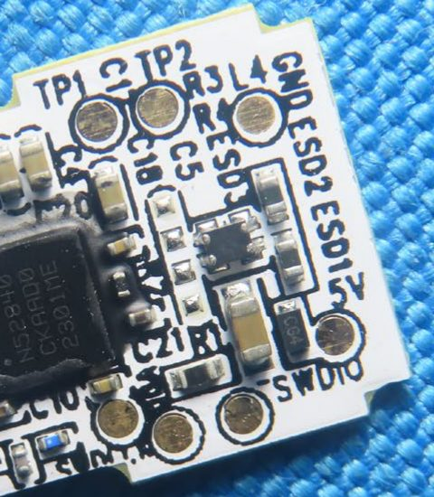{ width="120" loading=lazy }](../assets/images/fcc/parts/dg-14.jpg){ .glightbox data-title="DG-14: FCC ID 2BQ4V0825DG, Internal Photos, page 5, lower photo" } | Test pads, back side | 8 round pads about 1 mm | - | SWD, power and test access | `TP1`, `TP2`, `GND` x2, `5V`, `SWDIO` [clear]; two more cut by the board edge, fragment `SW…` (SWCLK expected, INFERRED) | DG IP p5 | DOC; confirmed | - |
| DG-15 | [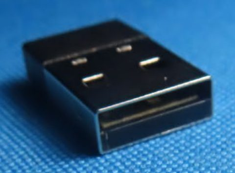{ width="120" loading=lazy }](../assets/images/fcc/parts/dg-15.jpg){ .glightbox data-title="DG-15: FCC ID 2BQ4V0825DG, External Photos, page 3, upper photo (plug end of the closed dongle)" } | USB-A plug and housing | 4 gold edge fingers (USB-A pitch) in a metal USB-A shell with a dark rear cap | - | Nano-class USB-A receiver, about 20-21 mm overall, about 11 mm proud of the host (INFERRED) | Shell with latch windows; no text [clear] | DG IP p4, p5; DG OTA p1; CRR IP7 p44, p45; DG EP p2-p3 | DOC; INFERRED (sizes); confirmed | - |
| DG-16 | [{ width="120" loading=lazy }](../assets/images/fcc/boards/dongle-board-back.jpg){ .glightbox data-title="DG-16: no crop of its own; Speedlink dongle board, back (nRF52840 U1, antenna end, test pads) (FCC ID 2BQ4V0825DG, Internal Photos, page 5)" } | Absent parts (both faces) | none | - | No external flash, USB bridge, PA/LNA, battery or charger | Only one IC-class part (U1) on either face [clear] | DG IP p4, p5 | DOC (absence); INFERRED; confirmed | - |
| DG-18 | [{ width="120" loading=lazy }](../assets/images/fcc/boards/dongle-exterior.jpg){ .glightbox data-title="DG-18: no crop of its own; Speedlink dongle, closed (metal USB-A shell, black cap) (FCC ID 2BQ4V0825DG, External Photos, page 2)" } | Closed dongle exterior | no product marking | - | No FCC ID, model or product text on shell or cap; only a lab sample tag on the cap (value withheld) | [clear] | CRR IP7 p44, p45; DG OTA p1; DG EP p2-p3 | DOC (absence); confirmed | The dongle filing's own exterior photos (DG EP p2-p3) show no FCC ID, model or logo anywhere, only a lab tag. |
| DG-19 | [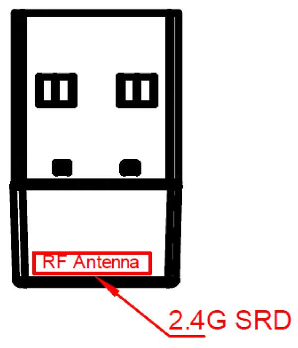{ width="120" loading=lazy }](../assets/images/fcc/parts/dg-19.jpg){ .glightbox data-title="DG-19: FCC ID 2BQ4V0825DG, SAR report, page 22, antenna-location figure (lab drawing with a red RF Antenna callout)" } | Antenna position | - | - | Drawing of the dongle: the plug end with two double-slot windows and two dimples, then the cap; 'RF Antenna' at the far end of the cap; 'The EUT only has one antenna and does not have synchronous transmission function' | [clear] | DG SAR p22, p27 | DOC; new (2026-09-23 exhibits) (one extraction pass, no blind re-read) | - |

### Naya Tune main board (ring PCB, `Tune_MB_20250227_V09`)

One sample, photographed once: CRL p17-p26 = CRR p14-p23 (same JPEG files).

<!-- fcc-images:start -->

<figure markdown="span">
  { width="640" loading=lazy }
  <figcaption>Tune main board (ring), component side, with the Qi coil ferrite. FCC ID 2BQ4V0825CRL, Internal Photos 3, page 19, lower photo.</figcaption>
</figure>

<figure markdown="span">
  { width="640" loading=lazy }
  <figcaption>Tune main board (ring), contact side, with the Qi coil wired on. FCC ID 2BQ4V0825CRL, Internal Photos 3, page 19, upper photo. Identifying marks removed.</figcaption>
</figure>

<!-- fcc-images:end -->

| ID | Image | Location | Part | Maker | Function | Marking as read | Source | Basis | Notes |
|---|---|---|---|---|---|---|---|---|---|
| TUM-03 | [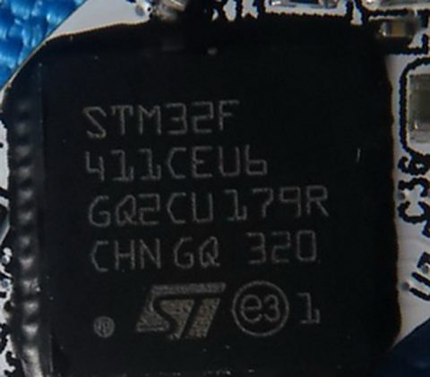{ width="120" loading=lazy }](../assets/images/fcc/parts/tum-03.jpg){ .glightbox data-title="TUM-03: FCC ID 2BQ4V0825CRL, Internal Photos 3, page 20, upper photo (= CRR IP2 p17), rotated upright" } | MCU (refdes not legible beside the chip; `U1` per an earlier reading) | STM32F411CEU6 (UFQFPN48, 7 x 7 mm) | STMicroelectronics | Module MCU: Cortex-M4F 100 MHz, 512 KB flash, 128 KB RAM, USB OTG FS | `STM32F` / `411CEU6` / `GQ2CU179R` / `CHN GQ 320`, ST logo, `e3`, `1` [clear] | CRL IP3 p19-p20 = CRR IP2 p16-p17 | DOC; INFERRED (`320` = 2023 week 20); confirmed | - |
| TUM-04 | [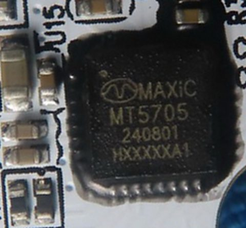{ width="120" loading=lazy }](../assets/images/fcc/parts/tum-04.jpg){ .glightbox data-title="TUM-04: FCC ID 2BQ4V0825CRL, Internal Photos 3, page 20, lower photo (= CRR IP2 p17), rotated; U15 label at left" } | `U15` | MT5705 | Maxic Technology | Qi (WPC 1.2.4 BPP) 5 W wireless-power receiver SoC, QFN32 4 x 4 mm, Cortex-M0, I2C slave | `MAXiC` / `MT5705` / `240801` / `HXXXXA1` [clear; line 4 is a printed lot code] | CRL IP3 p19-p20 = CRR IP2 p16-p17 | DOC; confirmed | `QI_?X_SCL`/`QI_?X_SDA` pads give the MCU an I2C link to it. |
| TUM-05 | [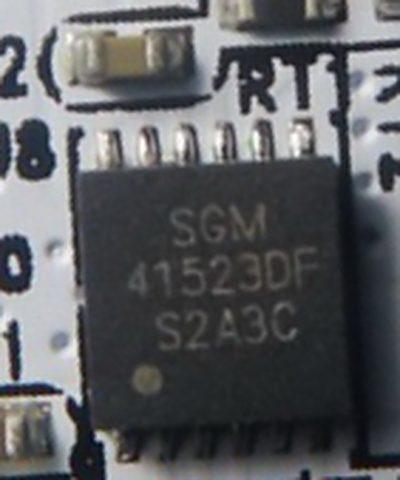{ width="120" loading=lazy }](../assets/images/fcc/parts/tum-05.jpg){ .glightbox data-title="TUM-05: FCC ID 2BQ4V0825CRL, Internal Photos 3, page 21 (= CRR IP3 p18), rotated upright" } | `U8` | SGM41523 (base variant; ordering code SGM41523YTDF12G/TR) | SG Micro | 2.5 A standalone switch-mode single-cell Li-ion charger, TDFN-3x3-12L, 1.33 MHz, no I2C, JEITA, TS/NTC input | `SGM` / `41523DF` / `S2A3C` [clear] | CRL IP3 p20-p21 = CRR IP2 p17; CRR IP3 p18 | DOC (marking matches the datasheet marking table); confirmed | - |
| TUM-06 | [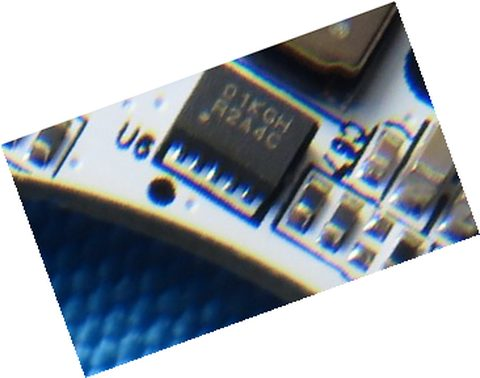{ width="120" loading=lazy }](../assets/images/fcc/parts/tum-06.jpg){ .glightbox data-title="TUM-06: FCC ID 2BQ4V0825CRL, Internal Photos 3, page 20, upper photo, bottom-left corner (= CRR IP2 p17), rotated" } | `U6`, beside an `R47` inductor | SGM62117 (SGM62117XTGH10G/TR) | SG Micro | Synchronous 4-switch buck-boost converter, 2.2-5.5 V in, 1.8-5.2 V out, 2 A, TDFN-3x2-10L | `01KGH` (first glyph consistent with `0`) / `H2A4C` or `?2A4C` [line 1 clear; line 2 partial] | CRL IP3 p19-p20 = CRR IP2 p16-p17 | DOC (datasheet marking `01KGH`); INFERRED (role); confirmed (Upgraded from 'probable' to a marking match) | Role (3.3 V rail from the cell, or 5 V toward the dock) INFERRED. |
| TUM-09 | [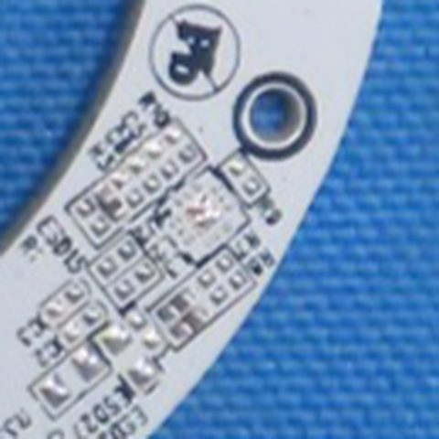{ width="120" loading=lazy }](../assets/images/fcc/parts/tum-09.jpg){ .glightbox data-title="TUM-09: FCC ID 2BQ4V0825CRL, Internal Photos 3, page 19, lower photo (= CRR IP2 p16); empty square land at the center" } | Unpopulated IC footprint ringed by `ESD15`, `ESD24`, `ESD27`, `R8`, `R9` | none (DNP) | - | Do-not-populate option | Empty square land [clear] | CRL IP3 p19 = CRR IP2 p16 | DOC; confirmed | - |
| TUM-10 | [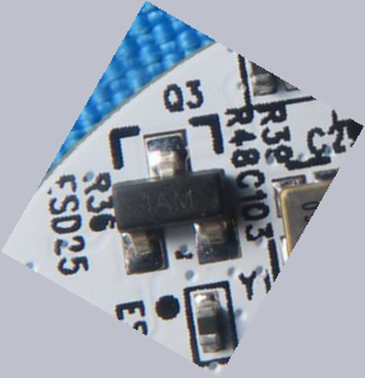{ width="120" loading=lazy }](../assets/images/fcc/parts/tum-10.jpg){ .glightbox data-title="TUM-10: FCC ID 2BQ4V0825CRL, Internal Photos 3, page 20, upper photo (= CRR IP2 p17), rotated upright" } | `Q3` | MMBT3904 class NPN, SOT-23 | multi-source | Small-signal NPN (40 V, 200 mA) | `1AM` [clear] | CRL IP3 p20 = CRR IP2 p17 | DOC (marking); INFERRED (code-to-part); confirmed | Q1/Q2 are U-TUM-10b. |
| TUM-11 | [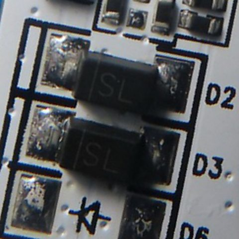{ width="120" loading=lazy }](../assets/images/fcc/parts/tum-11.jpg){ .glightbox data-title="TUM-11: FCC ID 2BQ4V0825CRL, Internal Photos 3, page 21 (= CRR IP3 p18), rotated upright" } | `D2`, `D3` (`D6` footprint unpopulated) | B5819W class Schottky, 40 V 1 A, SOD-123 | multi-source | OR-ing of the Qi and dock inputs (INFERRED) | `SL` on both [clear] | CRL IP3 p21 = CRR IP3 p18 | DOC (marking); INFERRED (code-to-part, role); confirmed | - |
| TUM-12 | [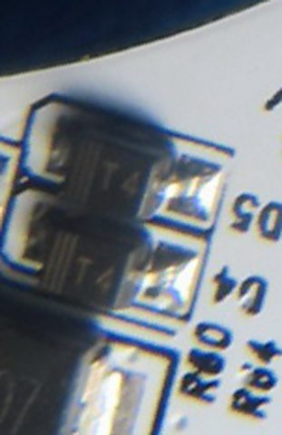{ width="120" loading=lazy }](../assets/images/fcc/parts/tum-12.jpg){ .glightbox data-title="TUM-12: FCC ID 2BQ4V0825CRL, Internal Photos 3, page 21 (= CRR IP3 p18), rotated upright" } | `D4`, `D5` | 1N4148W class switching diode, SOD-123 | multi-source | Switching diode | `T4` with cathode bar [clear in two readings] | CRL IP3 p21 = CRR IP3 p18 | DOC; INFERRED (code-to-part); confirmed | - |
| TUM-14 | [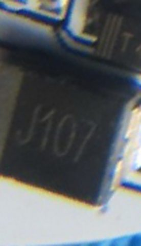{ width="120" loading=lazy }](../assets/images/fcc/parts/tum-14.jpg){ .glightbox data-title="TUM-14: FCC ID 2BQ4V0825CRL, Internal Photos 3, page 21 (= CRR IP3 p18), rotated upright" } | Polarised bulk capacitor | 100 uF tantalum/polymer (`107`; `J` is the common 6.3 V tantalum voltage code, INFERRED) | not identified | Bulk capacitance | `J107`, `+` on the silkscreen, end band [clear after rotation] | CRL IP3 p19, p21 = CRR IP2 p16; CRR IP3 p18 | DOC; INFERRED (voltage code); corrected (Full marking read (was `?07`)) | - |
| TUM-15 | [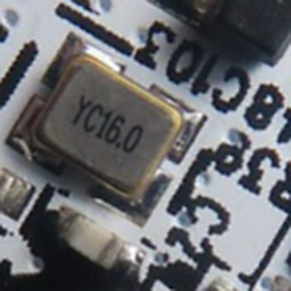{ width="120" loading=lazy }](../assets/images/fcc/parts/tum-15.jpg){ .glightbox data-title="TUM-15: FCC ID 2BQ4V0825CRL, Internal Photos 3, page 20, upper photo (= CRR IP2 p17), rotated upright" } | `Y1` | 16.000 MHz crystal, 4-pad metal lid | not identified | STM32 HSE | `YC16.0` [clear] | CRL IP3 p20 = CRR IP2 p17 | DOC; confirmed | - |
| TUM-16 | [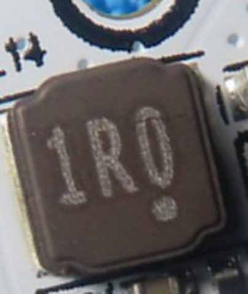{ width="120" loading=lazy }](../assets/images/fcc/parts/tum-16.jpg){ .glightbox data-title="TUM-16: FCC ID 2BQ4V0825CRL, Internal Photos 3, page 21 (= CRR IP3 p18): L14 1R0 only; the R47 inductor by U6 is not in this crop" } | Inductors `L14`, the inductor by U6, `L7`, `L8`, `L11`, `L13` | 1.0 uH (`1R0`) and 0.47 uH (`R47`) SMD inductors | not identified | Charger switch-node inductor (L14, INFERRED) and the buck-boost inductor | `L14` `1R0` [clear]; by U6 `R47` [clear, not `4R7`]; other refs only | CRL IP3 p19, p21 = CRR IP2 p16; CRR IP3 p18 | DOC; confirmed (`R47` settled over the `4R7` alternative) | - |
| TUM-17 | [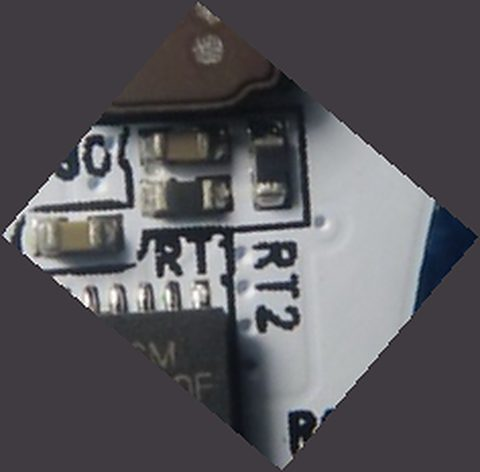{ width="120" loading=lazy }](../assets/images/fcc/parts/tum-17.jpg){ .glightbox data-title="TUM-17: FCC ID 2BQ4V0825CRL, Internal Photos 3, page 21 (= CRR IP3 p18), rotated" } | `RT1`, `RT2` beside U8 | 0402 resistors | - | TS-pin divider for the pack NTC (the SGM41523 datasheet names them RT1/RT2; role INFERRED) | Refs [clear] | CRL IP3 p21 = CRR IP3 p18 | DOC; INFERRED (role); confirmed | - |
| TUM-18 | [{ width="120" loading=lazy }](../assets/images/fcc/boards/tune-main-board-front.jpg){ .glightbox data-title="TUM-18: no crop of its own; Tune main board (ring), component side, with the Qi coil ferrite (FCC ID 2BQ4V0825CRL, Internal Photos 3, page 19)" } | ESD and passives | unmarked ESD parts and passives | - | Line protection; highest refs seen: R95, C103, D40, ESD29, U15, L14, Q3, TVS1, RT2, Y1, J6 | `ESD1`-`ESD3`, `ESD14`, `ESD15`, `ESD18`, `ESD21`, `ESD23`-`ESD27`, `ESD29`; `D1`, `D7`, `D38`, `D40` [clear] | CRL IP3 p19-p21 = CRR IP2 p16-p17; CRR IP3 p18 | DOC; confirmed | - |
| TUM-19 | [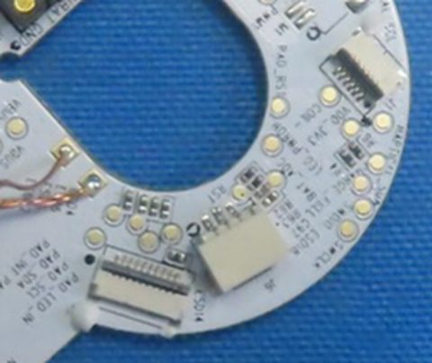{ width="120" loading=lazy }](../assets/images/fcc/parts/tum-19.jpg){ .glightbox data-title="TUM-19: FCC ID 2BQ4V0825CRL, Internal Photos 3, page 19, upper photo (= CRR IP2 p16): FPC receptacle, J6 header, J1" } | Board connectors | FPC and wire-to-board connectors, unmarked | not identified | FPC about 10 contacts by the `PAD_*` labels (to the touch disc); 2 flip-lock ZIF on the inner island; `J1` small FPC about 6-8 contacts by `HAPTICAL_SDA` (haptic assembly, INFERRED); `J6` white 4-contact header | [clear presence; way counts are estimates] | CRL IP2 p18; CRL IP3 p19 = CRR IP2 p15-p16 | DOC; INFERRED (destinations); confirmed | Tan tape covers several connectors. |
| TUM-20 | [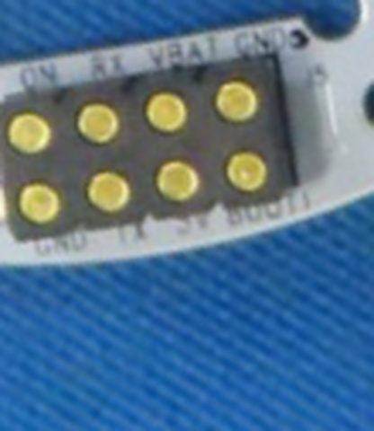{ width="120" loading=lazy }](../assets/images/fcc/parts/tum-20.jpg){ .glightbox data-title="TUM-20: FCC ID 2BQ4V0825CRL, Internal Photos 3, page 19, upper photo (= CRR IP2 p16), rotated so the pad labels read" } | `J5`, internal dock contact block (module side) | 8-contact block, staggered 2 x 4 (1-2-2-2-1 zigzag), through-hole | not identified | Tune dock contacts | 8 gold contacts; labels `GND` `VBAT` `RX` `ON` / `GND` `TX` `?V` `BOOT1`; two paler round pads beside the block (U-TUM-20b) [clear count] | CRL IP2 p18; CRL IP3 p19 = CRR IP2 p15-p16 | DOC; confirmed | Corrects an earlier reading of 12 pads (2 x 6). |
| TUM-21 | [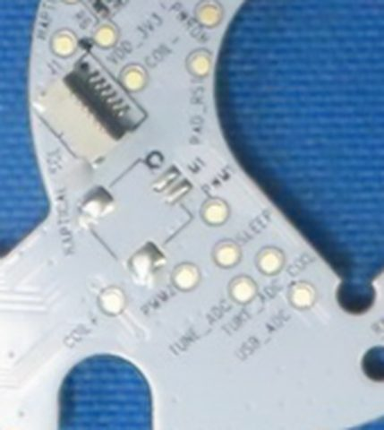{ width="120" loading=lazy }](../assets/images/fcc/parts/tum-21.jpg){ .glightbox data-title="TUM-21: FCC ID 2BQ4V0825CRL, Internal Photos 3, page 19, upper photo (= CRR IP2 p16), rotated 180" } | Actuator drive pads and footprint | pads, `M1` 2-pad boxed footprint | - | Motor/coil drive (H-bridge style IN1/IN2/nSLEEP set, INFERRED), coil sensing, an I2C device inside the dial assembly | `M1`, `PWM1` (partial), `PWM2`, `SLEEP`, `COIL+`, `COIL-`, `TUNE_ADC`, `TUNE_ADC_COIL`, `HAPTICAL_SCL`, `HAPTICAL_SDA` (partial) [clear except where marked] | CRL IP3 p19 = CRR IP2 p16 | DOC; INFERRED (roles); confirmed | Consistent with a force-feedback dial (INFERRED). |
| TUM-22 | [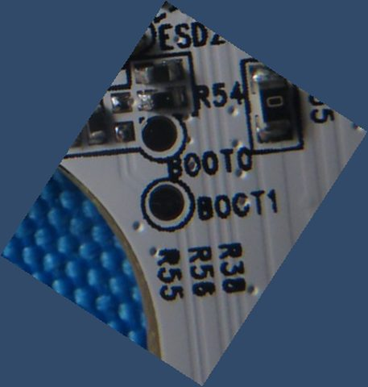{ width="120" loading=lazy }](../assets/images/fcc/parts/tum-22.jpg){ .glightbox data-title="TUM-22: FCC ID 2BQ4V0825CRL, Internal Photos 3, page 20, upper photo (= CRR IP2 p17): BOOT0/BOOT1 pads; the partial SWD labels on the back are not in this crop" } | Debug and boot pads | test pads | - | STM32 SWD and boot straps; `BOOT1` also reaches the dock block | `BOOT0`, `BOOT1` (beside the MCU), `SWDIO`, `SWCL…`, `RST` [clear to partial] | CRL IP3 p19-p20 = CRR IP2 p16-p17 | DOC; confirmed | - |
| TUM-23 | [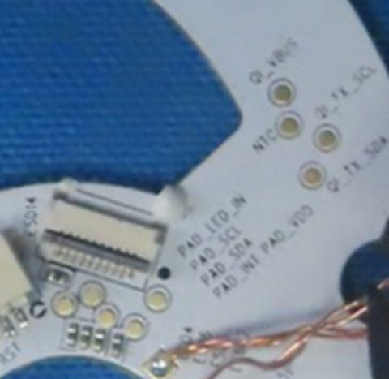{ width="120" loading=lazy }](../assets/images/fcc/parts/tum-23.jpg){ .glightbox data-title="TUM-23: FCC ID 2BQ4V0825CRL, Internal Photos 3, page 19, upper photo (= CRR IP2 p16), rotated 180" } | Other net pads | test pads | - | Touch-disc I2C + INT + RST + LED data; Qi and charger status; ADC sense | `PAD_LED_IN`, `PAD_SCL`, `PAD_SDA`, `PAD_INT`, `PAD_VDD`, `PAD_RST`; `QI_VBUS`, `NTC`, `QI_?X_SCL`, `QI_?X_SDA`; `VBUS` x2; `USB_ADC`, `BAT_ADC`; `VDD_3V3`, `LED_PWRON`, `CHARGE_FULL` [clear to partial] | CRL IP3 p19 = CRR IP2 p16 | DOC; confirmed (Subset re-read; rest corroborated by two readings) | - |
| TUM-24 | [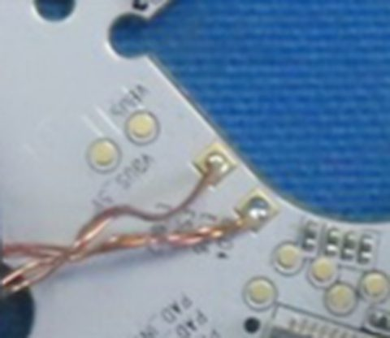{ width="120" loading=lazy }](../assets/images/fcc/parts/tum-24.jpg){ .glightbox data-title="TUM-24: FCC ID 2BQ4V0825CRL, Internal Photos 3, page 19, upper photo (= CRR IP2 p16)" } | Qi coil landing | two square pads | - | Qi coil input (coil: TUX-18) | Twisted enamelled leads soldered on [clear] | CRL IP3 p19 = CRR IP2 p16 | DOC; confirmed | - |

### Naya Tune touch/LED disc, dial, enclosure

Same shared photos as the Tune main board.

<!-- fcc-images:start -->

<figure markdown="span">
  { width="640" loading=lazy }
  <figcaption>Tune main board (ring), contact side, with the Qi coil wired on. FCC ID 2BQ4V0825CRL, Internal Photos 3, page 19, upper photo. Identifying marks removed.</figcaption>
</figure>

<figure markdown="span">
  { width="640" loading=lazy }
  <figcaption>Tune touch/LED disc Tune_touch 20240926 V00. FCC ID 2BQ4V0825CRL, Internal Photos 4, page 23, upper (only photo). Identifying marks removed.</figcaption>
</figure>

<figure markdown="span">
  { width="640" loading=lazy }
  <figcaption>Tune T-shaped sub-board, two views side by side (U-TUX-16). FCC ID 2BQ4V0825CRL, Internal Photos 4, page 24, upper (left) and lower (right), composited.</figcaption>
</figure>

<figure markdown="span">
  { width="640" loading=lazy }
  <figcaption>Tune base underside: dock pads, marks, base label. FCC ID 2BQ4V0825CRL, Internal Photos 2, page 17, lower photo. Identifying marks removed.</figcaption>
</figure>

<!-- fcc-images:end -->

| ID | Image | Location | Part | Maker | Function | Marking as read | Source | Basis | Notes |
|---|---|---|---|---|---|---|---|---|---|
| TUX-04 | [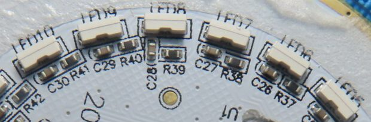{ width="120" loading=lazy }](../assets/images/fcc/parts/tux-04.jpg){ .glightbox data-title="TUX-04: FCC ID 2BQ4V0825CRL, Internal Photos 4, page 23, upper photo (= CRR IP3 p20): LED6 to LED11 with their C/R pairs" } | LED ring on the touch disc | 24 side-view RGB LEDs, white bodies, unmarked (4020 class INFERRED) | not identified | Addressable LED ring on one data line (`PAD_LED_IN`), no driver IC; per-LED passives C(20+n), R(31+n) | `LED1`-`LED24`; `LED1` `C21` `R32`, `LED2` `C22` `R33` (so `C21`-`C44`, `R32`-`R55`) [clear] | CRL IP3 p22; CRL IP4 p23 = CRR IP3 p19-p20 | DOC; INFERRED (class); confirmed | Host side is open (OQ-08): MEASURED 2026-09-08, about 9 indices (88-96) lit with a Tune docked left; MEASURED 2026-09-19 on a donor Tune with module firmware 2.1.2, 88-93 took the host color and 94-111 stayed bright white. |
| TUX-07 | [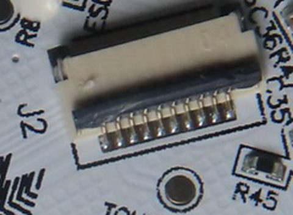{ width="120" loading=lazy }](../assets/images/fcc/parts/tux-07.jpg){ .glightbox data-title="TUX-07: FCC ID 2BQ4V0825CRL, Internal Photos 4, page 23, upper photo (= CRR IP3 p20), rotated 180" } | `J2` on the disc | 10-contact flip-lock FPC receptacle, unmarked | not identified | Flex to the main board | 10 contacts (9 clear + 1 at the edge) [clear count] | CRL IP4 p23 = CRR IP3 p20 | DOC; confirmed | Corrects an earlier '~15-way' estimate. |
| TUX-08 | [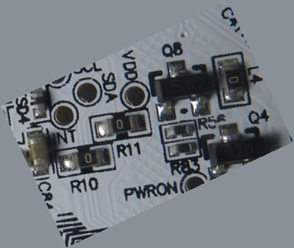{ width="120" loading=lazy }](../assets/images/fcc/parts/tux-08.jpg){ .glightbox data-title="TUX-08: FCC ID 2BQ4V0825CRL, Internal Photos 4, page 23, upper photo (= CRR IP3 p20), rotated" } | `L4`, `R10`, `R11` on the disc | 0-ohm links | - | Jumpers | Each marked `0` [clear] | CRL IP4 p23 = CRR IP3 p20 | DOC; confirmed | Q4/Q8 on the same board: U-TUX-08b. |
| TUX-09 | [{ width="120" loading=lazy }](../assets/images/fcc/boards/tune-touch-disc.jpg){ .glightbox data-title="TUX-09: no crop of its own; Tune touch/LED disc Tune_touch 20240926 V00 (FCC ID 2BQ4V0825CRL, Internal Photos 4, page 23)" } | Disc ESD and passives | unmarked ESD parts and passives | - | Line protection around U1 | `ESD1`-`ESD7`, `ESD13`; `R1`-`R11`, `R63` (partial); `C1`-`C4`, `C83`, `C84` [clear] | CRL IP4 p23 = CRR IP3 p20 | DOC; confirmed | - |
| TUX-10 | [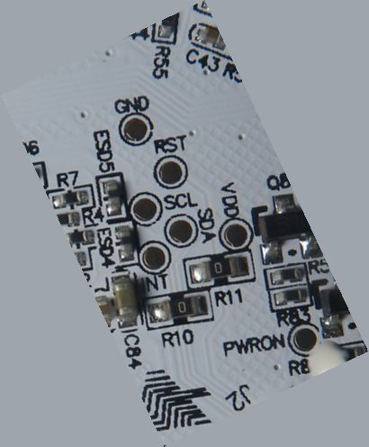{ width="120" loading=lazy }](../assets/images/fcc/parts/tux-10.jpg){ .glightbox data-title="TUX-10: FCC ID 2BQ4V0825CRL, Internal Photos 4, page 23, upper photo (= CRR IP3 p20), rotated" } | Disc host and power pads | test pads | - | I2C host interface (VDD, GND, SDA, SCL, RST, INT), `IN`, and two switched rails gated by `PWRON` | `VDD`, `GND`, `SDA`, `SCL`, `RST`, `INT`, `IN`, `PWRON`, `TOUCH-VDD`, `LED-VDD` [clear; `IN` lower legibility] | CRL IP4 p23 = CRR IP3 p20 | DOC; confirmed | - |
| TUX-11 | [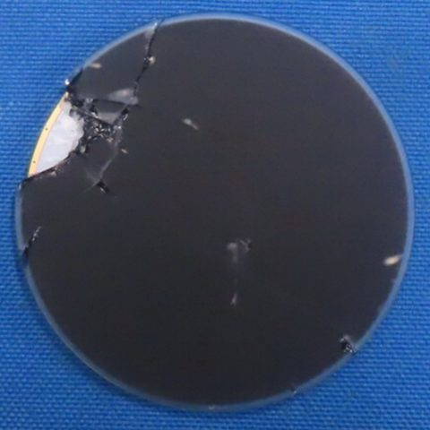{ width="120" loading=lazy }](../assets/images/fcc/parts/tux-11.jpg){ .glightbox data-title="TUX-11: FCC ID 2BQ4V0825CRL, Internal Photos 3, page 22, lower photo (= CRR IP3 p19)" } | Touch cover | black glass disc about 45 mm, unmarked | - | Touch surface over the disc (marketing 'In-Built Touch Surface', INFERRED naming) | No marking; cracked edge from the teardown; about 45 mm against the tape in frame [clear] | CRL IP3 p22 = CRR IP3 p19 | DOC; confirmed | - |
| TUX-12 | [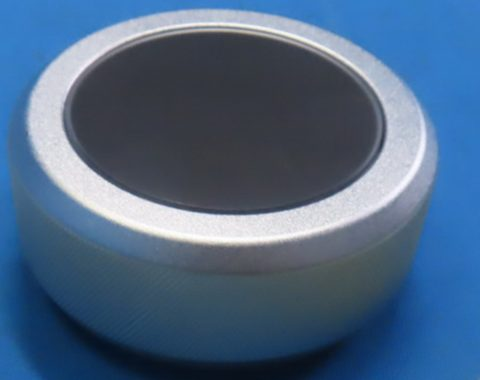{ width="120" loading=lazy }](../assets/images/fcc/parts/tux-12.jpg){ .glightbox data-title="TUX-12: FCC ID 2BQ4V0825CRL, Internal Photos 2, page 17, upper photo (= CRR IP2 p14)" } | Dial ring | silver knurled ring, unmarked | - | Dial ring; marketed as CNC-machined aluminum, soft-knurled | No marking [clear] | CRL IP2 p17 = CRR IP2 p14 | DOC (photo; naya.tech marketing); confirmed | - |
| TUX-18 | [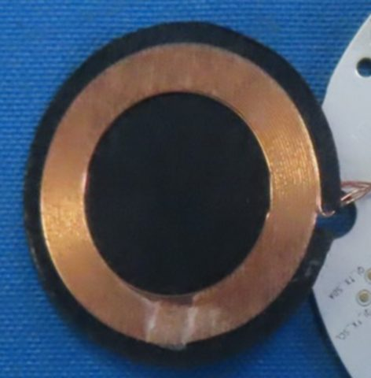{ width="120" loading=lazy }](../assets/images/fcc/parts/tux-18.jpg){ .glightbox data-title="TUX-18: FCC ID 2BQ4V0825CRL, Internal Photos 3, page 19, upper photo (= CRR IP2 p16)" } | Qi receive coil | flat copper spiral on black ferrite, about 30-31 mm, unmarked | not identified | Qi coil feeding U15 (MT5705) | No marking; enamelled leads to TUM-24 [clear] | CRL IP2 p18; CRL IP3 p19 = CRR IP2 p15-p16 | DOC; INFERRED (size from the extraction pass); confirmed | - |
| TUX-19 | [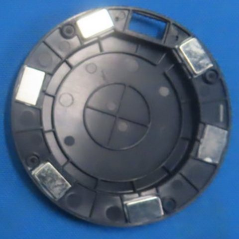{ width="120" loading=lazy }](../assets/images/fcc/parts/tux-19.jpg){ .glightbox data-title="TUX-19: FCC ID 2BQ4V0825CRL, Internal Photos 2, page 18, upper photo (= CRR IP2 p15)" } | Base cover | black molded cover about 64 mm; 6 silver rectangular blocks; 8 flat gold pads (staggered 2 x 4) | - | Dock magnets or steel strike plates (INFERRED); module-side external dock pads | 6 blocks in rim pockets; 8 pads in a recessed block, 1-2-2-2-1 stagger [clear counts] | CRL IP2 p17-p18 = CRR IP2 p14-p15 | DOC; INFERRED (magnet vs steel); confirmed | - |
| TUX-21 | [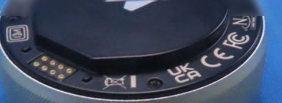{ width="120" loading=lazy }](../assets/images/fcc/parts/tux-21.jpg){ .glightbox data-title="TUX-21: FCC ID 2BQ4V0825CRL, Internal Photos 2, page 17, lower photo (= CRR IP2 p14)" } | Base marks and fasteners | compliance marks | - | Multi-market marks on the base | `CE`, FCC logo, `UK`/`CA`, WEEE bin [clear]; `N` mark, `VCI` box, triangle, circle-with-bar [shape only]; at least 3-4 screws | CRL IP2 p17 = CRR IP2 p14 | DOC; confirmed | - |
| TUX-22 | [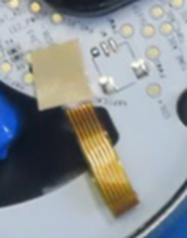{ width="120" loading=lazy }](../assets/images/fcc/parts/tux-22.jpg){ .glightbox data-title="TUX-22: FCC ID 2BQ4V0825CRL, Internal Photos 2, page 18, upper photo (= CRR IP2 p15)" } | Internal flex | amber polyimide flex, about 7-8 traces | - | Main board to the touch/LED disc | [clear] | CRL IP2 p18 = CRR IP2 p15 | DOC; confirmed | - |

### Naya Touch main board (`Touch_MB_20250227_V10`)

One sample: CRL p27-p36 = CRR p24-p33 (same JPEG files).

<!-- fcc-images:start -->

<figure markdown="span">
  { width="640" loading=lazy }
  <figcaption>Touch main board, MCU side (close-up). FCC ID 2BQ4V0825CRL, Internal Photos 5, page 31, lower photo. Identifying marks removed.</figcaption>
</figure>

<!-- fcc-images:end -->

| ID | Image | Location | Part | Maker | Function | Marking as read | Source | Basis | Notes |
|---|---|---|---|---|---|---|---|---|---|
| TCM-03 | [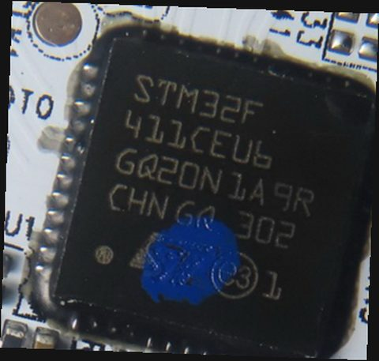{ width="120" loading=lazy }](../assets/images/fcc/parts/tcm-03.jpg){ .glightbox data-title="TCM-03: FCC ID 2BQ4V0825CRL, Internal Photos 5, page 31, lower photo (= CRR IP5 p28 lower)" } | `U1` | STM32F411CEU6 (UFQFPN48) | STMicroelectronics | Module MCU | `STM32F` / `411CEU6` / `GQ20N 1A9R` / `CHN GQ 302`, ST logo, `e3`, `1` [clear]; 48 leads counted | CRL IP5 p31 = CRR IP5 p28 (label-covered on CRL IP5 p29-p30 = CRR IP4 p26-p27) | DOC; confirmed | - |
| TCM-05 | [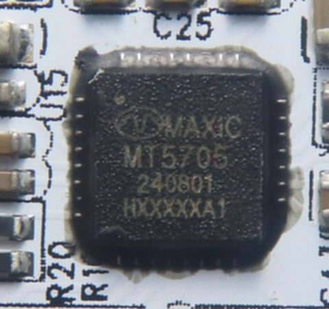{ width="120" loading=lazy }](../assets/images/fcc/parts/tcm-05.jpg){ .glightbox data-title="TCM-05: FCC ID 2BQ4V0825CRL, Internal Photos 5, page 31, upper photo (= CRR IP5 p28 upper)" } | Qi receiver (refdes read `U5` or `U15`) | MT5705 | Maxic Technology | Qi 5 W receiver | `MAXiC` / `MT5705` / `240801` / `H…A1` [lines 1-3 clear; line 4 partial] | CRL IP5 p30-p31 = CRR IP4 p27; CRR IP5 p28 | DOC; confirmed | - |
| TCM-06 | [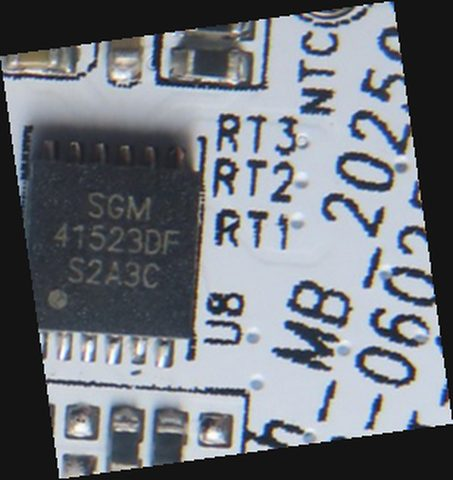{ width="120" loading=lazy }](../assets/images/fcc/parts/tcm-06.jpg){ .glightbox data-title="TCM-06: FCC ID 2BQ4V0825CRL, Internal Photos 5, page 31, lower photo (= CRR IP5 p28 lower)" } | `U8`, beside `R7`, `C18`, `C19`, `Q4`, `RT1`-`RT3` | SGM41523 (base variant) | SG Micro | Single-cell switch-mode charger, TDFN-3x3-12L (12 leads) | `SGM` / `41523DF` / `S2A3C` [clear] | CRL IP5 p30-p31 = CRR IP4 p27; CRR IP5 p28 | DOC; confirmed | - |
| TCM-09 | [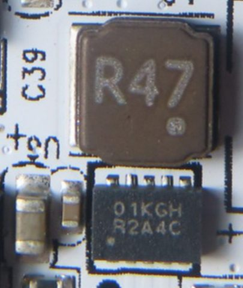{ width="120" loading=lazy }](../assets/images/fcc/parts/tcm-09.jpg){ .glightbox data-title="TCM-09: FCC ID 2BQ4V0825CRL, Internal Photos 5, page 31, upper photo (= CRR IP5 p28 upper)" } | `U3` (one reading `U5`), beside the `R47` inductor | SGM62117 | SG Micro | Buck-boost converter, TDFN-3x2-10L | `01KGH` / `R2A4C`, pin-1 dot [clear] | CRL IP5 p31 = CRR IP5 p28 | DOC (datasheet marking `01KGH`); confirmed | Role (3.3 V rail from the cell, or 5 V toward the dock) INFERRED. |
| TCM-10 | [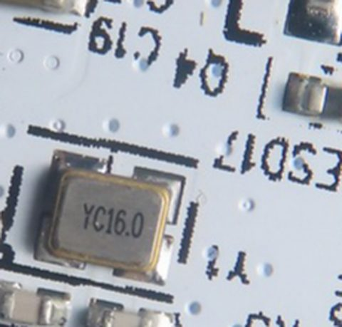{ width="120" loading=lazy }](../assets/images/fcc/parts/tcm-10.jpg){ .glightbox data-title="TCM-10: FCC ID 2BQ4V0825CRL, Internal Photos 5, page 31, lower photo (= CRR IP5 p28 lower)" } | `Y1` | 16.000 MHz crystal | not identified | STM32 HSE | `YC16.0` [clear] | CRL IP5 p31 = CRR IP5 p28 | DOC; confirmed | - |
| TCM-12 | [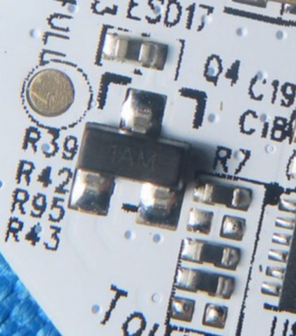{ width="120" loading=lazy }](../assets/images/fcc/parts/tcm-12.jpg){ .glightbox data-title="TCM-12: FCC ID 2BQ4V0825CRL, Internal Photos 5, page 31, lower photo (= CRR IP5 p28 lower)" } | `Q4` | MMBT3904 class NPN, SOT-23 | multi-source | Small-signal NPN | `1AM` [clear] | CRL IP5 p31 = CRR IP5 p28 | DOC; INFERRED (code-to-part); confirmed | - |
| TCM-13 | [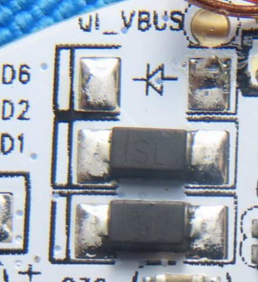{ width="120" loading=lazy }](../assets/images/fcc/parts/tcm-13.jpg){ .glightbox data-title="TCM-13: FCC ID 2BQ4V0825CRL, Internal Photos 5, page 31, upper photo (= CRR IP5 p28 upper)" } | `D1`, `D2` (`D6` unpopulated), near `QI_VBUS` | B5819W class Schottky, SOD-123FL | multi-source | Input OR-ing (INFERRED) | `SL` on both [clear] | CRL IP5 p31 = CRR IP5 p28 | DOC; INFERRED; confirmed | - |
| TCM-15 | [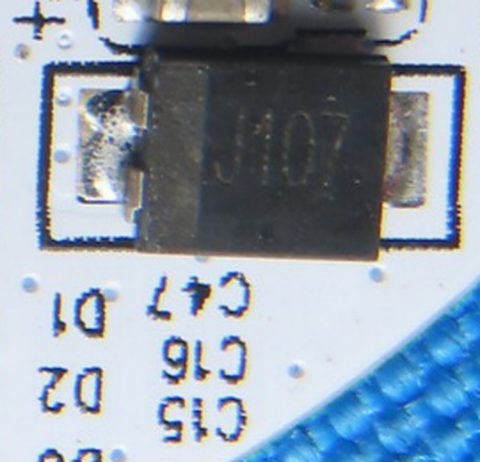{ width="120" loading=lazy }](../assets/images/fcc/parts/tcm-15.jpg){ .glightbox data-title="TCM-15: FCC ID 2BQ4V0825CRL, Internal Photos 5, page 31, upper photo (= CRR IP5 p28 upper)" } | Probably `C47`, below the `C47`/`D1` labels | 100 uF 6.3 V tantalum (EIA `J` = 6.3 V, `107` = 100 uF) | not identified | Bulk capacitance | `J107` [clear after 180° rotation] | CRL IP5 p31 = CRR IP5 p28 | DOC; INFERRED (code decode); confirmed | The nearby `+` silkscreen belongs to an adjacent unpopulated footprint. |
| TCM-16 | [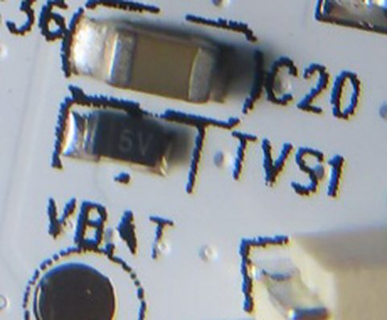{ width="120" loading=lazy }](../assets/images/fcc/parts/tcm-16.jpg){ .glightbox data-title="TCM-16: FCC ID 2BQ4V0825CRL, Internal Photos 5, page 31, lower photo (= CRR IP5 p28 lower)" } | `TVS1`, beside `VBAT`/`NTC` | 5 V TVS diode | not identified | Battery-line protection (INFERRED) | `5V` [clear] | CRL IP5 p31 = CRR IP5 p28 | DOC; confirmed | - |
| TCM-17 | [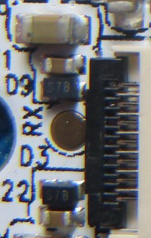{ width="120" loading=lazy }](../assets/images/fcc/parts/tcm-17.jpg){ .glightbox data-title="TCM-17: FCC ID 2BQ4V0825CRL, Internal Photos 5, page 31, upper photo (= CRR IP5 p28 upper)" } | `D3`, `D22`; `D72`, `D74` | `S78`: not identified; `T4`: 1N4148W class (INFERRED) | not identified | Small signal or protection diodes | `S78` on D3 and D22 [clear]; `T4` on D72 and D74 [clear] | CRL IP5 p31 = CRR IP5 p28 | DOC; corrected (`S78` settled over `S7B`) | - |
| TCM-18 | [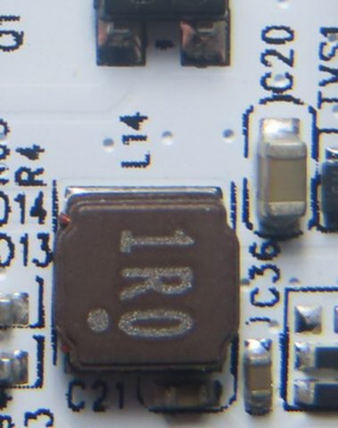{ width="120" loading=lazy }](../assets/images/fcc/parts/tcm-18.jpg){ .glightbox data-title="TCM-18: FCC ID 2BQ4V0825CRL, Internal Photos 5, page 31, upper photo (= CRR IP5 p28 upper)" } | Inductors | 1.0 uH (`1R0`, L14) and 0.47 uH (`R47`, `L2` per one reading) | not identified | Charger inductor (INFERRED) and buck-boost inductor | `1R0`, `R47` [clear]; `L1`, `L13` refs only | CRL IP5 p30-p31 = CRR IP4 p27; CRR IP5 p28 | DOC; confirmed | - |
| TCM-19 | [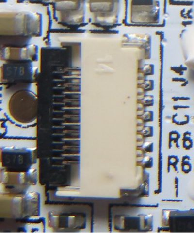{ width="120" loading=lazy }](../assets/images/fcc/parts/tcm-19.jpg){ .glightbox data-title="TCM-19: FCC ID 2BQ4V0825CRL, Internal Photos 5, page 31, upper photo (= CRR IP5 p28 upper)" } | `J4` | 14-position flip-lock FPC receptacle, about 0.3 mm pitch | not identified | Takes the pogo-board flex (TCX-11) | Molded `14` on the actuator; 13-14 contacts [clear] | CRL IP5 p30-p31 = CRR IP4 p27; CRR IP5 p28 | DOC; INFERRED (pitch); confirmed | Corrects an earlier '~24-way' estimate. |
| TCM-20 | [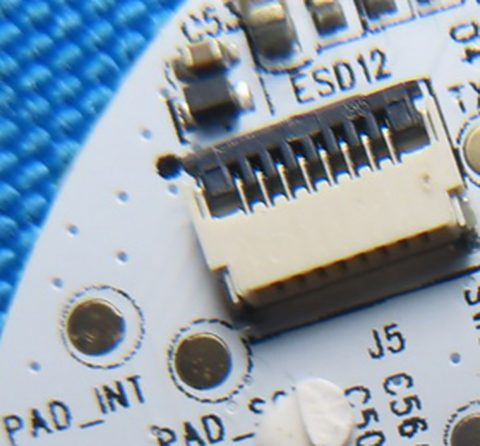{ width="120" loading=lazy }](../assets/images/fcc/parts/tcm-20.jpg){ .glightbox data-title="TCM-20: FCC ID 2BQ4V0825CRL, Internal Photos 5, page 30, upper photo (= CRR IP4 p27 upper)" } | `J5` | 8-position FPC receptacle, about 0.5 mm pitch | not identified | Takes the sensor board's 8-way `J1` tail (INFERRED) | 8 contacts [clear] | CRL IP5 p30-p31 = CRR IP4 p27; CRR IP5 p28 | DOC; INFERRED (pitch, mating); confirmed | Corrects an earlier '~10-way' estimate. |
| TCM-22 | [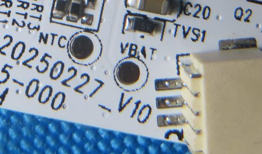{ width="120" loading=lazy }](../assets/images/fcc/parts/tcm-22.jpg){ .glightbox data-title="TCM-22: FCC ID 2BQ4V0825CRL, Internal Photos 5, page 31, lower photo (= CRR IP5 p28 lower)" } | `J3` battery header, `VBAT` and `NTC` pads beside | 3-position right-angle wire-to-board header, about 1.0 mm pitch | not identified (JST SH class not confirmed) | Battery connector (VBAT, GND, NTC INFERRED) | White housing, 3 contacts + 2 hold-down tabs; `1`, `2` on the silkscreen [clear count] | CRL IP5 p31 = CRR IP5 p28 | DOC; INFERRED (pitch, pinout); confirmed | - |
| TCM-23 | [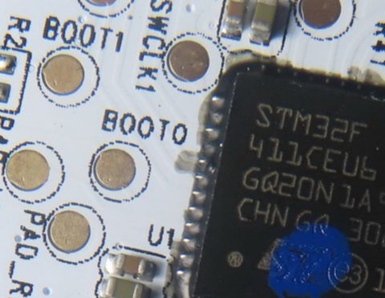{ width="120" loading=lazy }](../assets/images/fcc/parts/tcm-23.jpg){ .glightbox data-title="TCM-23: FCC ID 2BQ4V0825CRL, Internal Photos 5, page 31, lower photo (= CRR IP5 p28 lower)" } | Debug and boot pads | test pads | - | STM32 SWD and boot straps | `SWCLK1`, `SWDIO` (partly under glue), `BOOT0`, `BOOT1` [clear except where marked] | CRL IP5 p30-p31 = CRR IP4 p27; CRR IP5 p28 | DOC; confirmed | - |
| TCM-24 | [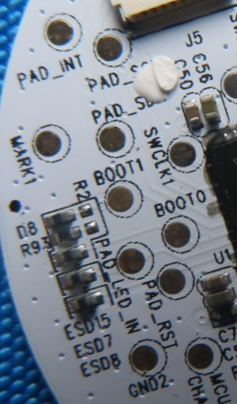{ width="120" loading=lazy }](../assets/images/fcc/parts/tcm-24.jpg){ .glightbox data-title="TCM-24: FCC ID 2BQ4V0825CRL, Internal Photos 5, page 30, upper photo (= CRR IP4 p27 upper)" } | Other net pads | test pads | - | Sensor-board I2C, MCU-to-Qi I2C, charger status, dock insertion sense (`INSERT`, INFERRED), UART | `PAD_INT`, `PAD_RST`, `PAD_LED_IN`, `PAD_SC…`, `PAD_SD…`, `PAD_VDD`, `LDO_ON`; `QI_RX_SDA`, `QI_RX_SCL`, `QI_VBUS`; `MCU_3V3`, `VDD_3V3`, `USB_ADC`, `BAT_ADC`, `VBUS`, `VBUS_5V`, `CHARGE_FULL`, `INSERT`, `NTC`, `VBAT`; `TX`, `RX`; `GND2`-`GND4`, `MARK1`, `MARK2` [clear to partial] | CRL IP5 p29-p31 = CRR IP4 p26-p27; CRR IP5 p28 | DOC; confirmed (Subset re-read; rest corroborated by two readings) | - |
| TCM-25 | [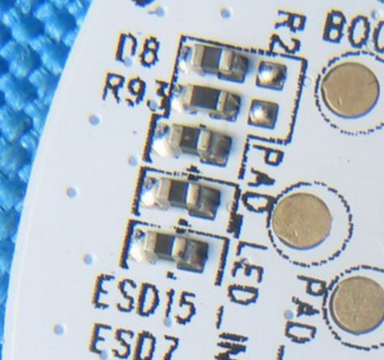{ width="120" loading=lazy }](../assets/images/fcc/parts/tcm-25.jpg){ .glightbox data-title="TCM-25: FCC ID 2BQ4V0825CRL, Internal Photos 5, page 31, lower photo (= CRR IP5 p28 lower)" } | ESD, diodes, thermistor divider, links | unmarked parts | - | Protection; TS divider; 0-ohm links; a large DNP footprint with `+` | `ESD7`-`ESD9`, `ESD12`-`ESD15`, `ESD17`, `ESD18`; `D3`, `D8`, `D9`, `D16`, `D45`; `RT1`-`RT3`; two parts marked `0` [clear] | CRL IP5 p30-p31 = CRR IP4 p27; CRR IP5 p28 | DOC; confirmed | - |

### Naya Touch sensor board, pogo board, enclosure

Same shared photos as the Touch main board.

<!-- fcc-images:start -->

<figure markdown="span">
  { width="640" loading=lazy }
  <figcaption>Touch sensor board. FCC ID 2BQ4V0825CRL, Internal Photos 6, page 35, upper photo. Identifying marks removed.</figcaption>
</figure>

<figure markdown="span">
  { width="640" loading=lazy }
  <figcaption>Touch pogo board and flex. FCC ID 2BQ4V0825CRL, Internal Photos 5, page 32, upper photo. Identifying marks removed.</figcaption>
</figure>

<figure markdown="span">
  { width="640" loading=lazy }
  <figcaption>Touch opened: main board in its carrier ring; housing with cell and pogo board. FCC ID 2BQ4V0825CRL, Internal Photos 4, page 28, upper photo. Identifying marks removed.</figcaption>
</figure>

<!-- fcc-images:end -->

| ID | Image | Location | Part | Maker | Function | Marking as read | Source | Basis | Notes |
|---|---|---|---|---|---|---|---|---|---|
| TCX-02 | [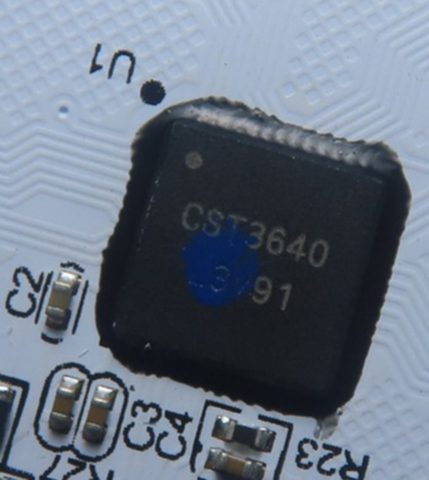{ width="120" loading=lazy }](../assets/images/fcc/parts/tcx-02.jpg){ .glightbox data-title="TCX-02: FCC ID 2BQ4V0825CRL, Internal Photos 6, page 36, upper photo (= CRR IP5 p33 upper)" } | `U1` on the sensor board | CST3640 (QFN52 6 x 6 mm per the JLCPCB `CST3640H` listing, INFERRED) | Hynitron | Capacitive multi-touch controller, I2C | `CST3640` [clear] / `[??]91` (1-2 characters under a blue ink dot) | CRL IP6 p35-p36 = CRR IP5 p32-p33 | DOC (marking); INFERRED (package); confirmed | - |
| TCX-04 | [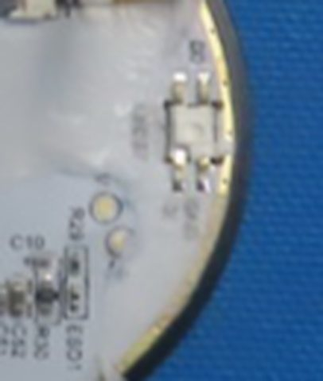{ width="120" loading=lazy }](../assets/images/fcc/parts/tcx-04.jpg){ .glightbox data-title="TCX-04: FCC ID 2BQ4V0825CRL, Internal Photos 6, page 35, upper photo (= CRR IP5 p32 upper)" } | `LED1` on the sensor board | single addressable RGB LED, 4-pad, white body, round lens, unmarked | not identified | Module status LED (driven through the first index of its bay block) | Pad `DO`; `R29`, `R30`, `C10`, `C51`, `C52`, `ESD1` nearby [clear] | CRL IP6 p35 = CRR IP5 p32; measured on one keyboard with one Touch, 2026-09-10 (firmware not recorded with the reading) | DOC; INFERRED (class); MEASURED (a Touch lights through index 88 or 112 only, 2026-09-10); confirmed | - |
| TCX-05 | [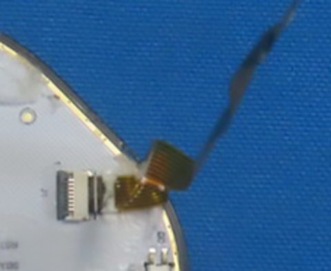{ width="120" loading=lazy }](../assets/images/fcc/parts/tcx-05.jpg){ .glightbox data-title="TCX-05: FCC ID 2BQ4V0825CRL, Internal Photos 6, page 35, upper photo (= CRR IP5 p32 upper)" } | `J1` on the sensor board | 8-contact FPC, orange 8-trace tail | not identified | Link to main-board `J5` | 8 contacts, pin-1 mark [clear] | CRL IP6 p35 = CRR IP5 p32 | DOC; confirmed | - |
| TCX-06 | [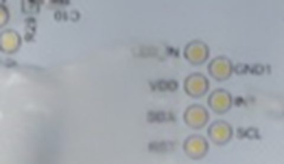{ width="120" loading=lazy }](../assets/images/fcc/parts/tcx-06.jpg){ .glightbox data-title="TCX-06: FCC ID 2BQ4V0825CRL, Internal Photos 6, page 35, upper photo (= CRR IP5 p32 upper)" } | Sensor-board host pads | test pads | - | I2C + INT + RST + LED data | `LED_IN`, `GND1`, `VDD`, `INT`, `SDA`, `SCL`, `RST` [clear to partial] | CRL IP6 p35-p36 = CRR IP5 p32-p33 | DOC; confirmed | - |
| TCX-07 | [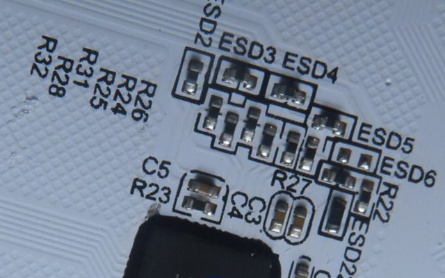{ width="120" loading=lazy }](../assets/images/fcc/parts/tcx-07.jpg){ .glightbox data-title="TCX-07: FCC ID 2BQ4V0825CRL, Internal Photos 6, page 36, upper photo (= CRR IP5 p33 upper)" } | Sensor-board support parts | unmarked passives and ESD | - | Protection and decoupling; slotted gold pad = ground/spring land (INFERRED) | `ESD2`-`ESD6`, `ESD22`; `R22`-`R28`, `R31`, `R32`; `C2`-`C5` [clear] | CRL IP6 p35-p36 = CRR IP5 p32-p33 | DOC; confirmed | - |
| TCX-09 | [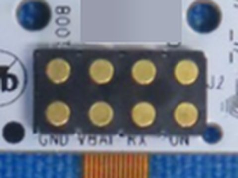{ width="120" loading=lazy }](../assets/images/fcc/parts/tcx-09.jpg){ .glightbox data-title="TCX-09: FCC ID 2BQ4V0825CRL, Internal Photos 5, page 32, upper photo (= CRR IP5 p29 upper)" } | `J2`, dock contact block on the Touch pogo board | 8 gold domed contacts, 2 columns of 4, black molded block | not identified | Touch module-side dock contacts | Labels `GND`, `VBAT`, `RX`, up-arrow, `…ON`, `BOO…`, `GND` [clear count] | CRL IP4 p28; CRL IP5 p32 = CRR IP4 p25; CRR IP5 p29 | DOC; confirmed | Corrects an earlier '2 x 5' reading. |
| TCX-10 | [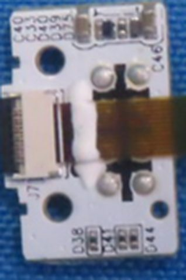{ width="120" loading=lazy }](../assets/images/fcc/parts/tcx-10.jpg){ .glightbox data-title="TCX-10: FCC ID 2BQ4V0825CRL, Internal Photos 5, page 32, lower photo (= CRR IP5 p29 lower)" } | Touch pogo board, back | `J7` FPC (about 8 contacts) and filter parts | not identified | ESD and filtering on the dock lines | `J7`; `C39`, `C40`, `C44`, `C46`, `D38`-`D41`, `D75`; 4 joints round a cross cut-out; three small SMD parts with refs starting `E` on the edge [clear] | CRL IP4 p28; CRL IP5 p32 = CRR IP4 p25; CRR IP5 p29 | DOC; corrected (Three separate SMD parts, not a stacked small board) | The round black part beside the block is U-TCX-10b. |
| TCX-11 | [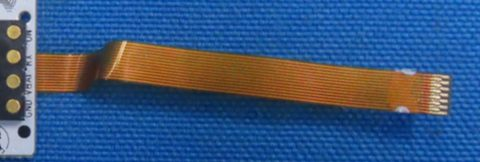{ width="120" loading=lazy }](../assets/images/fcc/parts/tcx-11.jpg){ .glightbox data-title="TCX-11: FCC ID 2BQ4V0825CRL, Internal Photos 5, page 32, upper photo (= CRR IP5 p29 upper)" } | Touch pogo flex | amber flex about 40-42 mm, 13-14 conductors at about 0.3 mm | - | Pogo board into main-board `J4` | About 13 traces resolvable [clear] | CRL IP5 p32 = CRR IP5 p29 | DOC; INFERRED (pitch); confirmed | - |
| TCX-13 | [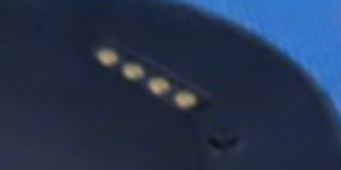{ width="120" loading=lazy }](../assets/images/fcc/parts/tcx-13.jpg){ .glightbox data-title="TCX-13: FCC ID 2BQ4V0825CRL, Internal Photos 4, page 27, lower photo (= CRR IP4 p24 lower)" } | Touch base exposed contacts | one straight row of 4 round gold contacts in a slot | - | Exposed module-to-dock contacts | 4 contacts plus a small round feature [clear count] | CRL IP4 p27 = CRR IP4 p24 | DOC; confirmed | Relation to the 8 contacts on the pogo board is open (OQ-11). |
| TCX-14 | [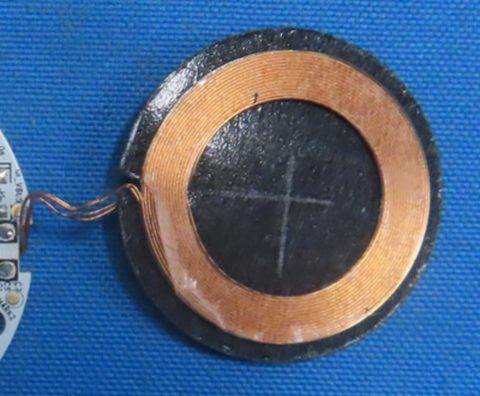{ width="120" loading=lazy }](../assets/images/fcc/parts/tcx-14.jpg){ .glightbox data-title="TCX-14: FCC ID 2BQ4V0825CRL, Internal Photos 5, page 30, lower photo (= CRR IP4 p27 lower)" } | Qi receive coil | single-layer spiral about 29-30 mm OD, 19-20 mm ID, on a ferrite disc about 33 mm | not identified | Qi coil feeding the MT5705 | No marking; scribed cross on the ferrite [clear] | CRL IP4 p28; CRL IP5 p29-p30 = CRR IP4 p25-p27 | DOC; INFERRED (sizes); confirmed | - |
| TCX-15 | [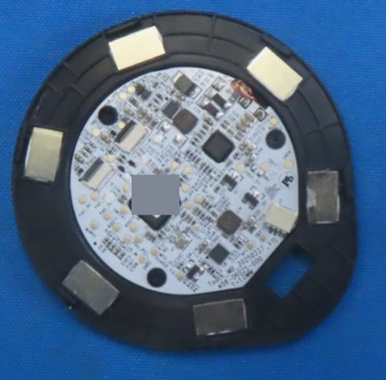{ width="120" loading=lazy }](../assets/images/fcc/parts/tcx-15.jpg){ .glightbox data-title="TCX-15: FCC ID 2BQ4V0825CRL, Internal Photos 4, page 28, upper photo (= CRR IP4 p25 upper)" } | Carrier frame | black plastic ring with 6 silver rectangular plates and a rectangular window | - | Holds the main board; dock magnets or steel strike plates (INFERRED) | 6 plates [clear count] | CRL IP4 p28 = CRR IP4 p25 | DOC; INFERRED; confirmed | - |
| TCX-16 | [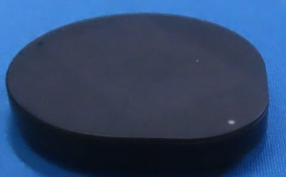{ width="120" loading=lazy }](../assets/images/fcc/parts/tcx-16.jpg){ .glightbox data-title="TCX-16: FCC ID 2BQ4V0825CRL, Internal Photos 4, page 27, upper photo (= CRR IP4 p24 upper)" } | Top cover | glossy black teardrop cover; black glass-like disc in the teardown | - | Touch surface; small light dot near the rim = LED window (INFERRED) | No print [clear]; size unresolved (U-TCX-16b) | CRL IP4 p27; CRL IP6 p35 = CRR IP4 p24; CRR IP5 p32 | DOC; confirmed | - |
| TCX-17 | [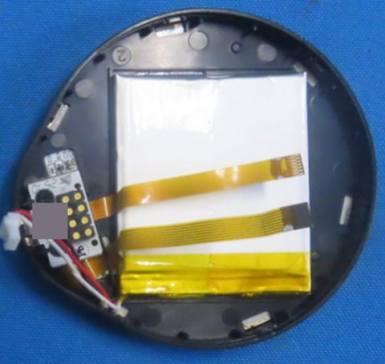{ width="120" loading=lazy }](../assets/images/fcc/parts/tcx-17.jpg){ .glightbox data-title="TCX-17: FCC ID 2BQ4V0825CRL, Internal Photos 4, page 28, upper photo (= CRR IP4 p25 upper)" } | Housing | black shell with a molded `2` in a circular boss | - | Enclosure; `2` is probably a mold cavity number (INFERRED) | `2` [clear]; cell held with yellow tape | CRL IP4 p28 = CRR IP4 p25 | DOC; INFERRED; confirmed | - |
| TCX-18 | [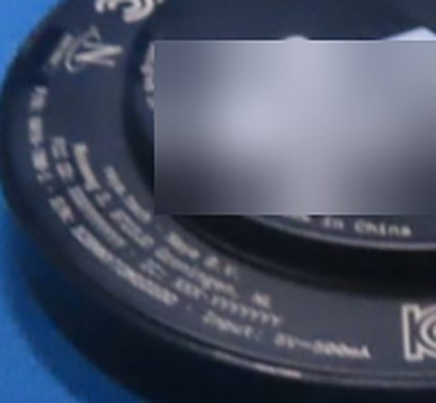{ width="120" loading=lazy }](../assets/images/fcc/parts/tcx-18.jpg){ .glightbox data-title="TCX-18: FCC ID 2BQ4V0825CRL, Internal Photos 4, page 27, lower photo (= CRR IP4 p24 lower)" } | Touch base label | label artwork with unfilled certification placeholders | - | Printed before any module certification; no module FCC ID exists | `…Netherlands · Made in China`; `…Naya B.V.`; `…, NL`; `XXX-YYYYYYY` (IC style), `R-C?-ABC-XXX…` (KC style), `XXX-ABC…` (Japan style), 13-character `CC…` (NCC style); `Input: 5V⎓500mA` [clear to partial] | CRL IP4 p27 = CRR IP4 p24 | DOC; INFERRED; confirmed | - |
| TCX-19 | [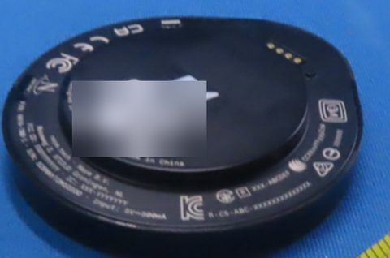{ width="120" loading=lazy }](../assets/images/fcc/parts/tcx-19.jpg){ .glightbox data-title="TCX-19: FCC ID 2BQ4V0825CRL, Internal Photos 4, page 27, lower photo (= CRR IP4 p24 lower)" } | Touch base marks | compliance marks | - | Marks beside the placeholder text | FCC, CE, UKCA, WEEE, KC, N in an arc, RCM-like triangle, others [clear to shape only] | CRL IP4 p27 = CRR IP4 p24 | DOC; confirmed | - |

### Naya Track main board (ring PCB, `Track_MB_20250305_V13`)

One sample: CRL p37-p46 = CRR p34-p43 (same JPEG files). IC close-ups are CRL IP7 p45-p46 = CRR IP7 p42-p43.

<!-- fcc-images:start -->

<figure markdown="span">
  { width="640" loading=lazy }
  <figcaption>Track main board, component (MCU) side, with the Qi coil's ferrite back. FCC ID 2BQ4V0825CRL, Internal Photos 7, page 45, upper photo. Identifying marks removed.</figcaption>
</figure>

<figure markdown="span">
  { width="640" loading=lazy }
  <figcaption>Track main board, connector and test-pad side, with the Qi coil face. FCC ID 2BQ4V0825CRL, Internal Photos 7, page 44, upper photo. Identifying marks removed.</figcaption>
</figure>

<!-- fcc-images:end -->

| ID | Image | Location | Part | Maker | Function | Marking as read | Source | Basis | Notes |
|---|---|---|---|---|---|---|---|---|---|
| TKM-03 | [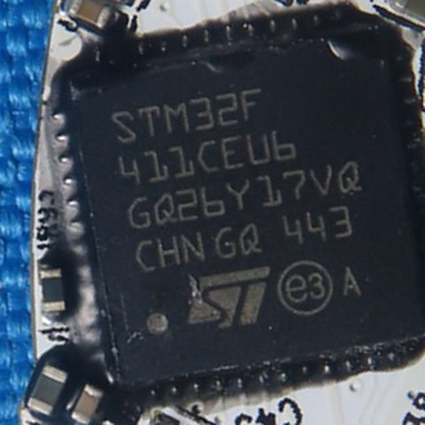{ width="120" loading=lazy }](../assets/images/fcc/parts/tkm-03.jpg){ .glightbox data-title="TKM-03: FCC ID 2BQ4V0825CRL, Internal Photos 7, page 45, lower photo (= CRR IP7 p42)" } | MCU | STM32F411CEU6 (UFQFPN48) | STMicroelectronics | Module MCU | `STM32F` / `411CEU6` / `GQ26Y17VQ` / `CHN GQ 443`, ST logo, `e3`, `A` [clear] | CRL IP7 p45 = CRR IP7 p42 (under a 2D label on CRL IP7 p44 = CRR IP6 p41) | DOC; INFERRED (`443` = 2024 week 43); confirmed | - |
| TKM-05 | [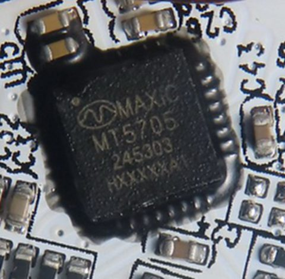{ width="120" loading=lazy }](../assets/images/fcc/parts/tkm-05.jpg){ .glightbox data-title="TKM-05: FCC ID 2BQ4V0825CRL, Internal Photos 7, page 46, upper photo (= CRR IP7 p43)" } | Qi receiver (refdes read `U15` or `U5`) | MT5705 | Maxic Technology | Qi 5 W receiver | `MAXIC` / `MT5705` / `245303` / `H…A` [lines 1-3 clear] | CRL IP7 p46 = CRR IP7 p43 | DOC; confirmed | Different lot (`245303`) from the Tune and Touch parts (`240801`). |
| TKM-06 | [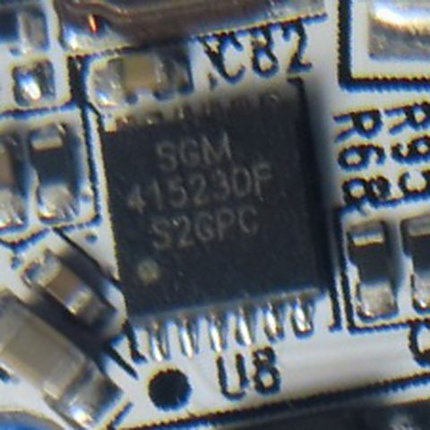{ width="120" loading=lazy }](../assets/images/fcc/parts/tkm-06.jpg){ .glightbox data-title="TKM-06: FCC ID 2BQ4V0825CRL, Internal Photos 7, page 46, upper photo (= CRR IP7 p43)" } | `U8` | SGM41523 (base variant) | SG Micro | Single-cell switch-mode charger | `SGM` / `41523DF` / `S2GPC` [clear] | CRL IP7 p46 = CRR IP7 p43 | DOC; corrected (Third line `S2GPC`, not `S26PC`) | - |
| TKM-07 | [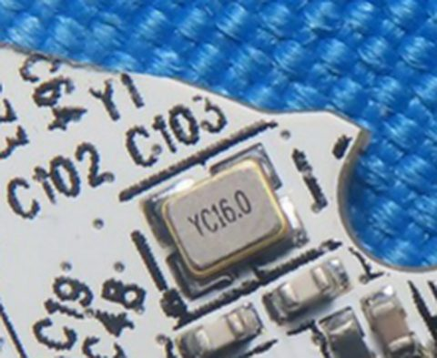{ width="120" loading=lazy }](../assets/images/fcc/parts/tkm-07.jpg){ .glightbox data-title="TKM-07: FCC ID 2BQ4V0825CRL, Internal Photos 7, page 45, lower photo (= CRR IP7 p42)" } | `Y1`, load caps `C102`, `C103` | 16.000 MHz crystal | not identified | STM32 HSE | `YC16.0` [clear] | CRL IP7 p45 = CRR IP7 p42 | DOC; confirmed | - |
| TKM-11 | [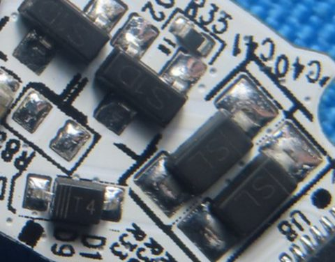{ width="120" loading=lazy }](../assets/images/fcc/parts/tkm-11.jpg){ .glightbox data-title="TKM-11: FCC ID 2BQ4V0825CRL, Internal Photos 7, page 46, upper photo (= CRR IP7 p43)" } | Two diodes near `C40`/`C41`; one near `D16` | `SL`: 1N5819W / B5819W class Schottky (SOD-123FL); `T4`: 1N4148WS class switching diode (SOD-323) | multi-source | Schottky power-path diodes and a small-signal switching diode | `SL` on two parts, `T4` with cathode bar on the third [clear] | CRL IP7 p46 = CRR IP7 p43 | DOC; INFERRED (code-to-part); corrected (Two different diode families, not one class) | - |
| TKM-12 | [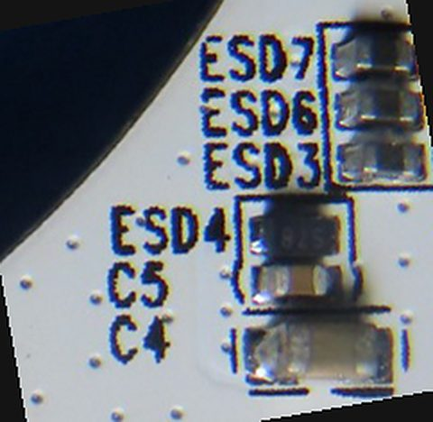{ width="120" loading=lazy }](../assets/images/fcc/parts/tkm-12.jpg){ .glightbox data-title="TKM-12: FCC ID 2BQ4V0825CRL, Internal Photos 7, page 46, upper photo (= CRR IP7 p43); shows ESD3, ESD4, ESD6, ESD7" } | ESD parts | unmarked ESD/TVS parts | - | Line protection | `ESD3`, `ESD4`, `ESD6`, `ESD7`, `ESD11`, `ESD15`, `ESD25` (+ `ESD22`, `ESD27` from the extraction pass) [clear] | CRL IP7 p45 = CRR IP7 p42; CRL IP7 p46 = CRR IP7 p43 | DOC; confirmed | The ESD4 part's own marking is U-TKM-12b. |
| TKM-13 | [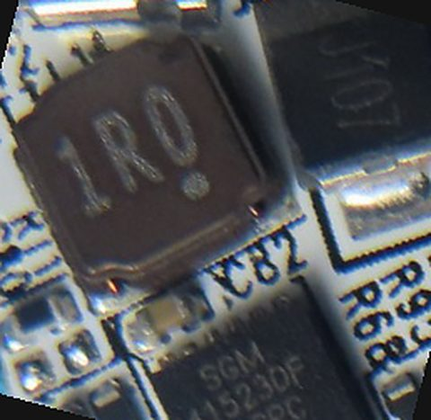{ width="120" loading=lazy }](../assets/images/fcc/parts/tkm-13.jpg){ .glightbox data-title="TKM-13: FCC ID 2BQ4V0825CRL, Internal Photos 7, page 46, upper photo (= CRR IP7 p43); shows the 1R0 inductor" } | Inductors and links | 1.0 uH (`1R0`) power inductor; 0-ohm link in `L13`; coil pads at `L11` | not identified | Charger inductor (INFERRED); Qi coil landing | `1R0` [clear]; `L13` part marked `0`; second inductor `10…` [partial]; `L1`, `L11` refs | CRL IP7 p45 = CRR IP7 p42; CRL IP7 p46 = CRR IP7 p43 | DOC; confirmed | - |
| TKM-15 | [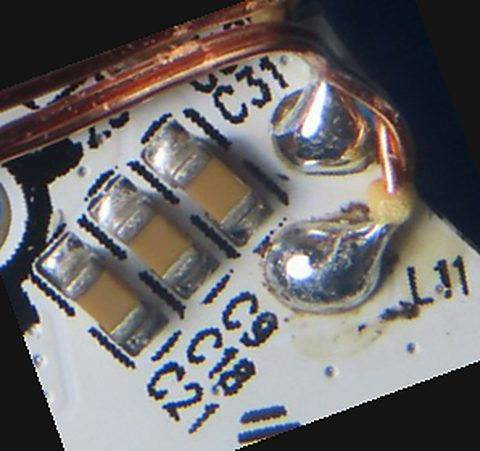{ width="120" loading=lazy }](../assets/images/fcc/parts/tkm-15.jpg){ .glightbox data-title="TKM-15: FCC ID 2BQ4V0825CRL, Internal Photos 7, page 46, upper photo (= CRR IP7 p43)" } | `C9`, `C18`, `C21`, `C31` at the coil pads | larger MLCCs, unmarked | - | Qi resonant/filter bank (INFERRED) | Refs [clear] | CRL IP7 p46 = CRR IP7 p43 | DOC; INFERRED (role); confirmed | - |
| TKM-16 | [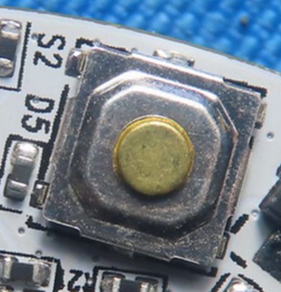{ width="120" loading=lazy }](../assets/images/fcc/parts/tkm-16.jpg){ .glightbox data-title="TKM-16: FCC ID 2BQ4V0825CRL, Internal Photos 7, page 46, upper photo (= CRR IP7 p43); shows S2" } | `S2`-`S5` | SMD tactile switches, metal frame, round brass actuators about 4-5 mm, unmarked | not identified | The four Track buttons (mapping to `TRACK_K1`-`K4` INFERRED) | `S2`, `S4`, `S5` [clear], `S3` [partial] | CRL IP7 p45 = CRR IP7 p42; CRL IP7 p46 = CRR IP7 p43; CRR IP6 p41; measured on one Track, 2026-09-06 | DOC; MEASURED (four buttons, bitmask 1/2/4/8, 2026-09-06); confirmed | - |
| TKM-17 | [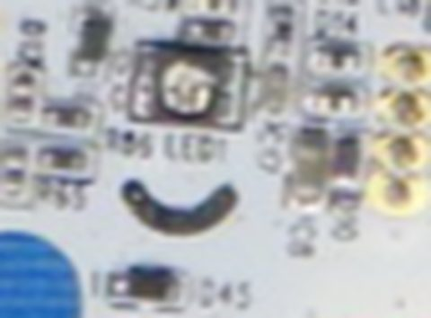{ width="120" loading=lazy }](../assets/images/fcc/parts/tkm-17.jpg){ .glightbox data-title="TKM-17: FCC ID 2BQ4V0825CRL, Internal Photos 7, page 45, upper photo (= CRR IP7 p42)" } | `LED1` between the two 1x4 pad rows | square top-view LED with round lens, unmarked | not identified | The Track's single status LED (RGB per marketing, INFERRED) | `LED1` [clear] | CRL IP7 p45 = CRR IP7 p42 | DOC; confirmed | One LED on the board supports the 'single dot' reading over the '~15 LEDs' band-pass note (OQ-08). |
| TKM-18 | [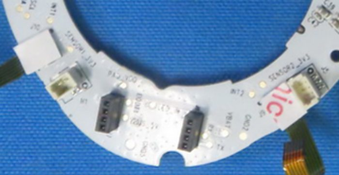{ width="120" loading=lazy }](../assets/images/fcc/parts/tkm-18.jpg){ .glightbox data-title="TKM-18: FCC ID 2BQ4V0825CRL, Internal Photos 7, page 44, upper photo (= CRR IP6 p41)" } | Connectors | wire-to-board and board-to-board sockets, unmarked | not identified | `M1` white 2-way (motor) by `SENSOR1_3V3`; white 4-way under red-printed tape by `SENSOR2…`; two black 4-position female sockets by `GND2`/`VBAT`/`RX`/`TX`/`?AD_VDD` (take the interposer, INFERRED) | [clear presence] | CRL IP7 p44 = CRR IP6 p41 | DOC; INFERRED (roles); confirmed | - |
| TKM-19 | [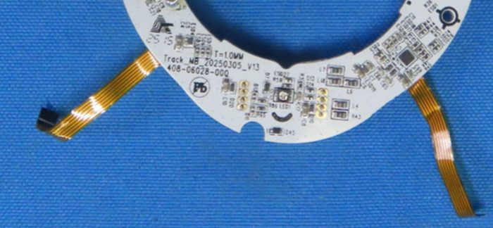{ width="120" loading=lazy }](../assets/images/fcc/parts/tkm-19.jpg){ .glightbox data-title="TKM-19: FCC ID 2BQ4V0825CRL, Internal Photos 7, page 45, upper photo (= CRR IP7 p42)" } | FPC tails | two orange FPC tails soldered to the ring | - | To the two sensor boards (INFERRED) | About 5-8 and 9-10 conductors [counts estimated] | CRL IP7 p44 = CRR IP6 p41 | DOC; confirmed | - |
| TKM-20 | [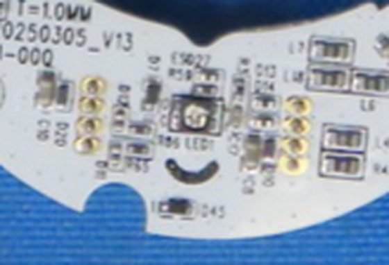{ width="120" loading=lazy }](../assets/images/fcc/parts/tkm-20.jpg){ .glightbox data-title="TKM-20: FCC ID 2BQ4V0825CRL, Internal Photos 7, page 45, upper photo (= CRR IP7 p42); the two 1x4 rows beside LED1" } | Pad rows either side of `LED1`; extra pad clusters near `R22`/`R23`/`R26`/`R27` | two 1x4 rows of bare plated through-holes | - | Programming header, board attach or DNP option (unknown) | Pad rows unpopulated [clear]; 2x2 and 2-pad clusters, fitted or DNP not provable | CRR IP7 p42, p43 | DOC; confirmed | - |
| TKM-21 | [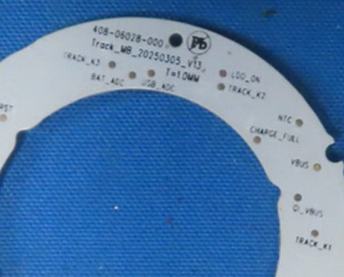{ width="120" loading=lazy }](../assets/images/fcc/parts/tkm-21.jpg){ .glightbox data-title="TKM-21: FCC ID 2BQ4V0825CRL, Internal Photos 7, page 44, upper photo (= CRR IP6 p41); lower and left arcs" } | Net pads | test pads | - | Buttons, charger, SWD/boot, two sensor buses, haptic enable, dock UART | `TRACK_K1`-`TRACK_K4`; `VBUS`, `QI_VBUS`, `NTC`, `CHARGE_FULL`, `LDO_ON`, `BAT_ADC`, `USB_ADC`, `VBAT`, `VDD_3V3`; `SWCLK1`, `SWDIO1`, `BOOT0`, `BOOT?`, `RST`; `SENSOR1_3V3`, `INT1`, `SCL`, `SDA`, `SCL1`, `SDA1`, `SENSOR2_3V3`, `INT2`; `TRACK_?RA_EN`, `MOTOR_IN?`; `RX`, `TX`, `USB_5V`, `PAD_VDD`, `LED_?`, `GND2`, `GND5`, `GND6` [clear to partial] | CRL IP7 p44 = CRR IP6 p41 | DOC; confirmed (Subset re-read; rest corroborated by two readings) | - |

### Naya Track sensor boards, pogo board, interposer, motor, enclosure

Same shared photos as the Track main board.

<!-- fcc-images:start -->

<figure markdown="span">
  { width="640" loading=lazy }
  <figcaption>Track sensor boards SensorR and SensorL: sensor side (top), connector side (bottom). FCC ID 2BQ4V0825CRL, Internal Photos 6, page 39, lower (top panel) and upper (bottom panel). Identifying marks removed.</figcaption>
</figure>

<figure markdown="span">
  { width="640" loading=lazy }
  <figcaption>Track pogo board contact face (left) and dock interposer board (right). FCC ID 2BQ4V0825CRL, Internal Photos 6, page 40, lower (left panel) and upper (right panel). Identifying marks removed.</figcaption>
</figure>

<figure markdown="span">
  { width="640" loading=lazy }
  <figcaption>Track opened: body with ball cup, pogo board, harness, cells and Qi coil; base cover with six metal inserts. FCC ID 2BQ4V0825CRL, Internal Photos 6, page 38, upper (only photo). Identifying marks removed.</figcaption>
</figure>

<!-- fcc-images:end -->

| ID | Image | Location | Part | Maker | Function | Marking as read | Source | Basis | Notes |
|---|---|---|---|---|---|---|---|---|---|
| TKX-04 | [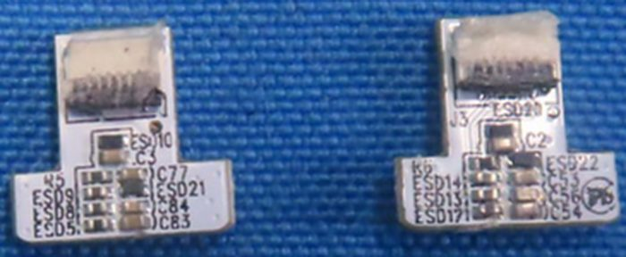{ width="120" loading=lazy }](../assets/images/fcc/parts/tkx-04.jpg){ .glightbox data-title="TKX-04: FCC ID 2BQ4V0825CRL, Internal Photos 6, page 39, upper photo (= CRR IP6 p36); connector side, J3 and ESD parts" } | Sensor-board pads and parts | pads, FPC `J3`, ESD and passives | - | PixArt-style 3-wire optical-sensor port (`SCLK`/`SDIO`/`MOTION`, INFERRED); two sensors on the ball allow twist sensing (INFERRED) | SensorL: `3V3_SENSOR` (partial), `MOTION`, `SDIO` (partial), `SCLK`, `GND1`, `R11`, `C27`, `C28`; SensorR: `MOTION`, `SCLK3`, `SDIO3`, `3V3`, `GND`, `R9`; backs: `J3` (about 6 contacts), `ESD5`, `ESD8`-`ESD10`, `ESD13`, `ESD14`, `ESD17`, `ESD21`, `ESD22`, `C2`, `C3`, `C53`-`C56`, `C77`, `C83`, `C84`, `R5`, `R6` [clear except where marked] | CRL IP6 p39 = CRR IP6 p36 | DOC; INFERRED; confirmed | The sensor ICs themselves are U-TKX-03. |
| TKX-07 | [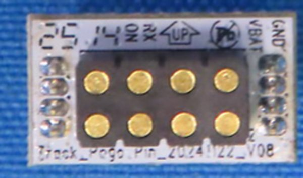{ width="120" loading=lazy }](../assets/images/fcc/parts/tkx-07.jpg){ .glightbox data-title="TKX-07: FCC ID 2BQ4V0825CRL, Internal Photos 6, page 40, lower photo (= CRR IP6 p37)" } | Track dock contacts on the pogo board | 8 gold domed contacts, 2 x 4, one black housing | not identified | Track module-side dock contacts | Labels `GND`, `VBAT`, up-arrow, `RX`, `ON`; 4 plated holes on each short edge; pitch about 2.5-3 mm (INFERRED) [clear count] | CRL IP6 p37, p40 = CRR IP5 p34; CRR IP6 p37 | DOC; INFERRED (pitch); confirmed | Corrects an earlier '2 x 5' reading. |
| TKX-10 | [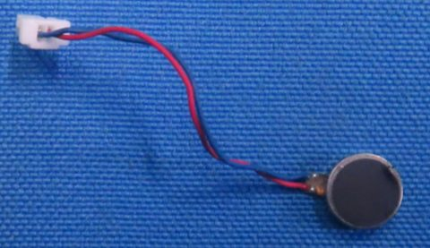{ width="120" loading=lazy }](../assets/images/fcc/parts/tkx-10.jpg){ .glightbox data-title="TKX-10: FCC ID 2BQ4V0825CRL, Internal Photos 6, page 41, upper photo (= CRR IP6 p38)" } | Haptic motor | flat coin vibration motor about 7-9 mm, unmarked | not identified | Track haptics; ERM vs coin LRA unresolved (U-TKX-10b) | Red and blue leads about 5 cm to a white 2-pin plug (mates `M1`) [clear] | CRL IP6 p41 = CRR IP6 p38 | DOC; INFERRED (size); confirmed | - |
| TKX-11 | [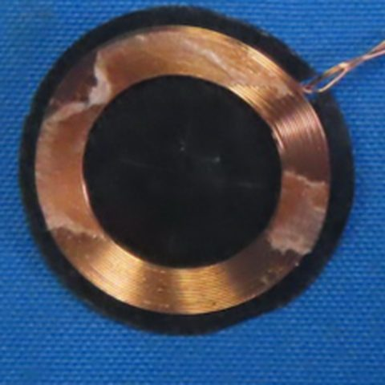{ width="120" loading=lazy }](../assets/images/fcc/parts/tkx-11.jpg){ .glightbox data-title="TKX-11: FCC ID 2BQ4V0825CRL, Internal Photos 7, page 44, upper photo (= CRR IP6 p41)" } | Qi receive coil | multi-strand spiral on black ferrite, disc about 34-35 mm (winding about 28 mm OD / 19 mm ID), foam ring | not identified | Qi coil feeding the MT5705; leads soldered at pads by `L11` | No marking [clear] | CRL IP6 p38; CRL IP7 p44, p46 = CRR IP6 p35, p41; CRR IP7 p43 | DOC; INFERRED (sizes); confirmed | - |
| TKX-12 | [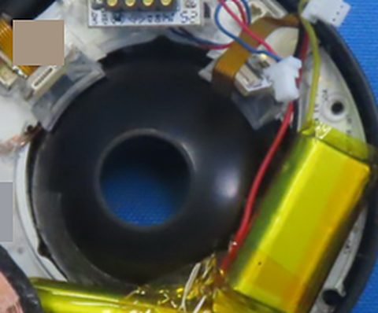{ width="120" loading=lazy }](../assets/images/fcc/parts/tkx-12.jpg){ .glightbox data-title="TKX-12: FCC ID 2BQ4V0825CRL, Internal Photos 6, page 38, only photo (= CRR IP6 p35)" } | Ball cup and carrier | black hemispherical cup with a central hole; translucent carrier with two sensor mounts | - | Trackball socket and sensor-board carrier | Bearings not resolvable [clear shape] | CRL IP6 p38 = CRR IP6 p35 | DOC; confirmed | - |
| TKX-13 | [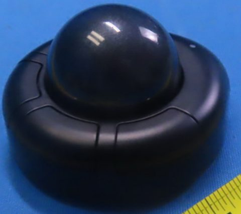{ width="120" loading=lazy }](../assets/images/fcc/parts/tkx-13.jpg){ .glightbox data-title="TKX-13: FCC ID 2BQ4V0825CRL, Internal Photos 6, page 37, upper photo (= CRR IP5 p34)" } | Trackball assembly | dark ball in a segmented top ring | - | Marketed 40 mm ball with 4 buttons; small dot at rear right = LED window (INFERRED) | Ring opening about 40 mm against the tape (INFERRED) [clear shape] | CRL IP6 p37 = CRR IP5 p34; naya.tech marketing (40 mm ball, 4 buttons) | DOC; INFERRED; confirmed | - |
| TKX-14 | [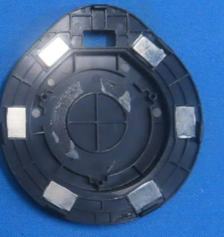{ width="120" loading=lazy }](../assets/images/fcc/parts/tkx-14.jpg){ .glightbox data-title="TKX-14: FCC ID 2BQ4V0825CRL, Internal Photos 6, page 38, only photo (= CRR IP6 p35)" } | Base cover | black teardrop cover with 6 rectangular metal inserts, a window for the pogo block and a round seat (Qi, INFERRED) | - | Dock magnets or steel strike plates (INFERRED) | 6 inserts [clear count] | CRL IP6 p38 = CRR IP6 p35 | DOC; INFERRED; confirmed | - |
| TKX-15 | [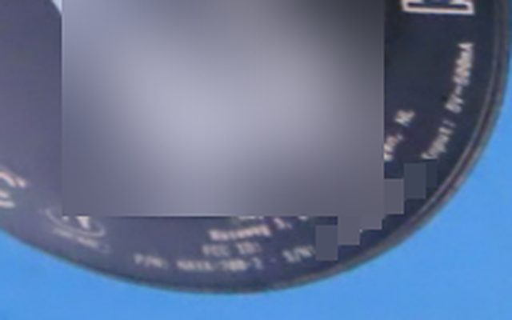{ width="120" loading=lazy }](../assets/images/fcc/parts/tkx-15.jpg){ .glightbox data-title="TKX-15: FCC ID 2BQ4V0825CRL, Internal Photos 6, page 37, lower photo (= CRR IP5 p34)" } | Track base label | label artwork | - | Base label printed with empty certification fields | `Designed in the Netherlands`; `naya.tech · Naya B.V.`; address line; `FCC ID:` and `IC:` printed with no value [clear]; `P/N: NAYA-` + 2 unclear characters + `00-2` (U-TKX-15b); `S/N:` (withheld); `Input: 5V⎓500mA` [partial] | CRL IP6 p37 = CRR IP5 p34 | DOC; confirmed (Only the P/N digits are unverifiable) | - |
| TKX-16 | [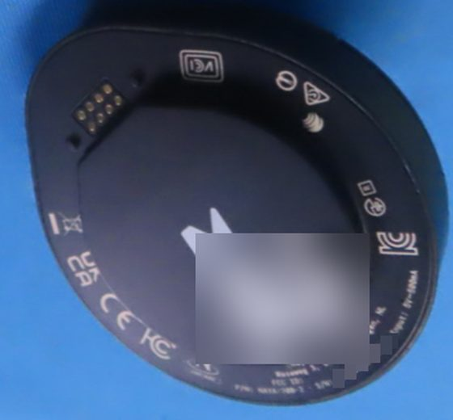{ width="120" loading=lazy }](../assets/images/fcc/parts/tkx-16.jpg){ .glightbox data-title="TKX-16: FCC ID 2BQ4V0825CRL, Internal Photos 6, page 37, lower photo (= CRR IP5 p34)" } | Track base marks and contacts | compliance marks; 8 exposed contacts | - | Marks and the exposed dock contacts | KC, CE, `UK`/`CA`, WEEE, `VCCI` (double box, in full), N-in-ellipse (issuer unidentified) [clear]; two marks shape-only (Giteki?, RCM?); 8 gold contacts 2 x 4 in a recess with two flanking round features | CRL IP6 p37 = CRR IP5 p34 | DOC; confirmed | - |
| TKX-17 | [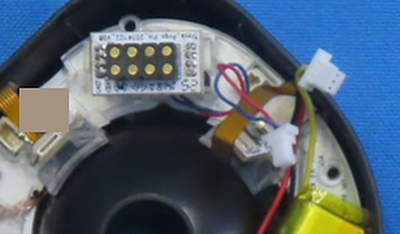{ width="120" loading=lazy }](../assets/images/fcc/parts/tkx-17.jpg){ .glightbox data-title="TKX-17: FCC ID 2BQ4V0825CRL, Internal Photos 6, page 38, only photo (= CRR IP6 p35)" } | Internal harness | wire-to-board harness and FPC | - | White 3-pin connector (red, black, yellow-green wires; battery, INFERRED); red/blue pair to a white 2-pin plug (motor); orange FPC about 6-8 traces into a white connector | [clear presence] | CRL IP6 p38 = CRR IP6 p35 | DOC; INFERRED (roles); confirmed | - |

### Batteries and power ratings (every half and every module)

Cell labels read from photos; declared values from the test reports' EUT tables.

| ID | Image | Location | Part | Maker | Function | Marking as read | Source | Basis | Notes |
|---|---|---|---|---|---|---|---|---|---|
| BAT-01 | [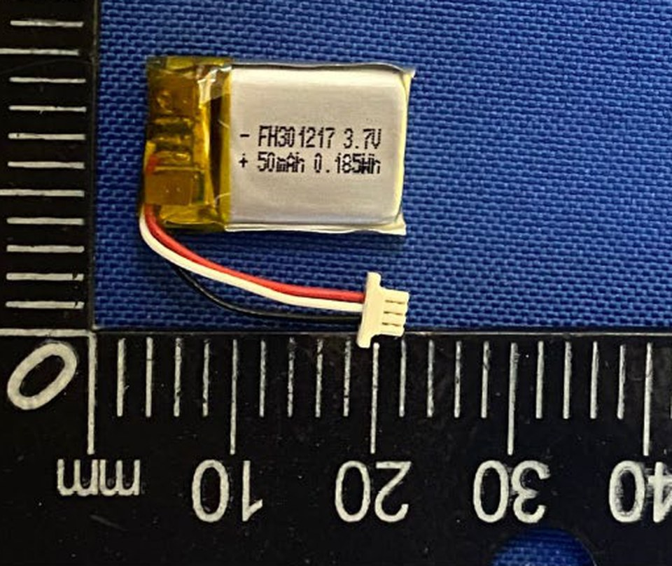{ width="120" loading=lazy }](../assets/images/fcc/batteries/half.jpg){ .glightbox data-title="BAT-01: battery photo" } | Each keyboard half, one cell, taped with its protection board | `FH301217` (report: 'Model: 301217') | not identified (`FH` prefix) | Half cell: keeps the half on while a module is swapped; charged while the half draws power; Li-ion polymer pouch about 3.0 x 12 x 17 mm by size code (INFERRED) | `- FH301217 3.7V` / `+ 50mAh 0.185Wh` [clear]; report 'Power Source 1# Supplied from battery. Model: 301217', 'DC 3.7V 50mAh 0.185Wh'; '2# Supplied from PC USB port', 'DC 5V' | CRL IP2 p13, p14; CRL IP1 p7; CRR IP1 p10, p11; CRL BLE p10; CRL SRD p10; CRR BLE p10; CRR SRD p10; CRR UM1 p4 | DOC; INFERRED (chemistry, size); confirmed | Manual v1.0.6 spec sheet says 'Internal Battery Capacity 45mA'; the cell and the report say 50 mAh (45 is a typo or a minimum, INFERRED). |
| BAT-02 | [{ width="120" loading=lazy }](../assets/images/fcc/batteries/half.jpg){ .glightbox data-title="BAT-02: battery photo" } | Half cell lead | 3-wire lead into a white multi-contact plug (JST SH class pitch, about 1.0-1.25 mm) | not identified | Cell connection; the white wire is an NTC or ID line (INFERRED) | Red / white / black wires; 3-4 gold blades visible in the shell [clear] | CRL IP2 p14; CRR IP1 p10, p11 | DOC; INFERRED (pitch, role); confirmed | The mainboard receptacle's pin count is unresolved (U-HP-10). |
| BAT-06 | [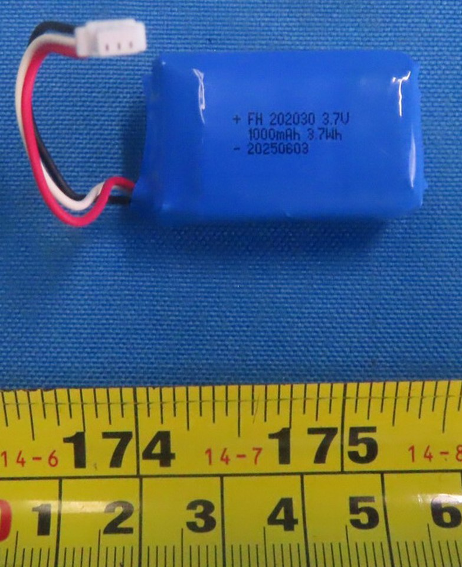{ width="120" loading=lazy }](../assets/images/fcc/batteries/tune.jpg){ .glightbox data-title="BAT-06: battery photo" } | Naya Tune pack | `FH 202030` | not identified (`FH` prefix) | Tune battery: 3.7 V 1000 mAh 3.7 Wh Li-ion polymer block pack, blue PVC wrap; about 20 x 20 x 30 mm by size code (INFERRED); 3 wires red/white/black to a white 3-position plug | `+ FH 202030 3.7V` / `1000mAh 3.7Wh` / `- 20250603` [clear] | CRL IP2 p18; CRL IP4 p25-p26 = CRR IP2 p15; CRR IP4 p22-p23 | DOC; INFERRED (size); confirmed | - |
| BAT-09 | [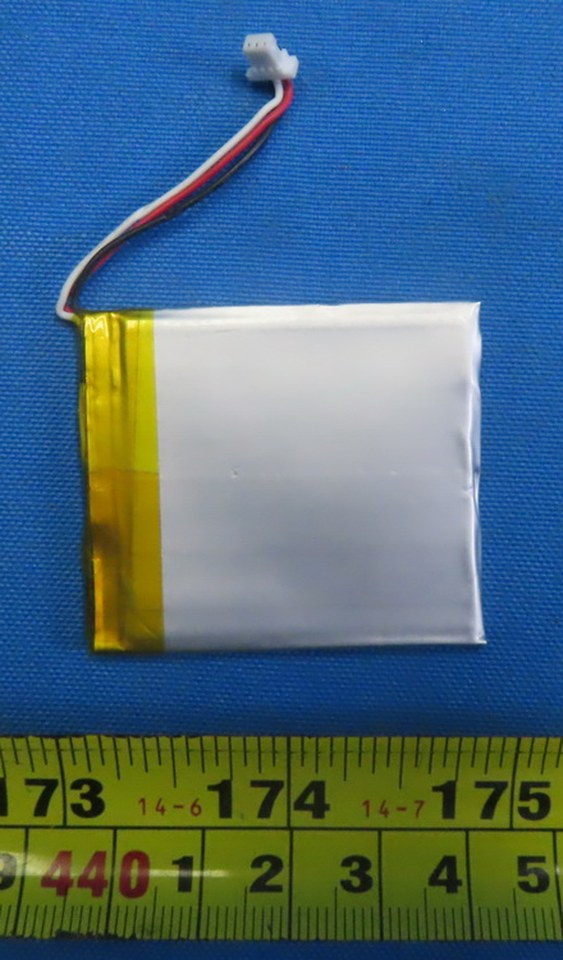{ width="120" loading=lazy }](../assets/images/fcc/batteries/touch.jpg){ .glightbox data-title="BAT-09: battery photo" } | Naya Touch cell A | `FH364046` | not identified (`FH` prefix) | Touch battery: 3.7 V 700 mAh 2.59 Wh Li-ion polymer pouch about 3.6 x 40 x 46 mm by size code (INFERRED); 3 wires red/black/white to a white 3-position plug (mates `J3`); protection board under yellow Kapton | `- FH364046 3.7V` / `700mAh 2.59Wh` / `+ 20250611` [clear] | CRL IP5 p33-p34 = CRR IP5 p30-p31 | DOC; INFERRED (size); confirmed | - |
| BAT-10 | [{ width="120" loading=lazy }](../assets/images/fcc/batteries/touch.jpg){ .glightbox data-title="BAT-10: battery photo" } | Naya Touch cell B (teardown layout photo) | `FH364045` | not identified (`FH` prefix) | A second 700 mAh cell of the same family | `- FH364045 3.7V` / `700mAh 2.59WH` / `+ 20241201` [clear; last model digit `5` on both copies] | CRL IP4 p28 = CRR IP4 p25 | DOC; confirmed (Model digit now read (was `FH36404?`)) | Whether a Touch holds one cell or two is open (OQ-20). |
| BAT-13 | [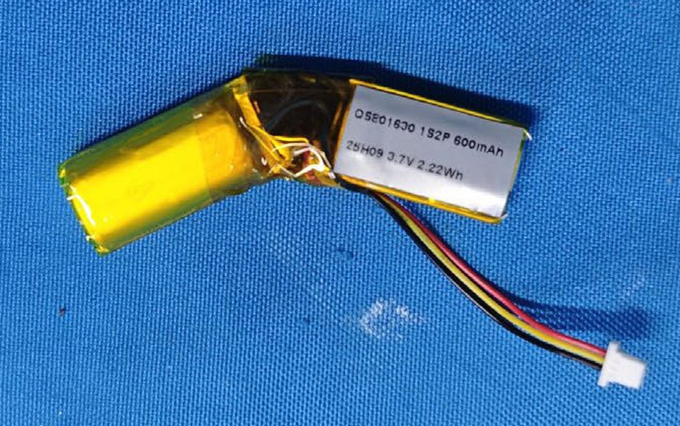{ width="120" loading=lazy }](../assets/images/fcc/batteries/track-pack.jpg){ .glightbox data-title="BAT-13: battery photo" } | Naya Track pack | `QS801630 1S2P` | not identified (`QS` prefix) | Track battery: 3.7 V 600 mAh 2.22 Wh, two cells in parallel bent around the ring, yellow polyimide tape, nickel tabs; 3 wires red/yellow/black to a white 3-way plug | `QS801630 1S2P 600mAh` / `3.7V 2.22Wh`; date codes `25H09` (lab photo) and `25G24` (a second, supplier-style photo) [clear] | CRL IP6 p38; CRL IP7 p42-p43 = CRR IP6 p35, p39-p40 | DOC; INFERRED (two packs photographed); confirmed | - |
| BAT-14 | [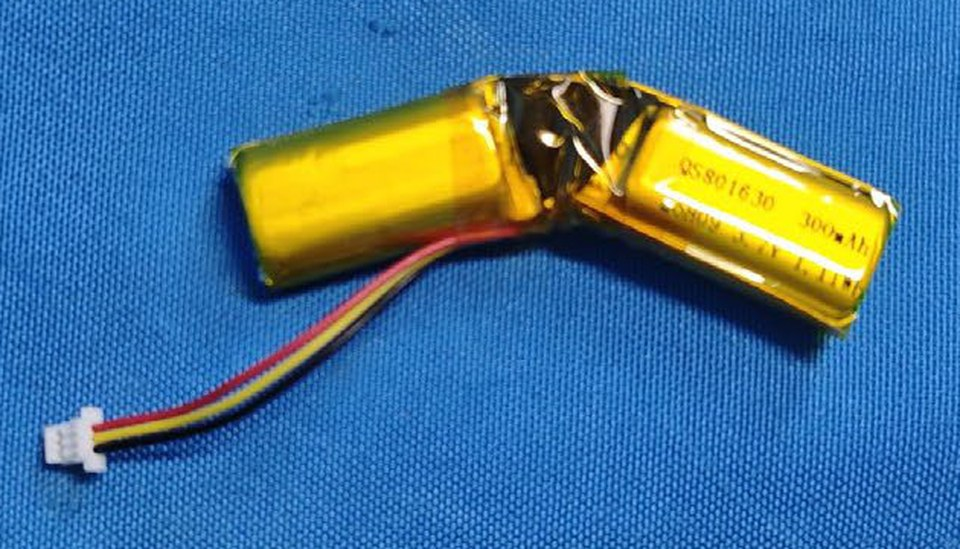{ width="120" loading=lazy }](../assets/images/fcc/batteries/track-cell.jpg){ .glightbox data-title="BAT-14: battery photo" } | Naya Track cell (inside the 1S2P pack) | `QS801630` single cell | not identified | One of the two pouch cells: 300 mAh, 1.11 Wh; about 8.0 x 16 x 30 mm by size code (INFERRED); 2 x 300 mAh = 600 mAh, 2 x 1.11 Wh = 2.22 Wh | `QS801630` / `300mAh` / `…09 3.7V 1.11Wh` [partial] | CRL IP7 p42 = CRR IP6 p39 | DOC; INFERRED (size); confirmed | - |
| BAT-16 | - | Advertised vs filed capacities | - | - | Vendor capacity figures disagree three ways (Tune / Touch / Track): website and 2023 campaign spec sheet 1500 / 800 / 800 mAh; v1.1.0 manuals 1500 / 1500 / 700 mAh; filed pre-production samples 1000 / 700 / 600 mAh | n/a | vendor website (archived); Kickstarter campaign Specs Sheet (2023); Tune, Touch and Track manuals v1.1.0 p2; BAT-06, BAT-09, BAT-13 | DOC; confirmed | Retail capacities are not confirmed (OQ-21). |
| BAT-18 | [{ width="120" loading=lazy }](../assets/images/fcc/parts/tkx-15.jpg){ .glightbox data-title="BAT-18: no crop of its own; board view" } | Module input rating (Touch and Track bases) | `Input: 5V⎓500mA` | - | Module DC input rating | [clear on the Track base; clear to partial on the Touch base] | Track: CRL IP6 p37 = CRR IP5 p34; Touch: CRL IP4 p27 = CRR IP4 p24 | DOC; confirmed | - |
| BAT-19 | - | Module power path | - | - | Dock 5 V (`VBUS`/`VBUS_5V`/`USB_5V`) or Qi (`QI_VBUS` from the MT5705) through `SL` Schottky diodes into the SGM41523 (charger only) and the pack; power back to the half only via the `VBAT` dock line or a boost (SGM62117 on the Tune and Touch) | Manual: halves' cells 'charged automatically while the keyboard is drawing power'; 'Docked modules will be charged ... if the keyboard is connected to a power source'; Qi 'both when docked and when not' [clear] | CRR UM1 p4; TUM-05, TUM-06, TUM-11, TCM-06, TCM-09, TKM-06 | DOC (parts, pads, manual); INFERRED (topology); confirmed | - |
| BAT-20 | [{ width="120" loading=lazy }](../assets/images/fcc/boards/label-dongle.jpg){ .glightbox data-title="BAT-20: no crop of its own; Speedlink dongle label artwork (FCC ID 2BQ4V0825DG, Label artwork, page 1)" } | Dongle power | - | - | Bus-powered; no battery, no cell in the photos | 'Power Source: Supplied from USB port', 'Power Rating: DC 5V' [clear]; label `Rating: 5V⎓30mA` [clear] | DG RF p10; DG IP p4, p5; DG LBL | DOC; confirmed | - |

### Accessories in the box

Box list from user manual v1.0.6 (CRR UM1 p2, native text).

<!-- fcc-images:start -->

<figure markdown="span">
  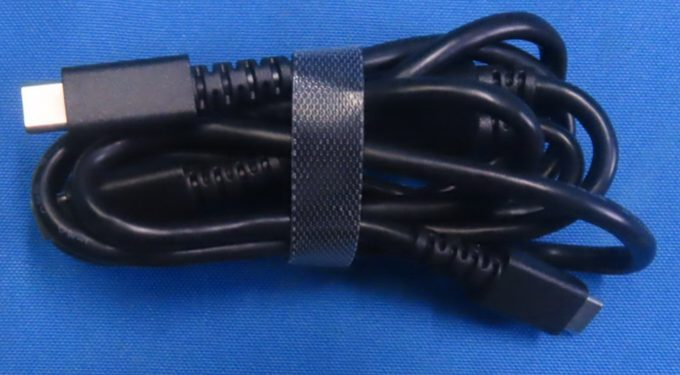{ width="640" loading=lazy }
  <figcaption>Retail 1 m USB-C Y-cable, coiled. FCC ID 2BQ4V0825CRL, Internal Photos 7, page 47, upper photo.</figcaption>
</figure>

<!-- fcc-images:end -->

| ID | Image | Location | Part | Maker | Function | Marking as read | Source | Basis | Notes |
|---|---|---|---|---|---|---|---|---|---|
| ACC-01 | [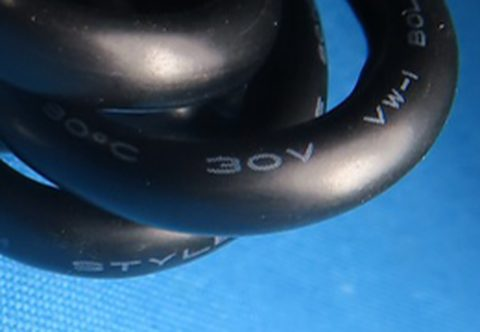{ width="120" loading=lazy }](../assets/images/fcc/parts/acc-01.jpg){ .glightbox data-title="ACC-01: FCC ID 2BQ4V0825CRL, Internal Photos 7, page 47, lower photo (= CRR IP7 p46): jacket print 30V, VW-1, 80 C, STYLE" } | Box item D | '1m USB Type-C Y-Cable' | not identified | Two short USB-C ends to the halves, long USB-C end to the computer; molded splitter (no print); gray hook-and-loop strap; UL AWM class jacket (30V/80°C/VW-1 triple, INFERRED) | Jacket print `30V`, `VW-1` [clear], `?0°C` (80 likely), `STYL…` (style number not legible) [partial] | CRR UM1 p2, p6; CRL IP7 p47-p48 = CRR IP7 p46-p47 | DOC; INFERRED; confirmed | - |
| ACC-02 | - | Lab support cable | 'USB Cable, Shielded NO, Ferrite Core NO, 0.8m' | - | Cable between the EUT and the host notebook during tests; the setup photos show a Y-splitter body like ACC-01 | Support-unit table text [clear] | CRL BLE p14; CRR BLE p14, p35; CRR SRD p13, p34 | DOC; confirmed | 0.8 m (lab) vs 1 m (retail) unresolved. The CRL setup photos repeat the report photos byte for byte. |
| ACC-03 | [{ width="120" loading=lazy }](../assets/images/fcc/boards/dongle-exterior.jpg){ .glightbox data-title="ACC-03: no crop of its own; Speedlink dongle, closed (metal USB-A shell, black cap) (FCC ID 2BQ4V0825DG, External Photos, page 2)" } | Box item C | 'Speedlink Dongle' (`NAYA-100-1`) | Naya | USB dongle; spec sheet 'Speedlink Connection: Using Bluetooth v5.4' | Box list; subtitle 'Wireless dongle · NAYA-100-1(Dongle)' in the CRR v1.0.6 copy only [clear] | CRR UM1 p2, p3; CRL UM1 p2 | DOC; confirmed | The dongle filing's manual is this same v1.0.6 manual: no dongle pairing procedure or LED description, one troubleshooting line ('Ensure the speedlink dongle is properly seated', UM4 p2). |
| ACC-04 | - | Box item A | 'Travel Case' | - | Clamshell case; 'can be stored in your travel case with modules attached' | [clear] | CRR UM1 p2; CRR UM2 p3 | DOC; confirmed | - |
| ACC-05 | - | Box item E | 'Keycap/Switch Puller' | - | One tool: wire keycap end, two-prong switch end | [clear] | CRR UM1 p2; CRR UM3 p1, p3 | DOC; confirmed | - |
| ACC-06 | [{ width="120" loading=lazy }](../assets/images/fcc/parts/en-01.jpg){ .glightbox data-title="ACC-06: no crop of its own; the part shown is EN-01 (FCC ID 2BQ4V0825CRL, Internal Photos 1, page 6, lower photo: low-profile switches with red stems and clear housings in the plate)" } | Box item F | 'Spare/Sample Switches (3x)' (Kailh CPG-1232 per the spec sheet) | Kailh | Spare switches | [clear] | CRR UM1 p2, p3 | DOC; confirmed | - |
| ACC-07 | - | Box item G | 'Module Spacers (2x)' | - | Ring-shaped spacers that 'pack empty space and prevent shifting while stored' | [clear] | CRR UM1 p2; CRR UM2 p3 | DOC; confirmed | - |
| ACC-08 | [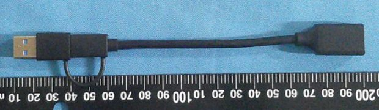{ width="120" loading=lazy }](../assets/images/fcc/parts/acc-08.jpg){ .glightbox data-title="ACC-08: FCC ID 2BQ4V0825DG, SAR report, page 24, auxiliary-equipment photo (USB extension cable on a ruler)" } | SAR test cable (lab, not in the box) | 'USB extension cable', 18.8 cm | - | USB-A plug on a tethered adapter sleeve at the host end, receptacle at the dongle end; used for three of the five SAR positions | [clear] | DG SAR p24; DG SAR-D photos 2, 3, 5 | DOC; INFERRED (connector reading); new (2026-09-23 exhibits) (one extraction pass, no blind re-read) | - |

## Unconfirmed readings

Legible text whose identity is not established. The Candidate column is reasoning, never a part number
DOC INFERRED.

| ID | Board | Location | Legible | Candidate (not a part number) | Why unconfirmed | Source |
|---|---|---|---|---|---|---|
| U-LB-11b | Identifiers | Energy mark and Japanese certification body | N crossed by an ellipse + 'ENERGY VERIFIED'; Giteki body code `219` | - | Issuers not identified by any search | CRR LBL |
| U-HM-08 | Half mainboard | `Y2`, both halves | `Y2` (left), `?2` (right); 2-pad package; lid marking illegible | 32.768 kHz LFXO (INFERRED, nRF52 reference design) | Body marking out of frame or unmarked in every photo | CRL IP1 p7, p10; CRR IP1 p8 |
| U-HM-09b | Half mainboard | `U1` flash, lines 2-4 (right half) | Extraction pass: `Q3??V???Q` / `2?0? 6?34` (best `2208 6134`) / `?0100??`; adversarial re-crop: line 2 has a `Q`, a digit and a `V`, nothing assignable | Winbond W25Q-series part (INFERRED) | Too few pixels per glyph | CRR IP1 p8 |
| U-HM-10 | Half mainboard | QSPI flash capacity | No density digit legible | 8 MB class (an earlier note, no photographic support) or 32 Mbit (if line 2 is `Q3`); STATIC: NayaCore 6.11.0 carries per-half images for flash generations A and B (`kb_fwl.bin` / `kb_fwl_64.bin`) chosen by PID bit 0x1000, so two capacities may exist; our units are generation A (MEASURED, keyboard firmware 3.41.0) | The 8 MB figure has no photographic support; the `Q3` read is not confirmed | CRR IP1 p8; STATIC: NayaCore 6.11.0 (per-generation image pair `kb_fwl.bin` / `kb_fwl_64.bin`, PID bit 0x1000) |
| U-HM-13b | Half mainboard | USB-C receptacle pin class | About 13 legs counted in a partial crop | 16-pin USB 2.0 receptacle (INFERRED: the nRF52840 is USB 2.0 FS only) | Full leg row not in any crop | CRR IP1 p8 |
| U-HM-15b | Half mainboard | `BOOT` pad label (left) | `BOOT` clear; a following `1` may belong to adjacent silkscreen | `BOOT1` | Ambiguous glyph ownership | CRL IP1 p9 |
| U-HP-01b | Half mainboard | IC beside `L11` (left) | 4-6 pad black package, pin-1 dot, no glyphs | DC-DC converter (INFERRED from the paired inductor) | No marking resolvable | CRL IP1 p9 |
| U-HP-02b | Half mainboard | `U10` (left) | 6-lead SOT-23-6 package, no glyphs | Regulator or load switch (INFERRED) | No marking resolvable | CRL IP1 p9 |
| U-HP-03 | Half mainboard | QFN/DFN between `R78`, `R79`, `R80`, `C101` (left) | Black square package; leads sub-pixel; no marking | Battery charger or power manager (INFERRED from nearby `USB_ADC`, `BAT_ADC`, `VBUS_5V`, `CHG_?NT`) | No marking resolvable | CRL IP1 p9 |
| U-HP-04 | Half mainboard | 2-terminal part beside `R79` (`C110`, `C32`) (left) | Uniform black molded body, no band, no code | Schottky diode (INFERRED from shape) | No marking | CRL IP1 p9 |
| U-HP-06 | Half mainboard | Epoxy glob beside `R90`, `R13`, `R89`, `R87` (left) | Irregular black potting, no leads or marking | - | Covered | CRL IP1 p9 |
| U-HP-07 | Half mainboard | `Q1`, `Q6`, `Q8`-`Q11` (left); `Q1` (right) | Left: SOT-23 bodies, markings illegible (`Q7` empty); right `Q1`: `S2U` (middle glyph `2` or `Z`) | Load switches for the module, LED and 5 V rails (INFERRED) | `S2U` has no entry in the marking-code databases reached (s-manuals.com `S2`, `2U`); search-engine summaries gave two contradictory identities | CRL IP1 p9; CRR IP1 p8 |
| U-HP-08 | Half mainboard | Small package near `C101`/`R12` (right) | 3-5 leads; refdes `U3` or `U5`; marking illegible | Small regulator or logic part (INFERRED) | No marking resolvable | CRR IP1 p8 |
| U-HP-10 | Half mainboard | Battery receptacle at `VBAT2` (left) | Pads `VBAT2`, `NTC` [clear], `M?_VBAT_2` (`MZ` most likely); cream body about 20-25 px wide in the photo | Mates the 3-wire cell lead (BAT-02) (INFERRED) | Pin count not resolvable | CRL IP1 p9 |
| U-WG-03b | Wing | Power slide switch part number | No marking (about 2 mm features) | C&K PCM12SMTR-class right-angle SPDT switch (form-factor candidate only, INFERRED) | Not a reading; needs a caliper or a donor board | CRL IP1 p12; CRR IP1 p9 |
| U-PD-02 | Pogo | Right pogo board name | Circled `R`, Pb mark, `GND_4`, `BOOT_2`, `5V_1`, `RX_2`; name under a QR sticker; `Cr` / `Pin` / `10` fragments very low confidence; edge text `?0010` | `Create_R_PogoPin_<date>_V10` (INFERRED from the left twin) | Name hidden | CRR IP2 p13; CRR IP1 p5, p6 |
| U-EN-02 | Half mechanics | Hot-swap socket part | Manual drawing only: square recess, 2 round holes top, 2 slotted tabs, center window; no text | Kailh-compatible PG1232 socket (INFERRED) | No PG1232-specific socket part number found; sockets not legible in photos | CRR UM3 p4; CRL UM2 p6 |
| U-LED | All boards | LED part numbers: half per-key, wing side bar, dock thumb, Tune ring, Touch LED1, Track LED1 | No marking on any LED body (a faint 1-2 character mark on the right dock LEDs is illegible) | WS2812/SK6812-class addressable LEDs (INFERRED from 4-pad `O`/`G`/`I`/`+` footprints and no driver IC); Tune ring side-view 4020 class (INFERRED) | Unmarked parts | CRL IP1 p8, p9, p11, p12; CRL IP2 p16; CRR IP1 p9, p12; CRL IP4 p23; CRL IP6 p35; CRL IP7 p45 = CRR IP3 p20; CRR IP5 p32; CRR IP7 p42 |
| U-DG-07 | Dongle | `Y2` | 2-pad metal lid about 2.1 x 1.1 mm, lid texture only | 32.768 kHz LFXO (INFERRED) | Marking illegible after two enhancement passes | DG IP p5 |
| U-DG-11b | Dongle | 4-lead package labeled `ESD3` | About 4 lead pads; no marking | USB ESD array or an LDO (INFERRED) | No marking | DG IP p5 |
| U-DG-12 | Dongle | 0603 part on the `5V` pad | `CG4` [clear] with a chevron and a band | Fuse, diode or TVS (INFERRED) | No `CG4` entry in s-manuals.com's CG table or other databases | DG IP p5 |
| U-TUM-07 | Tune main board | `U11` | 8-lead small outline (4 per side), no marking | Actuator H-bridge driver (INFERRED from `PWM1`/`PWM2`/`SLEEP`) | No marking | CRL IP3 p19 = CRR IP2 p16 |
| U-TUM-08 | Tune main board | `U9` near `ESD1`/`C32` | Small square QFN/DFN, no marking | - | No marking | CRL IP3 p19 = CRR IP2 p16 |
| U-TUM-10b | Tune main board | `Q1`, `Q2` | `S1B` or `S1D` on both (SOT-23) | - | Code not decoded in this package | CRL IP3 p20 = CRR IP2 p17 |
| U-TUM-13 | Tune main board | `TVS1` | Two lines; lower plausibly `5V`, upper unresolved | 5 V TVS (INFERRED) | Partial marking | CRL IP3 p21 = CRR IP3 p18 |
| U-TUM-20b | Tune main board | Beside the `J5` dock block | Two paler round pads next to the 8 contacts; the label after `TX` reads `5V` or `3V` | Separate `RX`/`TX` test pads (two readings) or positions 9-10 of one 2 x 5 block (one reading) | Readers disagree; 8 vs 10 signal count needs continuity | CRL IP2 p18; CRL IP3 p19 = CRR IP2 p15-p16 |
| U-TUX-03 | Tune disc | `U1` touch controller | Line 1 `CST3` + one character under a blue ink dot; line 2 `L3v9` + a partly hidden character | Hynitron CST3640, as on the Touch (INFERRED); family Hynitron CST3xxx | Suffix digit hidden under ink in every exposure | CRL IP4 p23 = CRR IP3 p20 |
| U-TUX-08b | Tune disc | `Q4`, `Q8` near `PWRON` | SOT-23 bodies, markings illegible | Switches for `LED-VDD` / `TOUCH-VDD` (INFERRED) | No marking | CRL IP4 p23 = CRR IP3 p20 |
| U-TUX-13 | Tune | Dial actuator | Black cylindrical can with visible helical copper windings in a recess under the Qi coil; no marking; its own leads not visible | Marketing: 'Hapticore Driver by Xeeltech' (DOC, naya.tech marketing); XeelTech HAPTICORE parts are magnetorheological-fluid rotary actuators (xeeltech.com) | Identity rests on marketing plus shape; no SKU | CRL IP2 p18 = CRR IP2 p15 |
| U-TUX-15 | Tune | Housed round component beside the internal dock block | Black molded bracket; dark round part with a slotted clip and a center screw; no marking | Detent, bearing retainer or motor mount (not determinable) | No marking, function unclear | CRL IP2 p18 = CRR IP2 p15 |
| U-TUX-16 | Tune | T-shaped sub-board | Green PCB about 10 x 7-9 mm; metal frame about 9.3 x 3.7 mm with a white 'pill' about 3.3 x 1 mm at one end of a slot; 6 pads on the crossbar; about 1.2-1.5 mm unmarked IC; no board name | Micro slide switch (leading reading, INFERRED); not USB-C (a USB-C opening is about 8.3 x 2.4 mm) | No marking or name | CRL IP2 p18; CRL IP4 p24 = CRR IP2 p15; CRR IP3 p21 |
| U-TUX-20 | Tune | Tune base label P/N | `Designed in the Netherlands` [clear]; `FCC ID:` + placeholders; `S/N:` (withheld); `P/N:` digits low-confidence | `NAYA-700-3` (family pattern, INFERRED) | Too few pixels | CRL IP2 p17 = CRR IP2 p14 |
| U-TCM-11 | Touch main board | `Q1`, `Q2` near `VBUS_5V` | `S1D` on both (SOT-23) [clear] | - | Database hits (a 300 V SMBTA42-family NPN; DO-214 rectifiers) do not fit the circuit or package | CRL IP5 p31 = CRR IP5 p28 |
| U-TCX-10b | Touch pogo board | Round black part beside the contact block (back) | No marking | Epoxy-blob IC, magnet or optical part (not determinable) | No marking | CRL IP4 p28; CRL IP5 p32 = CRR IP4 p25; CRR IP5 p29 |
| U-TCX-16b | Touch | Sensor board and cover size | Estimates 66-72 mm (one extraction), about 45 mm (another), 25-30 mm (a recalibration) | Larger than the 44 mm main board (INFERRED) | Tape calibrations disagree; only the main board is anchored by a known package | CRL IP4 p28; CRL IP6 p35 = CRR IP4 p25; CRR IP5 p32 |
| U-TKM-08 | Track main board | Small QFN on the upper-left arc near `L4`/`L6` | About 3 mm, top looks unmarked | - | No marking | CRL IP7 p45 = CRR IP7 p42; CRR IP6 p41 |
| U-TKM-09 | Track main board | Leaded IC near `S3`, beside a shielded inductor | SOP/SOT class, smooth top; inductor reads `10…` | Regulator (INFERRED, weak) | No marking | CRL IP7 p45 = CRR IP7 p42; CRL IP7 p46 = CRR IP7 p43 |
| U-TKM-10 | Track main board | `Q1`, `Q2` | `S1D` on both (SOT-23) [clear] | - | Every database hit for `S1D` is a DO-214 rectifier (wrong package) | CRL IP7 p46 = CRR IP7 p43 |
| U-TKM-12b | Track main board | ESD4 part marking | `S76` (best re-read) vs `S78` / `ST8` / `S7?` (extraction) | - | Glyphs ambiguous; no database match | CRL IP7 p45 = CRR IP7 p42 |
| U-TKM-14 | Track main board | 2-terminal part beside the `1R0` inductor | `10` + an unclear third glyph after a hook mark | 100 uF capacitor if `107` (INFERRED, weak) | Reflective surface; not confirmed | CRL IP7 p46 = CRR IP7 p43 |
| U-TKX-03 | Track sensor boards | `U9` (SensorL), `U11` (SensorR) | Black windowed packages with two apertures and an emitter element; no marking at 4x-16x | Optical motion sensor with a PixArt-style 3-wire port (INFERRED) | Unmarked | CRL IP6 p39 = CRR IP6 p36 |
| U-TKX-05b | Track pogo board | Date stamp | `25 1?` | `25 14` (one extraction) | Second digit not confirmed | CRL IP6 p40 = CRR IP6 p37 |
| U-TKX-09b | Track interposer | `U41` | A dark SOT/DFN part in the lower row; refdes and marking not legible | - | Illegible | CRL IP6 p40 = CRR IP6 p37 |
| U-TKX-10b | Track | Motor type | Net `TRACK_?RA_EN` (`L` or `E`) | `LRA_EN` would mean a linear resonant actuator; coin ERM also possible | Motor unmarked; one glyph ambiguous | CRL IP6 p41; CRL IP7 p44 = CRR IP6 p38, p41 |
| U-TKX-15b | Track | Track base P/N | `P/N: NAYA-` + two unclear characters + `00-2` (first digit 7 or 2 on both copies, not 8) | - | Ambiguous glyphs | CRL IP6 p37 = CRR IP5 p34 |
| U-BAT-11 | Touch | Cell date on the in-situ thumbnail | `…0250?19` (one copy), partial on the other | - | Does not match the sharp `20250611`; resolution too low | CRL IP5 p33 = CRR IP5 p30 |
| U-BAT-17 | All devices | Cell makers | Prefixes `FH` (half, Tune, Touch) and `QS` (Track) | - | No manufacturer, distributor or datasheet hit for FH301217, FH202030, FH364046, FH364045 or QS801630 | BAT-01, BAT-06, BAT-09, BAT-10, BAT-13 |

## Open hardware questions

<!-- parts fact 13 -->
Twenty-six questions remain, grouped by what they need: an opened spare half (flash part and
capacity, power tree, cell connector, 32 kHz crystal, LED part and protocol, dock pin map, spring-pin
block, slide switch and socket, USB-C class); opened spare modules (Tune actuator and driver, Tune
sub-board, touch-controller suffix, Track sensor, Track motor, one or two Touch cells, cell makers); a
retail unit without opening (board revisions when opened anyway, Touch base contacts, the module-base
magnets, base part numbers, the dongle's `ESD3` and `CG4`, the Y-cable print); a browser (the
energy-mark issuer and the MIC body; the exhibits and ISED numbers are settled); and one SWD read only
where the debug lock allows (the silicon revision) DOC. Each also appears on
[Open questions](../open-questions.md).

| ID | Question | What the filings show | How to find out | Needs |
|---|---|---|---|---|
| OQ-01 | Do retail units match the filed boards? | Pre-production samples received by the lab on 2025-06-20; boards V13 (main), V11 (wing), V09 (dock), V10 (pogo); no firmware version printed anywhere | Photograph the silkscreen of each board on an opened retail or donor half and module | Donor board; screwdriver; camera |
| OQ-02 | QSPI flash part number and capacity; does generation B use a larger part? | Only the `winbond` wordmark (HM-09); NayaCore 6.11.0 selects images by PID bit 0x1000 (U-HM-10) | Macro photo of U1 on a donor half; JEDEC ID (0x9F) read of the flash with the nRF held in reset; check a generation-B unit's PID if one exists | Donor half; SOIC/USON probe or clip; logic analyzer or SPI programmer |
| OQ-03 | Half power tree: charger/PMIC, DC-DC ICs, load switches (`S2U`), `U3`/`U5`, epoxy glob | Presence only (U-HP-01b to U-HP-08); schematic and block diagram are long-term confidential | Low-angle macro photos on a donor mainboard; measure `VBUS_5V`, `SYS`, `SYS_OUT`, `5V_OUT`, `LED_PWR_5V` with a multimeter | Donor board; multimeter |
| OQ-04 | Half battery connector pin count and pinout; which wire is the NTC | 3-wire lead (BAT-02); receptacle pin count unresolved (U-HP-10) | Photo of the `VBAT2` receptacle and cell plug; continuity from each wire to `VBAT2`, `NTC`, ground | Donor half; multimeter |
| OQ-05 | nRF52840 silicon revision (build code D0) | `CKAAD0` on both halves and the dongle (HM-04, DG-04) | Read Nordic's nRF52840 IC revision / compatibility document in a browser (automated fetch returned 403); FICR read over SWD on a donor half only where APPROTECT allows | Browser; for FICR: donor half and SWD probe |
| OQ-06 | Is a 32.768 kHz crystal fitted (half `Y2`, dongle `Y2`) and used? | 2-pad packages, illegible lids (U-HM-08, U-DG-07) | Lid marking on a donor board; scope on the crystal pins while running; firmware LFCLK source if a plaintext image ever becomes available | Donor board; oscilloscope |
| OQ-07 | LED part numbers and protocol | Unmarked 4-pad LEDs, no driver IC (U-LED) | Macro photo of an LED; logic analyzer on an LED data line (`LED_01`, `LED_D7_1`, `PAD_LED_IN`) to tell WS2812 from SK6812 timing | Donor board; logic analyzer |
| OQ-08 | LED map geometry: which physical light bar is indices 74-80; how many bay indices a Tune and a Track follow | Board counts: Tune 24 LEDs (TUX-04), Touch 1 (TCX-04), Track 1 (TKM-17). MEASURED: about 9 Tune indices lit in a band test (2026-09-08), index 88 alone lit a Tune (2026-09-10), 6 of 24 took color on a module firmware 2.1.2 Tune (2026-09-19); an early Track reading of about 15 indices was a band artifact | Paint one LED index at a time with each module docked, on module firmware 2.3.3 | Retail keyboard and modules; a tool that writes the LED map |
| OQ-09 | Dock pin-to-signal map, voltages, UART settings; how the half enters a module bootloader | Net names only (PD-13); no `D+`/`D-`; `BOOT1` reaches the STM32 strap and the dock block (TUM-22). No USB data reaches the dock (so forcing the STM32 USB DFU via `BOOT0` does not fit), so a USART bootloader via `RX`/`TX` + `BOOT1` fits the wiring better (INFERRED, untested) | Continuity from each spring pin to the dock-board pads on a donor half and from each module pad to its main-board nets; logic analyzer on `TX`/`RX`/`BOOT` during docking and a NayaFlow module update | Donor half and donor module; multimeter; logic analyzer |
| OQ-10 | Tune internal `J5`: 8 or 10 contacts; `5V` or `3V` label | 8 contacts plus two paler pads; readers disagree (U-TUM-20b) | Angled photo of the block on a donor Tune; continuity from the paler pads to `RX`/`TX` | Donor Tune |
| OQ-11 | Touch base: why only 4 contacts show through the slot when the pogo board has 8 | TCX-13 vs TCX-09 | Look at a retail Touch underside (non-destructive) | Retail Touch |
| OQ-12 | Spring-pin block maker, pitch and stroke | 8 unmarked domed pins (PD-03) | Caliper on a donor pogo board; compare catalog 2 x 4 spring-pin blocks | Donor half; caliper |
| OQ-13 | Module bases: are their 6 metal blocks magnets or steel? | 6 blocks in each module base (TUX-19, TCX-15, TKX-14). The half side is answered: 6 magnets per bay, the 2 features beside the contacts (PD-11) and 4 blocks on the carrier plate (PD-10); the 5 bracket blocks (PD-09) are not magnets (paper-clip test, 2026-09-23) | Paper-clip test on each module base | Retail modules; paper clip |
| OQ-14 | Tune dial actuator identity, driver `U11`, and the `HAPTICAL` I2C device | Wound can, drive pads, marketing name (U-TUX-13, U-TUM-07, TUM-21) | Donor Tune teardown (actuator label); logic analyzer on `HAPTICAL_SCL`/`HAPTICAL_SDA` for the device address | Donor Tune; logic analyzer |
| OQ-15 | Tune T-shaped sub-board, housed round component, `U9` | Shapes only (U-TUX-15, U-TUX-16, U-TUM-08) | Donor Tune teardown with macro photos | Donor Tune |
| OQ-16 | Tune touch controller exact part | `CST3` + a digit under ink (U-TUX-03) | Angled-light photo on a donor Tune, or an I2C chip-ID read | Donor Tune |
| OQ-17 | Track optical sensor part | Unmarked windowed packages with `SCLK`/`SDIO`/`MOTION` pads (U-TKX-03) | Donor Track teardown; logic analyzer on `SCLK`/`SDIO` to read the sensor's product-ID register (PixArt parts keep it at register 0x00) | Donor Track; logic analyzer |
| OQ-18 | Track motor ERM or LRA; small QFN, leaded IC, ESD4 marking, `10?` part | U-TKX-10b, U-TKM-08, U-TKM-09, U-TKM-12b, U-TKM-14 | Donor Track macro photos; capture the motor drive waveform | Donor Track; oscilloscope |
| OQ-19 | Module part numbers on base labels | Tune `NAYA-700-3`? (U-TUX-20); Track `NAYA-?00-2` (U-TKX-15b); Touch not read | Read the base labels on retail modules (non-destructive; keep serial values private) | Retail modules |
| OQ-20 | Touch: one or two 700 mAh cells; sensor board and cover size | Two different cell labels (BAT-09, BAT-10); size estimates disagree (U-TCX-16b) | Caliper on a retail Touch; donor Touch teardown | Retail or donor Touch; caliper |
| OQ-21 | Cell makers and retail capacities | Prefixes `FH`, `QS` only (U-BAT-17); marketing 1500/800/800 mAh vs filed 1000/700/600 mAh (BAT-16) | Labels on retail packs from a donor teardown; UN38.3 test summaries (not part of FCC filings) | Donor modules |
| OQ-22 | Wing slide switch part and ON/OFF direction; PG1232 hot-swap socket part | Unmarked switch (U-WG-03b); manual drawings disagree on direction; socket drawn only (U-EN-02) | Caliper and photos on a donor half; compare Kailh and C&K catalogs | Donor half; caliper |
| OQ-23 | USB-C receptacle pin class | About 13 legs visible (U-HM-13b) | Photo of the full leg row on a donor board | Donor board |
| OQ-24 | Dongle `ESD3` and `CG4` parts | U-DG-11b, U-DG-12 | Macro photo of an opened retail dongle | Retail dongle |
| OQ-26 | Issuer of the N-in-ellipse energy mark; Japanese certification body `219` | U-LB-11b The left MIC number is `219-257017`; the dongle has no MIC number and no N-in-ellipse mark. | MIC's list of registered certification bodies; Canadian energy-verification mark lists | Browser |
| OQ-27 | Y-cable AWM style number; 1 m retail vs 0.8 m lab cable | ACC-01, ACC-02 | Read the jacket print and measure a retail cable | Retail cable |

## Citation codes

The codes in the Source column name the FCC exhibit and its page; the full key, with links, is on
[Regulatory records](regulatory.md#how-to-cite-an-fcc-photo) DOC.

| Code | FCC ID | Exhibit | Pages |
|---|---|---|---|
| CRL IP1-IP7 | 2BQ4V0825CRL | Internal Photos 1-7 ('PHOTOGRAPHS OF EUT', 48 pages, BTL project 2506C291) | IP1 p1, p5-p12; IP2 p13-p18; IP3 p19-p22; IP4 p23-p28; IP5 p29-p34; IP6 p35-p41; IP7 p42-p48 |
| CRL EP | 2BQ4V0825CRL | External Photos | p2-p4 |
| CRL BLE | 2BQ4V0825CRL | Test report BTL-FCCP-1-2506C291 R01 | report page |
| CRL SRD | 2BQ4V0825CRL | Test report BTL-FCCP-2-2506C291 R01 (2 Mbps) | report page |
| CRL ANT | 2BQ4V0825CRL | Antenna specification, Boen RF0400A ver1.1 | PDF page |
| CRL UM1-UM3 | 2BQ4V0825CRL | User Manual parts 1-3 (older, image-only) | PDF page |
| CRR IP1-IP7 | 2BQ4V0825CRR | Internal photos 01-07 (47 pages, BTL project 2506C430) | IP1 p5-p12; IP2 p13-p17; IP3 p18-p21; IP4 p22-p27; IP5 p28-p34; IP6 p35-p41; IP7 p42-p47 (dongle p44-p47) |
| CRR EP | 2BQ4V0825CRR | External Photos | p1 cover, p2-p4 |
| CRR BLE / SRD / MPE | 2BQ4V0825CRR | Test reports BTL-FCCP-1/-2/-3-2506C430 R01 | report page |
| CRR ANT | 2BQ4V0825CRR | Antenna specification RF0400A ver1.1 (same content as CRL ANT) | PDF page |
| CRR LBL | 2BQ4V0825CRR | 'Create-R Engraving Reference Sheet' (label artwork) | p1 |
| CRR UM1-UM5 | 2BQ4V0825CRR | User manual v1.0.6, parts 1-5 (native text) | PDF page |
| DG IP | 2BQ4V0825DG | Internal photos (attachment p4-p5 of 5) | p4, p5 |
| DG RF | 2BQ4V0825DG | Test report BTL-FCCP-1-2506C290 R00 | report page |
| DG OTA | 2BQ4V0825DG | Antenna test report BTL-OTA-1-2506C290 R00 (Boen RF0401A) | report page |
| CRL LLOC | 2BQ4V0825CRL | Label Location (p1 'Create-L Engraving Reference Sheet', p2 the right sheet) | p1, p2 |
| CRL MPE | 2BQ4V0825CRL | MPE report BTL-FCCP-3-2506C291 R00 | report page |
| CRL SETUP | 2BQ4V0825CRL | Test setup photos | p1-p6 |
| DG EP | 2BQ4V0825DG | External photos | p1-p3 |
| DG LBL | 2BQ4V0825DG | Label artwork | p1 |
| DG SAR / SAR-D | 2BQ4V0825DG | SAR report BTL-FCC SAR-1-2506C290 R00 and its Appendix D (set-up photographs) | report page |
| DG SETUP | 2BQ4V0825DG | Test setup photos | report page |
| CL | all three | Confidentiality letters | p1 |

## Safety

None physical. Any image reused from these exhibits must be scrubbed of QR and 2D codes,
serial-number fields, lab tags and handwriting.

## Open questions

- OPEN Everything in the table above ([details](../open-questions.md#oq-h01) and the rows that follow it).

## Sources

[^fcc]: FCC IDs 2BQ4V0825CRL, 2BQ4V0825CRR and 2BQ4V0825DG: exhibits on the FCC record ([FCC EAS search](https://apps.fcc.gov/oetcf/eas/reports/GenericSearch.cfm), grantee code 2BQ4V; mirrors [fccid.io/2BQ4V0825CRL](https://fccid.io/2BQ4V0825CRL), [fccid.io/2BQ4V0825CRR](https://fccid.io/2BQ4V0825CRR), [fccid.io/2BQ4V0825DG](https://fccid.io/2BQ4V0825DG)).
[^license]: Pages CC BY 4.0, code snippets MIT; see [About](../about.md).
[^ks-14]: Kickstarter update 14, [2024-07-24](https://www.kickstarter.com/projects/naya-create/naya-create/posts/4157656).
[^ks-15]: Kickstarter update 15, [2024-09-03](https://www.kickstarter.com/projects/naya-create/naya-create/posts/4095301).
