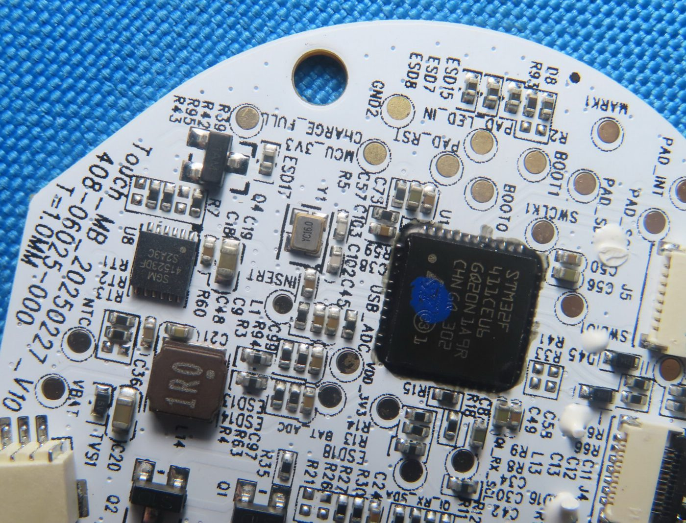
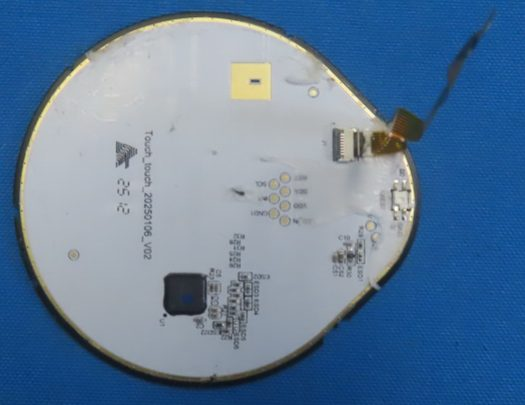
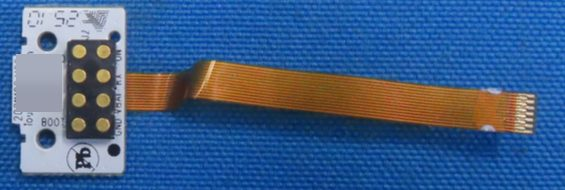
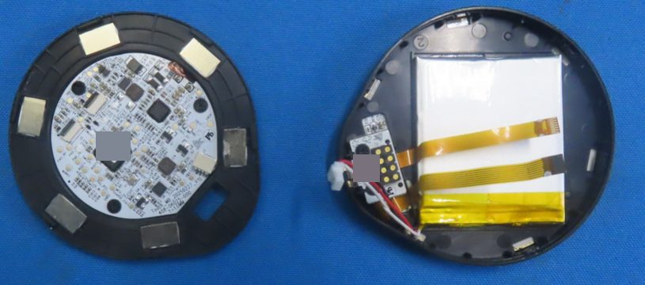

# Naya Touch

The Touch is the touchpad module: a matte glass surface with multi-finger gestures and no haptics. This
page covers its boards, chips, sensor, LED, battery and base, plus what the host sees: the dock address,
the LED index, the gesture vocabulary, what is streamed and the firmware defaults. The one thing to
know: the touch controller is a Hynitron CST3640 that most likely reports raw coordinates, so the
gestures are computed by the module's STM32. One Touch was photographed, once: left-filing pages 27-36
are the same images as right-filing pages 24-33, a pre-production sample received 2025-06-20.

!!! note "At a glance"
    - MCU ST STM32F411CEU6; Qi receiver Maxic MT5705; charger SGM41523; buck-boost SGM62117.
    - Touch controller Hynitron CST3640 on a teardrop-shaped sensor board; one RGB status LED.
    - Filed battery 700 mAh (one or two cells); the manual says 1500 mAh.
    - Dock address `0x10` left, `0x11` right; it lights through the first index of its bay's LED block.
    - NayaCore refuses double-tap bindings for the Touch.

!!! info "Manual"
    [Touch user manual v1.1.0](../assets/manuals/naya-touch-user-manual-v1.1.0.pdf) (PDF); every version is listed on [Manuals](../product/manuals.md).

## What it is

<!-- touch facts 1-2 -->
The Touch is a programmable touchpad module with a matte glass surface and multi-finger gestures; it has
no haptics DOC[^man-to][^wb-naya]. The v1.1.0 manual prints 1500 mAh, 75 x 69 x 12 mm, a matte glass pad
and a single RGB LED. It is teardrop-shaped, not a round puck DOC CRL IP4 p27[^man-to][^fcc-crl]. The 2023
campaign spec sheet gave 66 mm across, 12 mm high, 45 g, 800 mAh and fine-grained matte glass; the vendor
later moved to 2.5D curved etched glass DOC[^ks-camp][^ks-08].

## Main board

<!-- touch facts 3-9 -->
<!-- fcc-images:start -->

<figure markdown="span">
  { width="560" loading=lazy }
  <figcaption>Touch main board, MCU side (close-up). FCC ID 2BQ4V0825CRL, Internal Photos 5, page 31, lower photo. Identifying marks removed.</figcaption>
</figure>

<!-- fcc-images:end -->

The main board is `Touch_MB_20250227_V10`, part number `408-06025-000`, 1.0 mm, single-sided, round,
about 44 mm (scaled from the 7 x 7 mm MCU package) DOC INFERRED CRL IP4 p28; CRL IP5 p29-p31[^fcc-crl] (also
named by naya-create-kb[^kb-hardware]).

| Part | Identity and marking | Evidence |
|---|---|---|
| MCU | ST STM32F411CEU6 (`U1`), marked `STM32F` / `411CEU6` / `GQ20N 1A9R` / `CHN GQ 302`, 48 leads; the modules moved from a Holtek MCU to the STM32F411 in May 2024 | DOC CRL IP5 p31[^ks-13] |
| Qi receiver | Maxic MT5705, lot `240801` | DOC CRL IP5 p30-p31 |
| Charger | SG Micro SGM41523 (`U8`, `SGM` / `41523DF` / `S2A3C`); naya-create-kb's "Touch frontend `4T523DF`" is this charger[^kb-hardware] | DOC |
| Buck-boost | SG Micro SGM62117 (`U3`, `01KGH` / `R2A4C`) | DOC |
| Other parts | 16 MHz crystal `YC16.0`; `1AM` NPN (`Q4`); `SL` Schottky diodes (`D1`, `D2`) near `QI_VBUS`; a 100 uF tantalum (`J107`); a 5 V TVS on the battery line; `S78` and `T4` diodes; 1.0 uH and 0.47 uH inductors; two `S1D`-marked SOT-23 parts that match no known code | DOC INFERRED CRL IP5 p30-p31 |
| Connectors | `J4`, a 14-position FPC (about 0.3 mm pitch) for the pogo-board flex; `J5`, an 8-position FPC for the sensor board; `J3`, a 3-position battery header (about 1.0 mm pitch) with `VBAT` and `NTC` pads beside it | DOC INFERRED |
| Debug and boot pads | `SWCLK1`, `SWDIO`, `BOOT0`, `BOOT1` | DOC (also listed by naya-create-kb) |
| Other pads | sensor-board I2C, INT, RST and LED data (`PAD_*`); `QI_RX_SDA`, `QI_RX_SCL` (MCU to Qi receiver); `MCU_3V3`, `VDD_3V3`, `USB_ADC`, `BAT_ADC`, `VBUS`, `VBUS_5V`, `CHARGE_FULL`, `INSERT` (dock insertion sense, inferred), `NTC`, `VBAT`, `LDO_ON`, `TX`, `RX` | DOC INFERRED CRL IP5 p29-p31 |

## Sensor board

<!-- touch facts 10-14 -->
<!-- fcc-images:start -->

<figure markdown="span">
  { width="560" loading=lazy }
  <figcaption>Touch sensor board. FCC ID 2BQ4V0825CRL, Internal Photos 6, page 35, upper photo. Identifying marks removed.</figcaption>
</figure>

<!-- fcc-images:end -->

The sensor board is `Touch_touch_20250106_V02` (stamp `25 12`), teardrop-shaped with a diamond-lattice
electrode pattern and a gold edge ring DOC CRL IP6 p35-p36[^fcc-crl]. Its touch controller is a Hynitron
CST3640 (`U1`, line 1 `CST3640`, line 2 partly under an ink dot), a capacitive multi-touch controller on
I2C with INT and RST; a public parts listing gives its package as QFN52, 6 x 6 mm DOC INFERRED[^jlc].

The nearest documented sibling, the Hynitron CST3240, reports raw finger coordinates and has no gesture
register, so the Touch's gestures are most likely computed by the module's STM32 from coordinates DOC
INFERRED[^cst3240]. The board carries one addressable RGB LED (`LED1`), showing through a small window near
the rim (inferred), and links to the main board through `J1`, an 8-contact FPC tail carrying power, I2C,
INT, RST and LED data DOC CRL IP6 p35.

## Pogo board and dock contacts

<!-- touch facts 15-16 -->
<!-- fcc-images:start -->

<figure markdown="span">
  { width="560" loading=lazy }
  <figcaption>Touch pogo board and flex. FCC ID 2BQ4V0825CRL, Internal Photos 5, page 32, upper photo. Identifying marks removed.</figcaption>
</figure>

<!-- fcc-images:end -->

The pogo board's name is partly hidden (`Tou`...`in` / `20`...`V0?`, stamp `25 10`), about 11 x 17 mm;
`J2` holds 8 domed dock contacts in two columns of four labeled `GND`, `VBAT`, `RX`, `…ON`, `BOO…`,
`GND`; a `J7` FPC and filter parts sit on the back, and an amber flex of 13-14 conductors runs to main
board `J4` DOC INFERRED CRL IP4 p28; CRL IP5 p32. The Touch's base shows only one straight row of 4 gold
contacts through a slot, although the pogo board has 8; why is not known DOC CRL IP4 p27
([details](../open-questions.md#oq-h11)). See [Module dock](dock.md).

## Battery, coil and enclosure

<!-- touch facts 17-21 -->
<!-- fcc-images:start -->

<figure markdown="span">
  { width="560" loading=lazy }
  <figcaption>Touch opened: main board in its carrier ring; housing with cell and pogo board. FCC ID 2BQ4V0825CRL, Internal Photos 4, page 28, upper photo. Identifying marks removed.</figcaption>
</figure>

<!-- fcc-images:end -->

- **Battery.** `FH364046`, 3.7 V 700 mAh 2.59 Wh pouch (about 3.6 x 40 x 46 mm by its size code,
  inferred), dated `20250611`, three wires to `J3`, a protection board under yellow tape. A second
  700 mAh cell, `FH364045` (dated `20241201`), appears in the teardown layout photo; whether a Touch holds
  one cell or two is not known DOC CRL IP5 p33-p34; CRL IP4 p28[^fcc-crl]
  ([details](../open-questions.md#oq-h20)). naya-create-kb attributes `FH364046` 700 mAh to the
  Track[^kb-exhibits][^kb-manual].
- **Capacity figures disagree.** Filed sample 700 mAh (or 2 x 700 if two cells), website and 2023
  campaign spec sheet 800 mAh, v1.1.0 manual 1500 mAh DOC[^man-to][^ks-camp]. naya-create-kb's "Touch
  FH202030, 1000 mAh class" is the Tune's pack[^kb-hardware].
- **Qi coil.** A single-layer spiral about 29-30 mm outer diameter on a ferrite disc of about 33 mm,
  unmarked DOC INFERRED.
- **Carrier frame.** A black plastic ring with 6 silver rectangular plates (magnets or steel, not
  determined) and a window; a black shell with a molded `2` (likely a mold cavity number) DOC INFERRED CRL
  IP4 p28 ([details](../open-questions.md#oq-h13)).
- **Base label.** Unfilled certification placeholders (FCC ID, IC, KC, Japan and NCC-style fields),
  "Designed in the Netherlands", "Made in China", the maker's name, and `Input: 5V⎓500mA`; marks include
  FCC, CE, UKCA, WEEE, KC and an RCM-like triangle. No module has an FCC ID of its own DOC CRL IP4
  p27[^fcc-crl]. See [Regulatory records](regulatory.md#modules-and-certification).

## As the host sees it

<!-- touch facts 22-32 -->
- **Dock address.** `0x10` on the left, `0x11` on the right MEASURED (a second board, 3.28.7, 2026-09-19;
  also the nayactl maintainer's board, 3.30.1[^nx-pr2]; also listed by naya-create-kb[^kb-modules]).
- **LED.** A Touch lights through exactly the first index of its bay's LED block (88 on the left, 112 on
  the right); lighting only 111 or 135 left it dark MEASURED (owner's board, 3.41.0, 2026-09-10) (also noted
  by naya-create-kb). See [Layout and positions](layout.md#the-led-map).
- **Gesture vocabulary.** NayaCore 6.11.0 names for the Touch: `vertical`, `horizontal`, `tap`,
  `double_tap` and four `swipe_*` directions at 1-4 fingers, plus `pinch`, `spread` and `pinch&spread`
  at 2 fingers STATIC[^nc] (also listed by naya-create-kb). NayaCore refuses double-tap bindings for the
  Touch, so the double-tap names are not usable STATIC[^nc].
- **Manual defaults.** One-finger tap = left click, tap and drag = drag, drag = cursor, two-finger tap =
  right click; macOS behavior applies to the macOS layout in NayaFlow DOC[^man-to].
- **Stock profiles.** NayaFlow's "Naya Touch Windows" and "Naya Touch MacOS" bind two-finger scrolling
  and three- and four-finger swipes and taps to system shortcuts; one-finger pointing and one- and
  two-finger taps are firmware defaults with no rows in the profile STATIC[^nc].
- **What the host receives (stock profile).** Two-finger scroll streams wheel reports; one-finger motion
  is cursor reports; four-finger swipes up or down stream a run of chords; three-finger swipes and
  four-finger left/right send one; pinch and spread send a run scaled to finger travel when bound MEASURED
  (owner's board, 2026-09-09 and 2026-09-10; pinch and spread 2026-09-18). With multi-finger gestures
  bound, the unbound one-finger firmware defaults can leak a click or a few pixels of cursor movement as
  fingers land or lift MEASURED (2026-09-10). See [Module fields](../protocol/module-fields.md).
- **Orientation.** The owner observed that a Touch docked on the left presents a mirror image of its
  right-side orientation (used for artwork); this is not measured INFERRED
  ([details](../open-questions.md#oq-h39)).
- **From finger to host.** Electrode lattice to CST3640 (coordinates) over I2C to the STM32F411 (gesture
  classification and the bound action), through the dock contacts to the half's nRF52840, which sends
  ordinary HID to the host INFERRED MEASURED (wiring from the photos; host output measured).
- **Firmware.** Touch module firmware is an encrypted app (`Touch_UserApp.sfb`) in the module bundle;
  forced module updates exist for Touch, Track and Tune only STATIC[^nc]. See
  [Module firmware](../firmware/modules.md).

## Safety

The pouch cell sits under tape: do not puncture it when opening the module. Do not bridge the base
contacts DOC[^um106].

## Open questions

- OPEN One or two cells; sensor board and cover size; the round black part beside the contact block on the pogo board ([details](../open-questions.md#oq-h20)).
- OPEN Why the base shows 4 contacts ([details](../open-questions.md#oq-h11)).
- OPEN Carrier plates magnet or steel ([details](../open-questions.md#oq-h13)).
- OPEN The mirror-image observation ([details](../open-questions.md#oq-h39)).
- OPEN Retail battery capacity ([details](../open-questions.md#oq-h21)).

## Sources

[^fcc-crl]: FCC ID 2BQ4V0825CRL (the module photos are in both halves' filings): exhibits on the FCC record ([FCC EAS search](https://apps.fcc.gov/oetcf/eas/reports/GenericSearch.cfm), grantee 2BQ4V; mirror [fccid.io/2BQ4V0825CRL](https://fccid.io/2BQ4V0825CRL)). Codes are explained on [Regulatory records](regulatory.md#how-to-cite-an-fcc-photo).
[^man-to]: Naya Touch User Manual Version 1.1.0 (vendor PDF `Naya_Touch_UserManual.pdf`), p2, p6-p7; see [Manuals](../product/manuals.md).
[^um106]: Naya Create User Manual Version 1.0.6, FCC ID 2BQ4V0825CRR user manual exhibits ([fccid.io](https://fccid.io/2BQ4V0825CRR)).
[^nc]: NayaFlow 1.25.1: installer default profiles, and NayaCore 6.11.0 strings and embedded module bundle (static reading).
[^jlc]: JLCPCB parts listing for `CST3640H` (third-party catalog).
[^cst3240]: Hynitron CST3240 datasheet (third-party copy).
[^nx-pr2]: nayactl, [pull request #2](https://github.com/Qonfused/nayactl/pull/2).
[^kb-hardware]: naya-create-kb, [hardware deep dive](https://nemezzizz.github.io/naya-create-kb/device/hardware/) (third party).
[^kb-exhibits]: naya-create-kb, [exhibit inventory](https://nemezzizz.github.io/naya-create-kb/device/exhibits/) (third party).
[^kb-manual]: naya-create-kb, [official manual claims](https://nemezzizz.github.io/naya-create-kb/device/manual/) (third party).
[^kb-modules]: naya-create-kb, [modules](https://nemezzizz.github.io/naya-create-kb/protocol/modules/) (third party).
[^ks-camp]: Kickstarter campaign page with its Specs Sheet, [naya-create/naya-create](https://www.kickstarter.com/projects/naya-create/naya-create) (2023).
[^ks-08]: Kickstarter update 8, [2023-11-28](https://www.kickstarter.com/projects/naya-create/naya-create/posts/3964585).
[^ks-13]: Kickstarter update 13, [2024-05-08](https://www.kickstarter.com/projects/naya-create/naya-create/posts/4061393).
[^wb-naya]: The vendor's former product pages, archived by the Wayback Machine ([naya.tech captures](https://web.archive.org/web/2025*/naya.tech/*)); cited only.
