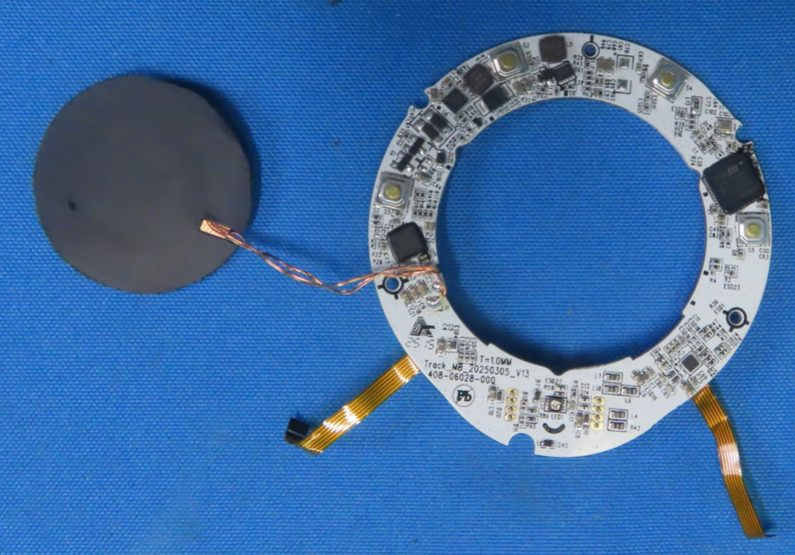
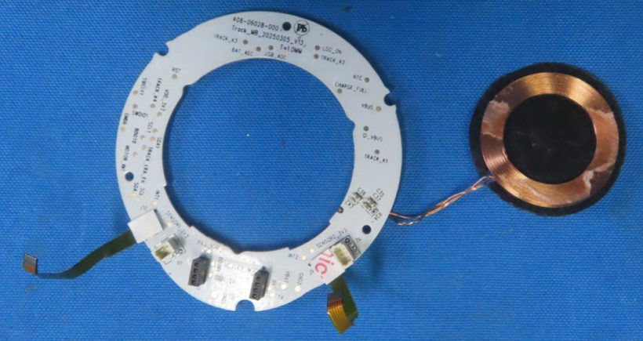
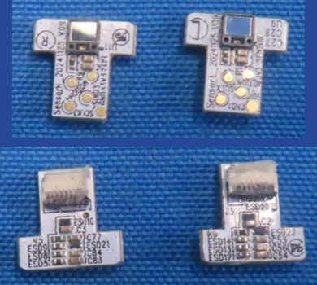
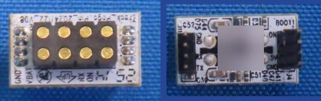
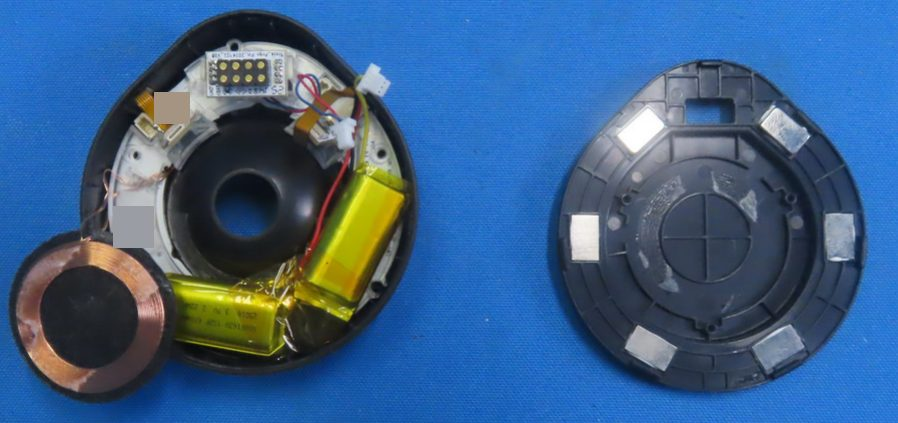

# Naya Track

The Track is the trackball module: a 40 mm ball, four configurable buttons, and scrolling by rotating
the ball around its vertical axis. This page covers its boards, chips, optical sensors, buttons, motor,
ball, battery and base, plus what the host sees: the dock address, the buttons, the reports and the
gestures. The one thing to know: two optical sensors placed 90 degrees apart read the ball, and its pack
is a 600 mAh 1S2P pack of two 300 mAh pouch cells, not a 700 mAh cell. One Track was photographed, once:
left-filing pages 37-48 are the same images as right-filing pages 34-45, a pre-production sample
received 2025-06-20.

!!! note "At a glance"
    - MCU ST STM32F411CEU6; Qi receiver Maxic MT5705; charger SGM41523; no buck-boost.
    - Two optical sensor boards (`SensorL`, `SensorR`), four tactile buttons, a coin vibration motor, one status LED.
    - Filed pack `QS801630 1S2P` 600 mAh; the manual says 700 mAh.
    - Dock address `0x20` left, `0x21` right; buttons arrive as mouse buttons 1, 2, 4 and 8.
    - `press` exists for buttons 1-3 only.

!!! info "Manual"
    [Track user manual v1.1.0](../assets/manuals/naya-track-user-manual-v1.1.0.pdf) (PDF); every version is listed on [Manuals](../product/manuals.md).

## What it is

<!-- track facts 1-2, 34 -->
The Track is a trackball module: a 40 mm ball, four configurable buttons, and scrolling by rotating the
ball around its vertical axis DOC[^man-tr][^reddit-13jydnp]. The v1.1.0 manual prints a 700 mAh battery,
75 x 69 x 34 mm, a 40 mm ball on ceramic bearings, four buttons and a "Toggled Scroll Mode"; the ball is
loose and falls out if the module is held upside down or at a steep angle. The 2023 campaign spec sheet
gave 66 mm across, 41 mm high, 70 g and 800 mAh DOC[^man-tr][^ks-camp]. The Track came after the Touch
and Tune: Batch 0 (100 test units, January 2025) shipped the Create, Touch and Tune; the Track was ready
for Batch 1 (April 2025) DOC[^ks-17][^ks-18][^ks-20].

## Main board (the ring)

<!-- track facts 3-11 -->
<!-- fcc-images:start -->

<figure markdown="span">
  { width="560" loading=lazy }
  <figcaption>Track main board, component (MCU) side, with the Qi coil's ferrite back. FCC ID 2BQ4V0825CRL, Internal Photos 7, page 45, upper photo. Identifying marks removed.</figcaption>
</figure>

<figure markdown="span">
  { width="560" loading=lazy }
  <figcaption>Track main board, connector and test-pad side, with the Qi coil face. FCC ID 2BQ4V0825CRL, Internal Photos 7, page 44, upper photo. Identifying marks removed.</figcaption>
</figure>

<!-- fcc-images:end -->

The main board is `Track_MB_20250305_V13`, part number `408-06028-000`, 1.0 mm, stamp `25 15`, about
60-66 mm outer diameter with a 40-43 mm opening for the ball (sizes inferred) DOC INFERRED CRL IP7
p44-p46[^fcc-crl]. naya-create-kb names the ring `Y08_06025_20250227_V00`, which is the Touch board's
number with `408` misread[^kb-exhibits].

| Part | Identity and marking | Evidence |
|---|---|---|
| MCU | ST STM32F411CEU6, marked `STM32F` / `411CEU6` / `GQ26Y17VQ` / `CHN GQ 443`; the modules moved from a Holtek MCU to the STM32F411 in May 2024 | DOC CRL IP7 p45[^ks-13] (also named by naya-create-kb) |
| Qi receiver | Maxic MT5705, lot `245303` (a different lot from the Tune and Touch parts) | DOC CRL IP7 p46 |
| Charger | SG Micro SGM41523 (`U8`, `SGM` / `41523DF` / `S2GPC`); no SGM62117 buck-boost was seen on the Track | DOC |
| Other parts | 16 MHz crystal `YC16.0` (`Y1`, load caps `C102`, `C103`); two `SL` Schottky diodes and one `T4` switching diode; a 1.0 uH inductor; larger capacitors at the Qi coil pads (a resonant or filter bank, inferred); unmarked ESD parts; two `S1D`-marked SOT-23 parts of unknown type; a small unmarked QFN and a leaded IC near `S3` | DOC INFERRED CRL IP7 p45-p46 |
| Buttons | four SMD tactile switches `S2`-`S5` with round brass actuators; net pads `TRACK_K1`-`TRACK_K4` | DOC CRL IP7 p45-p46 |
| Status LED | a single top-view LED `LED1` between two rows of unpopulated plated holes (RGB per marketing, inferred) | DOC CRL IP7 p45 |
| Connectors | a white 2-way socket `M1` for the motor, a white 4-way socket under tape near the sensor pads, and two black 4-position sockets beside `GND2`/`VBAT`/`RX`/`TX` that take the dock interposer (inferred); two orange FPC tails to the sensor boards | DOC INFERRED CRL IP7 p44 |
| Net pads | buttons `TRACK_K1`-`K4`; charger `VBUS`, `QI_VBUS`, `NTC`, `CHARGE_FULL`, `LDO_ON`, `BAT_ADC`, `USB_ADC`, `VBAT`, `VDD_3V3`; debug `SWCLK1`, `SWDIO1`, `BOOT0`, `BOOT?`, `RST`; two sensor buses (`SENSOR1_3V3`, `INT1`, `SCL`, `SDA`, `SCL1`, `SDA1`, `SENSOR2_3V3`, `INT2`); haptics `TRACK_?RA_EN`, `MOTOR_IN?`; dock `RX`, `TX`, `USB_5V` | DOC CRL IP7 p44 |

## Sensors

<!-- track facts 12-14 -->
<!-- fcc-images:start -->

<figure markdown="span">
  { width="560" loading=lazy }
  <figcaption>Track sensor boards SensorR and SensorL: sensor side (top), connector side (bottom). FCC ID 2BQ4V0825CRL, Internal Photos 6, page 39, lower (top panel) and upper (bottom panel). Identifying marks removed.</figcaption>
</figure>

<!-- fcc-images:end -->

The two sensor boards are T-shaped, `SensorL_20241125_V09` and `SensorR_20241125_V09` (about 11 x 11 mm),
each carrying one windowed, unmarked sensor package (`U9`, `U11`) with `SCLK`, `SDIO` and `MOTION` pads:
an optical motion sensor with a PixArt-style three-wire port is the reading DOC INFERRED CRL IP6
p38-p39[^fcc-crl]. The vendor describes the Track's "two sensors, placed 90 degrees apart"; Batch 1
enlarged the sensor window and changed "sensor positioning to improve vertical-axis rotation for smooth
scrolling"; EVT2 had already repositioned and upgraded the sensors. Two sensors on the ball make twist
(scroll) sensing possible DOC INFERRED[^ks-16][^ks-19][^ks-20]. Some earlier readings counted four sensor boards
or assumed capacitive sensing; two boards were each photographed front and back DOC.

## Motor, ball and dock

<!-- track facts 15-19 -->
<!-- fcc-images:start -->

<figure markdown="span">
  { width="560" loading=lazy }
  <figcaption>Track pogo board contact face (left) and dock interposer board (right). FCC ID 2BQ4V0825CRL, Internal Photos 6, page 40, lower (left panel) and upper (right panel). Identifying marks removed.</figcaption>
</figure>

<!-- fcc-images:end -->

- **Haptic motor.** A flat coin vibration motor about 7-9 mm, unmarked, on red and blue leads to a white
  2-pin plug (mates `M1`); whether it is an ERM or an LRA is open (the enable net reads `TRACK_?RA_EN`,
  where `LRA_EN` would suggest an LRA). Marketing did not advertise Track haptics DOC INFERRED CRL IP6
  p41[^fcc-crl] ([details](../open-questions.md#oq-h18)). naya-create-kb lists the coin motor among the
  module extras without naming the Track[^kb-hardware].
- **Ball assembly.** A black hemispherical cup with a central hole and a translucent carrier holding the
  two sensor boards; the ring opening is about 40 mm DOC INFERRED CRL IP6 p37-p38.
- **Pogo board.** `Track_Pogo_Pin_20241122_V08` (about 17 x 10 mm), 8 gold domed dock contacts in a 2 x 4
  housing labeled `GND`, `VBAT`, `RX`, `ON`; a separate unnamed interposer board carries headers `J11`
  (`GND`, `RX`, `TX`, one more) and `J4` (`ON`, `5V`, `GND`, one more) and a `BOOT1` pad, and plugs into
  the main board's two 4-position sockets DOC CRL IP6 p37, p38, p40. Some earlier readings gave the pogo
  board as `..._V00` with a 2 x 5 pad array; it is V08 with 2 x 4 DOC. See [Module dock](dock.md).
- **Qi coil.** A multi-strand spiral on black ferrite, a disc of about 34-35 mm (winding about 28 mm
  outer, 19 mm inner), with a foam ring, unmarked DOC INFERRED.

## Battery

<!-- track facts 20-22 -->
The pack is `QS801630 1S2P`, 3.7 V 600 mAh 2.22 Wh, made of two `QS801630` pouch cells of 300 mAh
1.11 Wh each in parallel, bent around the ring under yellow tape, with three wires (red, yellow, black)
to a white 3-way plug; date codes `25H09` (lab photo) and `25G24` (a second photo) DOC CRL IP6 p38; CRL
IP7 p42-p43[^fcc-crl]. naya-create-kb gives the same pack on its hardware page[^kb-hardware], but its
exhibit page gives the Track the Touch's `FH364046` 700 mAh cell and a separate cylindrical "ICR" 300 mAh
cell[^kb-exhibits]. The "300 mAh, 1.11 Wh" cell in the photos is one of the two pouch cells inside the
Track pack; there is no fourth module battery and no cylindrical cell DOC.

Capacity figures disagree: the filed sample has 600 mAh; the website and the 2023 campaign spec sheet
said 800 mAh; the v1.1.0 manual says 700 mAh DOC[^man-tr][^ks-camp] ([details](../open-questions.md#oq-h21)).
See [Power and batteries](power.md).

## Base

<!-- track fact 23 -->
<!-- fcc-images:start -->

<figure markdown="span">
  { width="560" loading=lazy }
  <figcaption>Track opened: body with ball cup, pogo board, harness, cells and Qi coil; base cover with six metal inserts. FCC ID 2BQ4V0825CRL, Internal Photos 6, page 38, upper (only photo). Identifying marks removed.</figcaption>
</figure>

<!-- fcc-images:end -->

The base is a black teardrop cover with 6 rectangular metal inserts (magnets or steel, not determined),
a window for the contact block and a round seat for the Qi coil; 8 contacts sit in a 2 x 4 recessed block
with two flanking round features. The label carries "Designed in the Netherlands", `FCC ID:` and `IC:`
printed with no value, a `P/N: NAYA-` number whose middle digits are unclear, a serial-number field (value
not reproduced) and `Input: 5V⎓500mA`; the marks are KC, CE, UKCA, WEEE, VCCI and an N-in-ellipse energy
mark DOC CRL IP6 p37-p38[^fcc-crl] ([details](../open-questions.md#oq-h19)).

## As the host sees it

<!-- track facts 24-33 -->
- **Dock address.** `0x20` on the left, `0x21` on the right MEASURED (owner's board, 3.41.0, 2026-09-03; also
  nayactl pull requests 2 and 5[^nx-pr2][^nx-pr5]; also listed by naya-create-kb[^kb-modules]).
- **Buttons.** The four buttons arrive at the host as mouse buttons with masks 1, 2, 4 and 8 MEASURED (owner's
  Track, 2026-09-06).
- **LED indices.** How many LED indices a Track follows is not settled: the board has one LED; an early
  band test (2026-09-08) that appeared to light 112-126 was later judged a band artifact; a single-index
  test with a Track has not been done DOC MEASURED ([details](../open-questions.md#oq-h08)).
- **Ball movement.** It arrives as ordinary HID mouse reports: 400 to 1500 reports per movement, deltas up
  to +/-127 MEASURED (owner's board, 3.41.0, module 2.3.3, 2026-09-03).
- **Gesture vocabulary.** NayaCore 6.11.0 names for the Track: `horizontal`, `vertical`, `rotate`;
  `track_up/down/left/right`; `clockwise_rotate` and `counter_clockwise_rotate`; for buttons 1-3
  `press`, `tap`, `double_tap`, `hold`, `tap_hold`; for button 4 the same without `press` STATIC[^nc].
  naya-create-kb lists `press` for all four buttons[^kb-hardware]. The per-direction names (`track_up`
  and so on) are how an older NayaFlow database stored a split axis as separate rows STATIC.
- **Defaults.** The manual: vertical and horizontal = cursor; rotate clockwise = scroll down;
  counterclockwise = scroll up. NayaFlow's stock profiles "Naya Track Left" and "Naya Track Right":
  buttons 1-4 tap = mouse buttons 1, 3, 2, 4; holds unbound; rotate = vertical scroll DOC STATIC[^man-tr][^nc].
- **NayaFlow behavior.** NayaFlow writes a Track button's hold over its tap (a NayaFlow behavior, not a
  device limit) MEASURED (owner's board, 2026-09). See [Module fields](../protocol/module-fields.md).
- **Firmware notes.** Module 2.1.2 made ball-twist scrolling less easy to trigger; keyboard 3.40.4
  (reached stable with 3.41.0) fixed "Track not keeping the Create awake" DOC[^nf-rel][^nf-beta]. The
  v1.0.6 default keymap has a "Toggle Scroll Direction" key (`LA3` on Layer 2) DOC[^um106].
- **Axis locking.** Marketing claimed axis locking and "rotate to scroll"; whether axis locking maps to
  any configuration field is not known DOC[^wb-naya] ([details](../open-questions.md#oq-h40)).

## Safety

The ball is loose: do not hold the module upside down (manual). The 1S2P pack wraps around the ring;
opening the module risks bending or puncturing the cells DOC[^man-tr].

## Open questions

- OPEN The optical sensor part (a PixArt product-ID read on an opened spare Track) ([details](../open-questions.md#oq-h17)).
- OPEN Motor ERM or LRA and the small unmarked parts ([details](../open-questions.md#oq-h18)).
- OPEN LED index count ([details](../open-questions.md#oq-h08)).
- OPEN Base part-number digits ([details](../open-questions.md#oq-h19)); base inserts magnet or steel ([details](../open-questions.md#oq-h13)).
- OPEN Whether "axis locking" exists in the configuration ([details](../open-questions.md#oq-h40)).
- OPEN Retail battery capacity ([details](../open-questions.md#oq-h21)).
- OPEN Whether Track Left and Track Right differ physically: NayaFlow ships separate stock profiles and an owner's observation suggests asymmetry; not measured ([details](../open-questions.md#oq-h33)).

## Sources

[^fcc-crl]: FCC ID 2BQ4V0825CRL (the module photos are in both halves' filings): exhibits on the FCC record ([FCC EAS search](https://apps.fcc.gov/oetcf/eas/reports/GenericSearch.cfm), grantee 2BQ4V; mirror [fccid.io/2BQ4V0825CRL](https://fccid.io/2BQ4V0825CRL)). Codes are explained on [Regulatory records](regulatory.md#how-to-cite-an-fcc-photo).
[^man-tr]: Naya Track User Manual Version 1.1.0 (vendor PDF), p2, p4, p6; see [Manuals](../product/manuals.md).
[^um106]: Naya Create User Manual Version 1.0.6, FCC ID 2BQ4V0825CRR user manual exhibits ([fccid.io](https://fccid.io/2BQ4V0825CRR)).
[^nc]: NayaFlow 1.25.1: installer default profiles and NayaCore 6.11.0 strings; an older NayaFlow user database (static reading).
[^nf-rel]: Vendor release notes, [NayaTech/NayaFlow-releases](https://github.com/NayaTech/NayaFlow-releases/releases) (1.14.5).
[^nf-beta]: Vendor beta release notes, [NayaTech/NayaFlow-beta-releases](https://github.com/NayaTech/NayaFlow-beta-releases/releases) (1.24.0).
[^nx-pr2]: nayactl, [pull request #2](https://github.com/Qonfused/nayactl/pull/2).
[^nx-pr5]: nayactl, [pull request #5](https://github.com/Qonfused/nayactl/pull/5).
[^kb-hardware]: naya-create-kb, [hardware deep dive](https://nemezzizz.github.io/naya-create-kb/device/hardware/) (third party).
[^kb-exhibits]: naya-create-kb, [exhibit inventory](https://nemezzizz.github.io/naya-create-kb/device/exhibits/) (third party).
[^kb-modules]: naya-create-kb, [modules](https://nemezzizz.github.io/naya-create-kb/protocol/modules/) (third party).
[^ks-camp]: Kickstarter campaign page with its Specs Sheet, [naya-create/naya-create](https://www.kickstarter.com/projects/naya-create/naya-create) (2023).
[^ks-13]: Kickstarter update 13, [2024-05-08](https://www.kickstarter.com/projects/naya-create/naya-create/posts/4061393).
[^ks-16]: Kickstarter update 16, [2024-10-06](https://www.kickstarter.com/projects/naya-create/naya-create/posts/4216739).
[^ks-17]: Kickstarter update 17, [2024-11-04](https://www.kickstarter.com/projects/naya-create/naya-create/posts/4243300).
[^ks-18]: Kickstarter update 18, [2025-01-02](https://www.kickstarter.com/projects/naya-create/naya-create/posts/4283150).
[^ks-19]: Kickstarter update 19, [2025-02-11](https://www.kickstarter.com/projects/naya-create/naya-create/posts/4312089).
[^ks-20]: Kickstarter update 20, [2025-03-19](https://www.kickstarter.com/projects/naya-create/naya-create/posts/4341013).
[^reddit-13jydnp]: Reddit, vendor post [13jydnp](https://www.reddit.com/r/ErgoMechKeyboards/comments/13jydnp/) (2023-05-17); archived text, not live-verified.
[^wb-naya]: The vendor's former product pages, archived by the Wayback Machine ([naya.tech captures](https://web.archive.org/web/2025*/naya.tech/*)); cited only.
