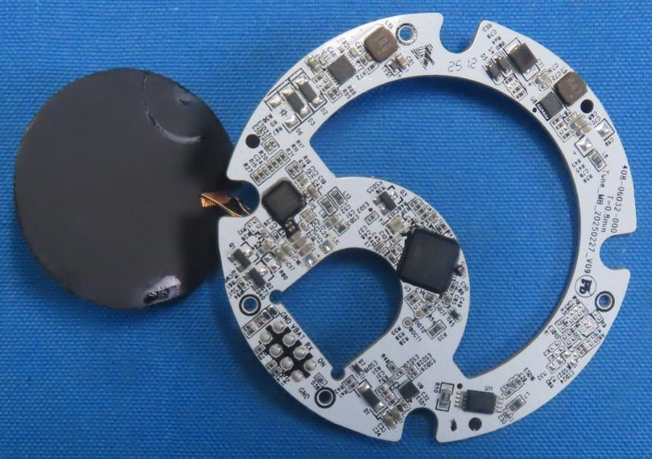
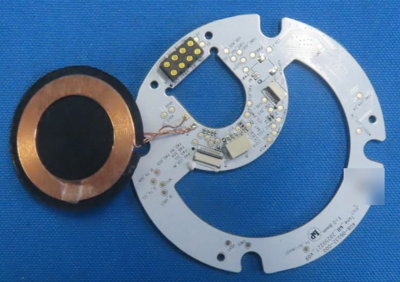
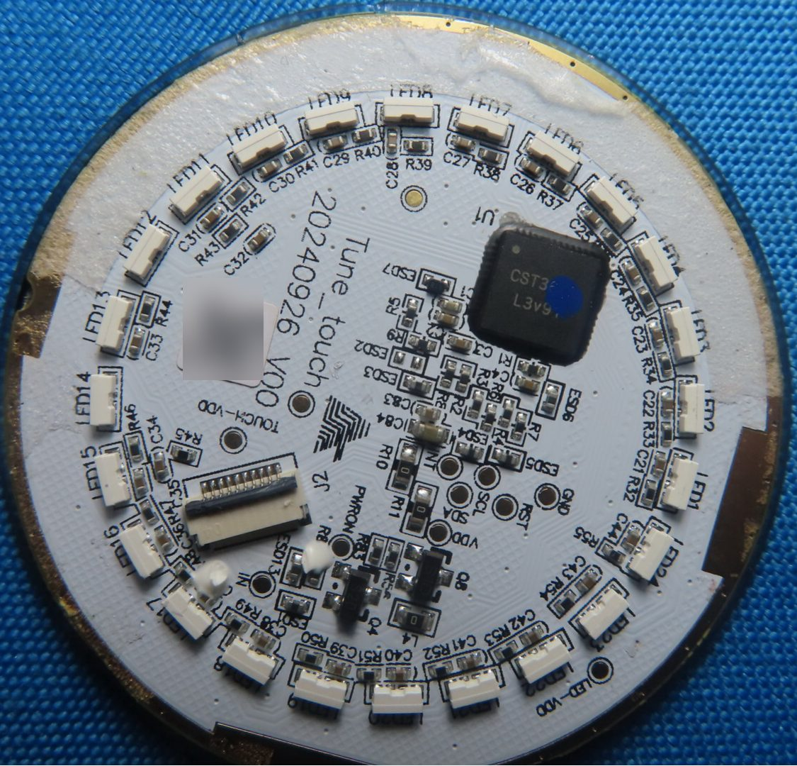
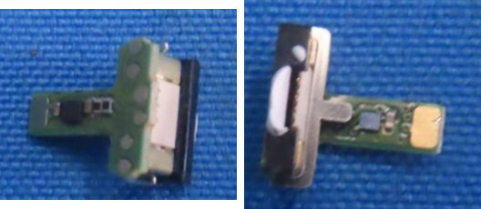
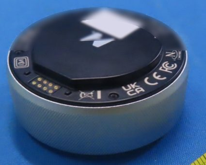

# Naya Tune

The Tune is the dial module: a rotating knurled ring around a glass touch surface, with haptic
feedback on the dial and an RGB LED ring. This page covers its boards, chips, haptic dial, touch
surface, LEDs, battery and base, plus what a user or tool author meets: the dock address, the LED
count, the dial settings, the gesture vocabulary and what the host receives. The one thing to know: the
dial's resistance is a magnetic brake (per the vendor), and no angle sensor is visible on any exposed
board. One Tune was photographed, once: left-filing pages 17-26 are the same images as right-filing
pages 14-23 (`CRL IP2 p17` = `CRR IP2 p14`), a pre-production sample received 2025-06-20.

!!! note "At a glance"
    - MCU ST STM32F411CEU6; Qi receiver Maxic MT5705; charger SG Micro SGM41523; buck-boost SGM62117.
    - 24 RGB LEDs on the touch disc; a Hynitron CST3xxx touch controller (CST3640 likely).
    - Dial resistance from a XeelTech "Hapticore" magnetic brake; a separate LRA gives touch feedback.
    - Filed battery 1000 mAh; the manual and website say 1500 mAh.
    - Dock address `0x40` left, `0x41` right.

## What it is

<!-- tune facts 1-3 -->
The Tune is a dial module: a rotating knurled ring (the manual calls it the "Crown") around a glass
touch surface (the "Gesturepad"), with haptic feedback on the dial and an RGB LED ring DOC[^man-tu].
The v1.1.0 manual prints a 1500 mAh battery, 69 x 69 x 28 mm, a crown of "CNC Machined Aluminum with
Soft-Knurled Finish" and an RGB LED ring. The 2023 campaign spec sheet gave 66 mm across, 28.5 mm high,
120 g, 1500 mAh, a pressure-sensitive crown press, and crown inputs rotate left/right, press, long press,
double press and press-and-rotate DOC[^man-tu][^ks-camp].

The dial's resistance comes from a XeelTech "Hapticore": per the vendor a magnetic brake (ferrofluid
plus an electromagnet), not a motor, driven by the crown's outer gear at 2:1 (the Hapticore turns twice
per crown turn). The crown is held on by magnets and pulls off to expose the bearing bracket and gear
teeth. A separate LRA vibration motor gives feedback for touch and press. Marketing named it "Hapticore
Driver by Xeeltech" with nine haptic modes and the feature "Naya Pulse"; no part number is known
DOC[^ks-08][^ks-10][^reddit-13jydnp][^wb-naya]. naya-create-kb lists a coin vibration motor among the
module extras without attributing it to a module[^kb-hardware]; the coin motor is the Track's (see
[Track](track.md)).

## Main board (the ring)

<!-- tune facts 4-14 -->
<!-- fcc-images:start -->

<figure markdown="span">
  { width="560" loading=lazy }
  <figcaption>Tune main board (ring), component side, with the Qi coil ferrite. FCC ID 2BQ4V0825CRL, Internal Photos 3, page 19, lower photo.</figcaption>
</figure>

<figure markdown="span">
  { width="560" loading=lazy }
  <figcaption>Tune main board (ring), contact side, with the Qi coil wired on. FCC ID 2BQ4V0825CRL, Internal Photos 3, page 19, upper photo. Identifying marks removed.</figcaption>
</figure>

<!-- fcc-images:end -->

The main board is `Tune_MB_20250227_V09`, part number `408-06032-000`, 0.8 mm, stamp `25 12`, about
58-60 mm across with a C-shaped inner island DOC INFERRED CRL IP2 p18; CRL IP3 p19, p21[^fcc-crl].
naya-create-kb names `Tune_Touch_20240926_V00` as the ring; that is the touch disc[^kb-exhibits].

| Part | Identity and marking | Evidence |
|---|---|---|
| MCU | ST STM32F411CEU6 (UFQFPN48, 7 x 7 mm; Cortex-M4F, 100 MHz, 512 KB flash, 128 KB RAM), marked `STM32F` / `411CEU6` / `GQ2CU179R` / `CHN GQ 320`. The modules moved from a Holtek MCU to the STM32F411 in May 2024 | DOC CRL IP3 p19-p20[^fcc-crl][^ks-13][^ks-14] |
| Qi receiver | Maxic MT5705 (`U15`), a 5 W WPC receiver SoC with an I2C interface, lot `240801`; pads `QI_?X_SCL` / `QI_?X_SDA` give the MCU an I2C link to it (so "charging only, no data" holds for the host, not for the MCU) | DOC CRL IP3 p19-p20 |
| Charger | SG Micro SGM41523 (`U8`, marking `SGM` / `41523DF` / `S2A3C`), a standalone switch-mode single-cell Li-ion charger with an NTC input (`RT1`/`RT2` divider beside it); naya-create-kb read the same marking as a "Touch frontend `4T523DF`"[^kb-hardware] | DOC CRL IP3 p20-p21 |
| Buck-boost | SG Micro SGM62117 (`U6`, marking `01KGH`), next to a 0.47 uH inductor; its role (3.3 V from the cell, or 5 V toward the dock) is not established | DOC INFERRED CRL IP3 p19-p20 |
| Other parts | 16 MHz crystal `YC16.0` (`Y1`); `1AM` NPN (`Q3`); two `SL` Schottky diodes (`D2`, `D3`) that OR the Qi and dock inputs (inferred); two `T4` switching diodes; a 100 uF tantalum (`J107`); a 1.0 uH charger inductor (`L14`); one unpopulated IC footprint; many unmarked ESD parts | DOC INFERRED CRL IP3 p19-p21 |
| Connectors | an FPC of about 10 contacts to the touch disc, two flip-lock ZIFs on the inner island, `J1` (about 6-8 contacts) toward the haptic assembly, and a white 4-contact header `J6` | DOC INFERRED CRL IP2 p18; CRL IP3 p19 |
| Dock block `J5` | 8 contacts in a 1-2-2-2-1 stagger labeled `GND`, `VBAT`, `RX`, `ON` / `GND`, `TX`, a 5 V line, `BOOT1`; two paler pads beside it are either separate test pads or contacts 9-10 (readers disagree) | DOC CRL IP3 p19 |
| Debug and boot pads | `BOOT0`, `BOOT1` (beside the MCU), `SWDIO`, `SWCL…`, `RST`; `BOOT1` also reaches the dock block | DOC CRL IP3 p19-p20 |
| Other net pads | `PAD_LED_IN`, `PAD_SCL`, `PAD_SDA`, `PAD_INT`, `PAD_VDD`, `PAD_RST` (to the touch disc); `QI_VBUS`, `NTC`, `VBUS` (x2), `USB_ADC`, `BAT_ADC`, `VDD_3V3`, `LED_PWRON`, `CHARGE_FULL` | DOC CRL IP3 p19 |
| Actuator drive pads | `M1` (a 2-pad footprint), `PWM1`, `PWM2`, `SLEEP`, `COIL+`, `COIL-`, `TUNE_ADC`, `TUNE_ADC_COIL`, and an I2C pair `HAPTICAL_SCL` / `HAPTICAL_SDA`; an unmarked 8-lead driver `U11` sits nearby (an H-bridge, inferred). Given the vendor's description, the `M1` footprint may be the LRA's and the coil pads the brake's | DOC INFERRED CRL IP3 p19 |

## The haptic dial

<!-- tune facts 15-16, 20 -->
The dial actuator is a black cylindrical can with visible copper windings in a recess under the Qi
coil; it carries no marking. It fits the vendor's description of the Hapticore brake (an electromagnet
acting on a magnetic fluid), which is not a part identification DOC INFERRED CRL IP2 p18[^fcc-crl][^ks-08].
No rotary encoder, Hall sensor or magnetic angle IC is visible on any exposed Tune board; the dial angle
is most likely sensed inside the actuator assembly and the detents made in firmware (a programmable
haptic knob) INFERRED. The dial ring is a silver knurled ring, unmarked (marketed as CNC-machined aluminum)
DOC CRL IP2 p17.

## Touch and LED disc

<!-- tune facts 17-19 -->
<!-- fcc-images:start -->

<figure markdown="span">
  { width="560" loading=lazy }
  <figcaption>Tune touch/LED disc Tune_touch 20240926 V00. FCC ID 2BQ4V0825CRL, Internal Photos 4, page 23, upper (only photo). Identifying marks removed.</figcaption>
</figure>

<!-- fcc-images:end -->

The disc is `Tune_touch 20240926 V00`, about 45 mm, bonded under a black glass disc of about 45 mm. It
carries the touch controller and a ring of 24 side-view RGB LEDs (`LED1`-`LED24`, one data line
`PAD_LED_IN`, no driver IC). The vendor raised the ring from 8 to 24 LEDs in 2023, with a diffuser
laminated under the glass DOC CRL IP3 p22; CRL IP4 p23[^fcc-crl][^ks-08]. naya-create-kb's "halo LED
rings" apply to the Tune only; the Touch and Track have one LED each[^kb-hardware].

The disc's touch controller is marked `CST3` plus a digit hidden under an ink dot; the Touch module's
controller is a Hynitron CST3640, so the same part is likely (a candidate only) DOC INFERRED CRL IP4 p23.
Its `J2` is a 10-contact flip-lock FPC; host pads `VDD`, `GND`, `SDA`, `SCL`, `RST`, `INT`, `IN`, and
switched rails `PWRON`, `TOUCH-VDD`, `LED-VDD` DOC.

## Unidentified small parts

<!-- tune fact 21 -->
<!-- fcc-images:start -->

<figure markdown="span">
  { width="560" loading=lazy }
  <figcaption>Tune T-shaped sub-board, two views side by side (U-TUX-16). FCC ID 2BQ4V0825CRL, Internal Photos 4, page 24, upper (left) and lower (right), composited.</figcaption>
</figure>

<!-- fcc-images:end -->

A small T-shaped green sub-board (about 10 x 7-9 mm) with a slot, a white "pill" and 6 pads is
unidentified; a micro slide switch is the leading reading, and it is too small to be a USB-C port. A
housed round part with a clip and a center screw beside the dock block is also unidentified DOC INFERRED CRL
IP2 p18; CRL IP4 p24 ([details](../open-questions.md#oq-h15)).

## Battery and power

<!-- tune facts 22-24 -->
The battery is an `FH 202030` block pack, 3.7 V 1000 mAh 3.7 Wh, in blue PVC (about 20 x 20 x 30 mm by
its size code, inferred), dated `20250603`, with three wires (red, white, black) to a white
3-position plug DOC CRL IP4 p25-p26; CRL IP2 p18[^fcc-crl]. naya-create-kb calls this the Touch
pack[^kb-hardware]; its exhibit page attributes it correctly[^kb-exhibits].

The capacity figures disagree: the filed sample has 1000 mAh; the website and the 2023 campaign spec
sheet said 1500 mAh; the v1.1.0 manual says 1500 mAh; a 2024 update says the Tune got a new assembly
method that fits a larger battery. Retail capacity is not confirmed. Marketing also claimed a 14-day
runtime DOC[^man-tu][^ks-camp][^ks-15][^wb-naya] ([details](../open-questions.md#oq-h21)). The Qi coil is
a flat copper spiral on black ferrite, about 30-31 mm, unmarked DOC INFERRED. See
[Power and batteries](power.md).

## Base

<!-- tune fact 25 -->
<!-- fcc-images:start -->

<figure markdown="span">
  { width="560" loading=lazy }
  <figcaption>Tune base underside: dock pads, marks, base label. FCC ID 2BQ4V0825CRL, Internal Photos 2, page 17, lower photo. Identifying marks removed.</figcaption>
</figure>

<!-- fcc-images:end -->

The base is a black molded cover about 64 mm across with 6 silver rectangular blocks in rim pockets
(magnets or steel plates, not determined) and 8 flat gold pads in a recessed 1-2-2-2-1 block; marks
include CE, the FCC logo, UKCA and WEEE; the label has a `P/N` whose digits are not legible and a
serial-number field (value not reproduced) DOC CRL IP2 p17-p18[^fcc-crl]
([details](../open-questions.md#oq-h19)).

## As the host sees it

<!-- tune facts 26-37 -->
- **Dock address.** `0x40` on the left, `0x41` on the right MEASURED (owner's board, 3.41.0, 2026-09-03; a
  second board, 3.28.7, 2026-09-19; also nayactl pull request 2[^nx-pr2]).
- **LED indices.** How many LED map indices a docked Tune follows is not settled and may depend on
  module firmware: a band test on 2026-09-08 saw 88-96 lit with a Tune in the left bay; on 2026-09-10
  index 88 alone lit it; a Tune on module firmware 2.1.2 took color on 88-93 only while 94-111 stayed
  white. The board carries 24 LEDs MEASURED DOC (owner's board, 3.41.0, module 2.3.3; a second board, 3.28.7,
  module 2.1.2, 2026-09-19) ([details](../open-questions.md#oq-h08)).
- **Dial settings.** NayaFlow 1.25.1 offers "Ticks per rotation" 5-170 (default 72), "Tick strength"
  0-100 (default 75) and ticks on/off (default on). On the device the detent spacing is stored as
  degrees per detent (360 divided by the value gives detents per turn) STATIC MEASURED[^nc] (owner's board,
  3.41.0, module 2.3.3, 2026-09-16). See [Module fields](../protocol/module-fields.md).
- **Gesture vocabulary.** NayaCore 6.11.0 names for the Tune: dial `rotate`, `clockwise_rotate`,
  `counter_clockwise_rotate`; touch `vertical`, `horizontal`, `tap`, `double_tap` and four `swipe_*`
  directions at 1-4 fingers; `pinch`, `spread` and `pinch&spread` at 2 fingers STATIC[^nc] (also listed by
  naya-create-kb[^kb-hardware]). NayaCore refuses double-tap bindings for the Tune ("unsupported double
  tap behaviour for Tune module type"), so the double-tap names are not usable STATIC[^nc].
- **What the host receives.** Each dial detent sends one key; two-finger swipes stream a run of events
  quantized on finger motion (11-20 per swipe in the first capture); one- and three-finger gestures fire
  once on lift, whatever the speed or distance MEASURED (owner's board, 3.41.0, module 2.3.3, 2026-09-05).
  Resting a finger on the glass while turning the dial does not change the detents and adds one swipe on
  lift; there is no hold-and-rotate gesture MEASURED (2026-09-05).
- **Stock bindings.** NayaFlow's default: dial = volume down/up; one-finger vertical and horizontal =
  scroll; two-finger tap = play/pause; three-finger tap = mute; two-finger swipes = brightness up/down
  and rewind/fast-forward; three-finger swipes = keyboard LED brightness and previous/next track
  STATIC[^nc]. The manual's defaults are Crown = volume, one finger = scroll, two fingers = brightness and
  tab, three fingers = play/pause, seek and track, and it warns that some units may ship without the
  latest configuration and should be updated with NayaFlow DOC[^man-tu].
- **Firmware notes.** Module 2.3.2 made ticks exact instead of estimated and cut Tune LED power by about
  20 % at full brightness; module 2.3.3 fixed phantom ticks near detents; keyboard 3.41.0 fixed phantom
  ticks when switching layers DOC[^nf-rel][^nf-beta]. The v1.0.6 default keymap has a "Cycle Tune Mode"
  key (`LB3` on Layer 2) DOC[^um106].
- **Firmware storage.** Tune module firmware is an encrypted app (`Tune_UserApp.sfb`) inside the module
  bundle; it lives in the STM32's internal flash (no external flash on the module) STATIC DOC[^nc]. See
  [Module firmware](../firmware/modules.md).

## Safety

The Tune's pack is a Li-ion block cell on flying leads; opening the module risks shorting it. Keep the
module off conductive surfaces when undocked: its base pads are the dock contacts, which the manual says
never to bridge DOC[^um106].

## Open questions

- OPEN Actuator part, driver `U11` and the `HAPTICAL` I2C device ([details](../open-questions.md#oq-h14)).
- OPEN Exact touch-controller part ([details](../open-questions.md#oq-h16)).
- OPEN The T-shaped sub-board, the housed round part and `U9` ([details](../open-questions.md#oq-h15)).
- OPEN `J5`: 8 or 10 contacts ([details](../open-questions.md#oq-h10)).
- OPEN Base blocks magnet or steel ([details](../open-questions.md#oq-h13)); base part-number digits ([details](../open-questions.md#oq-h19)).
- OPEN LED indices a Tune follows on module 2.3.3 ([details](../open-questions.md#oq-h08)).
- OPEN Retail battery capacity ([details](../open-questions.md#oq-h21)).

## Sources

[^fcc-crl]: FCC ID 2BQ4V0825CRL (the module photos are in both halves' filings): exhibits on the FCC record ([FCC EAS search](https://apps.fcc.gov/oetcf/eas/reports/GenericSearch.cfm), grantee 2BQ4V; mirror [fccid.io/2BQ4V0825CRL](https://fccid.io/2BQ4V0825CRL)). Codes are explained on [Regulatory records](regulatory.md#how-to-cite-an-fcc-photo).
[^man-tu]: Naya Tune User Manual Version 1.1.0 (vendor PDF `Naya_Tune_UserManual.pdf`), p2, p6; see [Manuals](../product/manuals.md).
[^um106]: Naya Create User Manual Version 1.0.6, FCC ID 2BQ4V0825CRR user manual exhibits ([fccid.io](https://fccid.io/2BQ4V0825CRR)).
[^nc]: NayaFlow 1.25.1: settings table, installer default profile, and NayaCore 6.11.0 strings and embedded module bundle (static reading).
[^nf-rel]: Vendor release notes, [NayaTech/NayaFlow-releases](https://github.com/NayaTech/NayaFlow-releases/releases) (1.17.2, 1.25.0).
[^nf-beta]: Vendor beta release notes, [NayaTech/NayaFlow-beta-releases](https://github.com/NayaTech/NayaFlow-beta-releases/releases) (1.16.0, 1.23.0).
[^nx-pr2]: nayactl, [pull request #2](https://github.com/Qonfused/nayactl/pull/2).
[^kb-hardware]: naya-create-kb, [hardware deep dive](https://nemezzizz.github.io/naya-create-kb/device/hardware/) (third party).
[^kb-exhibits]: naya-create-kb, [exhibit inventory](https://nemezzizz.github.io/naya-create-kb/device/exhibits/) (third party).
[^ks-camp]: Kickstarter campaign page with its Specs Sheet, [naya-create/naya-create](https://www.kickstarter.com/projects/naya-create/naya-create) (2023).
[^ks-08]: Kickstarter update 8, [2023-11-28](https://www.kickstarter.com/projects/naya-create/naya-create/posts/3964585).
[^ks-10]: Kickstarter update 10, [2024-01-06](https://www.kickstarter.com/projects/naya-create/naya-create/posts/4000229).
[^ks-13]: Kickstarter update 13, [2024-05-08](https://www.kickstarter.com/projects/naya-create/naya-create/posts/4061393).
[^ks-14]: Kickstarter update 14, [2024-07-24](https://www.kickstarter.com/projects/naya-create/naya-create/posts/4157656).
[^ks-15]: Kickstarter update 15, [2024-09-03](https://www.kickstarter.com/projects/naya-create/naya-create/posts/4095301).
[^reddit-13jydnp]: Reddit, vendor post [13jydnp](https://www.reddit.com/r/ErgoMechKeyboards/comments/13jydnp/) (2023-05-17); archived text, not live-verified.
[^wb-naya]: The vendor's former product pages, archived by the Wayback Machine ([naya.tech captures](https://web.archive.org/web/2025*/naya.tech/*)); cited only.
